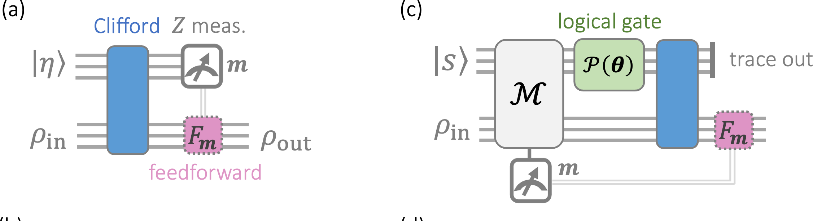
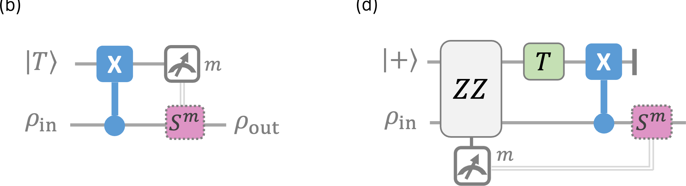

Magic gate teleportation（MGT）把一个已经制备好的非稳定子资源态、一个 Clifford 电路和末端 Pauli 测量组合起来，在任意数据态上实现非 Clifford 门。[[State injection]] 给出了单量子比特 injection 的物理线路；本文讨论它背后更一般的稳定子码结构。

本文固定资源寄存器 $R$ 在左、数据寄存器 $D$ 在右。测量 bit $m_k\in\{0,1\}$ 对应本征值 $(-1)^{m_k}$，Pauli 旋转记为

$$
P(\theta):=\exp\left(-\frac{i\theta P}{2}\right).
$$

这里构造的是反向传播检查、测量分支码及其逻辑门。把这些检查综合成具体 Clifford 电路是后续问题。

---
### 1. 物理 MGT 与反向传播测量

设 MGT 的 Clifford 电路为 $V$。在 $V$ 之后测量资源寄存器上的 $Z_{R,k}$，结果为 $\boldsymbol m=(m_1,\ldots,m_N)$。末端测量的分支投影为

$$
\Delta_{\boldsymbol m}
=
\prod_{k=1}^{N}
\frac{I+(-1)^{m_k}Z_{R,k}}{2}.
$$

对任意联合输入态 $\sigma$，该分支的未归一化状态是

$$
\Delta_{\boldsymbol m}V\sigma V^\dagger\Delta_{\boldsymbol m}.
$$

定义

$$
M_k
:=
V^\dagger
\bigl(Z_{R,k}\otimes I_D\bigr)
V,
\qquad
\mathcal M:=\{M_k\}_{k=1}^{N},
\qquad
\Pi_{\boldsymbol m}
:=
V^\dagger\Delta_{\boldsymbol m}V
=
\prod_{k=1}^{N}
\frac{I+(-1)^{m_k}M_k}{2}.
$$

因为 $V$ 是 Clifford，$M_k$ 仍是 Pauli 算子。酉共轭还保持末端单比特 $Z$ 算子的对易性和独立性，所以 $\mathcal M$ 是一组独立相容的 Pauli 检查，$\Pi_{\boldsymbol m}$ 是相应稳定子码分支的投影。

于是

$$
\Delta_{\boldsymbol m}V\sigma V^\dagger\Delta_{\boldsymbol m}
=
V\Pi_{\boldsymbol m}\sigma\Pi_{\boldsymbol m}V^\dagger.
\tag{1}
$$

式 (1) 只使用酉共轭。它说明以下两种分支描述完全相同：

- 物理线路：先施加 $V$，再测量 $Z_{R,k}$；
- 反向传播描述：先按 $\{M_k\}$ 投影，再施加 $V$。

这里没有假定 $V$ 与测量对易，也没有把真实线路中的时间顺序颠倒。所谓“反向传播”，只是把末端可观测量沿 $V$ 共轭回线路起点。

这一关系有两个相反的使用方向：

$$
\begin{array}{lll}
V\longmapsto\{M_k\}
&:&
\text{分析一个已有 MGT 线路},\\[2mm]
\{M_k\}\longmapsto V
&:&
\text{先设计联合检查，再综合实现它们的 Clifford 电路}.
\end{array}
\tag{2}
$$

例如，单量子比特 $T$ injection 使用

$$
V=\operatorname{CNOT}_{D\to R}.
$$

因为

$$
V^\dagger
\bigl(Z_R\otimes I_D\bigr)
V
=
Z_R\otimes Z_D,
$$

所以它的反向传播测量是 $Z_RZ_D$。MGT 的一般构造将采用式 (2) 的第二个方向：先选择合适的联合检查，再说明相应的 $V$ 存在。

---
### 2. 资源态分解带来的第二次换序

设资源态可以写成

$$
|\eta\rangle_R
=
U_R(\boldsymbol\theta)|s\rangle_R,
\qquad
U_R(\boldsymbol\theta)
=
\prod_{\alpha=1}^{L}P_\alpha(\theta_\alpha),
\tag{3}
$$

其中 $|s\rangle$ 是稳定子态，非平凡 Pauli 轴 $P_\alpha$ 两两对易。若反向传播检查满足

$$
[M_k,U_R(\boldsymbol\theta)\otimes I_D]=0
\qquad
\text{对所有 }k,
\tag{4}
$$

则 $U_R(\boldsymbol\theta)\otimes I_D$ 也与每个分支投影 $\Pi_{\boldsymbol m}$ 对易。因此

$$
\begin{aligned}
&\Pi_{\boldsymbol m}
\bigl(
|\eta\rangle\langle\eta|_R\otimes\rho_D
\bigr)
\Pi_{\boldsymbol m}\\
&\quad=
(U_R\otimes I_D)
\Pi_{\boldsymbol m}
\bigl(
|s\rangle\langle s|_R\otimes\rho_D
\bigr)
\Pi_{\boldsymbol m}
(U_R^\dagger\otimes I_D).
\end{aligned}
\tag{5}
$$

这是与式 (1) 不同的第二次变换：

| 描述     | 代数顺序                                                                                             | 所需条件                  |
| ------ | ------------------------------------------------------------------------------------------------ | --------------------- |
| 物理线路   | $\lvert\eta\rangle\otimes\rho \xrightarrow{V}$ 测量 $Z_R$                                          | MGT 的实际线路             |
| 反向传播描述 | $\lvert\eta\rangle\otimes\rho \xrightarrow{\mathcal M}\xrightarrow{V}$                           | 只需式 (1) 的 Clifford 共轭 |
| 稳定子码描述 | $\lvert s\rangle\otimes\rho \xrightarrow{\mathcal M}\xrightarrow{U_R\otimes I_D}\xrightarrow{V}$ | 还需式 (4) 的对易关系         |

第三行不是说实验中临时施加一次昂贵的 $U_R$。非 Clifford 旋转早已包含在制备好的资源态 $|\eta\rangle=U_R|s\rangle$ 中；式 (5) 只是为了识别同一测量分支中的编码和逻辑门。

式 (5) 还说明 $U_R\otimes I_D$ 保持 $\operatorname{im}\Pi_{\boldsymbol m}$ 不变，因而在这个测量分支码上充当逻辑门。

**原文 Fig. 1(a,c)：** 左图是资源态经过 Clifford 电路、末端 $Z$ 测量和前馈的物理线路；右图把同一分支写成反向传播检查 $\mathcal M$、逻辑门 $\mathcal P(\boldsymbol\theta)\otimes I$ 和 Clifford 解码。右图没有单独画出表格第二行的纯反向传播描述；图中的 $F_{\boldsymbol m}$ 是按测量结果施加的条件校正，见第 5.2 节。裁自 [S006，Fig. 1(a,c)](<../../Papers/S006_2026_Zheng_magic_gate_teleportation.pdf>)，印刷页码 2、PDF 页序 2。

令

$$
E_{\boldsymbol m}
:=
\Pi_{\boldsymbol m}
\bigl(|s\rangle_R\otimes I_D\bigr)
\tag{6}
$$

为从数据空间到联合系统的分支映射。相应测量结果的概率为

$$
p_{\boldsymbol m}(\rho)
=
\operatorname{Tr}
\left(
E_{\boldsymbol m}^\dagger E_{\boldsymbol m}\rho
\right).
$$

由于一个适用于任意输入态的 MGT 分支不能泄露输入信息，则这个概率对所有密度算子 $\rho$ 恒定，当且仅当有效 POVM 元素是恒等算子的标量倍数，即

$$
E_{\boldsymbol m}^\dagger E_{\boldsymbol m}
=p_{\boldsymbol m}I_D
\tag{7}
$$

其中 $p_{\boldsymbol m}$ 与输入态无关。只要 $p_{\boldsymbol m}>0$，

$$
W_{\boldsymbol m}
:=
\frac{E_{\boldsymbol m}}{\sqrt{p_{\boldsymbol m}}}
\tag{8}
$$

就是等距编码。

“投影到一个码空间”本身并不足以推出式 (7)。下面的特殊构造会直接证明完整联合测量的等距性。

---
### 3. 资源态压缩与独立生成元数

#### 3.1 分离由稳定子固定的量子比特

S006 把计算基态制备、Clifford 门和单量子比特 $Z$ 测量列为 MGT 允许使用的“自由操作”。这里“自由”是资源记账术语：实施这些操作不需要额外的非稳定子资源态。它不表示 Clifford 电路和测量在实际设备上没有门数、运行时间、纠错或硬件成本。

为了得到没有 Pauli 稳定子的资源态(比如 $\ket{T}$ 没有 Pauli 稳定子，只有厄米酉算子稳定子 $A=\frac{X+Y}{\sqrt{ 2 }}$),需要利用“自由操作”对有 Pauli 稳定子的资源态进行“压缩”。

设原资源态 $|\eta\rangle$ 有 $N$ 个量子比特和 $r$ 个独立 Pauli 稳定子。其稳定子零度定义为

$$
\nu(|\eta\rangle):=N-r.
\tag{9}
$$

可以选择 Clifford 算子 $C$，把这 $r$ 个稳定子变为前 $r$ 个单比特 $Z$，从而得到

$$
C|\eta\rangle
=
|0\rangle^{\otimes r}\otimes|\eta'\rangle.
\tag{10}
$$

$|\eta'\rangle$ 有 $N-r$ 个量子比特，而且没有非平凡 Pauli 稳定子；因此

$$
\nu(|\eta'\rangle)=N-r.
$$

式 (10) 给出了压缩资源态的具体操作。对 $|\eta\rangle$ 施加 Clifford $C$ 后，前 $r$ 个量子比特已经与 $|\eta'\rangle$ 分离，并确定处于 $|0\rangle^{\otimes r}$。在 $Z$ 基测量这些量子比特时，结果确定为 $0$；此后不再让它们参与协议，余下的活动寄存器就是 $|\eta'\rangle$。这个测量不会获得 $|\eta'\rangle$ 的信息，也不会改变它。

从表格中的物理线路看，若实际提供的是原始资源态 $|\eta\rangle$，那么在资源寄存器上施加 $C$，就是运行以 $|\eta'\rangle$ 为资源的 MGT 之前的一步预处理。若该压缩协议随后施加 Clifford $V'$，则可以把资源侧的 $C$ 与 $V'$ 合成为物理线路中的一个 Clifford 电路；分离出的 $|0\rangle^{\otimes r}$ 量子比特不再参与 $V'$。若实验能够直接制备 $|\eta'\rangle$，则物理线路直接从 $|\eta'\rangle$ 开始，不需要这一步预处理。

反过来，从 $|\eta'\rangle$ 出发，先制备 $r$ 个 $|0\rangle$，再施加 $C^\dagger$，便精确恢复 $|\eta\rangle$。这里的 $C^\dagger$ 只用于说明反方向也可以实现，并不是压缩协议中还要执行的另一步预处理。因此，对这里这对特定资源态，$|\eta\rangle$ 与 $|\eta'\rangle$ 可以只用计算基态制备、Clifford 门和 $Z$ 测量确定性地相互转换；后续构造可以直接以真正承载非稳定子部分的 $|\eta'\rangle$ 为资源。

把 $|\eta'\rangle$ 的 $N-r$ 个量子比特重新记为 $n$，并把压缩后的资源态 $|\eta'\rangle$ 重新记为 $|\eta\rangle$。以下统一假定

$$
\nu(|\eta\rangle)=n.
\tag{11}
$$

这一步包含对有效 Pauli 旋转分解的重新选择和重新命名，并不声称原来的每个旋转轴都逐项留在被保留的子系统上。

例如，对一般的非 Clifford 角度 $\theta$，

$$
|\eta\rangle=XX(\theta)|00\rangle
$$

虽然有两个量子比特，却被 $ZZ$ 稳定，故 $\nu(|\eta\rangle)=1$。施加 Clifford

$$
\operatorname{CNOT}_{1\to2}
$$

后，

$$
\operatorname{CNOT}_{1\to2}|\eta\rangle
=
\bigl(X(\theta)|0\rangle\bigr)\otimes|0\rangle.
$$

真正需要保留的非稳定子部分只有一个量子比特。

#### 3.2 生成元秩的上下界

令

$$
\mathcal G
=
\langle G_1,\ldots,G_g\rangle
$$

为式 (3) 中所有旋转轴生成的交换 Pauli 子群；独立性按忽略 Pauli 整体相位后的二进制辛向量计算。$n$ 个量子比特上的交换 Pauli 子群秩至多为 $n$，所以

$$
g\le n.
\tag{12}
$$

再取 $|s\rangle$ 的独立稳定子生成元 $S_1,\ldots,S_n$。任意稳定子可写成

$$
S(\boldsymbol x)
=
\prod_{i=1}^{n}S_i^{x_i},
\qquad
\boldsymbol x\in\mathbb F_2^n.
$$

定义二进制对易矩阵 $A\in\mathbb F_2^{g\times n}$：

$$
A_{ki}
=
\begin{cases}
0,&[G_k,S_i]=0,\\
1,&\{G_k,S_i\}=0.
\end{cases}
$$

于是 $S(\boldsymbol x)$ 与所有 $G_k$ 对易，当且仅当

$$
A\boldsymbol x=0\pmod 2.
$$

由秩—零化度定理，

$$
\dim\ker A
=n-\operatorname{rank}A
\ge n-g.
\tag{13}
$$

核空间中的独立向量给出至少 $n-g$ 个同时与所有旋转轴对易的 $\ket{s}$ 稳定子。若这样的稳定子记为 $S$，则

$$
S|\eta\rangle
=
SU_R|s\rangle
=
U_RS|s\rangle
=
|\eta\rangle,
$$

所以它仍然稳定资源态。若 $r_\eta$ 是 $|\eta\rangle$ 的独立稳定子数，便有

$$
r_\eta\ge n-g,
\qquad
\nu(|\eta\rangle)=n-r_\eta\le g\le n.
\tag{14}
$$

结合满零度条件 $\nu(|\eta\rangle)=n$，只能有

$$
g=n.
\tag{15}
$$

> 对一个已经压缩（即没有非平凡 Pauli 稳定子）的 $n$ 量子比特资源态，从稳定子态制备它时，所使用的相互对易 Pauli 旋转轴必须包含恰好 $n$ 个独立方向。少
  > 于 $n$ 个方向，就必然有某个原稳定子未受影响而与 Pauli 旋转轴对易（从而保留下来）。

---
### 4. 联合 Pauli 检查的等距编码

在资源寄存器和同样含 $n$ 个量子比特的数据寄存器上，选择反向传播检查

$$
\mathcal M
=
\left\{
M_k=G_k^{(R)}\otimes G_k^{(D)}
\right\}_{k=1}^{n}.
\tag{16}
$$

式 (16) 中的两个 $G_k$ 是同一个联合 Pauli 可观测量在两个寄存器上的两个因子。由于 $G_k$ 两两对易且相互独立，$M_k$ 也两两对易且相互独立。结果为 $\boldsymbol m$ 时，分支码的稳定子群为

$$
\mathcal S_{\boldsymbol m}
=
\left\langle
(-1)^{m_k}G_k^{(R)}\otimes G_k^{(D)}
\right\rangle_{k=1}^{n}.
\tag{17}
$$

它作用在 $2n$ 个物理量子比特上并有 $n$ 个独立生成元，所以定义一个

$$
[\![2n,n]\!]
$$

稳定子码。

还需要证明该测量把任意数据态等距地编码进这个码，而不是只把状态投影到码空间的某个输入相关子空间。令

$$
G(\boldsymbol x)
:=
\prod_{k=1}^{n}G_k^{x_k},
\qquad
\boldsymbol x\in\mathbb F_2^n.
$$

对 Pauli 检查 $M_k$，结果 $m_k$ 对应本征值 $(-1)^{m_k}$，所以相应本征空间的投影是

$$
\frac{I+(-1)^{m_k}M_k}{2}.
$$

所有 $M_k$ 两两对易，因此联合结果 $\boldsymbol m$ 的分支投影是这些单检查投影的乘积：

$$
\Pi_{\boldsymbol m}
=
2^{-n}
\prod_{k=1}^{n}
\left[I+(-1)^{m_k}M_k\right].
$$

展开这个乘积时，对每个 $k$ 都有两种选择：取第一项 $I$，或者取第二项 $(-1)^{m_k}M_k$。用 $x_k\in\{0,1\}$ 记录这次选择，$x_k=0$ 表示取 $I$，$x_k=1$ 表示取第二项。遍历全部 $\boldsymbol x\in\mathbb F_2^n$，便得到

$$
\prod_{k=1}^{n}
\left[I+(-1)^{m_k}M_k\right]
=
\sum_{\boldsymbol x\in\mathbb F_2^n}
\prod_{k=1}^{n}
\left[(-1)^{m_k}M_k\right]^{x_k}.
$$

每一项的符号因子为

$$
\begin{aligned}
\prod_{k=1}^{n}(-1)^{m_kx_k}
&=
(-1)^{\sum_km_kx_k}\\
&=
(-1)^{\boldsymbol m\cdot\boldsymbol x},
\end{aligned}
$$

其中

$$
\boldsymbol m\cdot\boldsymbol x
:=
\left(\sum_{k=1}^{n}m_kx_k\right)\bmod2.
$$

算子因子则由式 (16) 和 $G(\boldsymbol x)$ 的定义化为

$$
\begin{aligned}
\prod_{k=1}^{n}M_k^{x_k}
&=
\prod_{k=1}^{n}
\left(
G_k^{(R)}\otimes G_k^{(D)}
\right)^{x_k}\\
&=
\left(\prod_{k=1}^{n}G_k^{x_k}\right)^{(R)}
\otimes
\left(\prod_{k=1}^{n}G_k^{x_k}\right)^{(D)}\\
&=
G(\boldsymbol x)^{(R)}
\otimes
G(\boldsymbol x)^{(D)}.
\end{aligned}
$$

把符号因子与算子因子代回乘积展开，得到

$$
\Pi_{\boldsymbol m}
=
2^{-n}
\sum_{\boldsymbol x\in\mathbb F_2^n}
(-1)^{\boldsymbol m\cdot\boldsymbol x}
G(\boldsymbol x)^{(R)}
\otimes
G(\boldsymbol x)^{(D)}.
\tag{18}
$$

对稳定子态 $|s\rangle$，Pauli 期望值只可能是 $0$ 或 $\pm1$。若某个 $\boldsymbol x\ne\boldsymbol0$ 满足

$$
\langle s|G(\boldsymbol x)|s\rangle=\pm1,
$$

则 $\pm G(\boldsymbol x)$ 稳定 $|s\rangle$。另一方面，$G(\boldsymbol x)$ 与 $U_R$ 中所有旋转轴对易，所以同一个非平凡 Pauli 也会稳定 $U_R|s\rangle=|\eta\rangle$。这与式 (11) 的满稳定子零度矛盾。因此

$$
\langle s|G(\boldsymbol x)|s\rangle
=
\begin{cases}
1,&\boldsymbol x=\boldsymbol0,\\
0,&\boldsymbol x\ne\boldsymbol0.
\end{cases}
\tag{19}
$$

把式 (18) 代入式 (6)，并使用 $\Pi_{\boldsymbol m}^2=\Pi_{\boldsymbol m}$，得到

$$
\begin{aligned}
E_{\boldsymbol m}^\dagger E_{\boldsymbol m}
&=
(\langle s|_R\otimes I_D)
\Pi_{\boldsymbol m}
(|s\rangle_R\otimes I_D)\\
&=
2^{-n}
\sum_{\boldsymbol x}
(-1)^{\boldsymbol m\cdot\boldsymbol x}
\langle s|G(\boldsymbol x)|s\rangle
G(\boldsymbol x)^{(D)}\\
&=
2^{-n}I_D.
\end{aligned}
\tag{20}
$$

式 (20) 也给出了本构造与 [S006 Sec. II.B 式 (5)](<../../Translations/S006.full.zh-CN.md>) 的关系。令 $\boldsymbol e_k$ 是第 $k$ 个标准基向量。由于 $|\eta\rangle=U_R|s\rangle$，且 $G_k$ 与 $U_R$ 对易，式 (19) 中取 $\boldsymbol x=\boldsymbol e_k$ 得到，对任意数据态 $\rho_D$，

$$
\begin{aligned}
\operatorname{Tr}\!\left[
M_k\bigl(|\eta\rangle\langle\eta|_R\otimes\rho_D\bigr)
\right]
&=
\langle\eta|G_k|\eta\rangle
\operatorname{Tr}(G_k\rho_D)\\
&=
\langle s|G_k|s\rangle
\operatorname{Tr}(G_k\rho_D)\\
&=0.
\end{aligned}
$$

这正是 S006 式 (5) 在 $M_k=G_k^{(R)}\otimes G_k^{(D)}$ 构造中的具体形式。该条件只保证每个测量 bit 的边缘分布无偏；当同时测量多个相容检查时，完整联合分布还取决于各个非平凡乘积 $\prod_k M_k^{x_k}$ 的期望值。式 (19) 对每个 $\boldsymbol x\ne\boldsymbol0$ 都成立，所以式 (20) 同时消去了这些联合相关项；它不仅推出 S006 式 (5)，还排除了输入信息通过测量结果间的相关性泄露。

于是每个联合结果的概率都是

$$
p_{\boldsymbol m}=2^{-n},
\tag{21}
$$

与输入态无关，而且

$$
W_{\boldsymbol m}
=
2^{n/2}
\Pi_{\boldsymbol m}
\bigl(|s\rangle_R\otimes I_D\bigr),
\qquad
W_{\boldsymbol m}^\dagger W_{\boldsymbol m}=I_D.
\tag{22}
$$

$W_{\boldsymbol m}$ 是从 $n$ 个数据量子比特到分支码的等距映射。其定义域和 $[\![2n,n]\!]$ 码空间的维数都为 $2^n$，所以像空间恰好是整个码空间。

---
### 5. 资源侧旋转的数据侧逻辑作用

#### 5.1 测量分支中的逻辑门

每个原旋转轴都可由独立生成元表示为

$$
P_\alpha
=
\prod_{k\in\mathcal I_\alpha}G_k,
\tag{23}
$$

其中可能出现的整体符号可吸收到旋转角约定中。定义由测量结果给出的奇偶量

$$
q_\alpha
:=
\left(
\sum_{k\in\mathcal I_\alpha}m_k
\right)\bmod2.
\tag{24}
$$

算子

$$
\overline P_\alpha
:=
I_R\otimes P_\alpha^{(D)}
\tag{25}
$$

与式 (17) 的所有稳定子对易。它也不属于稳定子群：该群的元素都形如

$$
\pm G(\boldsymbol x)^{(R)}
\otimes
G(\boldsymbol x)^{(D)};
$$

若资源侧因子为 $I_R$，独立性迫使 $\boldsymbol x=\boldsymbol0$，数据侧因子也只能是 $I_D$。因此，非平凡的 $\overline P_\alpha$ 是一个逻辑 Pauli 代表。

这些 $\overline P_\alpha$ 只是本构造所需的一组彼此对易的逻辑代表，并不是 $[\![2n,n]\!]$ 码的完整逻辑 Pauli 群。完整逻辑 Pauli 群还需要与它们反对易的共轭逻辑代表。

将式 (17) 中 $k\in\mathcal I_\alpha$ 的稳定子相乘可得

$$
(-1)^{q_\alpha}
P_\alpha^{(R)}\otimes P_\alpha^{(D)}
\in\mathcal S_{\boldsymbol m}.
\tag{26}
$$

以

$$
A\equiv_{\mathcal Q_{\boldsymbol m}}B
$$

表示 $A$ 与 $B$ 限制到分支码空间 $\mathcal Q_{\boldsymbol m}$ 后作用相同。式 (26) 给出

$$
P_\alpha^{(R)}\otimes I_D
\equiv_{\mathcal Q_{\boldsymbol m}}
(-1)^{q_\alpha}
I_R\otimes P_\alpha^{(D)}.
\tag{27}
$$

指数化后，

$$
P_\alpha^{(R)}(\theta_\alpha)\otimes I_D
\equiv_{\mathcal Q_{\boldsymbol m}}
I_R\otimes
P_\alpha^{(D)}
\left((-1)^{q_\alpha}\theta_\alpha\right).
\tag{28}
$$

由于所有旋转轴对易，资源侧的整个旋转乘积在码空间上实现

$$
U_{\boldsymbol m}
=
\prod_{\alpha=1}^{L}
P_\alpha
\left((-1)^{q_\alpha}\theta_\alpha\right)
\tag{29}
$$

这个作用在数据逻辑量子比特上的门。若 $P_\alpha=G_1G_2$，则

$$
q_\alpha=m_1\oplus m_2;
$$

这说明角度符号由组成该旋转轴的生成元测量结果之奇偶决定，而不是只由某一个结果决定。

#### 5.2 确定性前馈与 Clifford 层级

令各测量分支最终实现的目标门为

$$
U_{\boldsymbol0}
=
\prod_{\alpha=1}^{L}P_\alpha(\theta_\alpha).
$$

根据式 (29)，在数据逻辑量子比特上按结果 $\boldsymbol m$ 施加

$$
F_{\boldsymbol m}
:=
U_{\boldsymbol0}U_{\boldsymbol m}^\dagger
=
\prod_{\alpha=1}^{L}
\left[
P_\alpha(2\theta_\alpha)
\right]^{q_\alpha}
\tag{30}
$$

即可消除测量分支对旋转角符号的影响。这里 $q_\alpha\in\{0,1\}$；逐项有

$$
\left[
P_\alpha(2\theta_\alpha)
\right]^{q_\alpha}
P_\alpha\left((-1)^{q_\alpha}\theta_\alpha\right)
=
P_\alpha(\theta_\alpha).
$$

再利用所有 $P_\alpha$ 两两对易，得到

$$
F_{\boldsymbol m}U_{\boldsymbol m}
=
U_{\boldsymbol0}.
\tag{31}
$$

因此每个测量结果都在前馈后实现同一个 $U_{\boldsymbol0}$。

前馈门与目标门所在的 Clifford 层级也可由式 (29) 得到。独立交换的 $G_1,\ldots,G_n$ 可在二进制辛空间中扩充为一组辛基，所以能够选择 Pauli 算子 $R_k$，使

$$
\{R_k,G_k\}=0,
\qquad
[R_k,G_\ell]=0
\quad(k\ne\ell).
$$

令

$$
R_{\boldsymbol m}
=
\prod_{k=1}^{n}R_k^{m_k}.
$$

由式 (23) 和式 (24)，

$$
R_{\boldsymbol m}P_\alpha R_{\boldsymbol m}^\dagger
=
(-1)^{q_\alpha}P_\alpha,
$$

从而

$$
\begin{aligned}
U_{\boldsymbol m}
&=
R_{\boldsymbol m}
U_{\boldsymbol0}
R_{\boldsymbol m}^\dagger,
\\
F_{\boldsymbol m}
&=
U_{\boldsymbol0}
R_{\boldsymbol m}
U_{\boldsymbol0}^\dagger
R_{\boldsymbol m}^\dagger.
\end{aligned}
\tag{32}
$$

若 $\ell\ge2$ 且 $U_{\boldsymbol0}\in\mathcal C_\ell$，则 Clifford 层级的定义给出

$$
U_{\boldsymbol0}R_{\boldsymbol m}U_{\boldsymbol0}^\dagger
\in
\mathcal C_{\ell-1}.
$$

右乘 Pauli 算子 $R_{\boldsymbol m}^\dagger$ 不改变该层级，所以

$$
F_{\boldsymbol m}\in\mathcal C_{\ell-1}.
\tag{33}
$$

特别地，$\mathcal C_3$ 中的目标门具有 Clifford 前馈。这里只使用正向蕴含

$$
U_{\boldsymbol0}\in\mathcal C_\ell
\Longrightarrow
F_{\boldsymbol m}\in\mathcal C_{\ell-1},
$$

不主张其逆命题。

式 (16)、式 (20) 和式 (29) 给出各分支中的等距编码与逻辑门，式 (30) 和式 (31) 再把这些分支统一为确定性实现 $U_{\boldsymbol0}$ 的 MGT。把前后的 Clifford $C_1,C_2$ 合并进协议的 Clifford 电路后，也可确定性实现 $C_1U_{\boldsymbol0}C_2$。

---
### 6. $T$ injection 的三种表示

取

$$
|s\rangle_R=|+\rangle_R,
\qquad
|\eta\rangle_R=T|+\rangle_R
\doteq
Z_R\left(\frac{\pi}{4}\right)|+\rangle_R,
$$

其中 $\doteq$ 表示忽略整体相位。此时 $n=1$、$G_1=Z$，物理 Clifford 为

$$
V=\operatorname{CNOT}_{D\to R}.
$$

这两幅表示之间未单独画出的反向传播描述是

$$
\begin{aligned}
&T|+\rangle_R\otimes|\psi\rangle_D\\
&\qquad
\xrightarrow{\,\text{测量 }Z_RZ_D\,}
\xrightarrow{\,V\,}.
\end{aligned}
\tag{34}
$$

**原文 Fig. 1(b,d)：** 左图是 CNOT、资源侧 $Z$ 测量和 $S^m$ 前馈组成的物理 $T$ injection；右图中，反向传播的 $ZZ$ 检查把数据编码进 $[\![2,1]\!]$ 重复码，资源侧 $T$ 充当逻辑旋转。裁自 [S006，Fig. 1(b,d)](<../../Papers/S006_2026_Zheng_magic_gate_teleportation.pdf>)，印刷页码 2、PDF 页序 2。

结果 $m$ 对应的码稳定子和一组逻辑代表可取为

$$
\begin{aligned}
\mathcal S_m
&=
\langle(-1)^mZ_RZ_D\rangle,
\\
\overline Z
&=
I_R\otimes Z_D,
\\
\overline X
&=
X_R\otimes X_D.
\end{aligned}
\tag{35}
$$

式 (29) 给出的数据侧逻辑分支为

$$
U_m
=
Z\left((-1)^m\frac{\pi}{4}\right)
\doteq
\begin{cases}
T,&m=0,\\
T^\dagger,&m=1.
\end{cases}
\tag{36}
$$

式 (30) 在本例中给出

$$
F_m
=
\left[Z\left(\frac{\pi}{2}\right)\right]^m
\doteq
S^m.
$$

两个结果各以概率 $1/2$ 出现。又因为

$$
ST^\dagger=T,
$$

施加 $S^m$ 后两条分支都实现 $T$。这与 [[State injection]] 中的物理线路和分支算符推导相同；这里的作用只是把同一协议重新识别为“联合检查编码进重复码，再由资源侧 $T$ 实现逻辑旋转”。

---
### 7. Clifford 解码器

式 (16) 的 $n$ 个检查是独立且相容的 Pauli 算子。稳定子形式体系保证存在 Clifford 解码器 $V$，使

$$
VM_kV^\dagger=Z_{R,k},
\qquad
k=1,\ldots,n.
\tag{37}
$$

更具体地，把 $\{M_k\}$ 与分支码的一组完整逻辑 Pauli 对扩充成辛基，再选择 Clifford $V$ 同时把稳定子生成元映到资源侧的 $Z_{R,k}$，把逻辑 Pauli 对映到数据侧的标准 $X/Z$。因此，物理上仍然执行“先 $V$，再测资源寄存器的单比特 $Z$”；式 (37) 只说明这条物理线路实现了预先设计的反向传播联合检查。若输出逻辑基中仍有已知的 Clifford 或 Pauli frame，则把它吸收到协议前后或前馈中。

第 III 节的结论是这种 Clifford 解码器的抽象存在性。如何从稳定子表显式综合并优化 $V$，属于 S006 Sec. V 与 Appendix A 的电路综合问题，不在本文展开。

---
### 8. 适用边界

- $|\eta\rangle=U_R|s\rangle$ 是对已经制备好的资源态的分解，不是物理线路中新增的在线非 Clifford 门。
- $V^\dagger Z_RV$ 描述“分析已有线路”，而先选 $G_k^{(R)}\otimes G_k^{(D)}$ 再求 $V$ 描述“构造新线路”。
- 检查数等于 $n$ 的原因是压缩后的满稳定子零度与秩计数共同推出 $g=n$，不是“一个量子比特自然对应一个生成元”。
- $G_k^{(R)}\otimes G_k^{(D)}$ 是一个跨两个寄存器的联合可观测量；两个因子承担的是比较同一 Pauli 奇偶的作用。
- $I_R\otimes P_\alpha^{(D)}$ 是所需逻辑 Pauli 的代表，不是完整逻辑 Pauli 群。
- 本文只覆盖 MGT 的抽象稳定子码构造、分支门与确定性前馈，不覆盖资源态有用性的必要条件、显式 Clifford 优化或输入态相关的 Pauli 前馈。

---
### 与其它笔记的连接

- [[State injection]]：给出单量子比特 gate teleportation、in-place $T$ injection、Kraus 分支及 $S^m$ correction 的物理推导。
- [[逻辑基态的表示]]：给出稳定子码投影、码空间维数和逻辑 Pauli 代表的一般形式体系。
- [[Distillation protocol]]：使用多个 magic-state injection 构造 syndrome、输出错误分布与资源开销；本文不讨论噪声和蒸馏误差。

---
### 参考来源

- Y. Zheng, A. Zang, and A. Kubica, [*Magic Gate Teleportation: Structure, Useful Resource States, and Simpler Feedforward*](<../../Papers/S006_2026_Zheng_magic_gate_teleportation.pdf>), arXiv:2607.08508v1 (2026), Secs. II.B–III；显式 Clifford 综合边界见 Sec. V 与 Appendix A。
- [S006 全文译本](<../../Translations/S006.full.zh-CN.md>)。本文对 Sec. III 中省略的生成元秩计数与完整联合分支等距性作了显式展开。
