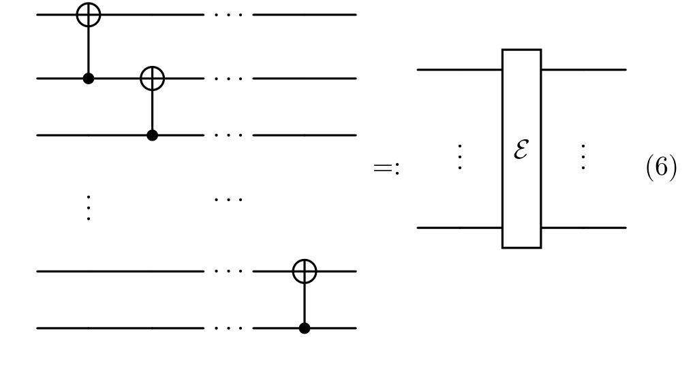
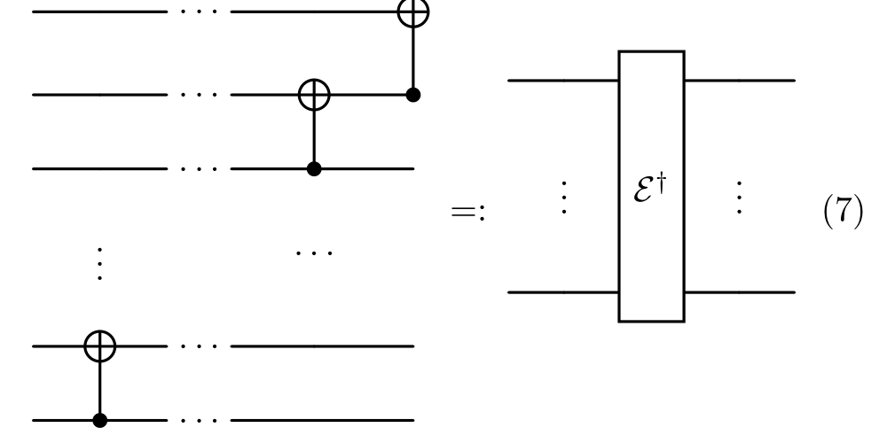
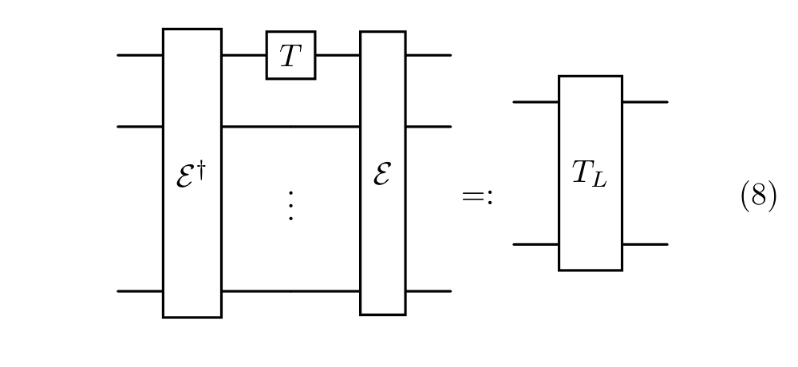
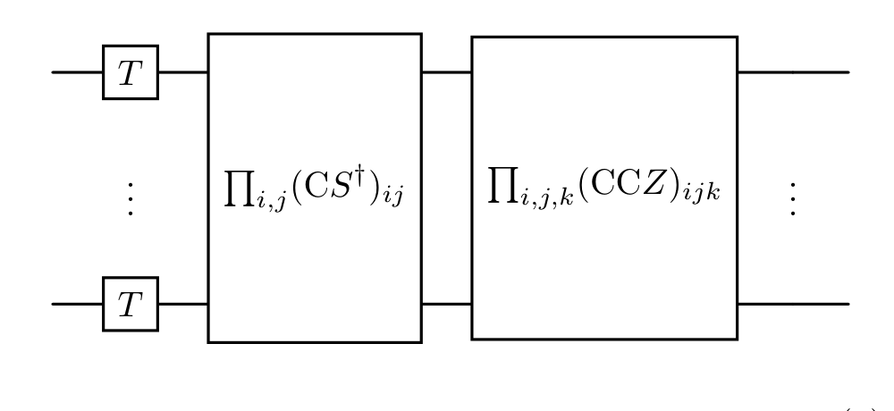
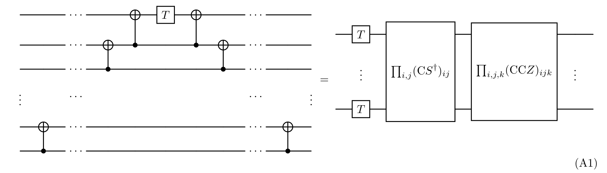
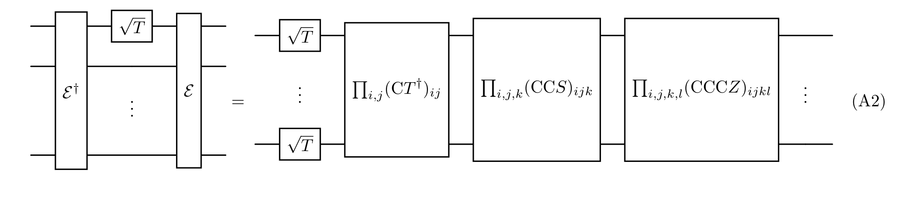
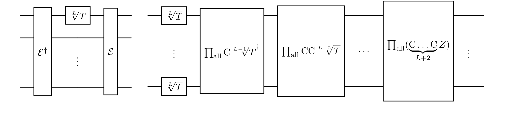
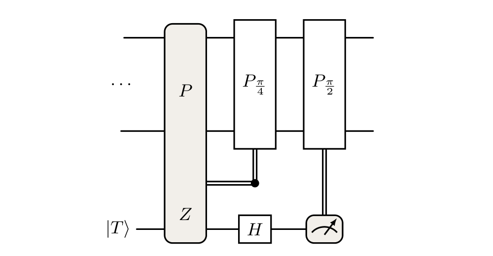
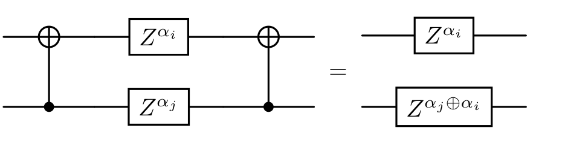
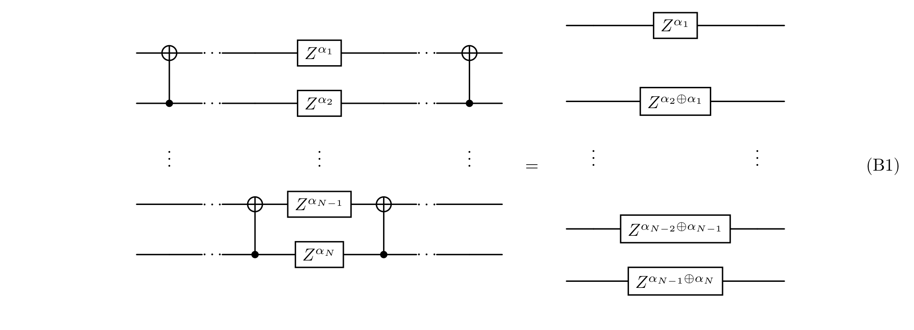

Jacinto 等人的重复码构造把 [[State injection]] 后剩下的 $Z$ 型错误，改写成一个外层 phase-flip repetition code 的 syndrome 检测问题。核心桥梁是：先在重复码上实现一个容错的逻辑 $T$ 门，再把这个逻辑门线路交换过解码线路，得到一个 $nT\to1T$ 的 magic-state distillation protocol。

本文采用

$$
T=\operatorname{diag}(1,e^{i\pi/4}),
\qquad
\omega=e^{i\pi/4},
\qquad
P_{\pi/8}=e^{-i\pi P/8}
$$

并只讨论 $P\in\{I,Z\}^{\otimes N}$ 的 Pauli product rotations。输入 magic states 的错误模型先约化为独立 $Z$ 型错误；这个约化的来源和限制见 [[Clifford Twirling 与魔态错误模型]]。

---
### Phase-flip repetition code

外层码取写在 $X$ 基中的 $[N,1,N]$ repetition code：

$$
|+_L\rangle=|+\rangle^{\otimes N},
\qquad
|-_L\rangle=|-\rangle^{\otimes N}.
$$

稳定子和逻辑算符可取为

$$
\mathcal S=\langle X_iX_{i+1}:1\leq i<N\rangle,
\qquad
\bar X=X_1,
\qquad
\bar Z=Z_1Z_2\cdots Z_N.
$$

这个码只保护一类错误：$Z$ 型 phase flip。若错误图样为

$$
Z(z)=\prod_{i=1}^N Z_i^{z_i},
\qquad
z\in\mathbb F_2^N,
$$

则第 $i$ 个稳定子 $X_iX_{i+1}$ 的 syndrome 是

$$
s_i=z_i\oplus z_{i+1}.
$$

所以没有 syndrome 的 $Z$ 图样只有两类：$z=0$，以及 $z=(1,1,\ldots,1)$。后一种正是逻辑错误 $\bar Z$。

设

$$
|\psi\rangle=\alpha|+\rangle+\beta|-\rangle.
$$

编码线路 $E$ 满足

$$
E\left(|\psi\rangle|+\rangle^{\otimes N-1}\right)
=
\alpha|+_L\rangle+\beta|-_L\rangle,
$$

并把单比特算符映射为

$$
X_i\mapsto X_iX_{i+1}\quad(1\leq i<N),
\qquad
X_1\mapsto \bar X,
\qquad
Z_1\mapsto \bar Z.
$$

这里 $E$ 可以由 descending CNOT cascade 实现，$E^\dagger$ 是 reverse cascade。后面的推导只需要这条 CNOT ladder 对 $Z$ 字符串和计算基奇偶性的作用。

> 编码线路 $E$：descending CNOT cascade（论文 Eq. (6)）。

> 解码线路 $E^\dagger$：reverse, ascending CNOT cascade（论文 Eq. (7)）。

---
### 解码式逻辑 $T$ 为什么不容错

最直接的逻辑 $T$ 门是“先解码、在第一条线上施加 $T$、再编码”：

$$
T_L:=E\,T_1\,E^\dagger.
$$

> 朴素的 decode--$T$--encode 实现（论文 Eq. (8)）。它在理想情况下正确，但会把第一条线上的 $Z$ 错误扩散为逻辑 $\bar Z$。

它在无错误时确实实现逻辑 $T$。问题在于，若 $T_1$ injection 出现一个 $Z_1$ 错误，重新编码会把它映射成

$$
E Z_1 E^\dagger=\bar Z=Z_1Z_2\cdots Z_N.
$$

这正是 repetition code 无法检测的全重逻辑错误。因此，简单的 decode--$T$--encode 线路不是 fault-tolerant：一个物理 injection 错误就能变成逻辑错误。

---
### 相位展开给出的局部门分解

附录 A 的关键结论是，上面的非容错写法可以改写成完全对角、局域支撑受限的门层：

$$
E\,T_1\,E^\dagger
=
\prod_i T_i
\prod_{i<j} CS^\dagger_{ij}
\prod_{i<j<k} CCZ_{ijk}.
$$

> 将 $T_1$ 交换过 CNOT ladder 后，编码和解码抵消，留下 $T$、$CS^\dagger$ 与 $CCZ$ 的对角门层（论文 Eq. (9)）。

这里所有门彼此对易，并且

$$
CS^\dagger=\operatorname{diag}(1,1,1,-i),
\qquad
CCZ=\operatorname{diag}(1,1,1,1,1,1,1,-1).
$$

这个等式不是稳定子码抽象性质，而是一个计算基相位恒等式。取

$$
|\epsilon\rangle
=
|\epsilon_1,\ldots,\epsilon_N\rangle,
\qquad
\epsilon_i\in\{0,1\}.
$$

解码 ladder 先把第一位变成所有输入位的 parity：

$$
\epsilon'_1
=
\epsilon_1\oplus\epsilon_2\oplus\cdots\oplus\epsilon_N.
$$

因此左侧线路在 $|\epsilon\rangle$ 上给出的相位是

$$
\omega^{\epsilon_1\oplus\cdots\oplus\epsilon_N}.
$$

右侧门层的相位来自三部分：

$$
\prod_i T_i:
\quad
\omega^{\sum_i\epsilon_i},
$$

$$
\prod_{i<j}CS^\dagger_{ij}:
\quad
\omega^{-2\sum_{i<j}\epsilon_i\epsilon_j},
$$

$$
\prod_{i<j<k}CCZ_{ijk}:
\quad
\omega^{4\sum_{i<j<k}\epsilon_i\epsilon_j\epsilon_k}.
$$

所以只需证明

$$
\epsilon_1\oplus\cdots\oplus\epsilon_N
\equiv
\sum_i\epsilon_i
-2\sum_{i<j}\epsilon_i\epsilon_j
+4\sum_{i<j<k}\epsilon_i\epsilon_j\epsilon_k
\pmod 8.
$$

这是 [[汉明重量展开#多比特异或公式]] 的模 $8$ 截断。将其中的比特取为 $x_i=\epsilon_i$，四重及更高项都含有 $8$ 的因子，正好得到上式。这里仅使用这一结论把 parity 相位转换为 $T/CS^\dagger/CCZ$ 门层。

> 同一个 parity polynomial 解释了附录 A 中更高层 $Z$ 轴旋转的推广：若相位角需要模 $2^{L+3}$ 核对，就要保留到 $S_{L+3}$；线路中随之出现更高体的 controlled-phase gates。本文后面只使用 $T$ 门对应的三阶截断。

> 附录 A 的线路形式：$E T_1 E^\dagger$ 与 $T/CS^\dagger/CCZ$ 门层相等（论文 Eq. (A1)）。

> 对 $\sqrt T$，三阶截断变为 $CT^\dagger$、$CCS$ 与 $CCCZ$ 门层（论文 Eq. (A2)）。

> 一般 $\sqrt[L]{T}$ 需要最高 $(L+2)$ 体的 controlled-$Z$ 相位层（论文 Eq. (A3)）。

---
### 直接分解的资源数和错误距离

这个门层包含：

- 每个 qubit 一个 $T$；
- 每对 qubits 一个 $CS^\dagger$；
- 每个三元组一个 $CCZ$。

若把

$$
CS^\dagger
\quad\text{和}\quad
CCZ
$$

分别精确分解为 Clifford+$T$，并按 $CS^\dagger$ 消耗 $3$ 个 $T$、$CCZ$ 消耗 $7$ 个 $T$ 计数，则总 $T$ 数是

$$
n
=
N+3\binom N2+7\binom N3.
$$

例如 $N=4$ 给出 $50\to1$、距离 $2$ 的 distillation picture；$N=7$ 给出 $315\to1$、距离 $3$ 的 picture。这个构造说明了重复码逻辑门和 distillation order 的关系，但资源数远大于 [[Reed-Muller码]] 对应的 $15\to1$ 距离 $3$ 协议。

错误距离的来源很直接：一个 faulty $T$、$CS^\dagger$ 或 $CCZ$ 最多只在其支撑上留下 $Z$ 型错误。只要若干 faulty gates 的支撑异或和不是全 $1$，repetition syndrome 就会发现它；只有全 $1$ 图样对应 undetected $\bar Z$。

---
### Pauli product rotation 的矩阵表示

直接使用 $T/CS^\dagger/CCZ$ 层太贵。更紧凑的做法是把逻辑门写成 $n$ 个 Pauli product rotations：

$$
C=\prod_{k=1}^n P^k_{\pi/8},
\qquad
P^k_{\pi/8}
=
e^{-i\pi P^k/8},
\qquad
P^k\in\{I,Z\}^{\otimes N}.
$$

> $P_{\pi/8}$ rotation 的 gate teleportation：注入 $|T\rangle$ 后测量 $P\otimes Z$，再按测量结果施加 Clifford correction（论文 Fig. 2）。

每个 $P^k_{\pi/8}$ 可由一个 $|T\rangle$ injection 和 Clifford correction 实现，因此每一列只消耗一个 noisy magic state。把第 $k$ 个 Pauli string 的支撑记成

$$
\alpha^k=(\alpha^k_1,\ldots,\alpha^k_N)\in\mathbb F_2^N,
\qquad
\alpha_i^k=
\begin{cases}
0,&(P^k)_i=I,\\
1,&(P^k)_i=Z.
\end{cases}
$$

所有列排成一个 $N\times n$ 二进制矩阵 $C$。一个 support 为 $\alpha^k$ 的 $P^k_{\pi/8}$ 等价于在这组支撑 qubits 上做一次较小 repetition code 的逻辑 $T$，所以它贡献：

- 对每个 $\alpha_i^k=1$ 的 qubit，一个 $T_i$ 相位；
- 对每个 $\alpha_i^k\alpha_j^k=1$ 的 pair，一个 $CS^\dagger_{ij}$ 相位；
- 对每个 $\alpha_i^k\alpha_j^k\alpha_l^k=1$ 的 triplet，一个 $CCZ_{ijl}$ 相位。

若要求这些 rotations 精确复现上节的逻辑 $T_L$ 分解，则有

$$
\sum_k\alpha_i^k\equiv1\pmod 8
\qquad(1\leq i\leq N),
$$

$$
\sum_k\alpha_i^k\alpha_j^k\equiv1\pmod 4
\qquad(i<j),
$$

$$
\sum_k\alpha_i^k\alpha_j^k\alpha_l^k\equiv1\pmod 2
\qquad(i<j<l).
$$

如果允许最后补 Clifford correction，则 $T^2=S$、$(CS^\dagger)^2=CZ$ 这些 Clifford 相位可以吸收，于是条件只需保留模 $2$：

$$
\sum_k\alpha_i^k\equiv1\pmod2,
$$

$$
\sum_k\alpha_i^k\alpha_j^k\equiv1\pmod2,
$$

$$
\sum_k\alpha_i^k\alpha_j^k\alpha_l^k\equiv1\pmod2.
$$

这组条件说的是：线路的每条线、每对线、每组三条线，都要被所选 rotations 的支撑覆盖奇数次。它还不是 triorthogonal matrix 的常见形式；常见形式会在交换过解码线路后出现。

---
### 逻辑门线路的距离

第 $k$ 个 noisy injection 若出错，会在 repetition block 上留下 $Z(\alpha^k)$。一组 faulty gates $K$ 的总错误图样是

$$
z(K)=\sum_{k\in K}\alpha^k
\pmod2.
$$

repetition code 的 undetected logical error 条件是

$$
z(K)=(1,1,\ldots,1).
$$

因此逻辑门线路的错误距离是

$$
d(C)
=
\min_K |K|
\quad\text{s.t.}\quad
\sum_{k\in K}\alpha^k
\equiv
\begin{pmatrix}
1\\
\vdots\\
1
\end{pmatrix}
\pmod2.
$$

在独立输入错误率 $p_{\mathrm{in}}$ 且 Clifford 操作理想的近似下，输出错误阶数由这个 $d(C)$ 控制：

$$
p_{\mathrm{out}}=O(p_{\mathrm{in}}^{d(C)}).
$$

前因子取决于最小 malignant sets 的数量；Jacinto 等人指出可用 MacWilliams identity 从相应码计算。

---
### 交换过解码线路得到蒸馏协议

给定一个满足上面条件、距离为 $d$ 的逻辑门线路 $C$，可以这样得到 $nT\to1T$ distillation protocol：

1. 准备 repetition code 的 $|+_L\rangle=E|+\rangle^{\otimes N}$；
2. 施加逻辑门线路 $C$，理想情况下得到 $|T_L\rangle$；
3. 用 $E^\dagger$ 解码；
4. 第一条线作为输出，其余 $N-1$ 条线作为检查 qubits；
5. 检查通过时接受。

为了得到实际的紧凑线路，把 $C$ 中每个 $P^k_{\pi/8}$ 交换过 $E^\dagger$,得到$U$。

$$
U\,E^{^{\dagger}}
=
E^\dagger\,P^k_{\pi/8}\,.
$$

附录 B 证明在这里的编码/解码算符约定下，交换后$U$仍是一个 $\pi/8$ Pauli product rotation$\widetilde P^k_{\pi/8}$：

先把 rotation 展开为

$$
P^k_{\pi/8}
=
\cos\frac{\pi}{8}\,I
-i\sin\frac{\pi}{8}\,P^k.
$$

由于 $E^\dagger I E=I$，共轭不改变 $I$ 项的系数；并且 CNOT 共轭会把 $Z$ strings 仍映为 $Z$ strings，不会产生额外的 $i$ 相位。因此若定义

$$
\widetilde P^k=E^\dagger P^kE,
$$

就有

$$
\begin{aligned}
E^\dagger P^k_{\pi/8}E
&=
\cos\frac{\pi}{8}\,I
-i\sin\frac{\pi}{8}\,E^\dagger P^kE\\
&=
\cos\frac{\pi}{8}\,I
-i\sin\frac{\pi}{8}\,\widetilde P^k
=
\widetilde P^k_{\pi/8}.
\end{aligned}
$$

所以交换线路只改变 Pauli string 的支撑，不改变旋转角，也不改变实施该 rotation 所需的一个 $|T\rangle$ injection。

若

$$
P^k=\prod_i Z_i^{\alpha_i^k},
\qquad
\widetilde P^k=\prod_i Z_i^{\beta_i^k},
$$

取任意进入编码线路前的计算基态 $|y\rangle=|y_1,\ldots,y_N\rangle$。把 Eq. (6) 的 CNOT cascade 从左到右作用，先得到

$$
E|y\rangle
=
|x\rangle,
\qquad
x_i=
\begin{cases}
y_i\oplus y_{i+1},&1\leq i<N,\\
y_N,&i=N.
\end{cases}
$$

现在只考察中间的 Pauli string。因为

$$
P^k|x\rangle
=
\left(\prod_i Z_i^{\alpha_i^k}\right)|x\rangle
=
(-1)^{\bigoplus_i\alpha_i^k x_i}|x\rangle,
$$

代入上面的 $x_i$ 后，$E^\dagger P^kE$ 在 $|y\rangle$ 上留下的相位指数是

$$
\begin{aligned}
\bigoplus_i\alpha_i^k x_i
&=
\bigoplus_{i=1}^{N-1}
\alpha_i^k(y_i\oplus y_{i+1})
\oplus\alpha_N^k y_N\\
&=
\alpha_1^k y_1
\oplus
\bigoplus_{i=2}^{N}
(\alpha_i^k\oplus\alpha_{i-1}^k)y_i.
\end{aligned}
$$

第二步只用了 $\alpha_i^k(y_i\oplus y_{i+1})=\alpha_i^k y_i\oplus\alpha_i^k y_{i+1}$，再把同一 $y_i$ 的两项合并。例如 $y_i$（$2\leq i<N$）的系数是 $\alpha_{i-1}^k\oplus\alpha_i^k$；$y_1$ 只出现一次，系数为 $\alpha_1^k$。

最后，$E^\dagger|x\rangle=|y\rangle$ 只还原 basis label，不改变已经获得的相位。因此

$$
\begin{aligned}
E^\dagger P^kE|y\rangle
&=
(-1)^{
\alpha_1^k y_1\oplus
\bigoplus_{i=2}^{N}
(\alpha_i^k\oplus\alpha_{i-1}^k)y_i
}|y\rangle\\
&=
\left(\prod_i Z_i^{\beta_i^k}\right)|y\rangle.
\end{aligned}
$$

逐项比较 $y_i$ 的系数，故

$$
\beta_1^k=\alpha_1^k,
\qquad
\beta_i^k=\alpha_i^k\oplus\alpha_{i-1}^k
\quad(2\leq i\leq N).
$$

从线路角度看，同一结论来自单个 CNOT 的共轭规则。令上方目标线的 $Z$ 指数为 $a$，下方控制线的指数为 $b$，则

$$
\operatorname{CNOT}
\left(Z_{\mathrm t}^{a}Z_{\mathrm c}^{b}\right)
\operatorname{CNOT}^{\dagger}
=
Z_{\mathrm t}^{a}Z_{\mathrm c}^{a\oplus b}.
$$

沿着 CNOT ladder 依次使用这条规则，得到的正是上述相邻差分。

> 上方线路是目标、下方线路是控制。目标线的 $Z$ 指数 $\alpha_i$ 被写入控制线，得到 $\alpha_j\oplus\alpha_i$（附录 B）。

> 让 $Z(\alpha)$ 穿过解码 CNOT ladder 后，得到相邻差分的 $Z(\beta)$ 字符串（论文 Eq. (B1)）。

这是一个下双对角的二进制线性变换。把前 $i$ 个 $\beta$ 相加时，中间的 $\alpha$ 全部成对消去：

$$
\bigoplus_{r=1}^{i}\beta_r^k
=
\alpha_1^k
\oplus(\alpha_2^k\oplus\alpha_1^k)
\oplus\cdots\oplus
(\alpha_i^k\oplus\alpha_{i-1}^k)
=
\alpha_i^k.
$$

因此反变换是

$$
\alpha_1^k=\beta_1^k,
\qquad
\alpha_i^k=\beta_1^k\oplus\beta_2^k\oplus\cdots\oplus\beta_i^k.
$$

对整个门序列逐个作相同变换，夹在相邻 rotations 之间的 $EE^\dagger$ 抵消：

$$
E^\dagger C E
=
\prod_{k=1}^n
\left(E^\dagger P^k_{\pi/8}E\right)
=
\prod_{k=1}^n\widetilde P^k_{\pi/8}.
$$

把所有 $\beta^k$ 作为列排成矩阵 $G$。这个 $G$ 就是 distillation circuit 的矩阵表示：列数 $n$ 是消耗的 $|T\rangle$ 数，第一行对应输出 qubit，其余行对应检查 qubits。

---
### $\alpha$ 条件如何变成 triorthogonal 条件

记

$$
A_i^k
=
\alpha_i^k
=
\beta_1^k\oplus\cdots\oplus\beta_i^k,
\qquad
A_0^k=0.
$$

逻辑门条件在 $\alpha$ 变量中是“所有 singlets、pairs、triplets 都出现奇数次”。换到 $\beta$ 变量后，附录 B 的 induction 可以理解为对 prefix 变量 $A_i^k$ 做有限差分。

先看单行条件：

$$
\sum_k A_i^k\equiv1\pmod2
\qquad(1\leq i\leq N).
$$

当 $i=1$ 时，

$$
\sum_k\beta_1^k\equiv1\pmod2.
$$

相邻两式相加给出

$$
\sum_k\beta_i^k
=
\sum_k(A_i^k\oplus A_{i-1}^k)
\equiv0\pmod2
\qquad(2\leq i\leq N).
$$

pair 条件同理。由

$$
\sum_k A_i^kA_j^k\equiv1\pmod2
\qquad(i<j)
$$

对 $i$ 和 $j$ 同时做差分：

$$
\sum_k\beta_i^k\beta_j^k
=
\sum_k
(A_i^k\oplus A_{i-1}^k)
(A_j^k\oplus A_{j-1}^k).
$$

右边展开成四个 prefix-pair sums；非边界项都是 $1$，边界项含 $A_0=0$ 后消失，最终都给偶数个 $1$，因此

$$
\sum_k\beta_i^k\beta_j^k\equiv0\pmod2
\qquad(i<j).
$$

triplet 条件也是同一机制：

$$
\sum_k A_i^kA_j^kA_l^k\equiv1\pmod2
\qquad(i<j<l)
$$

三重差分后，每个 $\sum_k\beta_i^k\beta_j^k\beta_l^k$ 是偶数个 prefix-triplet sums 的和，所以

$$
\sum_k\beta_i^k\beta_j^k\beta_l^k\equiv0\pmod2
\qquad(i<j<l).
$$

于是 distillation 矩阵 $G=(\beta^1,\ldots,\beta^n)$ 满足

$$
\sum_k\beta_1^k\equiv1\pmod2,
$$

$$
\sum_k\beta_i^k\equiv0\pmod2
\qquad(2\leq i\leq N),
$$

$$
\sum_k\beta_i^k\beta_j^k\equiv0\pmod2,
$$

$$
\sum_k\beta_i^k\beta_j^k\beta_l^k\equiv0\pmod2.
$$

这正是 $[\![n,1,d]\!]$ punctured(意为删除某多余列) triorthogonal distillation matrix 的形状：第一行奇重量，检查行偶重量，任意两行和任意三行的重叠为偶数。一般 triorthogonal distillation 的码空间解释见 [[Distillation protocol]]；横向相位为什么由这些重叠控制见 [[三正交码与横向逻辑T门]]。

---
### 距离在解码后的形式

原逻辑门线路中的 undetected logical error 是

$$
\sum_{k\in K}\alpha^k
\equiv
\begin{pmatrix}
1\\
\vdots\\
1
\end{pmatrix}
\pmod2.
$$

记 $\alpha\mapsto\beta$ 的差分变换为 $\beta=D\alpha$，其中

$$
D=
\begin{pmatrix}
1&0&0&\cdots&0\\
1&1&0&\cdots&0\\
0&1&1&\cdots&0\\
\vdots&&\ddots&\ddots&\vdots\\
0&\cdots&0&1&1
\end{pmatrix}
\pmod2.
$$

它正是上一节的

$$
\beta_1=\alpha_1,
\qquad
\beta_i=\alpha_i\oplus\alpha_{i-1}
\quad(2\leq i\leq N)
$$

的矩阵形式。现在令 $\alpha=\mathbf 1=(1,1,\ldots,1)^\mathsf T$。第一行给出

$$
\beta_1=1,
$$

而每一条检查线 $i\geq2$ 都给出

$$
\beta_i=1\oplus1=0.
$$

所以

$$
D\mathbf 1
=
\begin{pmatrix}
1\\
1\oplus1\\
\vdots\\
1\oplus1
\end{pmatrix}
=
\begin{pmatrix}
1\\
0\\
\vdots\\
0
\end{pmatrix}
=:e_1.
$$

在线路上，这正是 repetition code 的全重逻辑错误在解码后的样子：

$$
E^\dagger\bar Z E
=
E^\dagger(Z_1Z_2\cdots Z_N)E
=
Z_1.
$$

也就是说，编码空间中无法被 syndrome 发现的 $\bar Z$，在解码后只翻转第一条输出线；其余 $N-1$ 条线没有 $Z$，故检查仍会通过。

更一般地，令一组 faulty rotations 的总错误向量为

$$
\alpha(K)=\bigoplus_{k\in K}\alpha^k.
$$

由于 $D$ 是线性的，其解码后图样是

$$
\beta(K)
=
D\alpha(K)
=
\bigoplus_{k\in K}\beta^k.
$$

因此 $\alpha(K)=\mathbf1$ 当且仅当 $\beta(K)=e_1$，distillation circuit 的距离可写成

$$
d(G)
=
\min_K |K|
\quad\text{s.t.}\quad
\sum_{k\in K}\beta^k
\equiv
\begin{pmatrix}
1\\
0\\
\vdots\\
0
\end{pmatrix}
\pmod2.
$$

这句话的操作含义是：一组输入 $|T\rangle$ 错误若只在第一条输出线上留下 $Z$，而在其余 $N-1$ 条检查线上不留下 syndrome，就会成为 accepted logical output error。需要至少 $d(G)$ 个 faulty injections 才能做到这一点，所以接受后的 leading-order output error 是 $p_{\mathrm{in}}^{d(G)}$ 阶。

---
### 适用范围与失效模式

这个构造依赖以下假设：

- 内层 QECC 已把 Clifford 操作、Pauli measurements、feedforward 和 Pauli product rotation 的 Clifford 部分保护好；
- 每个 $|T\rangle$ injection 的主要缺陷可视为独立 $Z$ 型错误；
- 外层 repetition code 只负责检测 $Z$ 图样，不处理一般 depolarizing、leakage 或 correlated faults；
- 把条件从模 $8$、模 $4$ 放松到模 $2$ 时，默认相差的 $S$、$CZ$ 等 Clifford corrections 可以可靠执行或并入 Pauli/Clifford frame；
- $n$ 只计 magic-state injections 或等价 $T$ resources，不包含 lattice surgery rounds、routing、idle errors、factory warm-up 和检查测量失败。

因此，$d$ 给出的是 magic-state input error 的阶数，而不是完整工厂的 logical failure rate。若 Clifford 层、检查测量或输入 magic states 存在相关错误，实际距离和前因子都需要重新估算。

---
### 连接

- [[State injection]]：说明单个 $|T\rangle$ 如何实现 $T$ 门，以及为什么 injection 错误可转化为输出 $Z$ 型错误。
- [[Distillation protocol]]：把这里得到的 $\beta$ 矩阵解释为一般 triorthogonal distillation protocol。
- [[Reed-Muller码]]：给出 $15\to1$ 距离 $3$ 协议的具体矩阵和错误计数。
- [[三正交码与横向逻辑T门]]：从一般横向相位展开解释 pair/triplet 重叠条件。

---
### 来源

- H. Jacinto, X. Valcarce, V. Barizien, É. Gouzien, and N. Sangouard, [*Exploring the landscape of compact magic-state distillation factories*](<../../Papers/S001_2026_Jacinto_compact_magic_state_factories.pdf>), arXiv:2606.07734 (2026), Sec. III and Appendices A--B.
