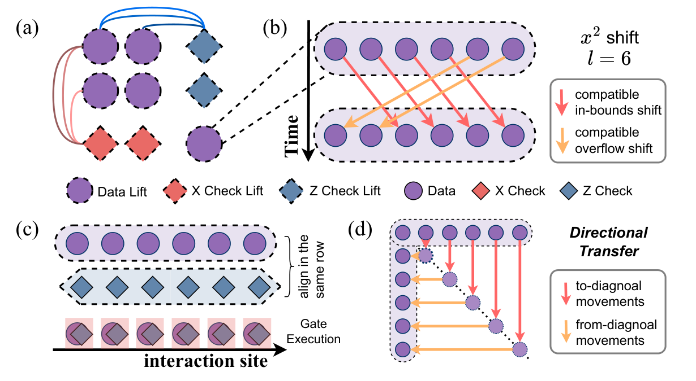

S007 第 6 节不是从头定义 lifted-product code，而是展示怎样把 LP 码的两层组合结构交给中性原子编译器：外层仍按乘积方向组织相互作用，内层再按每条边携带的循环移位标签重排 lift 内的副本。一般构造与记号见 [[Lifted product code]]；HGP 中乘积坐标和行／列方向的来源见 [[Hypergraph product code]]。

### 来源、实例与已知边界

这里采用 S007 的 arXiv v1，重点是第 6 节、式 (2)、图 12 与表 3；第 2.2 节、图 1 和第 3.1 节提供 HGP 乘积方向与中性原子一维执行的接口。论文把实例参数直接记为

$$
\ell=45,
\qquad
[\![2610,744,d\le 16]\!].
$$

这三个参数在这里都是来源给定数据，不从式 (2) 推导。论文把该码归于参考文献 [6]，但该来源目前没有登记在本地文献库中；因此以下只解释 S007 自己展示的构造与执行信息。

英文原文在实例介绍中把这个码指向式 (2)。全文译本同一位置显示的“示例 LP 码 [2]”据此读作“式 (2)”，而不是参考文献 [2]。

S007 显式展示的 seed base matrix 是

$$
A=
\begin{pmatrix}
x^{29}&x^{21}&x^{31}&x^{15}&x^{37}&x^{25}&x^{27}\\
x^{13}&x^{25}&x^{19}&x^{26}&x^{11}&x^{18}&x^{29}\\
x^{31}&x^{2}&x^{27}&x^{32}&x^{41}&x^{41}&x^{18}
\end{pmatrix}.
\tag{2}
$$

这只是一个 $3\times 7$ 的单项式 seed base matrix。S007 第 6 节没有同时展示一般 LP 记号中的第二个因子，也没有把 $A$ 的三行、七列逐项指派成完整的 data、$X$-check、$Z$-check sectors。因此，可以读取每个已展示条目的 shift label，却不能只凭 $A$ 重建完整 stabilizer matrix、完整 lift-level interaction graph 或上述码参数。

### 外层乘积方向

[[Hypergraph product code#行与列的乘积方向]] 中，每条 Tanner 边固定一个乘积坐标、只改变另一个坐标；所有边因而分成两个互不混合的方向。S007 第 2.2 节和图 1 先用 HGP 说明：一个方向可以组织为并行的行子问题，另一个方向可以组织为并行的列子问题；ONEX（把一维门调度转换为中性原子移动与门执行方案的编译器）分别求解这些子问题，再在两个方向之间切换。

第 6 节把同一执行接口用于 LP 实例。LP 相对 HGP 保留 outer product skeleton，同时在每条 base edge 上增加 inner-lift label。于是有两个不同层级：

1. outer product direction 决定当前处理哪一组 lift-level interactions；
2. 该组中每条边的环值系数决定相连 lift 内的副本如何循环配对。

S007 只说明该实例具有可供这种编译使用的底层乘积结构。式 (2) 的单个矩阵不足以自行恢复两个方向的全部代数坐标；具体 data、$X$-check、$Z$-check lift 角色只按图 12 和相邻正文读取。

### Lift-level graph 与式 (2)

在图 12(a) 中，一个虚线外框表示一个完整 lift，框内节点类型由图例标成 Data Lift、X Check Lift 或 Z Check Lift。提升间相互作用图在这个粒度上连边：此时调度单元是整个 lift，而不是其中某个副本。

式 (2) 中每个非零条目都是单项式。安全的读取方式是把

$$
x^k
$$

解释为某条已给 base edge 携带的 cyclic-shift label。矩阵的行、列位置选择 base edge 的两个原型端点，指数 $k$ 再指定这两个端点各自的 $\ell$ 个副本如何对应。这个解释不会把 $A$ 的行、列额外认作完整 LP 码的物理或校验扇区。

### 单项式与提升内配对

按 [[Lifted product code#循环 lift 的环表示]] 固定的仓库记号，令

$$
R_\ell=\mathbb F_2[x]/(x^\ell-1),
\qquad
Pe_t=e_{t+1\bmod\ell},
\qquad
\Phi(x^k)=P^k.
$$

对一条已经确定、列端副本为 $u_t$、行端副本为 $v_t$ 的 base edge，标签 $x^k$ 表示

$$
u_t\longleftrightarrow v_{t+k\bmod\ell}.
$$

这是本库采用的正方向 convention；S007 图 12 只要求循环移位，并没有把正负号规定为唯一约定。若矩阵在校验公式中转置，相应标签也要按 [[Lifted product code#反对合与二进制转置]] 变成逆移位。

图 12(b) 用 $\ell=6$、$x^2$ 画出机制示意。在上述 convention 下，六个副本的对应是

$$
0\mapsto2,
\quad 1\mapsto3,
\quad 2\mapsto4,
\quad 3\mapsto5,
\quad 4\mapsto0,
\quad 5\mapsto1.
$$

前四项是图中标出的界内移位，后两项是溢出移位；“溢出”只表示指标按模 $6$ 回绕。这里的 $\ell=6$ 不是实际码参数；S007 实例采用 $\ell=45$。

再实际读取式 (2) 的左上角条目：$A_{1,1}=x^{29}$。若这条 base edge 的列端、行端副本分别记为 $u_t,v_t$，则

$$
u_t\longleftrightarrow v_{t+29\bmod45}.
$$

这一步只得到该 base edge 的 inner-lift matching，不给 $u,v$ 补充 S007 没有明示的 sector 身份。式 (2) 的 21 个条目都是单项式，所以每条已给边都可按同样方式化成一维循环移位。论文同时指出，一般多项式元素可能需要启发式二维循环移动；这不是本实例单项式机制的额外定义。

### 四个执行阶段

#### 1. 提升间重排

- **处理对象：** 图 12(a) 中的 data lifts 与 check lifts，每个 lift 作为一个完整调度单元。
- **使用的数据：** S007 执行框架采用的 lift-level interaction graph，以及由边着色得到的相容交互组。边着色把共享端点的边分入不同颜色，使同色边形成可同时处理的不冲突组。
- **产生的结果：** ONEX 给出当前相容组中各完整 lift 的移动序列，使所需的 data/check lifts 到达可以继续对齐的位置。

式 (2) 只展示 seed description 的矩阵 $A$；这里所说的完整 interaction graph 是编译流程的输入，不能从已展示的 $A$ 单独补出。

#### 2. 提升内重排

- **处理对象：** 当前活跃 data lift 内编号为 $t\in\mathbb Z_\ell$ 的物理副本。
- **使用的数据：** 当前 base edge 对应的环值系数；在这个实例中是单项式 $x^k$。
- **产生的结果：** 按 cyclic-shift label 重排副本，使应当相互作用的 data/check qubits 在副本层级一一对应。

提升间重排回答“哪两个 lifts 要相遇”，提升内重排回答“这两个 lifts 中哪两个副本要配对”。二者不能合并成同一层索引。

#### 3. 门执行

- **处理对象：** 经过两级重排后已经配对的数据量子比特与校验量子比特。
- **使用的数据：** 当前门阶段的相容交互组与中性原子相互作用位点（interaction sites，即可以执行双量子比特门的成对阱）。
- **产生的结果：** 如图 12(c)，每一对量子比特在同一行的指定相互作用位点对齐；相容组内的纠缠门并行执行。

这一阶段消费前两阶段形成的物理对齐结果，本身不再改变 LP 校验边的代数定义。

#### 4. 定向转移与重复

- **处理对象：** 当前 product direction 执行完毕后的完整物理布局。
- **使用的数据：** 下一 product direction 的取向与图 12(d) 所示双层转移方案。
- **产生的结果：** 通过移向对角线、再移离对角线的 parking 过程，使布局在水平与竖直取向之间切换；随后在新方向重复提升间重排、提升内重排和门执行。

对角停放是 S007 这个中性原子实例的布局方案，不是 LP 码定义或所有硬件实现都必须采用的步骤。

### 层级关系与性能分解

| 层级 | 决定什么 | S007 中的对象 | 执行结果 |
|---|---|---|---|
| outer product | 当前处理哪个乘积方向 | 水平／竖直方向 | 一组一维子问题 |
| inter-lift | 哪些完整 lifts 需要相互作用 | 图 12(a) 的 lift-level graph | 完整 lifts 的相对位置 |
| inner lift | 相连 lifts 内哪些副本配对 | 式 (2) 的 $x^k$、图 12(b) | 循环移位后的副本对应 |
| gate alignment | 配对量子比特在哪里执行门 | 图 12(c) 的 interaction sites | 相容门并行执行 |
| direction transfer | 怎样切换两个乘积方向 | 图 12(d) 的 diagonal parking | 下一方向的初始布局 |

S007 表 3 分别统计 inter-lift、intra-lift、gate、transfer 和额外区间穿梭（shuttle）时长，因而从执行数据上保留了这些层级。表中的加速比例和各项时长只属于该实例与论文采用的硬件、布局及编译设置，不能推广成一般 LP 码的性能定律。

### 回到一般 LP

在本节采用的循环环情形中，LP 构造提供 product skeleton、环值 base matrix、二进制展开和 cyclic-shift labels；这些对象决定校验图中的节点与边。更一般的系数环或群代数条目不必是单一循环移位。S007 在这个循环 lift 实例上增加了具体的中性原子执行选择：以 lift 为元单元的 ONEX 重排、lift 内循环移动、interaction-site 对齐以及双层定向转移。

因此，从这个案例可以带回 [[Lifted product code]] 的一般结论只有：outer product 坐标与 inner lift 坐标是两层不同数据，单项式可以作为 base edge 的循环移位标签。图 12 的 node roles、四阶段编译、diagonal parking 与表 3 性能则保留为 S007 特例；它们不补足论文没有展示的第二因子、完整 sectors 或参数推导。

[[Künneth 分解]] 不参与式 (2) 的读取、cyclic shift 的解释或上述四阶段。只有在进一步分析逻辑空间、维数公式或一般系数环的同调边界时，才需要把它作为可选数学支线。

### 来源

- Adrian Liu, Wan-Hsuan Lin, Daniel Bochen Tan, Qian Xu, Jason Cong，[S007 全文译本](../../Translations/S007.full.zh-CN.md)：§2.2、图 1、§3.1、§4.2.1、§6、式 (2)、图 12 与表 3。
- [S007 本地 PDF](../../Papers/S007_2026_Liu_architecture_compilation_codesign.pdf)：arXiv v1，重点核对 pp.12–13 的英文交叉引用、式 (2)、图 12 与四阶段说明。
- [S007 来源登记](../../Papers/SOURCES.md)：题名、作者、arXiv:2608.20164、版本与本地文件状态。
