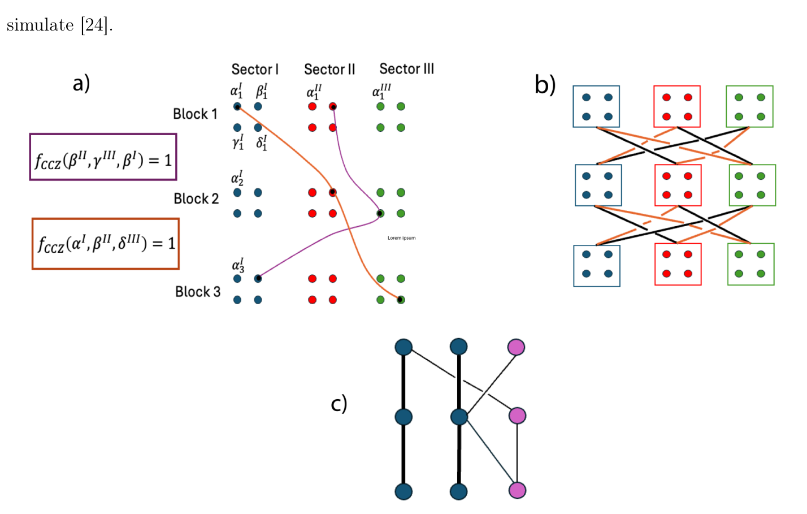
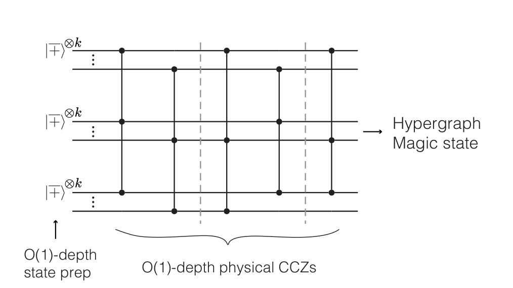
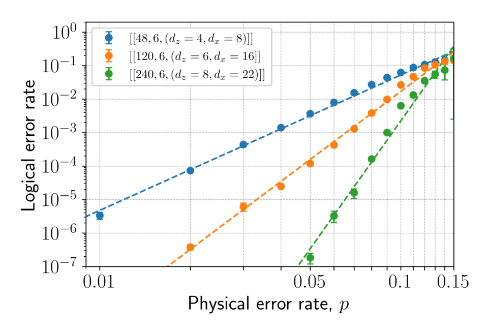
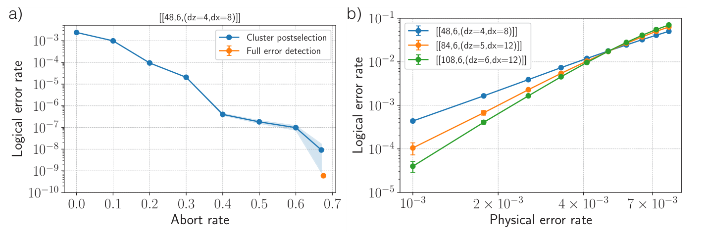
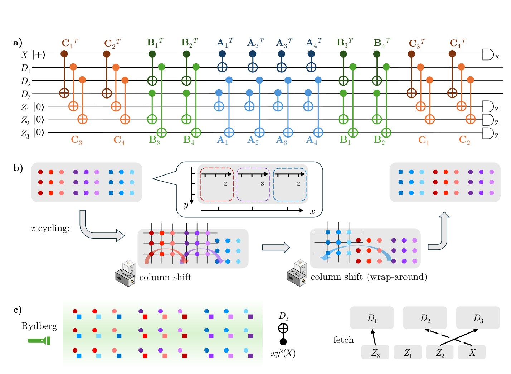
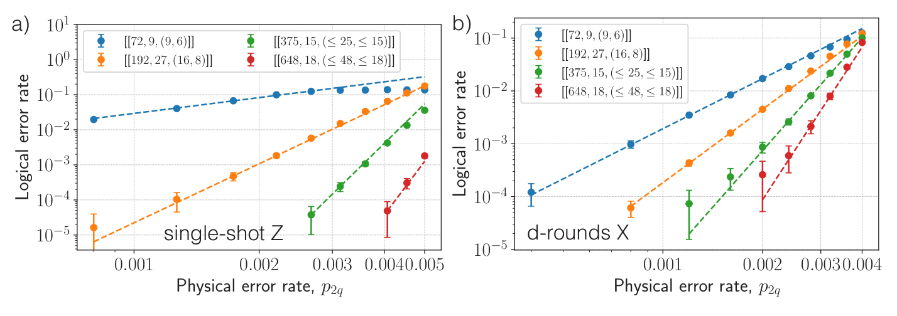
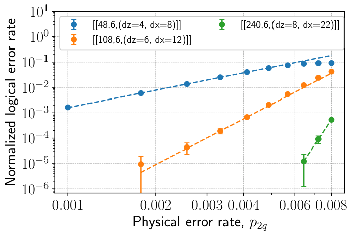
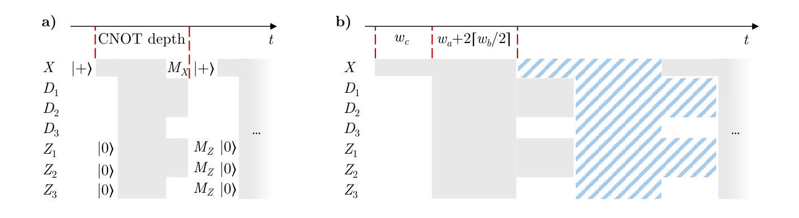
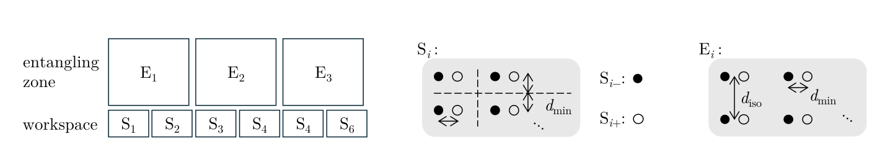

# 魔法三轮码：使用有限块长量子 LDPC 码高效生成魔法态

## 译文信息

- 文献 ID：S003
- 原文：[S003_2025_Menon_magic_tricycles.pdf](../Papers/S003_2025_Menon_magic_tricycles.pdf)
- 原文版本：arXiv:2508.10714v2（PDF 页脚版本日期为 2025-11-06；文稿首页日期为 2025-11-10）
- 翻译类型：全文翻译
- 覆盖范围：所登记 PDF 的全部 63 页，包括标题、摘要、目录、正文第 1–4 节、附录 A–I、参考文献和论文内附的 Supplementary Material；不含另行发布的 ancillary files
- 印刷页码：有；1–63
- PDF 页序：从 1 开始；1–63
- 页码对应关系：印刷页码与 PDF 页序一一对应，即印刷页码 $p$ = PDF 页序 $p$
- 状态：已核对
- 待核对项：无

| 原文章节 | 印刷页码 | PDF 页序 | 状态 | 待核对 |
|---|---:|---:|---|---|
| Title, Abstract, Contents | 1–2 | 1–2 | 已核对 | 无 |
| 1 Introduction | 3–7 | 3–7 | 已核对 | 无 |
| 1.1 Background | 3–5 | 3–5 | 已核对 | 无 |
| 1.2 Summary of results | 5–6 | 5–6 | 已核对 | 无 |
| 1.3 Related work | 6–7 | 6–7 | 已核对 | 无 |
| 2 Main results | 7–19 | 7–19 | 已核对 | 无 |
| 2.1 Tricycle codes | 7–9 | 7–9 | 已核对 | 无 |
| 2.2 Transversal CCZ circuits | 9–12 | 9–12 | 已核对 | 无 |
| 2.3 Single-shot distillation | 12–15 | 12–15 | 已核对 | 无 |
| 2.4 Circuit-noise simulations | 15–17 | 15–17 | 已核对 | 无 |
| 2.5 Implementation of syndrome extraction circuits | 17–19 | 17–19 | 已核对 | 无 |
| 3 Discussion and Outlook | 19–20 | 19–20 | 已核对 | 无 |
| 4 Acknowledgments | 20 | 20 | 已核对 | 无 |
| A Code construction and properties | 20–26 | 20–26 | 已核对 | 无 |
| B Single-shot guarantees | 26–29 | 26–29 | 已核对 | 无 |
| C Determining code distances | 29–31 | 29–31 | 已核对 | 无 |
| D Symmetric triple cup-product and transversal CCZ action | 31–38 | 31–38 | 已核对 | 无 |
| E Numerical Leibniz rule for CCZ gates on 3D balanced-product codes | 38–41 | 38–41 | 已核对 | 无 |
| F Logical circuit optimization | 41–42 | 41–42 | 已核对 | 无 |
| G Numerical details of noise simulations | 42–44 | 42–44 | 已核对 | 无 |
| H Optimal-depth syndrome extraction circuits | 44–48 | 44–48 | 已核对 | 无 |
| I Neutral atom array architecture and rearrangement procedure | 48–51 | 48–51 | 已核对 | 无 |
| References | 51–59 | 51–59 | 已核对 | 无 |
| Supplementary Material | 60–63 | 60–63 | 已核对 | 无 |

## 术语表

| 原文 | 统一译名 | 说明 |
|---|---|---|
| tricycle code | 三轮码 | 首次出现时保留英文 |
| magic state | 魔法态 | |
| magic state distillation (MSD) | 魔法态蒸馏（MSD） | |
| quantum low-density parity-check (qLDPC) code | 量子低密度奇偶校验（qLDPC）码 | |
| transversal gate/circuit | 横向门／横向电路 | |
| code-space preserving | 保持码空间的 | |
| single-shot | 单次 | 首次出现时保留英文 |
| metacheck | 元校验 | |
| soundness | 健全性 | |
| balanced product | 平衡积 | |
| cup-product | 杯积 | 保留原文连字符含义，不改作者记号 |
| symmetric triple cup-product (STCP) | 对称三重杯积（STCP） | |
| numerical Leibniz rule (NLR) | 数值莱布尼茨规则（NLR） | |
| hypergraph magic state | 超图魔法态 | |
| sector | 扇区 | |
| syndrome extraction | 综合征提取 | |
| post-selection | 后选择 | |
| abort rate | 中止率 | |
| neutral atom array | 中性原子阵列 | |

---

## 标题、作者与摘要

**魔法三轮码：使用有限块长量子 LDPC 码高效生成魔法态**

Varun Menon\*†、J. Pablo Bonilla Ataides\*、Rohan Mehta、Andi Gu、Daniel Bochen Tan、Mikhail D. Lukin

美国马萨诸塞州剑桥市 02138，哈佛大学物理系

2025 年 11 月 10 日

### 摘要

制备高保真非 Clifford（魔法）态是实现通用量子计算不可或缺的子程序，却会带来可观的时空开销。基于高码率、高码距量子低密度奇偶校验（LDPC）码且配有横向非 Clifford 门的魔法态工厂，有望显著降低这些开销：它们既可免去多轮蒸馏，又可在单个码块中生成大量魔法态。为朝着高效、容错的魔法态制备迈进一步，我们引入一类有限块长量子 LDPC 码，并将其命名为三轮码（tricycle codes）；它把著名的自行车码推广到三个同调维度。这些码能够支持在三个码块之间实现逻辑 $CCZ$ 门的常深度物理电路。为构造这些常深度 $CCZ$ 电路，我们发展了适用于一大类三维同调积码和平衡积码的新解析与数值技术。

我们还证明，三轮码允许单次（single-shot）态制备和错误校正，由此得到一种极为高效的魔法态生成方案。对若干具体码的数值模拟证实了它们在电路级噪声下的稳健性能，并显示出高于 $0.5\%$ 的高电路噪声阈值。只需适度后选择，某些块长仅为 $50$–$100$ 个量子比特的三轮码便可达到 $6\times10^{-10}$ 或更低的逻辑错误率。最后，我们构造了三轮码的最优深度综合征提取电路，并给出在可重构中性原子平台上高效实现这些电路的方案。

\* 这些作者贡献相同。

† `varunmenon@g.harvard.edu`

## 目录

1. 引言 ··· 3
   1. 背景 ··· 3
   2. 结果概述 ··· 5
   3. 相关工作 ··· 6
2. 主要结果 ··· 7
   1. 三轮码 ··· 7
   2. 横向 $CCZ$ 电路 ··· 9
   3. 单次蒸馏 ··· 12
   4. 电路噪声模拟 ··· 15
   5. 综合征提取电路的实现 ··· 17
3. 讨论与展望 ··· 19
4. 致谢 ··· 20
A. 码构造与性质 ··· 20
B. 单次保证 ··· 26
C. 确定码距 ··· 29
D. 对称三重杯积与横向 $CCZ$ 作用 ··· 31
E. 三维平衡积码上 $CCZ$ 门的数值莱布尼茨规则 ··· 38
F. 逻辑电路优化 ··· 41
G. 噪声模拟的数值细节 ··· 42
H. 最优深度综合征提取电路 ··· 44
I. 中性原子阵列架构与重排流程 ··· 48

补充材料 ··· 60

## 1 引言

### 1.1 背景

通用容错量子计算要求在量子纠错码的逻辑量子比特上同时实现 Clifford 操作和非 Clifford 操作 [39]。在许多码中，逻辑 Clifford 门往往可以横向实现——也就是说，用一个深度不随码大小增长的物理电路来实现。横向门架构天然具有容错性，因为错误在码的物理量子比特之间的扩散范围本来就是有界的。然而，Eastin 和 Knill 的一个奠基性结果证明，不可能在量子纠错码中横向实现通用门集 [32]。由于人们希望尽可能多地横向实现量子门，许多容错量子计算架构采用具有横向 Clifford 门集的码；而非 Clifford 门（亦称魔法门）则通过把专门制备的非 Clifford 资源态传态注入码空间来实现。

容错制备这类高保真资源态的一类方案称为魔法态蒸馏（magic state distillation, MSD）。它依靠具有横向魔法门的量子纠错码，把大量有噪输入魔法态精炼为较少、但保真度更高的输出态。为达到目标输出保真度，典型 MSD 方案（例如 15 到 1 蒸馏，即 15-1-3 方案 [17]）需要多层重复蒸馏，还要与一个码距足够大且支持横向 Clifford 门的内码级联；这些要求显著增加了方案的时空开销。因此，据估算，在最先进的容错架构中，魔法态蒸馏的开销主导着量子比特总数和门总数。例如，即使经过大量优化，魔法态生成在使用 Shor 算法分解 RSA 整数的最新资源估算中仍占主导 [36, 113]。

过去十年间，通过设计兼具横向非 Clifford 门和优良码参数的各种码，人们在显著降低魔法态蒸馏开销方面取得了长足进展 [16, 54, 43, 23]。事实上，最近已有工作证明，存在横向非 Clifford 门、渐近常码率和渐近常相对码距可以同时成立的量子码族，原则上由此可得空间开销为常数的 MSD 方案 [73, 106]。不过，这些提案有两个重要限制。第一，这些低开销蒸馏方案所用的码具有高权重奇偶校验，其校验权重通常随码块长广延增长。因此，在电路级噪声下，这些码本身是否显然容错尚不清楚：它们需要深度随块长增长的综合征提取电路，因而采用裸辅助量子比特提取综合征时，未必具有有限阈值，也未必能在阈值以下实现指数错误抑制。

第二，这些方案在执行码的 Clifford 编码与解码电路时，隐含假设 Clifford 操作无噪声 [17]。若把蒸馏码与具有横向 Clifford 操作的内码（例如二维色码）级联，这一假设便有依据。在实践中，为了不让 Clifford 操作的错误率成为蒸馏方案的瓶颈，必须采用码距足够大的内码，这一要求会进一步放大方案的开销。此外，Clifford 编码和解码电路的深度可能随码的物理量子比特数线性增长，从而造成显著的时间开销。

量子低密度奇偶校验（qLDPC）码同时具有稀疏稳定子校验以及优良的码率、码距标度，已被视为降低量子纠错成本的一条路径。在量子存储方面，最近已有工作证明，存在渐近常码率、常相对码距的 qLDPC 码 [78, 59]；也有人提出了若干在超导量子比特和中性原子架构上实现 qLDPC 存储器的方案 [7, 107, 109, 15]。然而，人们直到最近才开始探索把一般 qLDPC 码用于魔法态生成方案，部分原因是很难构造能够承载横向非 Clifford 门的码。

合适的 qLDPC 码能够从多个方面大幅降低 MSD 方案的开销。高相对码距可确保蒸馏期间有效抑制错误；高码率则允许在单个码块中并行蒸馏多个魔法态，从而提高吞吐率。传统 MSD 方案依赖多次级联的小码，与之不同，LDPC 码有望通过单轮蒸馏达到相同的目标保真度，因而大幅降低时空开销。前述非 LDPC 的常开销和低开销 MSD 方案同样具备这一点；但关键区别是，qLDPC 码在保持常深度综合征提取电路容错性的同时便能具备这些性质。此外，对于具有强横向非 Clifford 门的 qLDPC 码——即不需要 Clifford 校正、仅用常深度非 Clifford 物理门电路即可实现的情形——也不必再与具有横向 Clifford 门的内码级联。因此，构造实用的 LDPC 魔法态工厂对于容错量子计算架构极具价值。

受上述考虑启发，本文引入一类用于魔法态蒸馏的有限块长、高码率、高码距量子 LDPC 码，它们具有横向逻辑 $CCZ$ 电路作用，我们称之为“三轮码”。这些码由阿贝尔群代数上的经典二元线性码 [48] 取三维平衡积 [19] 构造而成；平衡积是同调积的一种特定推广。这一构造把文献 [53, 62] 的双块群代数码（亦称自行车码 [76]）推广到三维，因而原则上允许实现 Clifford 层级第三层中的横向门 [40]。所以，我们也把三轮码称为“三块阿贝尔群代数码”。

需要强调的是：对魔法态蒸馏而言，有限块长但码率和码距都较高的码，基本足以满足任何大规模量子计算的需要。例如，在可实现的物理错误率下，若一个码的码距足以达到 $10^{-12}$ 的逻辑错误率，预期它便足以生成魔法态，使 Shor 算法之类的大规模量子算法 [89] 得以容错执行。

我们用来在三维积码上构造横向非 Clifford 门的理论形式体系，是在码上赋予杯积（cup-product）。杯积是代数拓扑和同调代数中的一种运算，并与码的逻辑算子的三重交有关；第 2.2 节和附录 D 将进一步讨论。概括地说，这套形式体系为一般积型量子 CSS 码提供了必要结构，使其可以承载沿 Clifford 层级上升的横向门。事实上，三维色码的横向非 Clifford 门也能解释为相应三维胞腔复形上的杯积 [11, 55]。

Breuckmann 等人最近提出了一套一般形式体系：为同调积和平衡积量子码对应的上链复形配备杯积，并分类由此产生的门 [18]。本文首先修改这套形式体系，得到具有非平凡 $CCZ$ 作用的高码率、高码距三轮码必须满足的一组条件（见附录 D）。由这一修改后的杯积构造导出的条件，是找到同时具有高码率和高相对码距的三轮码的关键。随后，我们详细研究满足这些条件的码所承载的横向非 Clifford 电路。

更一般地，我们还引入一种受杯积构造启发的新数值方法，用于在迭代平衡积量子码上寻找保持码空间的短深度非 Clifford 电路，并把它用于某些三轮码。我们给出若干这种高码率、高码距三轮码的具体实例，研究它们在现实电路级噪声下的表现，并探索它们在实用魔法态蒸馏方案中的应用。

### 1.2 结果概述

我们构造的三轮码在较小块长下即可取得优良参数，同时承载实现逻辑 $CCZ$ 作用的常深度电路。我们引入若干类校验权重满足 $w_x\leq12$、$w_z\leq8$ 的三轮码，其中 $w_x$ 和 $w_z$ 分别表示码的 $X$ 校验与 $Z$ 校验的权重。我们用记号 $[[N,K,D]]$ 表示量子码的块长 $N$、编码逻辑量子比特数 $K$ 和最小码距 $D$。找到的一些实例参数为

$$
[[48,6,4]],\quad [[108,21,6]],\quad [[270,24,8]],\quad [[270,12,12]],\quad [[480,12,\leq17]],
$$

它们展现出很有竞争力的码距和码率，并与横向非 Clifford 作用相容。表 1 给出了更完整的码表，以及这些码所承载的非 Clifford 横向电路深度。

我们证明，三轮码承载只由三个码块之间的 $CCZ$ 门组成、保持码空间的常深度物理电路。$CCZ$ 电路的逻辑作用取决于各码块中代表性逻辑算子基的选择，但通常是一个逻辑 $CCZ$ 门电路。当这样的电路作用于三个码块的逻辑态 $|+,+,+\rangle^{\otimes K}$ 时，会产生一种高魔法资源态，称为超图魔法态 [114, 24]。这种超图魔法态内嵌 $K_{\mathrm{CCZ}}\leq K$ 个互不相交的 $CCZ|+,+,+\rangle$ 魔法态，可用门传态技术将它们提取出来。物理 $CCZ$ 电路、决定其深度的因素，以及它在特定码上诱导的逻辑作用，将在第 2.2 节和附录 D 中讨论。

我们还证明，三轮码在 $Z$ 测量基中具有单次性质 [9]。第 2.3 节表明，这一性质使得一种蒸馏方案在错误校正周期中只需常数轮综合征提取，而非 $O(d)$ 轮，其中 $d$ 是码距。此外，我们给出数值证据，表明三轮码还具有更强的单次态制备性质，从而可在常深度内制备魔法态制备电路的初始逻辑态。据我们所知，这是此类单次魔法态蒸馏方案的首个实例。

我们在现实的电路级噪声模型下分析若干三轮码的性能。通过比较一系列不同块长的码，我们确定某一三轮码族在采用最大似然错误（MLE）译码器时具有 $0.5\%$ 的电路级噪声阈值。我们也研究后选择和完全错误检测如何改善这些码的性能。为此，我们把最近为量子 LDPC 码提出的高效、基于簇的后选择方法 [57] 与“信念传播 + 局部统计译码”（BP+LSD）[46] 结合使用。

我们证明，在完全错误检测下，即便是本文详细研究的最小三轮码（参数为 $[[48,6,4]]$），也能在接受比例约为 $30\%$ 时达到约 $6\times10^{-10}$ 的逻辑错误率。对于一个更大的码，我们估计：在完全错误检测且接受比例约为 $9\%$ 时，逻辑错误率小于 $10^{-12}$，足以兼容全规模容错量子计算。需要注意，这些逻辑错误率来自把码作为存储器、经历多轮错误校正（含后选择）的数值模拟。具体来说，在确定最终魔法态的保真度时，它们没有计入 $CCZ$ 电路引入的错误。不过，由于 $CCZ$ 电路相当短（上述码的深度为 $8$），我们预期由逻辑存储性能得到的估计会很好地近似目标魔法态的保真度；第 2.4 节将更详细地讨论这一观点。

虽然本文给出的码都是有限块长码，但这一构造允许我们从每个给定块长中选一个高性能三轮码，以此定义码族。这种码族不太可能渐近良好；不过，我们预期总能找到块长更大、码距也更大的码，附录 A 证明的码距下界支持这一主张。相对于这样构造的码族定义阈值后，便可以通过选择块长和码距任意大的码，保证阈值以下的噪声得到抑制。

随后，我们说明如何为所有三轮码构造紧凑的最优深度综合征提取电路。最后，我们给出在可重构中性原子阵列平台上高效实现这些码的制备与综合征提取的具体方案。随本文发布的 ancillary files 中还提供了一段视频，用来演示三轮码综合征提取时的原子移动方案。

我们还澄清了应用文献 [18] 的杯积门形式体系时若干容易忽视的细节。具体而言，要用这套形式体系在高码率、高码距三轮码上产生横向非 Clifford 电路，必须推广文献 [18] 第 5 节给出的条件。由此得到的新条件很可能也适用于其他同调积码族和平衡积码族。附录 D 讨论这些基于杯积的门的理论问题；附录 E 则提出一种互补的数值方法，把杯积构造推广为在三维平衡积码上寻找保持码空间的 $CCZ$ 电路。

本文朝着一类新的蒸馏方案迈出一步：利用量子 LDPC 码的结构性质，降低通用容错计算的资源开销。这类魔法态生成方案天然适合这样的容错量子计算架构：用 LDPC 量子存储器配合魔法态注入的通用适配器，例如文献 [109, 110] 的方案；或者采用低维积码之间的高效码切换方案 [60, 101, 37]。

### 1.3 相关工作

最近有若干工作提出了兼具渐近高码率、高相对码距和横向逻辑 $CCZ$ 作用的二元量子 LDPC 码族。Golowich 和 Lin [38] 基于经典 Sipser–Spielman 扩展子码 [91] 与局部 Reed–Muller 码 [80, 71] 的同调积，构造了一族码率和相对码距近似为常数、并支持横向逻辑非 Clifford 门的码。不过，这些码的校验权重并非常数，而是随块长对数增长。Lin 还提出一套基于代数层的通用形式体系，用于构造具有横向非 Clifford 门的 LDPC 量子码族 [63]。类似地，Zhu 提出了一族码率为常数、码距为多项式且具有横向 $CCZ$ 门的拓扑码 [114, 115]。

量子彩虹码是色码向高维单纯复形的一种推广，具有横向非 Clifford 门，并达到渐近常码率和对数码距 [88]。最后，Breuckmann 等人 [18] 讨论了如何使用上链复形的迭代同调积与平衡积，以及他们发展的杯积门形式体系，构造具有常码率、多项式码距和沿 Clifford 层级上升的横向门的码族。

作为对这些结果的补充，本文聚焦于一类特定的高性能有限块长码。上述工作中的码族究竟从多大的最小实例开始尚不清楚；但由于量子码大小相对于经典码呈立方增长，基于经典码三重同调积的构造，即使是能取得优良参数的最小块长，也很可能需要至少数千、甚至数万个物理量子比特。本文三轮码的块长显著更小，这是我们选择研究它们的主要原因之一。未来一个有趣方向，是直接比较上述各种构造所得 LDPC 码与本文三轮码之间的开销和性能。

## 2 主要结果

### 2.1 三轮码

本文始终以 $\mathbb F_2\equiv\{0,1\}$ 表示二元域，其中的算术均模 $2$ 进行。三轮码是由下列二元分块奇偶校验矩阵定义的量子 CSS 码 [21, 94]：

$$
H_X=\begin{bmatrix}A^T&B^T&C^T\end{bmatrix}
\in\mathbb F_2^{n_G\times3n_G},
\qquad
H_Z=
\begin{bmatrix}
C&0&A\\
0&C&B\\
B&A&0
\end{bmatrix}
\in\mathbb F_2^{3n_G\times3n_G}.
\tag{1}
$$

这里

$$
A=\sum_{i=1}^{w_a}A_i\in\mathbb F_2^{n_G\times n_G},\qquad
B=\sum_{i=1}^{w_b}B_i\in\mathbb F_2^{n_G\times n_G},\qquad
C=\sum_{i=1}^{w_c}C_i\in\mathbb F_2^{n_G\times n_G},
$$

其中 $w_a,w_b,w_c$ 为常数，而 $A_i,B_i,C_i$ 是置换矩阵，即每行、每列都恰有一个 $1$ 的矩阵。参数 $n_G$ 是每个分块的线性大小，并与一个有限群的大小有关（下标 $G$ 正源于此）；附录 A 将讨论这一联系的细节。因此，这些奇偶校验矩阵定义了作用在 $N=3n_G$ 个量子比特上的码。模二算术立即保证 CSS 正交条件 $H_ZH_X^T=0$ 成立。此外，矩阵 $A,B,C$ 两两对易。

码中有 $n_G$ 个权重为 $w_a+w_b+w_c$ 的 $X$ 校验，以及 $3n_G$ 个 $Z$ 校验；后者可分成三组，每组 $n_G$ 个，权重分别为 $w_c+w_a$、$w_c+w_b$ 和 $w_b+w_a$。若取常数 $w$ 并令 $w_a,w_b,w_c\leq w$，所得码在 $X$ 基中是 $(\leq w,\leq3w)$-LDPC 码，在 $Z$ 基中是 $(\leq2w,\leq2w)$-LDPC 码。这里，$(p,q)$-LDPC 表示每个量子比特至多参与 $p$ 个校验，且每个校验至多作用于 $q$ 个量子比特。

表 1 中的具体三轮码说明，这些校验通常高度冗余——由于校验总数 $4n_G\gg N-K=3n_G-K$，这往往能带来优良的码参数并使译码更容易。这一观察具体体现为：三轮码在 $Z$ 基中具有元校验，即由矩阵 $H_{\mathrm{meta}}$ 编码的 $Z$ 校验之间的关系，满足

$$
H_{\mathrm{meta}}H_Z=0.
$$

第 2.3 节将讨论元校验的结构及其影响。

为了确保在低于伪阈值错误率的早期容错架构中实际实现这些码是可行的，我们把注意力限制在最大校验权重不超过 $12$ 的三轮码上。具体考虑三类码。第一类取 $w_a=4$、$w_b=w_c=2$，所得 $X$ 校验权重为 $8$，$Z$ 校验权重为 $4$ 或 $6$；我们根据 $w_a,w_b,w_c$ 的权重把它称为 $4$-$2$-$2$ 码。第二类取 $w_a=w_b=4$、$w_c=2$，因而 $X$ 校验权重为 $10$，$Z$ 校验权重为 $8$ 或 $6$；我们称之为 $4$-$4$-$2$ 码。最后，若取 $w_a=w_b=w_c=4$，则 $X$ 校验权重为 $12$，$Z$ 校验权重为 $8$；我们称之为 $4$-$4$-$4$ 码。

同样也可以考虑 $X$ 校验权重为 $6$、$Z$ 校验权重为 $4$ 的 $2$-$2$-$2$ 码，但经验上，具有非平凡横向 $CCZ$ 作用的这类码，其码率和码距并不理想。特别地，我们找不到编码逻辑量子比特数 $K>3$ 且码距 $D>7$ 的实例；其他近期工作已研究过编码 $K=3$ 个逻辑量子比特、码距 $D\leq7$ 的这类 $2$-$2$-$2$ 码 [51, 60]。

之所以只考虑 $w_a,w_b,w_c$ 取 $2$ 或 $4$，是因为三轮码承载横向 $CCZ$ 电路所需的具体条件（见附录 D）在任意一个 $w_{a,b,c}=3$ 时都无法满足，而 $w_{a,b,c}=1$ 会给出平凡码。也可以令 $w_{a,b,c}>4$，以寻找参数比本文实例更好的码；但经验上，我们发现 $6$-$2$-$2$ 码的参数不优于 $4$-$2$-$2$ 和 $4$-$4$-$2$ 码，而进一步增大校验权重很可能导致较差的阈值。

**表 1：不同块长下的三轮码实例及其参数。**

| $N$ | $K$ |    $D_X$ |    $D_Z$ | 类型          | $CCZ$ 深度 | $CCZ$ 方法 |
| --: | --: | -------: | -------: | ----------- | -------: | -------- |
|  48 |   6 |        8 |        4 | $4$-$2$-$2$ |        8 | STCP     |
|  84 |   6 |       12 |        5 | $4$-$2$-$2$ |        8 | STCP     |
| 108 |   6 |       12 |        6 | $4$-$2$-$2$ |        8 | STCP     |
| 240 |   6 | $\leq22$ |        8 | $4$-$2$-$2$ |        8 | STCP     |
| 480 |   6 | $\leq36$ |       10 | $4$-$2$-$2$ |        8 | STCP     |
| 108 |  12 |       11 |        4 | $4$-$4$-$2$ |       16 | STCP     |
| 180 |  12 |       15 |        6 | $4$-$4$-$2$ |       32 | STCP     |
| 108 |  15 |       12 |        6 | $4$-$4$-$4$ |       96 | NLR      |
| 270 |  24 |       15 |        8 | $4$-$4$-$4$ |       96 | NLR      |
| 324 |  12 | $\leq32$ | $\leq12$ | $4$-$4$-$4$ |      128 | STCP     |
| 480 |  15 | $\leq48$ | $\leq14$ | $4$-$4$-$4$ |      128 | STCP     |

$N$ 为块长，$K$ 为编码逻辑量子比特数，$D_X$ 和 $D_Z$ 分别为逻辑 $X$ 型算子与逻辑 $Z$ 型算子的最小权重。在可行时，码距通过 SAT 求解器寻找最短错误 [35]，或通过混合整数规划 [56] 精确求得。否则，使用附录 C 所述的低权重偏置蒙特卡洛抽样方法、以一亿次抽样估计码距；有时这一估计带有很强的统计保证，此时我们把码距报告为精确值。[^table1-distance]

这些具体码的构造见附录 A 和表 2。“类型”一列用式 (1) 的权重 $w_a$-$w_b$-$w_c$ 标记三轮码类别。表中还列出每个码上具有非平凡逻辑作用、保持码空间的 $CCZ$ 电路深度。最后一列“$CCZ$ 方法”说明码及其非平凡 $CCZ$ 电路是用对称三重杯积方法（STCP，见附录 D）构造，还是用数值莱布尼茨规则方法（NLR，见附录 E）构造。

[^table1-distance]: 具体而言，我们所用方法在对最小权重码字分布作出若干假设的条件下，返回码距的一个置信区间；随后又可以用抽样所得低权重码字的经验分布对这些假设作假设检验。当置信度高于 $99.9\%$ 且假设检验对应的 $p$ 值高于 $10\%$ 时，我们把码距报告为精确值。方法细节见附录 C。

表 1 中各码的码距不平衡，满足 $d_Z\leq d_X$。附录 A 将证明所有三轮码都是如此。实验平台中的噪声通常偏向某一个基，因此，这种不平衡码距可能是有用的特性。噪声偏置能在多大程度上提升三轮码的实验性能，留待未来详细研究。

总的来说，三轮码具有较大的码距，又承载横向 $CCZ$ 电路（见第 2.2 节），因而是面向不同目标逻辑错误率的魔法态工厂的理想候选。虽然这些码的码率低于对应的二维自行车码（例如见文献 [15]），但远高于块长相当的三维二元同调积码，包括三维色码。

本文余下部分主要关注若干 $4$-$2$-$2$ 型三轮码；它们校验权重更低，且具有深度为 $8$ 的 $CCZ$ 电路，因而更贴近实践。$4$-$4$-$4$ 三轮码一般具有更高的码率和码距，但代价是校验权重更高、电路噪声阈值较低（约为 $0.4\%$），而且其非平凡 $CCZ$ 电路平均深得多。附录 D、E 和 G 将给出 $4$-$4$-$4$ 码的更多细节。在我们搜索到的范围内，经验结果表明，$4$-$4$-$2$ 型码的码率、码距或阈值相较于 $4$-$2$-$2$ 和 $4$-$4$-$4$ 型码并无显著改进；不过，表 1 仍列出了两个具有非平凡 $CCZ$ 的 $4$-$4$-$2$ 码实例。

### 2.2 横向 $CCZ$ 电路

三轮码支持由跨三个码块作用的物理 $CCZ$ 门构成、保持码空间的常深度电路。每个码块包含 $3n_G$ 个量子比特，并分成大小相等的 I、II、III 三个扇区，每个扇区含 $n_G$ 个量子比特。把每个量子比特记作 $q_i^j$，其中 $i\in\{1,2,3\}$ 表示码块，$j\in\{\mathrm I,\mathrm{II},\mathrm{III}\}$ 表示扇区。每个扇区内的量子比特可以任意编号，但三个码块中的编号必须保持一致。

横向 $CCZ$ 电路的结构由下列二元函数编码：

$$
f_{\mathrm{CCZ}}:\mathcal Q\times\mathcal Q\times\mathcal Q\longrightarrow\mathbb F_2,
\tag{2}
$$

其中 $\mathcal Q$ 是所有物理量子比特的集合。若

$$
f_{\mathrm{CCZ}}\bigl(q_1^{j_1},q_2^{j_2},q_3^{j_3}\bigr)=1,
$$

就表示在所指定的三个量子比特之间施加一个物理 $CCZ$ 门，其中每个码块各取一个量子比特；否则不施加门。图 1(a) 给出了示意。随后，把 $f_{\mathrm{CCZ}}$ 线性延拓为定义在所有计算基态上的三线性函数。要定义一个有效且保持码空间的电路，$f_{\mathrm{CCZ}}$ 还必须满足两个条件：

1. 若一个或多个自变量对应于定义某个 $X$ 型稳定子的二进制串 $\mathbf b$——即 $X^{\mathbf b}=X^{b_1}\otimes X^{b_2}\otimes\cdots\otimes X^{b_{3n_G}}$ 是 $X$ 型稳定子——而其余自变量对应非平凡 $X$ 型逻辑算子，则 $f_{\mathrm{CCZ}}$ 必须为零。这个条件确保 $f_{\mathrm{CCZ}}$ 能下降为逻辑码字空间上的良定义函数。
2. $f_{\mathrm{CCZ}}$ 必须定义一个由物理 $CCZ$ 门组成的常深度电路。

附录 D 将详述这两个条件及其同调解释；三轮码的 $f_{\mathrm{CCZ}}$ 如何定义，见命题 5。

Breuckmann 等人最近以同调积码上一类称为杯积的代数运算为基础，提出了一套构造满足条件 1 和 2 的适当三线性函数 $f_{\mathrm{CCZ}}$ 的形式体系 [18]。我们修改这套体系，并导出三轮码承载这类横向 $CCZ$ 电路所必须满足的条件；详见附录 D。基于附录 D 中阐述的理由，我们把这套框架及其对码的相应条件称为横向 $CCZ$ 门的对称三重杯积形式体系。它既适用于三维同调积量子 LDPC 码，也适用于三维平衡积量子 LDPC 码 [19]；三轮码正是后者的一例。随后，我们证明存在码率和码距都很好的三轮码，满足对称杯积框架的条件。

需要指出，最近的文献 [51, 60] 已研究过按文献 [18] 原始杯积条件构造的三轮码；所得 $2$-$2$-$2$ 码总有 $K=3$，而 $4$-$2$-$2$ 及其他更高权重码总有 $D=2$。我们发现，要绕开这些限制，本文导出的新对称杯积条件不可或缺；它们也更普遍地适用于其他类别的高维平衡积量子码。

下文略微滥用术语，把 $CCZ$ 电路的“深度”和任一物理量子比特的最大度——即该量子比特参与的 $CCZ$ 门数——交替使用。事实上，控制错误在各码块的物理量子比特之间扩散的相关量正是最大度。电路中这些门的最小调度深度，不超过该度乘以一个很小的常数因子（见附录 D）[75]。

满足对称三重杯积条件的 $4$-$2$-$2$ 型三轮码通常承载深度为 $8$ 的 $CCZ$ 电路。类似地，$4$-$4$-$2$ 码承载深度为 $16$ 或 $32$ 的电路；$4$-$4$-$4$ 码则承载深度为 $12$、$64$ 或 $128$ 的电路。附录 D 将解释码构造中的哪些选择导致这些电路深度。

除对称三重杯积框架外，我们还引入了一套更一般的形式体系，用于在平衡积量子码 [19] 上构造有效的 $f_{\mathrm{CCZ}}$ 函数；这套体系适合对块长为数百量子比特的码开展大规模数值搜索，详见附录 E。借助这一数值方法，我们能找到另外一些 $4$-$4$-$4$ 三轮码：相较于杯积形式体系的结果，它们既有更好的码率和码距，又有深度更短的物理 $CCZ$ 电路。表 1 给出了两个这样的 $4$-$4$-$4$ 码实例；对这套方法更彻底的探索留待未来完成。

按照式 (1) 中奇偶校验矩阵的分块结构，每个三轮码码块中的物理量子比特都可自然分成三个扇区。如图 1 所示，保持码空间的 $CCZ$ 电路总是跨三个码块的不同扇区作用。要导出横向 $CCZ$ 电路的逻辑作用，就用每个码块的逻辑 $X$ 算子代表元，把 $f_{\mathrm{CCZ}}$ 限制到逻辑子空间。若

$$
f_{\mathrm{CCZ}}(l_1^i,l_2^j,l_3^k)=1,
$$

便在相应三个逻辑量子比特之间产生一个逻辑 $CCZ$ 门；这里，$\{l_1^i\}_{i=1,\ldots,K}$ 是第一码块的逻辑 $X$ 算子代表基，$\{l_2^j\}$ 和 $\{l_3^k\}$ 的定义类似。把所得逻辑电路作用于 $|+,+,+\rangle^{\otimes K}$ 后得到的态定义了一个超图魔法态 [114, 24]：顶点是逻辑量子比特，超边是 $CCZ$ 门。近期工作研究了这类超图魔法态，并指出它们可能含有大量魔法资源，而且可能难以经典模拟 [24]。

**图 1：三轮码横向 $CCZ$ 门的结构。** (a) 一个 12 量子比特码上的横向 $CCZ$ 电路示意图。每个码块分成三个各含 4 个量子比特的扇区；量子比特以 $\alpha,\beta,\gamma,\delta$ 标记，其上下标分别表示码块和扇区。彩色曲线表示 $f_{\mathrm{CCZ}}$ 非零的量子比特三元组之间的 $CCZ$ 门。图内 “Block” 表示“码块”，“Sector” 表示“扇区”。(b) 横向 $CCZ$ 电路的结构：所有扇区通过两组互不相交的电路层参与其中；它们分别以橙色和黑色边表示，每一组都可在各量子比特之间并行执行。每个量子比特至多经历 $l$ 个黑色 $CCZ$ 门和 $m$ 个橙色 $CCZ$ 门，因而最大度为 $l+m$。(c) 对一个 $K=3$ 的码优化基之后的逻辑 $CCZ$ 连通结构。圆表示逻辑量子比特，各行对应不同码块。粗黑线表示可用于魔法态蒸馏的 $CCZ$ 门（图示 $K_{\mathrm{CCZ}}=2$），细线则涉及初始化为 $|0\rangle$ 的规范量子比特（粉色）。蓝色圆表示属于互不相交三元组的逻辑量子比特；它们只与同一三元组中的其他量子比特或规范量子比特相连。

> [!note] 译注
> 图 1(a) 原图在紫色曲线附近保留了占位文字 “Lorem ipsum”；本译文按原图保留，不把它解释为物理标注。

> [!note] 译注
> 图 1(b) 最容易误读的一点是：橙色和黑色不是说整个电路只需要两个实际时间步，而是表示两组扇区连接模式。每个码块都有扇区 $\mathrm I,\mathrm{II},\mathrm{III}$；一个非零物理 $CCZ$ 从三个不同码块各取一个量子比特，而且三个量子比特必须分别来自三个不同扇区。因此，三个码块的扇区标签 $(i,j,k)$ 必须是 $(\mathrm I,\mathrm{II},\mathrm{III})$ 的排列，共有 $3!=6$ 种。它们可分成两组，例如：
>
> | 组 | 三个码块的扇区 $(B_1,B_2,B_3)$ |
> |---|---|
> | 黑色 | $(\mathrm I,\mathrm{II},\mathrm{III})$、$(\mathrm{II},\mathrm{III},\mathrm I)$、$(\mathrm{III},\mathrm I,\mathrm{II})$ |
> | 橙色 | $(\mathrm I,\mathrm{III},\mathrm{II})$、$(\mathrm{II},\mathrm I,\mathrm{III})$、$(\mathrm{III},\mathrm{II},\mathrm I)$ |
>
> 两组的颜色名称互换不影响结构。每组中，九个“码块–扇区”组合都恰好出现一次，所以组内三种连接模式不共享扇区，可以在扇区层面相互并行。例如，第一码块扇区 $\mathrm I$ 中的量子比特只会遇到两种扇区连接模式：
>
> $$
> (B_1\mathrm I,B_2\mathrm{II},B_3\mathrm{III}),
> \qquad
> (B_1\mathrm I,B_2\mathrm{III},B_3\mathrm{II}),
> $$
>
> 其中一种属于黑色组，另一种属于橙色组。
>
> 同一种扇区连接模式内部仍可能包含许多物理 $CCZ$ 门，而且这些门可能共享具体量子比特。对物理量子比特 $q$，定义
>
> $$
> d_{\mathrm B}(q)
> =\text{量子比特 }q\text{ 参与的黑色门数},
> \qquad
> d_{\mathrm O}(q)
> =\text{量子比特 }q\text{ 参与的橙色门数}.
> $$
>
> 若对所有 $q$ 都有
>
> $$
> d_{\mathrm B}(q)\leq l,
> \qquad
> d_{\mathrm O}(q)\leq m,
> $$
>
> 那么
>
> $$
> d(q)
> =d_{\mathrm B}(q)+d_{\mathrm O}(q)
> \leq l+m,
> $$
>
> 因而 $CCZ$ 超图的最大度满足
>
> $$
> \Delta=\max_q d(q)\leq l+m.
> $$
>
> 图注把这个总上界简称为“最大度 $l+m$”；严格地说，若 $l,m$ 只是两组各自的上界，则直接推出的是 $\Delta\leq l+m$，只有某个量子比特同时达到两部分上界时才取等号。还要区分最大度和实际电路深度：最大度 $\Delta$ 是单个量子比特总共参加的 $CCZ$ 门数；实际深度则是把全部门安排成多少个互不共享量子比特的时间层。同一个量子比特参与的 $\Delta$ 个门不能同时执行，所以深度至少为 $\Delta$，其他调度冲突还可能使深度更大。附录 D 的主要实例中，最大度为 $8$，而最小调度深度为 $10$。因此，黑、橙两组只表示扇区层面的并行结构，不是两个实际门层。

> [!note] 译注
> 图 1(c) 表达的是：三个 $K=3$ 的码块若把全部逻辑量子比特初始化为 $|+\rangle$，完整逻辑 $CCZ$ 电路通常会产生一个连通关系复杂的九逻辑量子比特超图态；通过选择合适的逻辑基，并把每个码块中的一个逻辑量子比特固定为 $|0\rangle$，可以留下两个彼此独立的 $|CCZ\rangle$ 资源态。
>
> 这里 $K=3$ 是指每个码块编码三个逻辑量子比特。因此，三个码块一共有 $3K=9$ 个圆：
>
> - 上、中、下三行分别表示码块 $1,2,3$；
> - 每行三个圆表示该码块的三个逻辑量子比特；
> - 一条贯穿三行的线表示一个作用于三个逻辑量子比特的三体逻辑 $CCZ$，不是若干两体 $CZ$。
>
> 逻辑电路可用三阶二元张量表示：
>
> $$
> T^{\mathrm{log}}_{ijk}=1
> \quad\Longleftrightarrow\quad
> CCZ\bigl(q_i^{(1)},q_j^{(2)},q_k^{(3)}\bigr)
> \text{ 出现在逻辑电路中}.
> $$
>
> 一般情况下，这个张量可能有许多非零元：一个逻辑量子比特会参加多个 $CCZ$，不同三元组可能共享逻辑量子比特，所得超图态因而不能直接分解成彼此独立的 $|CCZ\rangle$。所谓“优化逻辑基”，就是在三个码块中分别选取新的逻辑算子基，使选出的两个逻辑坐标满足
>
> $$
> T^{\mathrm{log}}_{abc}
> =
> \begin{cases}
> 1,&a=b=c,\\
> 0,&\text{其他},
> \end{cases}
> \qquad
> a,b,c\in\{1,2\}.
> $$
>
> 于是，蓝色逻辑量子比特之间只剩两个三体门：
>
> $$
> CCZ\bigl(q_1^{(1)},q_1^{(2)},q_1^{(3)}\bigr),
> \qquad
> CCZ\bigl(q_2^{(1)},q_2^{(2)},q_2^{(3)}\bigr).
> $$
>
> 这就是图中的两条粗黑线，所以图示可提取的资源态数为 $K_{\mathrm{CCZ}}=2$。剩下每个码块的第三个逻辑量子比特画成粉色，并被初始化为 $|0\rangle$；所有细线表示的额外 $CCZ$ 都至少涉及一个粉色逻辑量子比特。对 $a,b,c\in\{0,1\}$，
>
> $$
> CCZ|abc\rangle=(-1)^{abc}|abc\rangle,
> $$
>
> 所以任一输入固定为 $|0\rangle$ 时，
>
> $$
> CCZ|ab0\rangle=|ab0\rangle,
> $$
>
> 相应的细线便不起作用。若六个蓝色逻辑量子比特初始化为 $|+\rangle$，有效输出为
>
> $$
> |CCZ\rangle_1\otimes|CCZ\rangle_2
> \otimes|0\rangle_{\mathrm{gauge}}^{\otimes3},
> \qquad
> |CCZ\rangle:=CCZ|+,+,+\rangle.
> $$
>
> 这里的“规范量子比特”只是指被固定、不作为输出资源使用的编码逻辑量子比特，不一定是 subsystem code 意义下原生的 gauge qubit。图中还隐含了一个重要假设：能够选择性地把粉色逻辑量子比特制备成 $|0\rangle$，同时把蓝色逻辑量子比特制备成 $|+\rangle$；论文指出，对 qLDPC 码高效完成这种选择性初始化仍是实际难题。

产生的超图魔法态本身既有趣，也可能直接用于计算；不过，为了量子计算，我们还希望能从逻辑电路中提取更小的组成魔法门。一种做法是要求逻辑电路由跨码块的 $K$ 个 $CCZ$ 门组成，且每个门作用于互不相交的逻辑量子比特三元组。然而，未必总能（而且很可能不能）选择出产生这种逻辑电路的逻辑基。我们可以退而求其次，最大化可从互不相交逻辑量子比特三元组上提取的 $CCZ$ 门数 $K_{\mathrm{CCZ}}\leq K$。

寻找这样一个子集，等价于计算 $f_{\mathrm{CCZ}}$ 限制到逻辑算子后所得函数的子秩；这是张量秩理论中的一个已知问题 [26, 52, 38, 63]。我们使用混合整数规划寻找该问题的可行解（附录 F），并报告表 1 每个码所找到的最佳 $K_{\mathrm{CCZ}}$。对大多数码，求解器受计算资源限制，最终在证明最优性之前超时。这说明如果采用专门设计的启发式优化策略，可能找到比本文报告值更大的 $K_{\mathrm{CCZ}}$；这是一个很有希望的未来方向。所得逻辑电路允许提取 $K_{\mathrm{CCZ}}$ 个可用的 $CCZ$ 门。不参与这些门的逻辑量子比特被当作规范量子比特并初始化为 $|0\rangle$，从而使所有涉及它们的 $CCZ$ 门失效（见图 1(d)）；详见附录 D。

> [!note] 译注
> 原文此处引用“图 1(d)”，但图 1 只有 (a)–(c) 三个分图；按上下文，该处应指图 1(c)。本译文保留原引用并说明这一疑似笔误。

利用附录 F 所述方法，我们为表 1 中每个码及其相应 $CCZ$ 电路都找到了至少 $K_{\mathrm{CCZ}}\geq2$。我们尝试为这些码寻找更大的 $K_{\mathrm{CCZ}}$，但所用求解器未能在合理时间内收敛。因此要强调：本文给出的 $K_{\mathrm{CCZ}}$ 是精确方法返回的下界；随着 $K_{\mathrm{CCZ}}$ 增大，这些方法会迅速变得不可行。首要原因是目前缺少针对二元张量子秩问题、性能优良的高效启发式方法。我们预计，一旦这类启发式方法有所进展，表 1 中各码可单独蒸馏的 $CCZ$ 型魔法态产率也会提高。

LDPC 魔法态蒸馏提案中有一个常被轻描淡写的细节：若要从完整逻辑电路中提取这 $K_{\mathrm{CCZ}}$ 个互不相交的 $CCZ$ 门，就必须能选择性地把规范逻辑量子比特初始化为 $|0\rangle$，同时把其余逻辑量子比特初始化为 $|+\rangle$。例如，文献 [38, 63, 114, 115, 18] 的提案都假定具备这一能力。然而，对 LDPC 码进行选择性态初始化并不平凡，而且一般并不清楚能否在常深度内完成。文献 [109] 为在同调积码中初始化任意 Pauli 乘积态而提出的技术，若加以扩展，或许可用于选择性初始化。

近期工作还提出了批量 Pauli 乘积态制备技术：只要同时把许多码块初始化为相同状态，它就能以常数开销在任意 qLDPC 码上实现选择性态初始化 [108]。我们预计，这些技术对于 LDPC $|CCZ\rangle$ 魔法态工厂非常有用 [108]。不过，更一般地，我们希望强调另一种观点：可以把 $K$ 个逻辑量子比特的全局超图魔法态视为高魔法资源态 [24]，再配合适当的电路编译技术，在具有横向 Clifford 操作的目标计算码中用它执行有用的量子计算。对这一观点的详细研究，以及在三轮码与目标 Clifford 门集计算码之间高效门传态的具体方案，都留待未来工作。

### 2.3 单次蒸馏

下面说明三轮码如何实现单次魔法态生成。先用常数轮错误校正，容错地把三个码块初始化为 $|+\rangle^{\otimes K}$；再施加上一节所述的横向 $CCZ$ 电路。这样便能在常数电路深度内得到高保真超图魔法态，如图 2 所示。

我们在常深度内制备逻辑 $|+\rangle^{\otimes K}$ 的方法，依靠两个关键性质：其一，态初始化期间，码在一个稳定子基中天然容错；其二，码具有元校验，可在互补基中进行单次错误校正。具体而言，把物理数据量子比特初始化为乘积态 $|+\rangle^{\otimes n}$，再执行一轮稳定子测量。三轮码是 CSS 码，$X$ 型校验由作用在输入 $|+\rangle$ 态上的物理 $X$ 算子乘积实现。因此，没有错误时，$X$ 校验的测量结果是确定的，于是可以检测并校正态制备期间出现的 $Z$ 错误。

**图 2：使用三轮码进行单次蒸馏。** 利用码在一个基中的固有韧性——即把物理量子比特制备成使相应稳定子校验结果确定的状态——并在互补的非确定性基中进行单次错误校正，就能以常深度容错制备三轮码的逻辑 $|+\rangle^{\otimes K}$ 态。逻辑非 Clifford 操作由物理 $CCZ$ 门组成的常深度电路实现。输出是一个逻辑超图魔法态，其中内嵌 $K_{\mathrm{CCZ}}\leq K$ 个互不相交的逻辑 $|CCZ\rangle$ 资源态。图内 “$O(1)$-depth state prep” 表示“$O(1)$ 深度态制备”，“$O(1)$-depth physical $CCZ$s” 表示“$O(1)$ 深度物理 $CCZ$ 门”，“Hypergraph Magic state” 表示“超图魔法态”。

然而，最初的 $Z$ 型稳定子测量会给出非确定性的 $\pm1$ 结果；在施加 $CCZ$ 门之前，必须在硬件上把这些结果可靠地固定为 $+1$ [7]。表面码之类的码不具有单次态制备性质；三轮码与它们不同，其 $Z$ 奇偶校验矩阵包含大量冗余校验。这些冗余校验继而构成一组稳健的元校验，在综合征比特上定义一个经典码，使译码器能够识别并校正综合征测量错误。在 $Z$ 基中，它们具有如下形式：

$$
H_{\mathrm{meta}}=\begin{bmatrix}B&A&C\end{bmatrix},
\tag{3}
$$

其中 $A,B,C$ 与式 (1) 相同。对测量量子比特错误的容忍度由单次码距 $D_Z^{\mathrm{SS}}$ [22] 决定；它定义为：通过所有元校验、却不是一个 $Z$ 综合征的错误综合征的最小权重。$D_Z^{\mathrm{SS}}$ 较大意味着存在相当多的冗余，因而更容易识别稀疏综合征错误。对所考察的所有码（见表 1），我们都发现 $D_Z^{\mathrm{SS}}=D_Z$；若精确计算码距不可行，则至少二者的上界相等（见附录 C）。文献 [51] 也从解析上证明，对这里的 $H_{\mathrm{meta}}$ 有 $D_Z^{\mathrm{SS}}=D_Z$。还总能把 $H_{\mathrm{meta}}$ 扩充为满秩矩阵 [22]：强制译码器把有噪综合征修复为某种数据量子比特错误模式可以产生的综合征，由此得到 $D^{\mathrm{SS}}=\infty$。

元校验与健全性性质 [22] 结合后，在某些错误模型下，只需常数轮错误校正，便可容错推断 $Z$ 稳定子的本征值。值得注意的是，从完全随机的初始化出发把 $Z$ 稳定子制备到 $+1$，比单纯进行单次错误校正更困难 [47, 9]；在后一个任务中，译码器可以假定，在观察到噪声之前，$Z$ 稳定子已经被容错固定为 $+1$。例如，许多超图积码可以进行单次错误校正，却不能进行单次态制备 [47]。

> [!note] 译注
> 令 $e$ 表示会翻转 $Z$ 稳定子本征值的 $X$ 型数据错误，$u$ 表示综合征测量错误，则实际读到的综合征为
> $$
> s=H_Ze+u.
> $$
> 因为 $H_{\mathrm{meta}}H_Z=0$，所以元综合征满足 $H_{\mathrm{meta}}s=H_{\mathrm{meta}}u$，只反映测量错误。
>
> 文中的“扩充为满秩矩阵”不是把 $H_{\mathrm{meta}}$ 变成可逆方阵，而是把它的行补成 $H_Z$ 左零空间的一组基。若综合征共有 $m$ 位，则补全后的最大元校验矩阵 $H_{\mathrm{meta}}^{\max}$ 满足
> $$
> \operatorname{row}H_{\mathrm{meta}}^{\max}=\ker H_Z^T,
> \qquad
> \operatorname{rank}H_{\mathrm{meta}}^{\max}=m-\operatorname{rank}H_Z,
> $$
> 从而
> $$
> \ker H_{\mathrm{meta}}^{\max}=\operatorname{im}H_Z.
> $$
> 因此，一个候选综合征通过全部元校验，当且仅当它确实能由某个数据错误产生。按定义，不再存在“通过元校验、却不属于 $\operatorname{im}H_Z$”的综合征，所以 $D^{\mathrm{SS}}=\infty$。这不表示能够纠正无限多个测量错误，只表示不会发生“修复后的综合征没有任何物理错误解释”的元校验失败。前文的 $D_Z^{\mathrm{SS}}=D_Z$ 针对天然的稀疏矩阵 $H_{\mathrm{meta}}=[B\ A\ C]$；$D^{\mathrm{SS}}=\infty$ 则针对补全后的最大元校验集，二者并不矛盾。补充约束也可以只在经典译码器中实施，不需要增加量子测量。
>
> 以下只考虑补全后的 $H_{\mathrm{meta}}^{\max}$。译码分为两步。
>
> **第一步：修复测量结果。** 译码器寻找最小权重的测量修正 $\widehat u$，使
> $$
> \widetilde s:=s+\widehat u\in\ker H_{\mathrm{meta}}^{\max}=\operatorname{im}H_Z.
> $$
> 因而 $\widetilde s$ 一定是合法综合征。实际测量错误 $u$ 虽然未知，却是一个可行解，因为 $s+u=H_Ze$；所以最小权重解满足 $|\widehat u|\leq|u|$。
>
> **第二步：修复数据错误。** 译码器选择数据修正 $\widehat e$，使 $H_Z\widehat e=\widetilde s$。施加后留下残余错误 $R:=e+\widehat e$，其综合征为
> $$
> q:=H_ZR=u+\widehat u,
> \qquad |q|\leq2|u|.
> $$
>
> 元校验补全只保证第一步得到的 $\widetilde s$ 有物理解释，并不保证第二步留下的 $R$ 很小。健全性补上了这一点：只要残余综合征 $q$ 足够小，就存在另一个错误 $R_\star$，满足
> $$
> H_ZR_\star=q,
> \qquad |R_\star|\leq f(|q|)\leq f(2|u|),
> $$
> 其中 $f$ 不随码块长增长。$R$ 与 $R_\star$ 具有相同综合征；在相应的量子码距条件下，它们只能相差一个稳定子，而不能相差一个逻辑算子。因此，残余错误 $R$ 在模稳定子的意义下仍然很小。
>
> 若不补全 $H_{\mathrm{meta}}$，第一步只知道 $\widetilde s$ 通过了天然元校验，并不自动知道它属于 $\operatorname{im}H_Z$；这时还需条件 $2|u|<D_Z^{\mathrm{SS}}$ 来保证其合法性。无论采用哪一种保证，元校验都利用同一轮测量中的空间冗余处理测量错误，健全性则控制残余数据错误，因而不必使用随码距增长的重复测量轮数。这里的严格结论仍取决于噪声模型和错误权重界，而且只直接保证单次错误校正；从随机初态把全部 $Z$ 稳定子固定为 $+1$ 的单次态制备还需要后文所述的额外条件。

附录 B 在 $Z$ 基中证明某一三轮码子类的健全性，并回顾由此得到的、适用于态制备的单次 $Z$ 基可译码保证 [109]。此外，我们直接模拟三个具有良好有限尺寸编码率和码距的码的单次态制备，结果表明一般三轮码似乎都具有单次态制备性质。图 3 的结果显示，随着码距增加，逻辑错误受到指数抑制；这与容错态制备一致。

**图 3：$4$-$2$-$2$ 三轮码在 $Z$ 基中的单次态制备唯象噪声模拟。** 我们的方法遵循文献 [47]，并假设初始 $Z$ 综合征平凡。对每个码，模拟一轮综合征测量，其中测量错误以概率 $p$ 发生；不过，我们预期增大译码窗口会提升性能（见第 2.4 节）。最大似然错误（MLE）译码器分别对数据量子比特和测量量子比特施加最小权重校正。随后，模拟对数据量子比特进行有噪横向 $Z$ 基测量，用 MLE 译码器译码重建的综合征，并施加相应校正。若残余 $X$ 算子是三轮码的逻辑算子，就视为发生一次逻辑失败；逻辑错误率按每个逻辑量子比特归一化。观察到的唯象阈值为 $\gtrsim13\%$。逻辑错误率由蒙特卡洛模拟确定；误差棒表示标准误差，计算式为 $\sqrt{p_L(1-p_L)/M}$，其中 $M$ 为样本数。图内纵轴 “Logical error rate” 表示“逻辑错误率”，横轴 “Physical error rate, $p$” 表示“物理错误率 $p$”。

回到魔法态工厂：初始化之后，必须依靠三轮码的单次错误校正能力来阻止错误扩散。每个 $CCZ$ 门都会把预先存在的一个 $X$ 错误传播为另外两个量子比特上的 $CZ$ 错误；综合征测量后，这些错误会坍缩成非确定性的 $Z$ 错误模式。为防止这类错误不断积累，必须持续把 $Z$ 稳定子修复到 $+1$。对于不具有单次性质的码，这通常需要“即时译码”（just-in-time decoding）[10]：先容许错误簇稍微扩张，再加以校正；代价是码的性能和阈值下降 [86, 87]。

相较之下，三轮码的单次 $Z$ 基可以立即校正 $X$ 错误（至多留下一点小的残余错误），从而限制 $CZ$ 错误反复传播。虽然 $X$ 基不具有单次性质，但关键在于：它所检测的 $Z$ 错误与 $CCZ$ 门对易，因此不必实时校正。这恰好很有利，因为在 $CCZ$ 电路完成前，它可能会扰乱 $X$ 稳定子群。$CCZ$ 电路深度为常数，所以只在完成后测量 $X$ 稳定子就足够；不过，若加入利用稳定子掩蔽 [69] 的中间校正策略，或许还能进一步获益。

这些结果共同表明，我们的码只用一轮便能容错制备逻辑 $|+\rangle$ 态。因此，基于这些码的魔法态工厂极其紧凑：可在常深度内制备初态 $|+\rangle_1\otimes|+\rangle_2\otimes|+\rangle_3$，并容错地把所有 $Z$ 稳定子固定为 $+1$；上一节说明，逻辑 $CCZ$ 操作同样可在常深度内实现，因而能在常深度内产生高保真超图魔法态。

### 2.4 电路噪声模拟

下面评估这些码在现实电路级噪声模型下的性能。我们主要关注 $4$-$2$-$2$ 三轮码族；它们的校验权重适中（$w_x=8,w_z=6$），并具有对称三重杯积构造中深度最短的 $CCZ$ 电路（见附录 D）。为便于比较，附录 G 也给出若干 $4$-$4$-$4$ 码的电路级噪声模拟。

为了标定性能，我们模拟影响综合征提取电路中纠缠门的电路级噪声。采用标准双量子比特退极化噪声模型：给定双量子比特门错误率 $p_{2q}$，每次纠缠操作之后以相等概率出现 $IX,IY,\ldots,ZZ$ 这十五种非平凡双量子比特 Pauli 错误之一；否则以概率 $1-p_{2q}$ 不发生错误。

三轮码在 $X$ 基中的码距自然高于 $Z$ 基。这里优先模拟更具挑战性的 $X$ 基；展现稳健单次行为的 $Z$ 基结果放在附录 G。在 $X$ 基中，我们采用传统的 $d$ 轮方案：综合征提取序列重复 $d$ 个周期，再利用全部轮次积累的完整综合征记录进行译码。所用的是第 2.5 节概述的深度最优综合征提取电路结构。

为进行译码，我们把综合征提取过程映射为一个时空码：校验对应相邻时间步稳定子测量结果的奇偶性，每个码量子比特则对应电路中一个不同的故障位置 [107, 14]（见附录 G）。对 $4$-$2$-$2$ 码的 $d$ 轮模拟，采用最大似然错误（MLE）译码器。所得逻辑错误率见图 4(b)，其定义为逻辑量子比特失败概率，再分别按错误校正总轮数和码块中的逻辑量子比特数归一化。我们观察到约 $0.5\%$ 的门噪声阈值，并在具有现实意义的物理门错误率下取得很低的逻辑错误率。例如，对 $[[108,6,(d_z=6,d_x=12)]]$ 码，当物理错误率为 $0.1\%$ 时，逻辑错误率约为 $4\times10^{-5}$。

为了进一步提升性能，我们考虑魔法态蒸馏工厂中常用的后选择 [16]。具体而言，使用 BP+LSD [46] 对 $[[48,6,(4,8)]]$ 码译码，并结合文献 [57] 提出的簇式后选择指标。在进行 $d_z=4$ 轮错误校正后，采用文献 [57] 的“$\alpha=2$ clusters llrs”后选择指标时，逻辑错误率随中止率的变化如图 4(a) 所示。此外，我们还评估完全错误检测，即丢弃出现任何稳定子翻转的全部样本。

对 48 量子比特码，我们观察到约 $32\%$ 的样本没有稳定子翻转，对应 $32\%$ 的接受比例，并给出接近 $6\times10^{-10}$ 的极低逻辑错误率。对 84 量子比特码，在 $d$ 轮完全错误检测下，接受比例变为约 $8.5\%$，逻辑错误率小于 $7\times10^{-14}$。

总之，在电路级噪声下，$4$-$2$-$2$ 三轮码在 $d$ 轮设置中表现优异。值得强调的是，实践中未必总要进行 $d$ 轮——例如，可以使用横向传态时——所以这些结果可视为可实现量子纠错性能的下界。还要注意，本文和附录中的数值结果针对一个码经历多轮错误校正，并未直接刻画逻辑 $CCZ$ 门的保真度。不过，$CCZ$ 电路很浅，因此我们预期这些结果可以作为合理近似。完整 $CCZ$ 电路的详细模拟留待未来工作。更多模拟细节和数值结果见附录 G。

**图 4：三轮码的电路级噪声模拟结果。** (a) 对 $[[48,6,(d_z=4,d_x=8)]]$ 码，在簇式后选择（蓝色）和完全错误检测（橙色）下，逻辑错误率随中止率的变化。簇式后选择数据展示采用 BP+LSD 译码器时逻辑错误率与后选择（中止）概率的权衡；完全错误检测则严格地只接受没有检测到稳定子翻转的试验。(b) 对大小和码距依次增加的三轮码，使用最大似然错误（MLE）译码器，在 $X$ 基中进行 $d$ 轮容错错误校正时，逻辑错误率随双量子比特物理门错误率 $p_{2q}$ 的变化。两个分图中的错误均按标准双量子比特退极化电路级噪声模型抽样，逻辑错误率等于总逻辑错误率按量子纠错轮数和逻辑量子比特数归一化后的值。逻辑错误率由蒙特卡洛模拟确定，每个数据点对应 $M$ 个样本；误差棒表示标准误差 $\sqrt{p_L(1-p_L)/M}$。图内 “Abort rate” 表示“中止率”，“Logical error rate”表示“逻辑错误率”，“Physical error rate”表示“物理错误率”，“Cluster postselection”表示“簇式后选择”，“Full error detection”表示“完全错误检测”。

### 2.5 综合征提取电路的实现

**图 5：在中性原子阵列上实现三轮码。** (a) 综合征提取电路。每条线表示一个扇区。跨两个扇区的成对量子比特之间施加 CNOT，配对关系由置换矩阵决定。(b) 在每个扇区内，$x$ 指标相同的物理量子比特组成沿一行排列的图块；每个图块内的量子比特按 $y,z$ 指标排序。两次 AOD 移动可以实现沿 $x$、$y$ 或 $z$ 的循环移位。(c) 把两个扇区重叠后，可通过 Rydberg 相互作用并行执行 CNOT。数据扇区位于纠缠区内，间距较大，以避免扇区内部相互作用。校验扇区在下方工作区内完成置换后，被取到相应数据扇区上方重叠并执行 CNOT；随后，校验扇区放回原位，再为下一层执行置换。图内 “$x$-cycling” 表示“沿 $x$ 循环”，“column shift” 表示“列移位”，“column shift (wrap-around)” 表示“列移位（回绕）”，“fetch” 表示“取入”，“Rydberg” 表示“Rydberg 相互作用”。

我们为本文给出的三轮码构造最优深度综合征提取电路。把数据量子比特扇区记作 $D_1,D_2,D_3$，$Z$ 校验扇区记作 $Z_1,Z_2,Z_3$，$X$ 校验扇区记作 $X$。图 5(a) 展示了 $4$-$4$-$4$ 码的构造；其中，每个 CNOT 符号都表示在一个校验扇区和一个数据扇区之间、与特定置换相联系的一组并行物理 CNOT。例如，第一个 CNOT 符号表示：只要 $C_1^T$ 的 $(i,j)$ 元为 $1$，便从第 $i$ 个 $X$ 校验向 $D_3$ 中第 $j$ 个量子比特施加 CNOT。因为 $C_1^T$ 是置换矩阵，所以对每个 $i$ 恰有唯一一个 $j$。该电路达到最优的 CNOT 深度 $12$。

整个构造分为五个用颜色表示的阶段。对 $4$-$4$-$2$ 和 $4$-$2$-$2$ 码，总体阶段结构不变，只是某些阶段的层数更少。设计中留有若干自由度，具体包括如何把矩阵 $A,B,C$ 分配给各个阶段，以及每个阶段内部各层的顺序。这些自由度为 $4$-$2$-$2$ 码带来 $1728$ 种可能电路。我们穷举搜索了这 $1728$ 种电路；第 2.4 节的电路噪声模拟针对每个码选用其中噪声抑制能力最强的电路。一般构造及其正确性证明见附录 H。

综合征提取电路既可在预制了全部所需耦合的固定架构 [104] 上实现，也可在通过物理量子比特置换进行重构的架构 [8, 34, 6, 84, 7, 25, 85, 70, 66, 42, 5, 81] 上实现。这里聚焦于可重构中性原子阵列。

我们略微滥用记号，用指标 $(x,y,z)$ 标记每个扇区中的量子比特，其中 $1\leq x\leq n_x$、$1\leq y\leq n_y$、$1\leq z\leq n_z$，且 $n_G=n_xn_yn_z$。如图 5(b) 的插图所示，把 $x$ 相同的量子比特组成图块，并将图块排成一行；每个图块内的量子比特按 $y,z$ 排列。量子比特由空间光调制器（SLM）生成的阱固定。我们假设 SLM 阱数量充足，因此图中没有把它们逐一画出。

两套相交的一维声光偏转器（AOD）产生二维可移动阱网格，使整个量子比特网格可以被拾取并在平面内重排。我们的量子比特布局可以高效实现所需的置换矩阵。例如，图 5(b) 展示了沿 $x$ 循环的过程，它对应对图块作循环移位：先把两个图块从 SLM 转移到 AOD，并行向右移动，再放入辅助 SLM 阱；第二步则沿相反方向对余下图块执行一次“回绕”。AOD 网格中的行和列原则上可以自由移动，但它们的次序必须保持，所以沿 $x$ 循环的两个步骤不能合并。类似地，沿 $y$ 和沿 $z$ 循环分别对应在每个图块内部循环移动行和列，用来实现 $C_1^T$ 之类的多项式项。

纠缠门通过把相邻的量子比特对激发到 Rydberg 态来执行。如图 5(c) 所示，把两个扇区重叠并施加全局 Rydberg 激光照明，就能在它们的对应量子比特之间并行实现 CNOT（圆点和方块分别表示数据量子比特和校验量子比特；颜色显示校验扇区已经沿 $x$ 循环一个单位、沿 $y$ 循环两个单位）。为防止同一扇区内量子比特发生非预期相互作用，各量子比特对之间要保持足够间距；所需距离由原子种类和 Rydberg 态决定。

整体布局见图 5(c) 右侧：数据扇区位于纠缠区的 SLM 阱中。对每个 CNOT 层，先在下方工作区内置换校验扇区，再把它们取到相应数据扇区上方，执行并行 CNOT。工作区采用较小网格间距，以减少置换所需的移动距离；取入时则展开校验扇区，使其与数据扇区间距对齐。完成纠缠后，校验扇区返回工作区，进行下一次置换。在这个实例中，由于移动路径交叉，为保持 AOD 的列次序，$Z$ 校验扇区与 $X$ 校验扇区必须分别取入和放回。

执行一个综合征周期只需常数次 AOD 移动。设 $t_{\mathrm{wsp}}$ 和 $t_{\mathrm{ent}}$ 分别表示 AOD 穿过工作区和纠缠区中一个扇区所需的时间。在上述实现中，所有 $Z$ 扇区的置换、取入和放回均可并行完成。于是每个 CNOT 层包含两次取入和两次放回操作，每次均以 $3t_{\mathrm{ent}}$ 为上界（例如从 $X$ 到 $D_1$）。$Z$ 和 $X$ 扇区的置换可能各需沿 $x,y,z$ 循环，每种至多耗时 $2t_{\mathrm{wsp}}$。因此，每层持续时间的上界为

$$
12\bigl(t_{\mathrm{wsp}}+t_{\mathrm{ent}}\bigr).
$$

更多细节和可能的优化见附录 I。

## 3 讨论与展望

本文引入了一类量子 LDPC 码——三轮码。它们支持常深度、单次制备逻辑魔法态，并在现实电路级噪声下展现出很强的韧性，阈值高于 $0.5\%$。我们证明，某些三轮码族允许紧凑、常深度地制备称为超图魔法态的高魔法态。这些超图魔法态又内嵌可单独蒸馏的 $CCZ$ 型魔法态，因此可以把三轮码用作魔法态工厂，实现通用量子计算。

这些码已经展现出可观性能，仍可从多个方向进一步改进。三轮码的 $X$ 与 $Z$ 扇区不对称，因此特别适合利用纠缠门操作中的噪声偏置；这种特征广泛存在于主流实验平台 [1, 7, 74, 90, 13]。此外，许多硬件架构中常见的丢失与泄漏错误也提供了另一条性能改进路径；近期工作已经表明，适当地处理这类错误，可以进一步降低逻辑错误率 [3, 7]。本文分析只考虑无偏退极化噪声并忽略丢失错误。未来若把为特定噪声偏置量身设计的利用方法、显式利用丢失／泄漏的策略与这些码结合，很可能获得进一步提升，是一个很有吸引力的研究方向。

改进译码方法同样有益。我们观察到：标准 BP+OSD、BP+LSD 译码器与精确但计算代价按指数增长的最大似然错误（MLE）译码器之间，逻辑错误率相差一个数量级以上。令人鼓舞的是，近期工作已提出能在保持实用推断时间的同时提升性能的新译码器 [72, 12, 67, 68]。

除独立用作蒸馏工厂外，把三轮码整合进更广泛的量子架构还带来若干重要挑战。一个关键开放问题，是如何把蒸馏出的魔法态无缝注入或传态到计算码块中，例如基于高性能自行车码的码块。晶格手术提供了一种稳健且与具体码无关的逻辑态转移方法，并已取得大量理论和实验进展 [27, 107, 105, 49, 96, 30, 29, 4, 112, 28]。不过，另一条格外有希望的路径，是利用三轮码与自行车码之间的自然同构进行横向传态。

与三维、二维色码之间的传态方案 [95, 31] 类似，在三维和二维积码之间使用横向单向 CNOT 门 [45]，或许能直接、容错地转移魔法态。特别是，我们认为双变量自行车码与双变量三轮码之间，以及三变量自行车码与三变量三轮码之间都应当可以做到，因为它们共享相同的积结构。扩展文献 [33] 的解析工具后，应当可以证明：某些成对的二维、三维群代数码的逻辑算子，会像超图积码那样分裂为彼此同构的扇区 [102]；这是使用横向单向 CNOT 高效进行门传态的自然环境。文献 [60] 最近已经探索了这一想法的一个版本。若能实现，这些方案可进一步降低时空开销，并带来魔法态蒸馏高效集成、高度模块化的架构。后续工作将研究一种具体魔法态工厂架构：使用高码率三轮码，并把魔法态横向传态到目标高码率自行车码。

另一个重要方向，是提高从这些电路产生的超图魔法态中提取互不相交 $CCZ$ 门的产率（见附录 F）。这对应寻找二元张量子秩的问题 [26, 52, 38, 63]，在计算上很困难。本文采用混合整数规划；新的启发式策略或许能为所考察的码找到更大的 $K_{\mathrm{CCZ}}$。与此同时，若能更深入理解第 2.2 节横向 $CCZ$ 电路产生的这些高魔法超图态的结构，就可能把它们直接编译为有用的量子电路，不必只提取互不相交的 $CCZ$ 门。

总而言之，三轮码是利用量子 LDPC 码实现可扩展、低开销、容错魔法态蒸馏的重要一步。继续研究新的码构造、横向门优化和高效码切换方案，将进一步改善实用高性能量子计算的前景。

## 4 致谢

感谢 Qian Xu、Nazli Ugur Koyluoglu、Rohith Sajith、Nishad Maskara、Shayan Majidy、Hengyun Zhou、Harry Putterman、Brenden Roberts、Jin Ming Koh、Andrei Diaconu 和 Jason Cong 所作的宝贵讨论。特别感谢 Qian Xu 对我们的结果和文稿给予细致反馈。

本研究得到以下项目与机构的资助：IARPA 与美国陆军研究办公室的 Entangled Logical Qubits 计划（合作协议编号 W911NF-23-2-0219）、DARPA MeasQuIT 计划（资助编号 HR0011-24-9-0359）、超冷原子中心（美国国家科学基金会 Physics Frontiers Center，PHY-1734011）、美国国家科学基金会（资助编号 PHY-2012023 和 CCF-2313084）、Wellcome Leap Quantum for Bio 计划、哈佛量子计划博士后奖学金（DBT）以及 QuEra Computing。

本项目完成后，我们注意到一项同样研究三轮码、但较少关注横向魔法门的相关工作 [51]。大致同期出现的另一项相关工作还提出了多循环阿贝尔群代数码的一般理论 [61]。

## 附录 A 码构造与性质

本附录更详细地说明三轮码奇偶校验矩阵的构造、码的一般性质，以及它们与经典群代数码平衡积的联系。

设 $G$ 为有限阿贝尔群，并对某个有限的 $k$ 写成

$$
G=\mathbb Z_{m_1}\times\mathbb Z_{m_2}\times\cdots\times\mathbb Z_{m_k},
\qquad
n_G=|G|=\prod_{i=1}^k m_i.
$$

我们构造的码由环 $R:=\mathbb F_2[G]$ 上的矩阵定义；$R$ 是 $G$ 在 $\mathbb F_2$ 上的群代数。$\mathbb F_2[G]$ 的元素是形式和

$$
\sum_{g\in G}a_g g,\qquad a_g\in\mathbb F_2,
$$

其加法逐分量进行，乘法则由群运算双线性延拓得到。由于 $G$ 是阿贝尔群，$\mathbb F_2[G]$ 是 $\mathbb F_2$ 上带单位元 $1_G\in G$ 的交换结合代数。对 $a\in\mathbb F_2[G]$，定义其权重为

$$
|a|=\bigl|\{g\in G:a_g=1\}\bigr|.
$$

每个 $a\in\mathbb F_2[G]$ 通过下式确定一个二元矩阵 $A\in\mathbb F_2^{n_G\times n_G}$：

$$
A_{\alpha,\beta}=\mathbb B_G(a)\equiv\sum_{g\in G}a_g\,\delta_{\alpha,g\beta},
\tag{4}
$$

其中 $\alpha,\beta\in G$，$\delta_{\alpha,g\beta}$ 是 $\alpha=g\beta$ 的示性函数。遵循文献 [78]，映射

$$
\mathbb B_G:\mathbb F_2[G]\longrightarrow\mathbb F_2^{n_G\times n_G}
$$

给出 $a$ 的正则表示。

另一种等价观点是，通过同构

$$
\mathbb F_2[G]\cong
\mathbb F_2[x_1,\ldots,x_k]\Big/
\left\langle x_1^{m_1}-1,\ldots,x_k^{m_k}-1\right\rangle,
\tag{5}
$$

把 $\mathbb F_2[G]$ 的元素等同于多项式，其中 $x_i$ 对应 $\mathbb Z_{m_i}$ 的一个生成元。在这一等同下，$a$ 的权重就是相应多项式中系数非零的单项式数。

为计算 $A$，令 $S_l$ 表示 $l\times l$ 二元右循环移位矩阵，并定义

$$
\widehat S_{m_i}=I_{m_1}\otimes\cdots\otimes S_{m_i}\otimes\cdots\otimes I_{m_k}.
$$

不同 $i$ 所对应的这些矩阵彼此对易。给定与 $a$ 对应的多项式 $p_a(x_1,\ldots,x_k)$，其二元矩阵表示为

$$
A=p_a\bigl(\widehat S_{m_1},\widehat S_{m_2},\ldots,\widehat S_{m_k}\bigr).
\tag{6}
$$

若 $|a|=w$，则 $A$ 的每行和每列汉明权重均为 $w$。现在可以正式定义三轮码。

**定义 1（三轮码）。** 三块阿贝尔群代数码（三轮码）是由权重分别为 $w_a,w_b,w_c$ 的元素 $a,b,c\in\mathbb F_2[G]$ 及其二元矩阵表示 $A,B,C\in\mathbb F_2^{n_G\times n_G}$ 定义的 CSS 码。$X$、$Z$ 奇偶校验矩阵由式 (1) 定义，其中各分量矩阵由群代数和二元化得到。例如，若 $a=a_1+a_2+a_3+a_4$，其中 $a_i\in G$，则

$$
A=\sum_i\mathbb B(a_i).
$$

我们主要研究 $G$ 为三个循环群之积（$k=3$）的码，因为经验上，它们的参数通常优于 $k=1,2$ 或更高的情形。类比自行车码的命名 [53, 15, 76]，可以把它们称为三变量三轮码（trivariate-tricycle codes）。$k=1$ 和 $k=2$ 的情形分别可称为广义三轮码和双变量三轮码。用单项式 $x_1\equiv x$、$x_2\equiv y$、$x_3\equiv z$ 表示生成元。表 2 列出了表 1 各实例所用的多项式和群。

**表 2：用于构造表 1 中三变量三轮码的多项式。** 它们对应群 $G=\mathbb Z_l\times\mathbb Z_m\times\mathbb Z_n$ 的群代数元素。若循环群因子少于三个，群阶元组 $(l,m,n)$ 中相应元素留空。

| $[[N,K,(D_X,D_Z)]]$ | $(l,m,n)$ | $a$ | $b$ | $c$ |
|---|---|---|---|---|
| $[[48,6,(8,4)]]$ | $(2,2,4)$ | $y+z+xz+xyz^2$ | $yz^2+yz^3$ | $y+xyz$ |
| $[[84,6,(12,5)]]$ | $(2,2,7)$ | $y+z+xz+xyz^2$ | $z^3+xz^4$ | $y+yz^4$ |
| $[[108,6,(12,6)]]$ | $(3,3,4)$ | $x+z^2+yz+x^2yz^3$ | $y^2z+x^2yz^3$ | $x^2+x^2yz^2$ |
| $[[240,6,(\leq22,8)]]$ | $(4,4,5)$ | $xy^2z^3+xy^3z^4+x^2y^2z+x^2y^3z^2$ | $y^3+x^2yz^2$ | $xz^4+x^3y^3z$ |
| $[[480,6,(\leq36,10)]]$ | $(4,5,8)$ | $x^2z^7+x^3y^2+y^4z^4+xy^3z^3$ | $z^6+x^2y^2z^2$ | $x^2+x^3y^4z$ |
| $[[108,12,(6,4)]]$ | $(3,3,4)$ | $z+xz^3+xyz^2+x^2y$ | $y^2+y^2z^3+xy^2z+xy^2z^2$ | $z+xyz^3$ |
| $[[180,12,(15,6)]]$ | $(3,4,5)$ | $yz^3+y^3+x^2yz^3+x^2y^3z$ | $xyz^4+xy^2z^2+x^2yz+x^2y^2z^4$ | $z^4+x^2z$ |
| $[[108,15,(12,6)]]$ | $(3,3,4)$ | $y+y^2z+xyz^3+x^2y^2z^2$ | $z^2+xy+xy^2z+x^2z^3$ | $yz^3+y^2z+x^2+x^2y^2z^2$ |
| $[[270,24,(15,8)]]$ | $(3,5,6)$ | $z^4+y^3+xy^2+x^2yz^4$ | $y^3+y^3z+xy^4+x^2y^2z$ | $yz^4+y^2z+xy^2z+xy^3z^4$ |
| $[[324,12,(\leq32,\leq12)]]$ | $(3,4,9)$ | $y^2z+xyz+x^2z^6+x^2y^3z^5$ | $z^4+z^5+xyz^7+x^2y^3z^2$ | $yz^7+xz^7+xy^3+x^2y^2$ |
| $[[480,15,(\leq48,\leq14)]]$ | $(4,5,8)$ | $x^2z^5+x^2yz^4+x^3y^3z^4+x^3y^4z^3$ | $x^2z^3+x^2y^4z^6+x^3z^5+x^3yz^2$ | $yz^5+xz^4+x^2y^4z^4+x^3y^2z^5$ |

> [!note] 译注
> 表 2 原文把第六行参数写为 $[[108,12,(6,4)]]$，而表 1 对同一 $N=108,K=12$ 的 $4$-$4$-$2$ 码写为 $D_X=11,D_Z=4$。本译文分别保留两表原值，不静默统一。

下面说明如何把三轮码视为非二元环上的三维超图积（HGP）[102]，并导出一个有条件的码距下界。先给出所需定义。

**定义 2（支撑子群与交子群）。** 设 $G$ 为有限阿贝尔群，且

$$
a=\sum_{g\in G}a_g g\in\mathbb F_2[G],\qquad a_g\in\{0,1\}.
$$

定义支撑子群 $G_a:=\langle\{g:a_g\neq0\}\rangle$。对元素 $a_1,\ldots,a_k\in\mathbb F_2[G]$，交子群为

$$
N=\bigcap_{i=1}^kG_{a_i}.
$$

由于 $G$ 是阿贝尔群，$N$ 在每个 $G_{a_i}$ 中都是正规子群。

**定义 3（连通码）。** 设 $a,b,c\in\mathbb F_2[G]$ 的支撑子群分别为 $G_a,G_b,G_c$。若 $G_aG_bG_c=G$，则称由 $a,b,c$ 定义的码是连通的。否则，该码分解为若干子码，它们支撑在子群 $G_aG_bG_c\subset G$ 的陪集上；该子群的阶为

$$
\frac{|G_a||G_b||G_c|}{|N|^2},
$$

其中 $N$ 为交子群。

这一连通性概念推广了文献 [62] 的阿贝尔情形；该文证明，连通双块群代数码可写成非二元环上的超图积。相同论证在这里给出如下结果。

**命题 1（非二元三维 HGP）。** 设 $a,b,c\in\mathbb F_2[G]$ 定义一个连通三轮码，并令

$$
N=G_a\cap G_b\cap G_c,\qquad |N|=c.
$$

记 $l_a=[G_a:N]$，并类似定义 $l_b,l_c$。定义 $R=\mathbb F_2[N]$，考虑下列 $R$ 值矩阵：

$$
\mathcal A=A_1\otimes I_{l_b}\otimes I_{l_c},
\tag{7}
$$

$$
\mathcal B=I_{l_a}\otimes B_1\otimes I_{l_c},
\tag{8}
$$

$$
\mathcal C=I_{l_a}\otimes I_{l_b}\otimes C_1,
\tag{9}
$$

其中适当选取 $A_1\in R^{l_a\times l_a}$、$B_1\in R^{l_b\times l_b}$、$C_1\in R^{l_c\times l_c}$。随后，对每个元素施加 $\mathbb B_N$，便得到二元矩阵 $A,B,C$；例如

$$
A_{i,j}=\mathbb B_N(\mathcal A_{i,j})\in\mathbb F_2^{c\times c}.
$$

相应奇偶校验矩阵对应一个三重 $R$ 线性同调积码 [111]：

$$
H_X^T=
\begin{bmatrix}
A_1\otimes I_{l_b}\otimes I_{l_c}\\
I_{l_a}\otimes B_1\otimes I_{l_c}\\
I_{l_a}\otimes I_{l_b}\otimes C_1
\end{bmatrix},
\tag{10}
$$

$$
H_Z=
\begin{bmatrix}
I_{l_a}\otimes I_{l_b}\otimes C_1&0&A_1\otimes I_{l_b}\otimes I_{l_c}\\
0&I_{l_a}\otimes I_{l_b}\otimes C_1&I_{l_a}\otimes B_1\otimes I_{l_c}\\
I_{l_a}\otimes B_1\otimes I_{l_c}&A_1\otimes I_{l_b}\otimes I_{l_c}&0
\end{bmatrix}.
\tag{11}
$$

通过式 (4) 定义的二元化映射 $\mathbb B_N$ 可恢复二元版本。

**证明。** 该结论与文献 [62] 附录中陈述 7、8、9 的证明完全相同。具体而言，选取陪集代表元集合

$$
p_i\in G_a/N,qquad q_j\in G_b/N,qquad r_k\in G_c/N,
$$

其中 $i=1,\ldots,l_a$、$j=1,\ldots,l_b$、$k=1,\ldots,l_c$，则 $R$ 值矩阵 $A_1,B_1,C_1$ 为

$$
(A_1)_{i_1,i_2}=\sum_{n\in N}a(p_{i_1}np_{i_2}^{-1})\,n,
\tag{12}
$$

$$
(B_1)_{j_1,j_2}=\sum_{n\in N}b(q_{j_1}nq_{j_2}^{-1})\,n,
\tag{13}
$$

$$
(C_1)_{k_1,k_2}=\sum_{n\in N}c(r_{k_1}nr_{k_2}^{-1})\,n,
\tag{14}
$$

其中 $a_g,b_g,c_g$ 分别是群代数元素 $a=\sum_{g\in G}a_g g$ 以及 $b,c$ 中的系数。□

把连通三轮码视为环上的三维同调积，有助于证明下面的码距下界。

**定理 A.1。** 考虑由群代数元素 $a,b,c\in\mathbb F_2[G]$ 构造的连通三块阿贝尔群代数码，相应二元矩阵为 $A,B,C\in\mathbb F_2^{n\times n}$，其中 $n=|G|$。再假设以 $A^T,B^T,C^T$ 为奇偶校验矩阵的经典二元线性码，其最小码距分别为 $d_A^T,d_B^T,d_C^T$。约定相应矩阵满秩时 $d=\infty$。令 $N=G_a\cap G_b\cap G_c$ 为定义 2 的交子群，则量子码的最小码距下界为

$$
d\geq\frac1{|N|}\min\{d_A^T,d_B^T,d_C^T\}.
\tag{15}
$$

**证明。** $d_Z$ 满足该不等式，可由文献 [62] 陈述 10 的证明得到。具体而言，只需把三维同调积分解为循环群代数上三维同调积的直和（类似文献 [77] 附录 B），文献 [62] 的引理 3 对三维同调积仍然成立。矩阵 $A,B,C$ 的构造完全相同；沿用文献 [62] 引理 3 的证明，在该引理的假设下，可以证明循环群代数上的每个分量码都具有全单位元 Smith 标准形。余下证明与原文完全相同，只需把它应用到式 (1) 定义的 $H_X$。随后，定理 A.2 将证明 $d_Z\leq d_X$，所以式 (15) 是整个码距的下界。□

若不连通码由 $m$ 个连通子码组成，这个界可分别用于各分量，再把结果相加。实践中，该下界通常较松；我们构造的码往往远远超过它。把文献 [111] 的技术推广到非二元环上，或许可以改进这个界。

上述界即使不紧，仍能推出三轮码存在阈值。原因是，以 $A^T,B^T,C^T$ 形式矩阵为奇偶校验矩阵的经典拟阿贝尔群代数码中，已知包含码距随块长线性增长的码 [62]。与上述界结合可知，存在码距随块长增长、至少具有 $\sqrt[3]{N}$ 标度的三轮码，因而存在阈值。

接下来证明三轮码满足 $d_Z\leq d_Xs$；这使定理 A.1 同时成为 $X$、$Z$ 码距的下界。

> [!note] 译注
> 原文引导句的 $d_Xs$ 比定理 A.2 多出一个字母 $s$，疑为排版笔误；本译文保留说明，并以定理陈述 $d_Z\leq d_X$ 为准。

**定理 A.2。** 由式 (1) 定义的所有连通三块阿贝尔群代数码均满足

$$
d_Z\leq d_X.
$$

**证明。** 假设 $A_1,B_1,C_1$ 都不满秩；否则三轮码平凡，$k=0$，且按约定 $d=\infty$。注意 $R\cong\bigoplus_{g\in N}\mathbb F_2$。映射

$$
\mathrm b_N:R\longrightarrow\mathbb F_2^{|N|},\qquad
\mathrm b_N:\ a=\sum_g a_g g\longmapsto(a_{g_1}\ \cdots\ a_{g_{|N|}})
$$

是向量空间同构。逐元素定义作用后，可把它扩展为 $\mathrm b_N^m:R^m\to\mathbb F_2^m$；下文省略上标。对任意 $v\in R^m$，在 $R^m$ 上定义范数

$$
|v|_R=\sum_{i=1}^m\bigl|\{g\in G:(v_i)_g=1\}\bigr|.
$$

重要的是，一般有 $|v|_R=|\mathrm b_N(v)|$。令 $\mathbb B_N:R\to\mathbb F_2^{|N|\times|N|}$ 为式 (4) 引入的 $N$ 的正则表示，并逐元素、线性地把它扩展到 $R^{m\times m}$。对任意 $A\in R^{m\times m}$ 和 $v\in R^m$，有

$$
\mathrm b_N(Av)=\mathbb B_N(A)\mathrm b_N(v).
$$

令 $x=(x_1\ x_2\ x_3)\in R^{l_al_bl_c}$ 表示一个最小权重逻辑 $X$ 算子。定义

$$
(\delta^{-1})^T:=
\begin{bmatrix}
A_1^T\otimes_R I_{l_b}&I_{l_a}\otimes_R B_1^T
\end{bmatrix},
\qquad
\delta^0:=
\begin{bmatrix}
I_{l_a}\otimes_R B_1\\
A_1\otimes_R I_{l_b}
\end{bmatrix}.
\tag{16}
$$

以 $(\delta^{-1})^T/\delta^0$ 为 $R$ 值 $X/Z$ 奇偶校验矩阵的 CSS 码是一个自行车码。由 $H_Zx=0$ 可得

$$
(x_1\ x_2)\in\ker(\delta^0\otimes_R I_{l_c})
=(\ker\delta^0)\otimes_R R^{l_c}
\cong(\ker\delta^0)^{\oplus l_c}.
$$

因此可以写成 $(x_1\ x_2)=\bigoplus_{i=1}^{l_c}\widetilde x_i$，其中 $\widetilde x_i\in\ker\delta^0$。假设至少有一个 $i^*\in[1,l_c]$ 满足 $\widetilde x_{i^*}\notin\operatorname{im}\delta^{-1}$。那么 $\widetilde x_{i^*}$ 是该自行车码的非平凡逻辑 $X$ 算子；存在某个

$$
\widetilde z\in\ker(\delta^{-1})^T\setminus\operatorname{im}(\delta^0)^T
$$

使 $|\mathrm b_N(\widetilde z)|\leq|\mathrm b_N(\widetilde x)|$（文献 [15] 引理 1）。我们把 $\widetilde z$ 提升为三轮码中等权重的逻辑 $Z$ 算子。

用 $(\delta^{-1})^T/\delta^0$ 表示 $H_X/H_Z$：

$$
H_X=\begin{bmatrix}(\delta^{-1})^T\otimes_R I_{l_c}&I_{l_al_b}\otimes_R C_1^T\end{bmatrix},
\qquad
H_Z=
\begin{bmatrix}
\delta^0\otimes_R I_{l_c}&0\\
I_{2l_al_b}\otimes_R C_1&\delta^{-1}\otimes_R I_{l_c}
\end{bmatrix}.
\tag{17}
$$

由 $R$ 模上同调的 Künneth 定理（见补充材料第 I 节和文献 [65]），

$$
\frac{\ker H_X}{\operatorname{im}H_Z^T}
\cong
\left(
\frac{R^{l_a}}{\operatorname{im}(\delta^{-1})^T}
\otimes_R\ker C_1^T
\right)
\oplus
\left(
\frac{\ker(\delta^{-1})^T}{\operatorname{im}(\delta^0)^T}
\otimes_R
\frac{R^{l_c}}{\operatorname{im}C_1^T}
\right).
\tag{18}
$$

由于 $R^{l_c}=\operatorname{im}C_1^T+R^{l_c}/\operatorname{im}C_1^T$ 由单位向量基张成，而且按假设 $\operatorname{im}C_1^T\subsetneq R^{l_c}$，存在某个单位向量 $\widehat e$，满足 $|\widehat e|_R=1$，使得

$$
z=(0\ \widetilde z\otimes_R\widehat e)
$$

是非平凡逻辑 $Z$ 算子。对任意 $g\in G,r\in R$，有 $|r|_R=|gr|_R$。因此，若存在 $\widetilde x_{i^*}\in\ker\delta^0\setminus\operatorname{im}\delta^{-1}$，则

$$
d_Z\leq|\mathrm b_N(z)|=|z|_R=|\widetilde z|_R
\leq|\widetilde x|_R\leq|x|_R=|\mathrm b_N(x)|=d_X.
$$

> [!note] 译注
> 上式原文倒数第二个等号印为 $|x|_R=\mathrm b_N(x)$，右侧少了范数符号；根据本证明前文明确给出的 $|v|_R=|\mathrm b_N(v)|$，译文在公式中补出范数，并在此说明。

对另外两种把三轮码写成一个自行车码与一个经典群代数码的 $R$ 同调积的方式重复上述分析后，只有下列情形尚未被覆盖：

$$
x\in
\operatorname{im}
\begin{pmatrix}
T_A&0\\0&I_{l_al_bl_c}\\T_C&0
\end{pmatrix}
\cap
\operatorname{im}
\begin{pmatrix}
T_A&0\\T_B&0\\0&I_{l_al_bl_c}
\end{pmatrix}
\cap
\operatorname{im}
\begin{pmatrix}
0&I_{l_al_bl_c}\\T_B&0\\T_C&0
\end{pmatrix},
\tag{19}
$$

其中

$$
T_A=A_1\otimes_R I_{l_b}\otimes_R I_{l_c},\quad
T_B=I_{l_a}\otimes_R B_1\otimes_R I_{l_c},\quad
T_C=I_{l_a}\otimes_R I_{l_b}\otimes_R C_1.
$$

这样的 $x$ 存在，当且仅当存在 $u_1,u_2,u_3\in R^{2l_al_bl_c}$，满足

$$
x_1=T_Au_1=T_Au_2,qquad
x_2=T_Bu_2=T_Bu_3,qquad
x_3=T_Cu_1=T_Cu_3,
$$

但

$$
x\notin\operatorname{im}H_X^T
=\operatorname{im}
\begin{pmatrix}T_A\\T_B\\T_C\end{pmatrix}.
\tag{20}
$$

令 $v_A=u_1+u_2$、$v_B=u_2+u_3$，于是 $u_1+u_3=v_A+v_B$。可得

$$
v_A\in\ker T_A,qquad v_B\in\ker T_B,qquad v_A+v_B\in\ker T_C.
$$

把 $x$ 写为

$$
\begin{aligned}
x
&=\begin{pmatrix}T_Au_1\\T_Bu_2\\T_Cu_3\end{pmatrix}
=\begin{pmatrix}T_Au_1\\T_B(u_1+v_A)\\T_C(u_1+v_A+v_B)\end{pmatrix}\\
&=\begin{pmatrix}T_Au_1\\T_B(u_1+v_A)\\T_Cu_1\end{pmatrix}
=H_X^Tu_1+\begin{pmatrix}0\\T_Bv_A\\0\end{pmatrix}.
\end{aligned}
\tag{21}
$$

$x$ 的解存在，当且仅当 $(0\ T_Bv_A\ 0)$ 是非平凡逻辑 $X$ 算子；这要求 $v_A\notin\ker T_B$。注意

$$
v_A\in\ker T_A\cap(\ker T_B+\ker T_C).
$$

下面使用一个引理。

**引理 A.3。** 在这一设置中，交可以对线性子空间之和分配：

$$
\ker T_A\cap(\ker T_B+\ker T_C)
=(\ker T_A\cap\ker T_B)+(\ker T_A\cap\ker T_C).
\tag{22}
$$

**证明。** 反向包含关系一般总成立。为证明正向包含，定义典范投影

$$
\Pi:R^{l_al_bl_c}\longrightarrow\ker T_A.
$$

任意 $v\in\ker T_A\cap(\ker T_B+\ker T_C)$ 满足 $\Pi v=v$，并可写成 $v=t_B+t_C$，其中 $t_B\in\ker T_B$、$t_C\in\ker T_C$。由于

$$
\Pi=\pi\otimes_R I_{l_b}\otimes_R I_{l_c},\qquad
\pi:R^{l_a}\longrightarrow\ker A_1,
$$

$\Pi t_B\in\ker T_B$ 且 $\Pi t_C\in\ker T_C$。按定义，$\Pi t_B,\Pi t_C\in\ker T_A$。□

因此

$$
v_A\in(\ker T_A\cap\ker T_B)+(\ker T_A\cap\ker T_C)
\subseteq\ker T_B+(\ker T_A\cap\ker T_C).
$$

若写成 $v_A=t_B+t_{AC}$，其中 $t_B\in\ker T_B$、$t_{AC}\in\ker T_A\cap\ker T_C$，则

$$
(0\ T_Bv_A\ 0)=H_X^Tt_{AC},
$$

所以它在逻辑上平凡。这与式 (20) 矛盾，故式 (19) 不可能成立。□

**推论 A.3.1。** 定理 A.2 可推广到不连通码。

**证明。** 任意不连通三轮码都是连通三轮码的直和。把定理 A.2 用于其中具有最低权重逻辑 $X$ 算子的分量即可。□

下面解释三轮码如何作为经典群代数码的平衡积出现。该构造建立在 CSS 码的同调表述，以及文献 [19, 78, 77, 18] 的平衡积构造之上。以下讨论假定读者熟悉这些内容；补充材料提供了回顾。

一个经典群代数码由元素 $a\in\mathbb F_2[G]$ 定义，其奇偶校验矩阵为 $H=\mathbb B_G(a)$，其中 $\mathbb B_G$ 是式 (4) 的二元化映射。它对应二项上链复形

$$
\mathbb F_2[G]\xrightarrow{\ a\ }\mathbb F_2[G].
\tag{23}
$$

上边缘映射是在代数中乘以 $a$。经典码的比特对应右侧的 $1$-上链，校验对应左侧的 $0$-上链。

给定分别由 $a,b\in\mathbb F_2[G]$ 定义的两个这类复形，它们的平衡积给出三项复形

$$
R\xrightarrow{\ \binom{a}{b}\ }R^2
\xrightarrow{\ \begin{pmatrix}b&a\end{pmatrix}\ }R,
\tag{24}
$$

其中为简化记号，写 $R=\mathbb F_2[G]$。把该复形二元化便得到阿贝尔自行车码，其中

$$
H_X^T=\begin{bmatrix}\mathbb B(a)^T&\mathbb B(b)^T\end{bmatrix},
\qquad
H_Z=\begin{bmatrix}\mathbb B(b)&\mathbb B(a)\end{bmatrix}
$$

[62, 53]；$0$-上链是 $X$ 校验，$1$-上链是量子比特，$2$-上链是 $Z$ 校验（$0,1,2$ 从左到右标注复形中的空间）。这个复形利用同构 $R\otimes_RR\cong R$ 从平衡积自然产生；见文献 [33, 19, 78] 和补充材料。

三轮码把这一构造再推广一步：与由 $c\in\mathbb F_2[G]$ 定义的第三个经典群代数码迭代取一次平衡积，得到四项上链复形

$$
\mathbb F_2[G]
\xrightarrow{\ \begin{pmatrix}a\\b\\c\end{pmatrix}\ }
\mathbb F_2[G]^3
\xrightarrow{\ \begin{pmatrix}c&0&a\\0&c&b\\b&a&0\end{pmatrix}\ }
\mathbb F_2[G]^3
\xrightarrow{\ \begin{pmatrix}b&a&c\end{pmatrix}\ }
\mathbb F_2[G].
\tag{25}
$$

这同样由展开平衡积复形的各项并应用 $R\otimes_RR\cong R$ 得到。

与三轮构造关联的量子 CSS 码由式 (25) 的前三项定义；相邻空间依次表示 $X$ 校验、量子比特和 $Z$ 校验。把上边缘映射二元化便得到式 (1) 的奇偶校验矩阵，最后一个映射则定义式 (3) 的元校验。这个复形出现在文献 [33] 的附录中，文献 [18] 也简要提到了这种形式的三轮码。

这一同调观点对构造横向逻辑门尤其有用。下一节将应用文献 [18] 的形式体系，为式 (25) 的复形赋予一种可实现横向 $CCZ$ 电路的代数结构。

## 附录 B 单次保证

本附录证明，三轮码在一个基中具有健全性；在对抗噪声下，这又保证了某些容错单次态制备与错误校正能力。证明大量引用 Campbell 在文献 [22] 中关于四维同调积码健全性的结果。

**定义 4（健全性）。** 设 $t\in\mathbb Z_+$，函数 $f:\mathbb Z\to\mathbb R$ 满足 $f(0)=0$。给定某个环 $R$ 及 $R^n$ 上的范数 $|\cdot|$，若对任意满足 $|Hv|<t$ 的 $v\in R^n$，都存在某个 $v'\in R^n$ 使得

$$
Hv=Hv',\qquad |v'|\leq f(|Hv|),
$$

则称奇偶校验矩阵 $H\in R^{m\times n}$ 是一个 $(t,f)$-健全映射。

首先考虑由 $\mathbb F_{2^k}$（某个 $k>1$）上的经典种子码形成的同调积码。用 $|\cdot|$ 表示汉明权重：对 $v\in\mathbb F_{2^k}^n$，

$$
|v|=\bigl|\{i:v_i\neq0\}\bigr|.
$$

在 $R$ 上使用类似的汉明权重。对 $\mathbb F_{2^k}$ 向量空间上的经典码，以通常方式按汉明权重定义其码距。

**引理 B.1（第一健全性引理的推广 [22]）。** 设

$$
C=C^0\xrightarrow{\ \delta^0\ }C^1
$$

为某个 $k>1$ 时 $\mathbb F_{2^k}$ 向量空间上的上链复形，对应一个作用在 $l$ 个 dit 上的码。把 $C$ 的汉明码距记为 $d_H(\delta^0)=d_0$，转置码的码距记为 $d_0^T$。令 $\widetilde C=C\otimes_{\mathbb F_{2^k}}C$，得到三项复形

$$
\widetilde C=
\widetilde C^{-1}\xrightarrow{\ \widetilde\delta^{-1}\ }
\widetilde C^0\xrightarrow{\ \widetilde\delta^0\ }
\widetilde C^1,
$$

其中

$$
\widetilde\delta^{0T}=
\begin{pmatrix}
\delta^{0T}\otimes_{\mathbb F_{2^k}}I\\
I\otimes_{\mathbb F_{2^k}}\delta^0
\end{pmatrix},
\qquad
\widetilde\delta^{-1}=
\begin{pmatrix}
I\otimes_{\mathbb F_{2^k}}\delta^{0T}\\
\delta^0\otimes_{\mathbb F_{2^k}}I
\end{pmatrix}.
\tag{26}
$$

则 $\widetilde\delta^{0T}$ 和 $\widetilde\delta^{-1}$ 都是 $(t,f)$-健全的，其中

$$
t=\min\{d_0,d_0^T\},\qquad f(x)=x^2/4.
$$

为说明思路，下面给出该引理的自足证明；它基本复现文献 [22] 附录 D。以后作相应推广时，只讨论文献 [22] 结果所需的修改。

**证明。** 重点证明 $\widetilde\delta^{0T}$；$\widetilde\delta^{-1}$ 的证明纲要类似。令

$$
s\in\operatorname{im}\widetilde\delta^{0T},\qquad |s|<t,qquad
s=\widetilde\delta^{0T}v.
$$

写 $s=(s_L\ s_R)$，并把 $\mathbb F_{2^k}^l\otimes_{\mathbb F_{2^k}}\mathbb F_{2^k}^l$ 重塑为 $\mathbb F_{2^k}^{l\times l}$，得到

$$
S_L=\delta^{0T}V,qquad S_R=V\delta^{0T}.
$$

对任意 $A\in\mathbb F_{2^k}^{l\times l}$，用 $\operatorname{rsp}(A)\subseteq\{1,\ldots,n\}$ 表示 $A$ 的非零行指标集合；类似地，用 $\operatorname{csp}(A)$ 表示非零列指标集合。

**引理 B.2。** 存在某个 $w$ 满足 $s=\widetilde\delta^{0T}w$，且

$$
|\operatorname{csp}(S_L)|=|\operatorname{csp}(W)|,
\qquad
|\operatorname{rsp}(S_R)|=|\operatorname{csp}(W)|.
$$

> [!note] 译注
> 引理 B.2 原文第二个等号右端也是 $|\operatorname{csp}(W)|$；但其证明和式 (28) 使用的是 $|\operatorname{rsp}(W)|$。译文在引理陈述中保留原式，并说明这一疑似笔误。

**证明。** 必定至少存在一个满足综合征方程的 $w$。对任意这样的 $w$，

$$
\operatorname{csp}(S_L)\subseteq\operatorname{csp}(W),
\qquad
\operatorname{rsp}(S_R)\subseteq\operatorname{rsp}(W),
$$

所以相应集合大小满足“$\leq$”关系。证明反向关系更困难。具体假设

$$
|\operatorname{csp}(S_L)|<|\operatorname{csp}(V)|,
\qquad
|\operatorname{rsp}(S_R)|<|\operatorname{rsp}(V)|.
$$

那么，$V$ 中存在列向量 $a$ 和行向量 $b^T$，满足 $a\in\ker\delta^{0T}$、$b\in\ker\delta^0$。$b^T$ 是 $V$ 的第 $i$ 行，记作 $V_{i,\cdot}=b^T$；$a$ 是第 $j$ 列，记作 $V_{\cdot,j}=a$。若 $V_{ij}\neq0$，则

$$
V'=V+V_{ij}^{-1}ab^T
$$

具有严格更小的支撑，因为

$$
V'_{\cdot,j}=V_{\cdot,j}+V_{ij}^{-1}(ab^T)_{\cdot,j}=0,
$$

其中 $(ab^T)_{\cdot,j}=b_j^Ta=V_{ij}a$。同理 $V'_{i,\cdot}=0$，并且不会有新的行或列获得支撑。于是更新 $V\leftarrow V'$ 并重复，直至算法停滞；停滞条件是不存在相交位置满足 $V_{ij}\neq0$ 的行列向量对 $b^T,a$。在相差行列置换的意义下，最终 $V$ 具有形式

$$
V=
\begin{pmatrix}
D&B&0\\
A&C&0\\
0&0&0
\end{pmatrix}.
\tag{27}
$$

左侧列块中的列满足 $a\in\ker\delta^{0T}$，中间列块中的列满足 $\delta^{0T}a\neq0$。类似地，顶部行块中的行 $b^T$ 满足 $b\in\ker\delta^0$，中间行块中的行则满足 $\delta^0b\neq0$。因为没有行列对相交，所以 $D=0$。若 $A$ 非零，则任意非零列 $a\in\ker\delta^{0T}$ 满足 $|a|\geq d_0^T$；又有 $|\operatorname{rsp}(S_R)|\geq|c|\geq d_0^T$，这给出矛盾。因此 $A=0$；同理 $B=0$。□

由于

$$
|s|=|S_L|+|S_R|
\geq|\operatorname{csp}(S_L)|+|\operatorname{rsp}(S_R)|,
$$

对整数 $a,b$ 使用一般恒等式 $(a+b)^2/4\geq ab$，得到

$$
\frac{|s|^2}{4}
\geq|\operatorname{csp}(S_L)|\,|\operatorname{rsp}(S_R)|
=|\operatorname{csp}(V)|\,|\operatorname{rsp}(V)|
\geq|V|.
\tag{28}
$$

类似地，还有如下结果。

**引理 B.3（第二健全性引理的推广 [22]）。** 设

$$
\widetilde C^{-1}\xrightarrow{\ \widetilde\delta^{-1}\ }
\widetilde C^0\xrightarrow{\ \widetilde\delta^0\ }
\widetilde C^1
$$

是 $\mathbb F_{2^{k_i}}$ 向量空间上的上链复形，其中 $\widetilde\delta^{0T}$、$\widetilde\delta^{-1}$ 是 $(t,f)$-健全的，且 $f(x)=x^2/4$。那么 $\check C=\widetilde C\otimes_{\mathbb F_{2^k}}\widetilde C$ 是四维复形

$$
\check C=
\check C^{-2}\xrightarrow{\ \check\delta^{-2}\ }
\check C^{-1}\xrightarrow{\ \check\delta^{-1}\ }
\check C^0\xrightarrow{\ \check\delta^0\ }
\check C^1\xrightarrow{\ \check\delta^1\ }
\check C^2,
\tag{29}
$$

其中

$$
\check\delta^{-2}=
\begin{pmatrix}
I\otimes_{\mathbb F_{2^k}}\widetilde\delta_0^T\\
\widetilde\delta_{-1}\otimes_{\mathbb F_{2^k}}I
\end{pmatrix},
\qquad
\check\delta^{-1}=
\begin{pmatrix}
I\otimes_{\mathbb F_{2^k}}\widetilde\delta_{-1}^T&0\\
\widetilde\delta_{-1}\otimes_{\mathbb F_{2^k}}I&I\otimes_{\mathbb F_{2^k}}\widetilde\delta_0^T\\
0&\widetilde\delta_0\otimes_{\mathbb F_{2^k}}I
\end{pmatrix},
\tag{30}
$$

$$
\check\delta^{0T}=
\begin{pmatrix}
\widetilde\delta_{-1}^T\otimes_{\mathbb F_{2^k}}I&0\\
I\otimes_{\mathbb F_{2^k}}\widetilde\delta_{-1}&\widetilde\delta_0^T\otimes_{\mathbb F_{2^k}}I\\
0&I\otimes_{\mathbb F_{2^k}}\widetilde\delta_0
\end{pmatrix},
\qquad
\check\delta^{1T}=
\begin{pmatrix}
\widetilde\delta_0^T\otimes_{\mathbb F_{2^k}}I\\
I\otimes_{\mathbb F_{2^k}}\widetilde\delta_{-1}
\end{pmatrix}.
\tag{31}
$$

映射 $\check\delta^0$ 和 $(\check\delta^{-1})^T$ 是 $(t,g)$-健全的，其中 $g(x)=x^3/4$。

**证明。** 当 $k=1$ 时，该结果的证明是文献 [22] 的引理 6；它又依赖该文的“部分健全性”和“健全性的继承”，分别为引理 7 和声明 3。当 $k>2$ 时，这三个陈述的证明都只需作一处小修改，正如定理 B.2：把约化步骤 $V\leftarrow V+ab^T$ 改为

> [!note] 译注
> 原文此处称“定理 B.2”，但本文附录 B 没有定理 B.2，只有紧邻的引理 B.2；这很可能是编号笔误。本译文保留原称呼。

$$
V\leftarrow V+V_{ij}^{-1}ab^T.
$$

$\mathbb F_2$ 情形只是特例：只要 $a$ 与 $b^T$ 相交，就有 $V_{ij}^{-1}=1$。继续使用汉明范数，其余分析均可推广。□

可以利用这些结果，证明某些连通四维平衡积码具有健全性。

**定理 B.4。** 令 $\check C$ 表示式 (29) 的 $R$ 模上四维上链复形，它由经典种子码

$$
C=C^0\xrightarrow{\ \delta^0\ }C^1
$$

反复取 $R$ 值同调积构成，其中 $R=\mathbb F_2[N]$。假设 $|N|$ 为奇数。令 $d_0$ 表示二元化经典码

$$
\mathrm b_N(C^0)\xrightarrow{\ \mathbb B_N(\delta^0)\ }\mathrm b_N(C^1)
$$

的码距。那么 $\check C$ 具有 $(t,f)$-健全性，其中

$$
t=\frac{d_0}{|N|},
\qquad
g(x)=\frac{|N|+1}{8}x^3.
$$

> [!note] 译注
> 定理 B.4 原文先称“$(t,f)$-健全”，随后却定义 $g(x)$；根据引理 B.3 及后续证明，这里应把三次界理解为函数 $g$。译文保留原陈述中的符号差异并在此说明。

**证明。** 因为 $|N|$ 为奇数，有 $|N|\nmid\operatorname{char}(\mathbb F_2)=2$；由 Maschke 定理，$R$ 是半单的。

> [!note] 译注
> Maschke 定理在这里需要的条件是 $\operatorname{char}(\mathbb F_2)\nmid|N|$，即 $2\nmid|N|$。原文把整除关系反写成 $|N|\nmid\operatorname{char}(\mathbb F_2)$；对一般奇数 $|N|>1$ 两者结论恰好一致，但写法并非定理的标准条件。

Wedderburn–Artin 定理给出 [77]

$$
R\cong\mathbb F_{2^{k_1}}\times\cdots\times\mathbb F_{2^{k_m}}.
$$

该同构可显式写成

$$
\psi:r\longmapsto(r\cdot e_1,r\cdot e_2,\ldots,r\cdot e_m),
$$

其中 $\{e_1,\ldots,e_m\}$ 是本原正交幂等元集合，并满足完备关系 $\sum_i e_i=1_R=1_G$。同构还可扩展到矩阵环

$$
R^{m\times n}\cong\bigoplus_i\mathbb F_{2^{k_i}}^{m\times n}.
$$

设 $A\in R^{n\times m}$、$B\in R^{m\times p}$，则

$$
AB=\bigoplus_{i,j}Ae_iBe_j
=\bigoplus_i A_{(k_i)}B_{(k_i)},
$$

且同样有

$$
A\otimes_RB
=\bigoplus_i\left[A_{(k_i)}\otimes_{\mathbb F_{2^{k_i}}}B_{(k_i)}\right].
$$

因此

$$
C\cong\bigoplus_i C_{(k_i)},
$$

其中 $C_{k_i}$ 是 $\mathbb F_{2^{k_i}}$-码，而奇偶校验矩阵分解为

$$
\delta^0\cong\bigoplus_i\delta^0_{(k_i)}.
$$

注意，对任意 $v\in R^m$，有 $|v|_R\leq|N||v|$。所以

$$
d_H(\delta^0_{(k_i)})
\geq d_H(\delta^0)
\geq\frac{d_R(\delta^0)}{|N|}
=\frac{d_H(\mathbb B_N(\delta^0))}{|N|}
$$

给出每个 $\delta^0_{(k_i)}$ 汉明码距的下界。由于在 $R$ 上的张量积逐分量分裂，$R$ 同调积码也逐分量分解，例如

$$
\check C=\bigoplus_i\left[\widetilde C_{(k_i)}\otimes_{\mathbb F_{2^{k_i}}}\widetilde C_{(k_i)}\right].
$$

对每个经典码分量 $C_{(k_i)}$ 应用引理 B.1 和 B.3，可知每个 $\check\delta^0_{(k_i)}$（以及 $(\check\delta^{-1}_{(k_i)})^T$）至少是 $(d_H(\delta^0_{(k_i)}),g)$-健全的。令 $s\in\operatorname{im}\check\delta^0$ 分解为 $s=\bigoplus_i s_{(k_i)}$。由于 $\psi$ 是同构，$\ker\psi^{-1}=\{0\}$，且 $|s_{(k_i)}|_H\leq|s|_H$。若

$$
|s|_R\leq\frac{d_H(\mathbb B_N(\delta^0))}{|N|},
$$

则由健全性，对每个 $i$ 都存在 $v_{(k_i)}\in\mathbb F_{2^{k_i}}^{6l^4}$，使得

$$
s_{(k_i)}=\check\delta^0_{(k_i)}v_{(k_i)},
\qquad
|v_{(k_i)}|\leq\frac{|s_{(k_i)}|^3}{4}.
$$

由此

$$
|v|_R\leq m|v_{(k_i)}|_H
\leq\frac{m|s|_H^3}{4}
\leq\frac{m|s|_R^3}{4}
=\frac{m|\mathrm b_N(s)|^3}{4}.
$$

最后，$m$ 是满足 $y=2^kx\pmod{|N|}$（某个整数 $k$）的整数对 $(x,y)$ 的等价类数；正式名称是模 $|N|$ 的 $2$-分圆陪集数。因此

$$
m\leq\frac{|N|+1}{2}.
$$

□

**推论 B.4.1（三轮码的健全性）。** 考虑任意参数为 $[[n,k,(d_Z,d_X)]]$ 的连通三轮码，并假设它可写成二元经典码 $C_1,C_2,C_3$ 的平衡积。存在一个译码器，使得对任意满足

$$
|u|\leq\frac1{2|N|}\min_i d_i
$$

的测量错误模式 $u\in\mathbb F_2^n$，以及任意满足

$$
(|N|+1)|u|+|v|<\frac{d_Z}{2}
$$

的数据错误 $v\in\mathbb F_2^n$，该译码器以综合征 $H_Zv+u$ 为输入并输出 $\widehat v$；模稳定子后，残余错误

$$
|(\widehat v+v)\bmod2|
$$

的大小至多为 $(|N|+1)|u|$。

**证明。** 首先，定理 B.4 很容易推广到经典种子码彼此不同的情形，不过这通常使不同基具有不同健全性参数。其次，三轮码正是这样一个四维 $R$ 同调积码：其中一个种子码是次数为 $0$ 的链复形 [47]。由此可检验，未受影响的基仍然健全，并具有所声称的 $t=\min_i d_i$ 和函数 $g$。如第 2.3 节所述，可以修改最小权重译码器对元校验矩阵 $H_{\mathrm{meta}}$ 译码，使 $d_{ss}=\infty$。结合文献 [22] 的定理 1、定理 A.2 和定理 B.4，即得该推论。□

与推论 A.3.1 一样，这一结果可直接推广到不连通码。尽管推论 B.4.1 只适用于 $|N|$ 为奇数的码，但根据第 2.3、2.4 节的数值结果，我们预期 $|N|$ 为偶数的码同样健全。事实上，表 2 中许多码都是连通码，而其交子群阶数为偶数。

## 附录 C 确定码距

我们使用三种不同方法，或精确求出三轮码的码距，或以很高的统计置信度估计码距。

第一种方法是混合整数规划（MIP）。首先在 $\mathbb F_2$ 上作高斯行约化，分别为给定码求出逻辑 $X$、$Z$ 算子基 $L_X,L_Z$。随后遍历逻辑算子基，把低权重逻辑算子的搜索表述为混合整数规划。例如，为求 $d_X$，对第 $i$ 个逻辑算子 $l_i\in L_Z$，在约束

$$
H_Zb=0\pmod2,
\qquad
b^Tl_i=1\pmod2
$$

下，最小化候选比特串解 $b$ 的汉明权重。后一约束强制 $b$ 对应一个与第 $i$ 个逻辑 $Z$ 算子反对易的 $X$ 型逻辑算子。若求解器在时限内收敛，遍历全部 $l_i$ 后即可找到最小权重逻辑算子。该任务使用 Python 中的 Gurobi [41] 软件包完成。

有时，我们也把 STIM 软件包 [35] 提供的最短错误搜索方法与 PySAT 软件包 [50] 结合，直接把求码距问题表述为布尔约束满足（SAT）问题。对某些码，后一方法能够收敛，而前述 MIP 方法在时限内超时；也有相反情形。

对本文考察的较大码，MIP 和 SAT 方法并不直接实用；即使是较小的码，它们有时也无法在某一个基中收敛，因为一般线性码精确码距的求解已知为 NP-困难。遇到这些情形，我们使用一种在低权重逻辑算子空间上进行结构化抽样的蒙特卡洛算法，估计 CSS 量子码的最小码距。该算法基于文献 [58] 为经典线性码提出的信息集算法，另外增加一步：去除属于另一奇偶校验矩阵行空间的低权重码字。

所用算法实质上与 GAP 计算代数编程语言中的 QDistRnd 软件包 [79] 相同。我们用 Python 独立实现了该算法。下面简要概述算法，以及针对 QDistRnd 算法导出的经验成功概率估计。

先讨论如何估计 $d_Z$；交换两个奇偶校验矩阵，即得 $d_X$ 的相同分析。目标是找到汉明权重最小的非零向量

$$
c\in\ker(H_X),
\qquad
c\notin\operatorname{rowspace}(H_Z).
$$

算法首先在 $\mathbb F_2$ 上作行约化，为零空间 $\ker(H_X)$ 计算一组基 $G$。每次蒙特卡洛试验中，对 $G$ 的列施加随机列置换 $\pi$，再作行约化（前向消元），为 $\ker(H_X)$ 产生一组低权重生成集。随后施加逆置换 $\pi^{-1}$，返回原坐标系。保留所得矩阵中与 $H_Z$ 各行线性无关的行，作为候选逻辑算子；这一判断仍通过 $\mathbb F_2$ 上的高效行约化完成。经过多次试验后，把遇到的全部有效逻辑算子中的最小权重报告为估计码距。

为了评估码距估计的可靠性，我们追踪在 $N$ 次试验中，每个不同的最小权重逻辑算子被重复发现的次数。设找到的不同最小权重向量数为 $m$，第 $i$ 个向量被观察到 $n_i$ 次。定义平均重复发现次数

$$
\langle n\rangle=\frac1m\sum_{i=1}^m n_i.
$$

假设每次试验都以相等概率 $\lambda>0$ 独立抽到一个最小权重码字，则每个这类码字被发现的次数服从均值为 $N\lambda$ 的 Poisson 分布。在该模型下，$N$ 次试验中一个最小权重码字都未发现的概率至多为

$$
P_{\mathrm{fail}}\leq\exp(-\langle n\rangle),
$$

其中 $\langle n\rangle\approx N\lambda$。这给出漏掉真实最小码距的概率的保守上界。特别地，当 $\langle n\rangle\gg1$ 时，失败概率呈指数减小。

为了进一步评估抽样质量，我们还检验重复发现次数分布 $\{n_i\}$ 是否与均匀多项分布相容。若每个最小权重码字被抽到的概率相等，频数 $\{n_i\}$ 应服从等概率多项分布。使用 Pearson 卡方检验检测对均匀性的偏离。相应 $p$ 值很小，表示抽样不均匀；这说明启发式方法可能有偏，或码字空间尚未探索充分。

在正文中，只有当返回的置信度 $1-P_{\mathrm{fail}}>0.99$ 且卡方检验相应的 $p$ 值 $>0.1$ 时，我们才把该方法找到的码距报告为精确值。为了保证假设检验可靠，也只有在找到至少两个不同的最小权重码字、且每个码字至少出现五次时，才由卡方检验推断 $p$ 值。其他所有情形都把估计码距报告为上界；不过，第 2.4 节的噪声模拟表明，观测到的噪声抑制与等于或接近这些估计值的码距相容。

> [!note] 译注
> 表 1 的原文脚注以“置信度 $>99.9\%$”作为报告精确码距的条件，而附录 C 此处写作 $1-P_{\mathrm{fail}}>0.99$（即 $>99\%$）。本译文分别保留两处数值，不静默统一。

## 附录 D 对称三重杯积与横向 $CCZ$ 作用

下面讨论如何从文献 [18] 的杯积逻辑门形式体系，导出第 2.2 节所述的横向 $CCZ$ 电路。

先从较高层次引入必要形式体系。杯积是一种可以定义在某些上链复形——例如式 (25) 的复形——上的代数结构。把式 (25) 的上链空间从左到右分别称为 $0$、$1$、$2$、$3$-上链，并记作 $C^0,C^1,C^2,C^3$。我们关注 $C^i$ 为 $\mathbb F_2$ 上有限维向量空间、且具有基 $X^i$ 的情形。上链 $c\in C^i$ 的权重 $|c|$ 定义为它在基 $X^i$ 上展开时非零项的数目。

例如，对式 (25) 的三轮码复形，基 $X^i$ 由 $G$ 定义，上链权重与群代数元素的权重一致。我们始终把复形的 $1$-上链与量子比特关联起来，把 $0$、$2$-上链分别与 $X$、$Z$ 校验空间关联起来。因此，对一个含 $N$ 个量子比特的 CSS 量子码，用量子比特标签 $q_1,\ldots,q_N$ 标记 $1$-上链基 $X^1$ 的元素。

杯积是双线性映射

$$
\smile:C^i\times C^j\longrightarrow C^{i+j},
\tag{32}
$$

并约定对三轮复形，若 $i+j>3$，则 $C^{i+j}=0$。并非任意这样的双线性映射都是杯积；映射 $\smile$ 还必须满足一个称为莱布尼茨规则的技术条件，见文献 [44, 18, 114]。不过，只要有这样的杯积，就能为与该上链复形关联的 CSS 码构造保持码空间的对角物理门电路。

一般而言，$m$ 项上链复形上的杯积会产生由对角 $C^{m-2}Z$ 门构成的物理电路；这些门位于 Clifford 层级的第 $m-1$ 层 [18]。本文关心的是式 (25) 的四项上链复形，所以得到 $CCZ$ 门电路。如第 2.2 节所述，这种电路可由作用在物理量子比特空间——按本文约定即 $1$-上链 $C^1$——上的三线性函数 $f$ 指定。与杯积关联的电路由下列函数定义：

$$
f_{\smile}(q_i,q_j,q_k)
=\bigl|(q_i\smile q_j)\smile q_k\bigr|\bmod2
\in\mathbb F_2.
\tag{33}
$$

非零值表示在 $f_{\smile}$ 三个自变量所标记、且分别来自三个不同码块的量子比特之间，施加一个物理 $CCZ$ 门。这里的 $|\cdot|$ 是把自变量视为相对于基 $X^i$ 的二元向量时，其支撑集的大小。由有限个 $1$-上链（此处为三个）的杯积构造出的这类函数，会产生稀疏、有限深度电路 [18, 63]。

此外，这类函数 $f_{\smile}$ 自然地在 $1$-上边缘上为零：若三个自变量中任一个形如 $d^0(c)$，其中 $c\in C^0$，$d^0:C^0\to C^1$ 是等价于矩阵 $H_X^T$ 的上边缘映射，则 $f_{\smile}$ 为零。这等价于：当任一自变量对应 $X$ 型稳定子，而另两个对应非平凡 $X$ 型逻辑算子时，$f_{\smile}$ 为零（见第 2.2 节）。该性质称为上边缘不变性（coboundary invariance）。它确保 $f_{\smile}$ 定义的电路能下降为良定义的逻辑操作 [63, 18]；直观地说，就是向逻辑算子加上稳定子时，$f_{\mathrm{CCZ}}$ 在逻辑算子上的作用不变。

文献 [18] 的形式体系在经典二项上链复形上构造杯积，并给出若干充分条件，使由它们构造的同调积和平衡积复形（见补充材料）也带有适当杯积。这样，就在与量子 CSS 码关联的积复形上得到式 (33) 形式的三线性函数。三轮码是经典阿贝尔群代数码的平衡积，所以这些方法可直接应用；下面回顾该形式体系的要点。

为了给与经典线性码对应的二项上链复形

$$
C^\bullet:C^0\xrightarrow{\ \delta\ }C^1
$$

配备杯积，需要构造 $1$-上边缘 $B^1$ 的分划（见补充材料），称为预定向（preorientation）。对任意 $a\in C^0$，考虑分划

$$
\delta(a)=\delta_{\mathrm{in}}(a)\sqcup
\delta_{\mathrm{out}}(a)\sqcup
\delta_{\mathrm{free}}(a),
\tag{34}
$$

其中 $\sqcup$ 表示不交并，并把 $C^\bullet$ 中的元素与其作为二元向量的支撑等同。相应分划分别称为元素 $a\in C^0$ 的 “in”“out”“free” 预定向。选定预定向后，可按下述定义在经典码上诱导杯积。

**定义 5（经典复形杯积）。** 由式 (34) 的预定向诱导的二项上链复形杯积定义为

$$
a\smile a=a,
\qquad \forall a\in C^0,
\tag{35}
$$

$$
a\smile x=x,
\quad a\in C^0,\ x\in C^1,
\quad\text{若 }x\in\delta_{\mathrm{out}}(a),
\tag{36}
$$

$$
x\smile a=x,
\quad a\in C^0,\ x\in C^1,
\quad\text{若 }x\in\delta_{\mathrm{in}}(a),
\tag{37}
$$

$$
0,\qquad\text{其他情形。}
\tag{38}
$$

注意，这个杯积一般不满足结合律：

$$
(a\smile b)\smile c\neq a\smile(b\smile c).
$$

按定义 5 的规则，不同分划选择在经典码上诱导不同杯积。给定分别由 $a,b,c\in\mathbb F_2[G]$ 定义的三个经典群代数码，并为每个码分别选定 in、out、free 分划，则三重平衡积三轮码自然带有一个由经典码杯积继承的杯积；量子码上的继承杯积详见文献 [18]。

要使量子码上的继承杯积——进而使式 (33) 定义的函数 $f_{\smile}(q_i,q_j,q_k)$——诱导保持码空间的电路，还需对经典预定向施加额外条件。文献 [18] 证明，所谓积分莱布尼茨规则是预定向的一个充分条件。

**命题 2（积分莱布尼茨规则）。** 若对所有 $a_1,a_2,a_3\in C^\bullet$ 都有

$$
\bigl|(\delta(a_1)\smile a_2)\smile a_3\bigr|
+\bigl|(a_1\smile\delta(a_2))\smile a_3\bigr|
+\bigl|(a_1\smile a_2)\smile\delta(a_3)\bigr|
=0\pmod2,
\tag{39}
$$

则称定义 5 的经典码杯积满足积分莱布尼茨规则。三个经典码上的积分莱布尼茨规则足以保证：积量子码上的继承杯积所定义的 $CCZ$ 电路

$$
f_{\smile}(q_1,q_2,q_3)
=\bigl|(q_1\smile q_2)\smile q_3\bigr|\bmod2
$$

是上边缘不变操作，即保持码空间的酉算子。

**证明。** 见文献 [18] 第 5 节。□

> [!note] 译注
> 式 (39) 原文第二项少印了一个右括号；本译文按该命题全文一致采用 $|(a_1\smile\delta(a_2))\smile a_3|$，并在此说明。

从式 (45) 还可以进一步导出 in、out、free 分划的等价子条件，文献 [18] 命题 5.2 列出了这些条件。不过，文献 [18] 的命题 5.2 若不另假设杯积满足结合律，从技术上说并不正确；而杯积一般并不结合。若满足“不重叠比特”条件

> [!note] 译注
> 原文在式 (45) 尚未出现之前就引用它；本段讨论的是刚给出的积分莱布尼茨规则式 (39)，所以这里很可能应引用式 (39)。本译文保留原编号。

$$
\delta_{\mathrm{in}}(a_1)\cap\delta_{\mathrm{in}}(a_2)=\varnothing,
\qquad a_1\neq a_2,
$$

并对 $\delta_{\mathrm{out}}$ 有类似条件，则杯积确实结合；但一旦允许 in、out 分划中的比特重叠，便不再如此。三轮码中只要一个或多个群代数元素的权重大于 $2$，正会出现这种重叠。

在文献 [18] 命题 5.2 的推导中，依次按 $(a\smile b)\smile c$ 施加杯积，可以导出正确条件。然而，我们发现所得条件对码参数限制太强。例如，文献 [51, 60] 使用这类条件研究了具有非平凡 $CCZ$ 作用、但参数受限为 $K=3$ 的 $2$-$2$-$2$ 码，以及 $D=2$ 的 $4$-$2$-$2$ 和 $4$-$4$-$4$ 码。

因此，我们不采用那些条件，而是通过在不同自变量次序下混合杯积的应用顺序，定义另一种三线性运算，并由此导出一组新的预定向条件。如下定义所示，我们称这一运算为对称三重杯积。

**定义 6（对称三重杯积）。** 对称三重杯积是二项上链复形上的三线性函数

$$
\_\smile\_\smile\_:
C^i\times C^j\times C^k\longrightarrow C^l,
\qquad i,j,k,l\in\{0,1\},
$$

仅当 $i+j+k=l$ 时才可能非零，并定义为

$$
a_1\smile a_2\smile a_3\equiv(a_1\smile a_2)\smile a_3,
\quad a_1\in C^1,\ a_2\in C^0,\ a_3\in C^0,
\tag{40}
$$

$$
a_1\smile a_2\smile a_3\equiv(a_1\smile a_2)\smile a_3,
\quad a_1\in C^0,\ a_2\in C^1,\ a_3\in C^0,
\tag{41}
$$

$$
a_1\smile a_2\smile a_3\equiv a_1\smile(a_2\smile a_3),
\quad a_1\in C^0,\ a_2\in C^0,\ a_3\in C^1,
\tag{42}
$$

$$
a_1\smile a_2\smile a_3\equiv(a_1\smile a_2)\smile a_3,
\quad a_1\in C^0,\ a_2\in C^0,\ a_3\in C^0,
\tag{43}
$$

$$
a_1\smile a_2\smile a_3\equiv0,
\quad\text{其他情形。}
\tag{44}
$$

括号中的杯积是定义 5 的标准杯积。下文凡三重杯积不写括号，都应理解为上面定义的对称版本。注意，对式 (41) 和式 (43) 的具体情形，括号次序无关紧要，因为标准杯积在这些自变量上满足结合律。

三个带有对称三重杯积的经典码取积量子码（同调积或平衡积）后，对应量子码的四项上链复形自然继承对称三重杯积。积量子码上的对称三重杯积与文献 [18] 的原始杯积构造基本完全相同，差别只在于运算顺序按定义 6 选取。同样可以证明，适当版本的积分莱布尼茨规则足以保证量子码上由对称三重杯积定义的三线性函数产生保持码空间的 $CCZ$ 电路。

**命题 3（对称积分莱布尼茨规则）。** 若对所有 $a_1,a_2,a_3\in C^\bullet$ 都有

$$
|\delta(a_1)\smile a_2\smile a_3|
+|a_1\smile\delta(a_2)\smile a_3|
+|a_1\smile a_2\smile\delta(a_3)|
=0\pmod2,
\tag{45}
$$

则称经典码上的对称三重杯积满足积分莱布尼茨规则。对称三重杯积的积分莱布尼茨规则足以保证：量子码上继承的对称三重杯积所定义的 $CCZ$ 电路

$$
f_{\smile}^{\mathrm{sym}}(q_1,q_2,q_3)
=|q_1\smile q_2\smile q_3|\bmod2
$$

是上边缘不变操作，即保持码空间的酉算子。

**证明。** 证明类似于文献 [18] 的引理 5.1。□

对称积分莱布尼茨规则可以进一步表示为上边缘分划的一组子条件。

**命题 4。** 若一个经典码的预定向之 in、out、free 分划满足下列条件，则它诱导的对称三重杯积满足积分莱布尼茨规则：

$$
|\delta_{\mathrm{in}}(a_1)|+|\delta_{\mathrm{out}}(a_1)|=0\pmod2,
\quad \forall a_1\in X^0,
\tag{46}
$$

$$
|\delta_{\mathrm{in}}(a_1)\cap\delta_{\mathrm{free}}(a_2)|=0\pmod2,
\quad \forall a_1,a_2\in X^0:\ a_1\neq a_2,
\tag{47}
$$

$$
|\delta_{\mathrm{out}}(a_1)\cap\delta_{\mathrm{free}}(a_2)|=0\pmod2,
\quad \forall a_1,a_2\in X^0:\ a_1\neq a_2,
\tag{48}
$$

$$
|\delta_{\mathrm{in}}(a_1)\cap\delta_{\mathrm{in}}(a_2)|
+|\delta_{\mathrm{out}}(a_1)\cap\delta_{\mathrm{out}}(a_2)|
=0\pmod2,
\quad \forall a_1,a_2\in X^0:\ a_1\neq a_2,
\tag{49}
$$

$$
\begin{aligned}
&|\delta_{\mathrm{in}}(a_1)\cap\delta_{\mathrm{in}}(a_2)\cap\delta_{\mathrm{in}}(a_3)|
+|\delta_{\mathrm{out}}(a_1)\cap\delta_{\mathrm{out}}(a_2)\cap\delta_{\mathrm{out}}(a_3)|\\
&\quad+|\delta_{\mathrm{free}}(a_1)\cap\delta_{\mathrm{in}}(a_2)\cap\delta_{\mathrm{in}}(a_3)|
+|\delta_{\mathrm{out}}(a_1)\cap\delta_{\mathrm{out}}(a_2)\cap\delta_{\mathrm{free}}(a_3)|\\
&\quad+|\delta_{\mathrm{out}}(a_1)\cap\delta_{\mathrm{free}}(a_2)\cap\delta_{\mathrm{in}}(a_3)|
=0\pmod2,
\end{aligned}
\tag{50}
$$

对所有 $a_1,a_2,a_3\in X^0$ 且 $a_1\neq a_2\neq a_3$ 成立；这里 $X^0$ 是 $C^0$ 的基集合。

**证明。** 直接使用定义 5、定义 6 和莱布尼茨规则，逐情形计算。□

这些条件适用于构造任意三维同调积量子码和平衡积量子码所用的经典码。与文献 [19] 的原始条件相比，它们限制更少；除三轮码之外，它们也可能为其他码族产生参数更好的、具有 $CCZ$ 门的积码。

现在把这些条件用于构造三轮码的经典阿贝尔群代数码。下文以 $|a|$ 表示群代数元素 $a$ 的权重，即其展开中出现的群元素数。对 $a_1,a_2\in\mathbb F_2[G]$，还用 $a_1\cap a_2$ 表示两个群代数元素共有的群元素集合。

对与式 (23) 二项上链复形关联、由 $a\in\mathbb F_2[G]$ 定义的经典阿贝尔群代数码，定义预定向就等价于把群代数元素分成更小且彼此不交的群代数元素：

$$
a=a_{\mathrm{in}}+a_{\mathrm{out}}+a_{\mathrm{free}},
\tag{51}
$$

其中 $a_{\mathrm{in}},a_{\mathrm{out}},a_{\mathrm{free}}\in\mathbb F_2[G]$。对 $\alpha\in\mathbb F_2[G]$，预定向定义为

$$
\delta_{\mathrm{in}}(\alpha)=a_{\mathrm{in}}\alpha,
\qquad
\delta_{\mathrm{out}}(\alpha)=a_{\mathrm{out}}\alpha,
\qquad
\delta_{\mathrm{free}}(\alpha)=a_{\mathrm{free}}\alpha,
$$

其中乘法在群代数内部进行。注意，对平衡积码，文献 [19] 的形式体系还要求群作用保持预定向。式 (51) 的预定向自然满足这一条件；例如

$$
g\cdot\delta_{\mathrm{in}}(\alpha)
=g\cdot a_{\mathrm{in}}\cdot\alpha
=\delta_{\mathrm{in}}(g\cdot\alpha),
$$

其他分划同理。

free 分划为空时，式 (46)–(50) 的条件特别简单。此时，由 $a\in\mathbb F_2[G]$ 定义的码，其经典预定向条件如下；$b,c$ 两个经典码的预定向条件完全相同：

$$
|a_{\mathrm{in}}|+|a_{\mathrm{out}}|=0\pmod2,
\tag{52}
$$

$$
|a_{\mathrm{in}}g\cap a_{\mathrm{in}}h|
+|a_{\mathrm{out}}g\cap a_{\mathrm{out}}h|
=0\pmod2,
\quad\forall g,h\in G:\ g\neq h,
\tag{53}
$$

$$
|a_{\mathrm{in}}f\cap a_{\mathrm{in}}g\cap a_{\mathrm{in}}h|
+|a_{\mathrm{out}}f\cap a_{\mathrm{out}}g\cap a_{\mathrm{out}}h|
=0\pmod2,
\quad\forall f,g,h\in G:\ f\neq g\neq h.
\tag{54}
$$

事实表明，要用满足上述条件的权重 $4$ 群代数元素构造高码率、高码距三轮码，必须令 free 分划为空（见定理 D.1 后的讨论），所以以下采用这一版本的莱布尼茨规则条件。若三个经典群代数码的预定向满足上述条件，则其平衡积在量子码上链复形上产生对称三重杯积，进而产生由量子码上诱导的对称三重杯积定义的常深度 $CCZ$ 电路：

$$
f_{\mathrm{CCZ}}(q_1,q_2,q_3)=|q_1\smile q_2\smile q_3|\bmod2.
$$

$f_{\mathrm{CCZ}}$ 的精确定义见下面的命题 5。

对权重 $2$ 的群代数元素，把 $a_{\mathrm{in}}$ 和 $a_{\mathrm{out}}$ 都选成单元素集合，便会自动、平凡地满足这些条件。表 1 中所有码都是通过数值搜索，寻找满足这些条件的经典群代数元素构造的。生成满足条件的权重 $4$ 群代数元素有一条简单规则：取固定的 $s\in G$，使下式四项两两不同，并令

$$
a=a_1+a_1s+a_2+a_2s.
$$

只要 $s^2\neq e$，就能找到由这类权重 $4$ 元素构造、具有非平凡 $CCZ$ 电路且 $k>3,d>2$ 的三轮码，从而绕开文献 [18] 原始条件的限制。下一个定理将此形式化。

**定理 D.1。** 对任意满足 $|G|\geq4$ 的 $G$，都存在满足式 (52)–(54) 的权重 $4$ 元素

$$
a=a_1+a_2+a_3+a_4\in\mathbb F_2[G].
$$

**证明。** 给出一种构造满足式 (52)–(54) 的预定向的办法。首先注意，对任意 $\alpha,\beta\in\mathbb F_2[G]$ 和 $g,h\in G$，

$$
|\alpha g\cap\beta h|=|\alpha\cap\beta hg^{-1}|.
$$

所以可把条件简化为（下文 $e$ 表示群单位元）

$$
|a_{\mathrm{in}}|+|a_{\mathrm{out}}|=0\pmod2,
\tag{55}
$$

$$
|a_{\mathrm{in}}\cap a_{\mathrm{in}}w|
+|a_{\mathrm{out}}\cap a_{\mathrm{out}}w|
=0\pmod2,
\quad\forall w\in G:\ w\neq e,
\tag{56}
$$

$$
|a_{\mathrm{in}}\cap a_{\mathrm{in}}v\cap a_{\mathrm{in}}w|
+|a_{\mathrm{out}}\cap a_{\mathrm{out}}v\cap a_{\mathrm{out}}w|
=0\pmod2,
\quad\forall v,w\in G:\ v\neq w\neq e.
\tag{57}
$$

任选 $a_1,a_3\in G$ 且 $a_1\neq a_3$，再选一个固定元素 $s\in G$，满足 $s\neq e$，且

$$
a_1s\neq a_3s,qquad a_1s\neq a_3,qquad a_1\neq a_3s.
$$

定义 $a_2\equiv a_1s$、$a_4\equiv a_3s$，并令

$$
a_{\mathrm{in}}=a_1+a_2,qquad
a_{\mathrm{out}}=a_3+a_4,qquad
a_{\mathrm{free}}=\varnothing.
$$

两个分划的权重都是 $2$，故式 (55) 显然成立。其次，

$$
|a_{\mathrm{in}}\cap a_{\mathrm{in}}w|=\mathbf1_{w=s},
\qquad
|a_{\mathrm{out}}\cap a_{\mathrm{out}}w|=\mathbf1_{w=s}.
$$

所以

$$
|a_{\mathrm{in}}\cap a_{\mathrm{in}}w|
+|a_{\mathrm{out}}\cap a_{\mathrm{out}}w|
=2\mathbf1_{w=s}=0\pmod2,
$$

式 (56) 也成立。最后，$a_{\mathrm{in}}$ 和 $a_{\mathrm{out}}$ 权重均为 $2$，容易看出

$$
a_{\mathrm{in}}\cap a_{\mathrm{in}}v\cap a_{\mathrm{in}}w=\varnothing,
$$

对 $a_{\mathrm{out}}$ 也一样；这一点对任意权重 $2$ 群代数元素以及非单位、彼此不同的 $v,w$ 都成立。因此式 (57) 也成立。□

定理 D.1 证明中的方案并不是权重 $4$ 元素满足式 (46)–(50) 的唯一方式。另一种可能是使用含有对合 $t\in G$、$t^2=e$ 的群 $G$。此时可以构造 free 分划非空、in 与 out 分划之一为空的预定向；例如，取

$$
a_{\mathrm{in}}=a_1+a_1t,qquad
a_{\mathrm{free}}=a_3+a_3t.
$$

然而，经验上，使用这类群代数元素的三轮码总有 $D=2$。更一般地，我们发现：若定理 D.1 构造分划所用偏移 $s$ 是对合，则总有 $D=2$，尽管我们还无法证明。这似乎与文献 [51] 使用原始杯积条件研究的所有 $4$-$2$-$2$ 和 $4$-$4$-$4$ 码都具有 $D=2$ 的原因相同，因为它们的构造也可以解释为用对合群元素满足相应条件。本文引入的对称三重杯积条件则允许选择不是对合的偏移 $s$，从而得到参数更好的三轮码。

下面定义量子三轮码的 $f_{\mathrm{CCZ}}$ 函数。它来自构成码的经典群代数码上某组预定向所指定的杯积。式 (25) 的上链复形结构表明，可以把码的量子比特分为三个扇区，每个扇区含 $|G|$ 个量子比特；见附录 A。每个扇区内的量子比特可由一个群元素标记。给群元素选定某种次序后，用记号 $g^i$ 表示第 $i$ 个扇区中的量子比特 $g$，其中 $i=\mathrm I,\mathrm{II},\mathrm{III}$。下文令

$$
\alpha_{\mathrm I}\equiv a,qquad
\alpha_{\mathrm{II}}\equiv b,qquad
\alpha_{\mathrm{III}}\equiv c
$$

表示指定三个经典码的群代数元素；这一记号使下面的表达式更紧凑。

**命题 5。** 考虑由群代数元素 $\alpha_{\mathrm I},\alpha_{\mathrm{II}},\alpha_{\mathrm{III}}\in\mathbb F_2[G]$ 定义、并分别带有 in、out 预定向的三轮码。第 2.2 节指定横向 $CCZ$ 电路的函数 $f_{\mathrm{CCZ}}$ 定义为

$$
f_{\mathrm{CCZ}}(p^i,q^j,r^k)
=\left|
r\alpha_i^{\mathrm{in}}\alpha_j^{\mathrm{in}}
\cap q\alpha_i^{\mathrm{in}}\alpha_k^{\mathrm{out}}
\cap p\alpha_j^{\mathrm{out}}\alpha_k^{\mathrm{out}}
\right|
\,\delta_{i\neq j\neq k}
\pmod2.
\tag{58}
$$

其中 $i,j,k\in\{\mathrm I,\mathrm{II},\mathrm{III}\}$ 分别标记三个码块中量子比特 $p,q,r$ 所属的扇区。$\delta_{i\neq j\neq k}$ 表示：若三个自变量中任意两个或更多量子比特位于同一扇区，则 $f_{\mathrm{CCZ}}=0$。若上式中任一分划为空，则 $f_{\mathrm{CCZ}}$ 在这些自变量上为零。

**非正式证明。** 该定义来自一个直接但繁琐的计算：经典码杯积在平衡积量子码上诱导杯积，并采用本文定义的混合新次序来满足式 (46)–(49) 的条件。□

命题 5 的表达式适用于任意配有满足式 (46)–(50) 条件的预定向的三轮码，并不局限于由权重 $4$ 群代数元素构造的码。明确地说，所得 $CCZ$ 电路在量子比特 $p^i,q^j,r^k$ 上施加一个 $CCZ$ 门，当且仅当 $f_{\mathrm{CCZ}}(p^i,q^j,r^k)=1$。图 1 的电路示意清楚体现了 $\delta_{i\neq j\neq k}$ 结构：跨码块但处于同一扇区的量子比特之间没有 $CCZ$ 门。还必须通过数值检查确定所得电路是否具有非平凡逻辑作用；表 1 所列所有码都已完成这一检查。

由命题 5 的 $f_{\mathrm{CCZ}}$ 函数，不难确定所得 $CCZ$ 电路的最大度，即某个量子比特参与的最大 $CCZ$ 门数。这里考虑的是用定理 D.1 的构造，为 $4$-$2$-$2$、$4$-$4$-$2$ 和 $4$-$4$-$4$ 型三轮码构造带有效预定向的权重 $4$ 群代数元素。令 $s_i$ 表示定理 D.1 证明中为 $\alpha_i$ 选取的偏移元素，其中 $i\in\{\mathrm I,\mathrm{II},\mathrm{III}\}$；列举时把权重 $4$ 元素置于权重 $2$ 元素之前。例如，对 $4$-$4$-$2$ 码，令 $\alpha_{\mathrm I},\alpha_{\mathrm{II}}$ 权重为 $4$，$\alpha_{\mathrm{III}}$ 权重为 $2$。

直接分析给出如下可能的最大电路度：

1. $4$-$2$-$2$ 码：度为 $8$。
2. $4$-$4$-$2$ 码：
   - $s_1=s_2$：度为 $16$；
   - $s_1\neq s_2$：度为 $32$。
3. $4$-$4$-$4$ 码：
   - $s_1=s_2=s_3$：度为 $12$；
   - 对 $i,j,k\in\{\mathrm I,\mathrm{II},\mathrm{III}\}$ 且 $i\neq j\neq k$，若 $s_i\neq s_j=s_k$：度为 $64$；
   - $s_1\neq s_2\neq s_3$：度为 $128$。

经验上，我们发现上述构造中电路度为 $64$ 和 $12$ 的 $4$-$4$-$4$ 码，其码率和码距参数相对较差，因此没有列入表 1。

正文略微滥用术语，把电路最大度与电路最小深度交替使用。对本文所考察的 $CCZ$ 电路，真实最小电路深度与相应三部三均匀超图的色指数有关。一个标准界 [75] 把最小深度和最大度 $\Delta$ 联系为

$$
\operatorname{depth}\leq3(\Delta-1).
\tag{59}
$$

另一个广为相信的猜想 [2] 称，对任意两条超边至多共享两个顶点的三均匀超图，有

$$
\operatorname{depth}\leq\frac{3\Delta}{2};
\tag{60}
$$

本文考察的 $CCZ$ 电路正是这种情形。例如，使用整数规划方法，我们发现正文第 2.4 节主要实例 $[[48,6,(8,4)]]$ 的 $4$-$2$-$2$ 码，其 $CCZ$ 电路最小深度为 $10$，而最大度为 $8$。实践中，控制错误在量子比特之间扩散的是电路的度；调度冲突造成的额外电路层只会增加相对较小的空闲错误。

## 附录 E 三维平衡积码上 $CCZ$ 门的数值莱布尼茨规则

下面提出一种数值方法，把基于杯积的门方法推广到三维平衡积码上，用来构造保持码空间的 $CCZ$ 电路。我们把它用于表 1 中两个 $4$-$4$-$4$ 三轮码，找到比式 (46)–(50) 的对称三重杯积（STCP）条件所得电路更浅的电路；对 $4$-$4$-$4$ 码，后者深度通常为 $128$。本节余下部分把该方法称为“数值莱布尼茨规则”（Numerical Leibniz Rule, NLR）。

该方法能为任意三维平衡积码产生保持码空间的电路。但与基于杯积的构造不同，它不保证所得电路的深度。尽管如此，我们会给出一种流程：适当选择方法的超参数后，对某些码可以从经验上控制所得电路深度，并且所得深度通常短于或相当于基于杯积的 $CCZ$ 电路。本节给出核心思想；未来工作将更详细地阐述该方法。

基本思路是用各组成经典码上的三线性函数，为三维平衡积码上的保持码空间三线性函数 $f_{\mathrm{CCZ}}$ 设定一个 Ansatz。随后，在每个经典三线性函数上施加命题 3 积分莱布尼茨规则的推广。我们将证明，这足以保证量子码上的三线性函数是上边缘不变操作，对应保持码空间的 $CCZ$ 电路。这里假设读者熟悉平衡积码的同调表述；补充材料提供了简短介绍。为简化术语，我们只按三轮码描述该方法，但它很容易推广到其他三维平衡积码，也可推广为 $k$ 维平衡积码上的保持码空间 $C^kZ$ 电路。

考虑式 (25) 的上链复形，以 $1$-上链 $\widetilde C^1$ 表示量子比特空间。$\widetilde C^1$ 的一组基由下列元素给出：

$$
p_1:=[p,1,1]_G,
\qquad
q_2:=[1,q,1]_G,
\qquad
r_3:=[1,1,r]_G,
\qquad \forall p,q,r\in G.
\tag{61}
$$

这里，把 $p,q,r\in G$ 理解为式 (23) 的经典群代数码复形中的 $1$-上链；把第 $i$ 个经典码的该空间记作 $C_i^1$，其中 $i=1,2,3$。$1\in G$ 表示群单位元，并应理解为经典复形的 $0$-上链空间 $C_i^0$ 中的元素（更多细节见文献 [18] 第 5.3 节）。下标 $1,2,3$ 指出向量中哪个位置的元素属于 $C_i^1$；另两个位置的元素属于 $C_i^0$。

> [!note] 译注
> 式 (61) 后的原文把这里的 $1$-上链写成“$\alpha_1,\alpha_2,\in G$”，既缺少第三个元素，也与式 (61) 的 $p,q,r$ 不一致。译文按式 (61) 的自变量恢复原意，并在此说明。

记号 $[\cdot,\cdot,\cdot]_G$ 应理解为 $(\mathbb F_2[G])^{\oplus3}$ 中的向量，并服从等价关系

$$
[g^{-1}\alpha,gh^{-1}\beta,h\gamma]_G
\sim[\alpha,\beta,\gamma]_G,
\qquad
\forall g,h\in G,quad \alpha,\beta,\gamma\in\mathbb F_2[G].
\tag{62}
$$

这一关系反映了平衡积码的群作用商空间结构 [19]（见补充材料）。下面在量子码上构造一个三线性运算；它与式 (33) 中基于杯积的三线性函数共享若干结构性质。先在经典码复形上定义适当函数。

**定义 7（经典群代数码上的群等变函数）。** 令 $C_i$ 表示式 (23) 中第 $i$ 个经典群代数码的上链复形，其中 $i=1,2,3$，并以 $C_i^0\equiv\mathbb F_2[G]$、$C_i^1\equiv\mathbb F_2[G]$ 分别表示 $0$、$1$-上链空间。对 $i,j\in\{1,2,3\}$，定义一组函数

$$
f_i^j:C\times C\times C\longrightarrow\mathbb F_2,
\tag{63}
$$

满足：

1. $f_i^j(x_1,x_2,x_3)$ 仅当 $x_j\in C_i^1$ 且对 $k\neq j$ 有 $x_k\in C_i^0$ 时才可能非零。
2. 群等变性：

   $$
   f_i^j(x_1,x_2,x_3)
   =f_i^j(gx_1,gx_2,gx_3),
   \qquad\forall g\in G.
   $$

$f_i^j$ 可视为经典码上杯积运算的推广。现在用这些函数定义量子码上的函数

$$
f_{\mathrm{CCZ}}:\widetilde C^1\times\widetilde C^1\times\widetilde C^1
\longrightarrow\mathbb F_2,
$$

并要求它尊重式 (62) 的群作用平衡关系。为此，采用下述结构。

**定义 8（三轮码三线性函数的乘积 Ansatz）。** 设 $i,j\in\{1,2,3\}$ 时的 $f_i^j$ 是定义 7 的群等变三线性函数。设 $p_i,q_j,r_k$（$i,j,k\in\{1,2,3\}$）是式 (61) 中 $\widetilde C^1$ 的基元素。则 $f_{\mathrm{CCZ}}$ 是 $\widetilde C^1$ 上的三线性函数，并在基元素上定义为

$$
\begin{aligned}
f_{\mathrm{CCZ}}(p_i,q_j,r_k)=
\begin{cases}
\displaystyle
\sum_{\substack{g_1,g_2,g_3\\h_1,h_2,h_3\in G}}
f_1^1(g_1p,g_2,g_3)
f_2^2(g_1^{-1}h_1^{-1},g_2^{-1}h_2^{-1}q,g_3^{-1}h_3^{-1})
f_3^3(h_1,h_2,h_3r)\bmod2,
&i=1,j=2,k=3,\\[4pt]
\displaystyle
\sum_{\substack{g_1,g_2,g_3\\h_1,h_2,h_3\in G}}
f_1^1(g_1p,g_2,g_3)
f_2^3(g_1^{-1}h_1^{-1},g_2^{-1}h_2^{-1},g_3^{-1}h_3^{-1}r)
f_3^2(h_1,h_2q,h_3)\bmod2,
&i=1,j=3,k=2,\\[4pt]
\displaystyle
\sum_{\substack{g_1,g_2,g_3\\h_1,h_2,h_3\in G}}
f_1^2(g_1,g_2q,g_3)
f_2^1(g_1^{-1}h_1^{-1}p,g_2^{-1}h_2^{-1},g_3^{-1}h_3^{-1})
f_3^3(h_1,h_2,h_3r)\bmod2,
&i=2,j=1,k=3,\\[4pt]
\displaystyle
\sum_{\substack{g_1,g_2,g_3\\h_1,h_2,h_3\in G}}
f_1^3(g_1,g_2,g_3r)
f_2^1(g_1^{-1}h_1^{-1}p,g_2^{-1}h_2^{-1},g_3^{-1}h_3^{-1})
f_3^2(h_1,h_2q,h_3)\bmod2,
&i=2,j=3,k=1,\\[4pt]
\displaystyle
\sum_{\substack{g_1,g_2,g_3\\h_1,h_2,h_3\in G}}
f_1^2(g_1,g_2q,g_3)
f_2^3(g_1^{-1}h_1^{-1},g_2^{-1}h_2^{-1},g_3^{-1}h_3^{-1}r)
f_3^1(h_1p,h_2,h_3)\bmod2,
&i=3,j=1,k=2,\\[4pt]
\displaystyle
\sum_{\substack{g_1,g_2,g_3\\h_1,h_2,h_3\in G}}
f_1^3(g_1,g_2q,g_3)
f_2^2(g_1^{-1}h_1^{-1},g_2^{-1}h_2^{-1}q,g_3^{-1}h_3^{-1})
f_3^1(h_1p,h_2,h_3)\bmod2,
&i=3,j=2,k=1,\\[4pt]
0,&\text{其他情形。}
\end{cases}
\end{aligned}
\tag{64}
$$

> [!note] 译注
> 式 (64) 的最后一个非零分支在原文中把 $q$ 同时放入前两个因子，并完全没有出现 $r$；这与另外五个分支的置换模式及定义 7 不一致。按模式推测，第一因子可能应为 $f_1^3(g_1,g_2,g_3r)$。本译文在公式中保留原印式，不静默修正。

上述定义看起来复杂，但六种非零情形各自都只是在三轮码三个码块的一组三扇区上定义三线性函数，产生与图 1 相同结构的 $CCZ$ 电路，类似附录 D 中基于杯积的电路。对六个群元素求和，再结合各分量函数的群等变性，确保 $f_{\mathrm{CCZ}}$ 在式 (62) 的平衡积等价类上良定义。

为了确保式 (64) 的 $f_{\mathrm{CCZ}}$ 是上边缘不变操作并产生保持码空间的 $CCZ$ 电路，我们在经典码上的函数 $f_i^j$ 上施加与命题 3 类似的一版莱布尼茨规则。

**命题 6（广义莱布尼茨规则）。** 假设第 $i$ 个经典群代数码如式 (23) 那样由元素 $\alpha_i\in\mathbb F_2[G]$ 定义，其中 $i\in\{1,2,3\}$。若

$$
f_i^1(\alpha_i g_1,g_2,g_3)
+f_i^2(g_1,\alpha_i g_2,g_3)
+f_i^3(g_1,g_2,\alpha_i g_3)
=0\pmod2,
\quad\forall g_1,g_2,g_3\in G,
\tag{65}
$$

则称定义 7 的函数 $f_i^j$ 满足广义莱布尼茨规则。定义 8 的 $f_{\mathrm{CCZ}}$ 对应保持码空间电路的一个充分条件，是所有 $f_i^j$ 都满足广义莱布尼茨规则。

**证明。** 证明结构与文献 [18] 引理 5.1 完全相同。具体而言，由于式 (64) 的乘积结构，可以证明 $f_{\mathrm{CCZ}}$ 从分量函数 $f_i^j$ 继承一个类似定义的广义莱布尼茨规则。该广义莱布尼茨规则继而足以保证 $f_{\mathrm{CCZ}}$ 在式 (25) 复形的第一上同调空间上良定义。□

NLR 方法可概括为：

1. 对 $i=1,2,3$ 时由 $\alpha_i\in\mathbb F_2[G]$ 定义的固定经典码，构造满足式 (65) 的所有可能群等变三线性函数 $f_i^j$ 的一组基。
2. 随机搜索候选 $f_i^j$；对每组候选按式 (64) 构造 $f_{\mathrm{CCZ}}$，不断迭代，直至 $f_{\mathrm{CCZ}}$ 的最大度较低。

第 1 步可以高效表述。具体而言，对每个 $i=1,2,3$，函数 $f_i^1,f_i^2,f_i^3$ 的集合是一个经典二元奇偶校验码的码字，其奇偶校验矩阵 $H_{\mathrm{leibniz}}$ 的形状为

$$
|G|^2\times3|G|^2.
$$

$H_{\mathrm{leibniz}}$ 每一行对应式 (65) 形式的一条约束。由于 $f_i^j$ 的群等变性质，只有 $|G|^2$ 条约束，而不是 $|G|^3$ 条。$H_{\mathrm{leibniz}}$ 的各列权重为 $3|\alpha_i|$，对应式 (65) 约束中的非零项。因此，只需求 $H_{\mathrm{leibniz}}$ 零空间的一组基，就能高效求得满足广义莱布尼茨规则的所有可能函数 $f_i^j$ 的一组基。

第 2 步可用多种启发式方法优化。实践中，我们发现以下办法能找到最浅电路：使用附录 C 算法的一个变体，生成 $H_{\mathrm{leibniz}}$ 的大量低权重码字，再在其中随机搜索。表 1 的 $4$-$4$-$4$ 型 NLR 码电路就是用该方法找到的。我们显式检查上边缘不变性条件，从数值上验证所得电路确实保持码空间。

一般而言，函数越稀疏（码字权重越低），所得 $f_{\mathrm{CCZ}}$ 的度越低。还可以在 $H_{\mathrm{leibniz}}$ 码字基上使用模拟退火或结构化搜索等其他策略，从而可能为某个固定码找到度更低的电路。特别是，目前尚不清楚该方法能否为某些码高效产生深度 $\leq20$、足以用于实用魔法态生成的电路。

该方法有一个限制：它旨在为固定码构造保持码空间的电路。因此，对某些码，可能不存在度较低的此类电路。要找到兼有短深度 $CCZ$ 电路的好码，就必须把码搜索与该方法结合。未来工作将更详细、更一般地研究该方法及其对其他码的应用。

## 附录 F 逻辑电路优化

本节讨论如何优化第 2.2 节产生超图魔法态的逻辑 $CCZ$ 电路，以最大化互不相交 $CCZ$ 魔法门的产率。

逻辑连通结构由上同调不变量 $f_{\mathrm{CCZ}}$ 限制到三个码块各自一组逻辑 $X$ 型算子基后决定。用上同调语言说，这就是相应上链复形第一上同调群 $H^1(C)$ 的一组基。把这些基的一个选择记作

$$
\{[l_i^1]\}_{i=1,\ldots,K},\qquad
\{[l_j^2]\}_{j=1,\ldots,K},\qquad
\{[l_k^3]\}_{k=1,\ldots,K},
$$

其中 $l_i$ 是 $\ker(H_Z)$ 的代表元，$[\cdot]$ 表示模 $\operatorname{im}(H_Z^T)$ 中元素的等价类。随后构造一个 $K\times K\times K$ 二元三阶张量，它对应 $f_{\mathrm{CCZ}}$ 在逻辑算子上的限制：

$$
T_{ijk}^{\mathrm{log}}
=f_{\mathrm{CCZ}}(l_i^1,l_j^2,l_k^3)
\in\mathbb F_2.
\tag{66}
$$

> [!note] 译注
> 原文把这里的商写成模 $\operatorname{im}(H_Z^T)$；但同一句称 $l_i\in\ker(H_Z)$ 且讨论逻辑 $X$ 算子，按 CSS 复形约定通常应商去 $\operatorname{im}(H_X^T)$。本译文保留原式，不静默改动。

张量 $T^{\mathrm{log}}$ 编码所得逻辑电路的全部结构：$T_{ijk}^{\mathrm{log}}=1$ 表示第一码块的第 $i$ 个、第二码块的第 $j$ 个和第三码块的第 $k$ 个逻辑量子比特之间有一个 $CCZ$ 门。自然地，改变任一码块的逻辑基会改变所得电路和相应超图魔法态的连通结构；这对应在 $T^{\mathrm{log}}$ 张量的每条腿上作基变换。

我们希望为每个码块选择适当的逻辑 $X$ 算子基，从 $f_{\mathrm{CCZ}}$ 定义的电路中提取若干互不相交的 $CCZ$ 门。可提取的这类互不相交 $CCZ$ 门的最大数目 $K_{\mathrm{CCZ}}$，等于 $T^{\mathrm{log}}$ 的子秩。直观地，二元张量的子秩衡量能嵌入其中、形如单位张量的最大对角子张量大小 [26, 52]。

更正式地，张量 $T^{\mathrm{log}}$ 的子秩是最大的整数 $r\geq0$，使得存在矩阵

$$
M^1,M^2,M^3\in\mathbb F_2^{r\times K}
$$

满足

$$
(M^1\otimes M^2\otimes M^3)\cdot T^{\mathrm{log}}
=I^{r\times r\times r}\pmod2,
\tag{67}
$$

其中 $I^{r\times r\times r}$ 是对角元为 $1$、其余各处为 $0$ 的 $r\times r\times r$ 张量。等价地，可逐分量写成

$$
\sum_{i,j,k}T_{ijk}^{\mathrm{log}}M_{a,i}^1M_{b,j}^2M_{c,k}^3
=\mathbf1_{a=b=c}\pmod2,
\qquad a,b,c\in[1,\ldots,r].
\tag{68}
$$

$M$ 矩阵可视为基变换矩阵：$M$ 的各行在新基中定义新的逻辑算子，从而产生 $r$ 个互不相交的 $CCZ$ 门。具体而言，第 $I$ 个码块中 $r$ 个逻辑算子的最优选择为

$$
\left\{\sum_jM_{a,j}^I l_j^I\right\}_{a=1,\ldots,r}.
$$

> [!note] 译注
> 原文此式印作 $\{\sum_jM_{a,j}^I(l_a^I)_j\}_{a=1,\ldots,r}$，其括号内对象会成为向量 $l_a^I$ 的分量而非逻辑算子。结合前文的基 $\{l_j^I\}$ 与“$M$ 的行定义新逻辑算子”的说明，译文采用通常的基变换式 $\sum_jM_{a,j}^Il_j^I$，并在此显式记录改写。

剩余 $K-r$ 个逻辑算子可任选，只要与前 $r$ 个线性无关。把这 $K-r$ 个逻辑量子比特视为规范逻辑量子比特，并初始化为 $|0\rangle$；见第 2.2 节末的讨论。

遗憾的是，即便在实数域上，寻找子秩 $r$ 及相应基 $M^1,M^2,M^3$ 也被广泛认为是 NP-困难问题 [52]。本文用混合整数规划（MIP）寻找次优解，并使用 Gurobi Python 软件包完成该任务 [41]。先在 $\mathbb F_2$ 上作行约化，以数值方式找到一组初始逻辑算子。固定 $r$ 后，把 $M^1,M^2,M^3$ 的 $3rK$ 个矩阵元作为整数规划的二元变量，再把式 (68) 的条件施加为一组整数约束；这些约束还涉及另外 $2r^3$ 个松弛变量。因此，整数规划的复杂度随 $r$ 急剧增长。

从 $r=0$ 开始逐步增大 $r$，直到 MIP 求解器收敛，或在时限内找不到可行解。第 2.2 节报告的 $K_{\mathrm{CCZ}}$ 值正由此得到。未来一个重要方向，是为二元张量子秩问题开发专门的优化启发式方法，以提取更大的 $K_{\mathrm{CCZ}}$，显著提高本文电路产生的超图魔法态中 $CCZ$ 型魔法态的吞吐量。

## 附录 G 噪声模拟的数值细节

这里给出三轮码的进一步数值模拟，以展示其在 $Z$ 基中的稳健单次纠错能力，并用重复多轮综合征提取评估其在 $X$ 基中的容错行为 [15]。

对两类模拟，我们都模拟三轮码的 $X$ 与 $Z$ 校验综合征提取电路。每次模拟先把数据量子比特初始化到相应基中，随后执行多个综合征提取周期。每个周期都初始化新的辅助量子比特，通过双量子比特门使其与数据纠缠，再测量辅助量子比特以提取稳定子值。

无论 $Z$ 基单次模拟还是 $X$ 基 $d$ 轮模拟，综合征提取都采用着色电路，并使用正文模拟所采用的标准双量子比特去极化电路噪声模型。

在单次情形下，我们使用窗口化译码协议：每个窗口包含固定轮数的综合征提取，随后进行译码与纠正。重复该窗口多次，就能具体检验码能否持续压低逻辑错误 [20]。具体而言，模拟采用三轮一窗，并重复十四次，总计四十二轮；此前已有工作表明，这一协议足以使高码率码达到可持续性能的饱和值 [107]。窗口大小固定时，只有真正具备单次能力的码才会表现出随码距增大的逻辑错误抑制；不具备该性质的码则受窗口大小限制。理论上窗口大小为一已经足够，但经验研究表明，大小为三对测量错误更稳健，通常也给出更好的逻辑错误率 [107, 14]。

在传统的 $X$ 基 $d$ 轮模拟中，综合征提取重复 $d$ 个周期，并用累积的完整综合征记录译码。这里采用文献 [76] 的置信传播加有序统计译码（BP+OSD）方案。为实现电路级译码，我们把每个综合征提取电路映射为空时码 [107, 14]：空时码的校验对应相邻两轮稳定子测量结果的奇偶校验，而码量子比特代表不同的故障位置，例如空时中特定位置的双量子比特门错误。形式上，在每一轮，时刻 $t$ 的稳定子值为 $m_t\in\{0,1\}$，探测器值定义为

$$
d_t:=m_t+m_{t-1}\pmod2.
$$

单次模拟中，除最终读出使用 BP+OSD 外，每个窗口都应用置信传播；$d$ 轮模拟则用 BP+OSD 对完整综合征记录译码。

所有电路均用 Stim 构造 [35]，BP+OSD 译码使用文献 [83, 82] 的工具实现。对于 $X$ 基 $d$ 轮模拟，在完整空时码上应用 BP+OSD：最小和 BP 的最大迭代次数为 $10000$，最小和缩放因子为 $0$，并使用阶数为 $10$ 的 OSD-CS。对于 $Z$ 基单次模拟，每个三周期窗口用 BP 译码，最大迭代次数设为“量子比特数除以 $5$”，最小和缩放因子为 $0.9$。最终横向测量使用 BP+OSD 译码，其最大迭代次数同样为“量子比特数除以 $5$”，最小和缩放因子为 $0.9$，并使用阶数为 $10$ 的 OSD-E。我们没有进行广泛的超参数优化，但初步试验表明，对 BP+OSD 参数作针对性调优可能显著改善逻辑错误率。

我们模拟了多种 $4$-$4$-$4$ 型三轮码，结果汇总于图 6。逻辑错误率定义为：在所模拟噪声模型下，码块中任一逻辑量子比特失效的概率。$X$ 基和 $Z$ 基结果均显示双量子比特门噪声阈值大于 $0.4\%$（进一步讨论见定理 A.1 之后）。把测得的逻辑错误率拟合到指数衰减模型

$$
p_L=\alpha\left(\frac{p}{p_{\mathrm{th}}}\right)^{\beta n^\gamma},
$$

可估计 $X$、$Z$ 两种基中能够达到的错误率。表 3 给出两个关键物理错误率基准下的逻辑错误率：$p_{2q}=10^{-3}$ 代表近期硬件，$10^{-4}$ 代表预期技术进展；表中还列出相应的码参数。

我们在若干三轮码实例上都观察到稳健的单次性能。$d$ 轮性能较弱，这反映出 $X$ 基中的校验权重更高、码距更小。

为完整起见，我们还模拟了正文研究的 $4$-$2$-$2$ 型三轮码的单次性能，使用的 BP+OSD 译码设置与上文相同。图 7 给出的结果显示，这类码具有很强的单次纠错抑制能力。不过在实践中，我们预计魔法态工厂的整体性能仍会受正文模拟的 $X$ 基 $d$ 轮性能限制，因为与 $Z$ 基相比，$X$ 基校验权重更高、码距更低。

**图 6：$4$-$4$-$4$ 型三轮码的电路级噪声模拟结果。** (a) $Z$ 基单次纠错中，逻辑错误率（以码块失效概率计）随双量子比特物理门错误率 $p_{2q}$ 的变化。单次性能采用窗口化译码协议评估：先进行三轮综合征提取，再译码和纠正；该窗口重复 $14$ 次（总计 $42$ 轮），用以检验对逻辑错误的可持续抑制。(b) $X$ 基容错 $d$ 轮纠错中，逻辑错误率随 $p_{2q}$ 的变化。两个面板都在标准双量子比特去极化电路级噪声模型下采样错误，并给出多种三轮码的结果。逻辑错误率由采用 BP+OSD 译码器的蒙特卡洛模拟确定，每个数据点对应 $M$ 个样本；误差棒表示标准误差，计算式为 $\sqrt{p_L(1-p_L)/M}$。图中内部标签：a) 单次 $Z$；b) $d$ 轮 $X$。

| $[[N,K,(D_X,D_Z)]]$ | $p_L^{(X)}(0.1\%)$ | $p_L^{(Z)}(0.1\%)$ | $p_L^{(X)}(0.01\%)$ | $p_L^{(Z)}(0.01\%)$ |
|---|---:|---:|---:|---:|
| $[[72,9,(9,6)]]$ | $2\times10^{-3}$ | $3\times10^{-2}$ | $1\times10^{-6}$ | $9\times10^{-4}$ |
| $[[192,27,(16,8)]]$ | $2\times10^{-4}$ | $2\times10^{-5}$ | $4\times10^{-9}$ | $6\times10^{-11}$ |
| $[[375,15,(\leq25,\leq15)]]$ | $5\times10^{-6}$ | $4\times10^{-10}$ | $4\times10^{-13}$ | $1\times10^{-21}$ |
| $[[648,18,(\leq48,\leq18)]]$ | $1\times10^{-7}$ | $1\times10^{-14}$ | $3\times10^{-17}$ | $2\times10^{-30}$ |

**表 3：若干 $4$-$4$-$4$ 型三轮码及其在电路级噪声下的逻辑错误率。** 对不同的 $[[N,K,D]]$ 码参数，分别给出 $p_{2q}=10^{-3}$ 和 $p_{2q}=10^{-4}$ 时的逻辑错误率 $p_L^{(X)}$ 与 $p_L^{(Z)}$。

**图 7：$4$-$2$-$2$ 型三轮码的单次模拟结果。** $Z$ 基单次纠错中，以 QEC 轮数和逻辑量子比特数归一化的逻辑错误率随双量子比特物理门错误率 $p_{2q}$ 的变化。逻辑错误率由采用 BP+OSD 译码器的蒙特卡洛模拟确定，每个数据点对应 $M$ 个样本；误差棒表示标准误差，计算式为 $\sqrt{p_L(1-p_L)/M}$。

## 附录 H 最优深度综合征提取电路

下面给出以下定理的构造性证明。

**定理 H.1。** 对由

$$
A=\sum_{i=1}^{w_a}A_i,qquad
B=\sum_{i=1}^{w_b}B_i,qquad
C=\sum_{i=1}^{w_c}C_i
$$

定义的三轮码，若 $w_a,w_b,w_c$ 均为偶数，则存在 CNOT 深度为 $w_a+w_b+w_c$ 的综合征提取电路。

**证明。** 用 $X\to A_i^T(D_1)$ 表示从校验扇区 $X$ 到数据扇区 $D_1$、按置换 $A_i^T$ 连接的 CNOT。箭头表示 CNOT 的方向：只要 $A_i^T$ 的 $(j,k)$ 元为 $1$，就从 $X$ 中的量子比特 $j$ 向 $D_1$ 中的量子比特 $k$ 施加 CNOT。由于 $A_i^T$ 是置换矩阵，这些 CNOT 两两不相交，可以并行执行。

我们把全部 CNOT 安排为五个阶段，总计 $w_a+w_b+w_c$ 层（方括号表示处于同一层的 CNOT 组）：

$$
\begin{aligned}
(1)\;&1\leq i\leq w_c/2:\quad
[C_{i+w_c/2}(D_1)\to Z_1,\ C_{i+w_c/2}(D_2)\to Z_2,\ X\to C_i^T(D_3)];\\
(2)\;&1\leq i\leq w_b/2:\quad
[B_{i+w_b/2}(D_1)\to Z_3,\ X\to B_i^T(D_2),\ B_{i+w_b/2}(D_3)\to Z_2];\\
(3)\;&1\leq i\leq w_a:\quad
[X\to A_i^T(D_1),\ A_i(D_2)\to Z_3,\ A_i(D_3)\to Z_1];\\
(4)\;&1\leq i\leq w_b/2:\quad
[B_i(D_1)\to Z_3,\ X\to B_{i+w_b/2}^T(D_2),\ B_i(D_3)\to Z_2];\\
(5)\;&1\leq i\leq w_c/2:\quad
[C_i(D_1)\to Z_1,\ C_i(D_2)\to Z_2,\ X\to C_{i+w_c/2}^T(D_3)].
\end{aligned}
\tag{69}
$$

还需验证该调度既测量稳定子，又保持逻辑算子。可以用稳定子表追踪 CNOT 的作用；由于 CNOT 不混合 $X$ 部分与 $Z$ 部分，可分别分析。这里只讨论 $X$ 部分，$Z$ 部分类似。

在稳定子表中再加入一个任意逻辑泡利 $X$，其支撑分别位于行向量 $u,v,w$ 的 $1$ 元位置。若 CNOT 产生如下预期结果，电路就是正确的：

$$
\begin{array}{c|ccccccc}
 &X&D_1&D_2&D_3&Z_1&Z_2&Z_3\\\hline
 &I&0&0&0&0&0&0\\
 &0&A^T&B^T&C^T&0&0&0\\
 &0&u&v&w&0&0&0
\end{array}
\longrightarrow
\begin{array}{c|ccccccc}
 &X&D_1&D_2&D_3&Z_1&Z_2&Z_3\\\hline
 &I&A^T&B^T&C^T&0&0&0\\
 &0&A^T&B^T&C^T&0&0&0\\
 &0&u&v&w&0&0&0
\end{array}.
\tag{70}
$$

在阶段 1，从 $X$ 到 $D_3$ 的 CNOT 把 $X$ 列中的各行经每个 $C_i^T$ 置换后加到 $D_3$ 列。记

$$
C_<^T:=\sum_{i=1}^{w_c/2}C_i^T,qquad
C_>^T:=\sum_{i=1+w_c/2}^{w_c}C_i^T.
$$

这些 CNOT 相当于把 $X$ 列右乘 $C_<^T$ 后累加到 $D_3$。另外两组 CNOT 从数据扇区传播到 $Z$ 校验。由于每个 $C_i$ 都是置换矩阵，$C_i(D_1)\to Z_1$ 等价于 $D_1\to C_i^T(Z_1)$；下文使用这一等价关系。因此，CNOT 的作用是把 $D_1,D_2$ 分别右乘 $C_>^T$，并把结果累加到 $Z_1,Z_2$。阶段 1 后，表变为

$$
\begin{bmatrix}
I&0&0&C_<^T&0&0&0\\
0&A^T&B^T&C^T&A^TC_>^T&B^TC_>^T&0\\
0&u&v&w&uC_>^T&vC_>^T&0
\end{bmatrix}.
$$

阶段 2 后，表变为

$$
\begin{bmatrix}
I&0&B_<^T&C_<^T&0&C_<^TB_>^T=B_>^TC_<^T&0\\
0&A^T&B^T&C^T&A^TC_>^T&B^TC_>^T+C^TB_>^T=B^TC_>^T+B_>^TC^T&A^TB_>^T\\
0&u&v&w&uC_>^T&vC_>^T+wB_>^T&uB_>^T
\end{bmatrix},
$$

其中等式成立，是因为 $A,B,C$ 中的所有多项式项彼此对易。下文始终使用这一性质，并一律按字典序书写各项的乘积。

阶段 3 后，表变为

$$
\begin{bmatrix}
I&A^T&B_<^T&C_<^T&A^TC_<^T&B_>^TC_<^T&A^TB_<^T\\
0&A^T&B^T&C^T&A^TC_>^T+A^TC^T&B^TC_>^T+B_>^TC^T&A^TB_>^T+A^TB^T\\
0&u&v&w&uC_>^T+wA^T&vC_>^T+wB_>^T&uB_>^T+vA^T
\end{bmatrix}.
$$

阶段 4 后，表变为

$$
\begin{bmatrix}
I&A^T&B^T&C_<^T&A^TC_<^T&B^TC_<^T&A^TB_<^T+A^TB_<^T=0\\
0&A^T&B^T&C^T&A^TC_>^T+A^TC^T&B^TC_>^T+B^TC^T&A^TB^T+A^TB^T=0\\
0&u&v&w&uC_>^T+wA^T&vC_>^T+wB^T&uB^T+vA^T
\end{bmatrix},
$$

其中等式成立，是因为加法模 $2$。

最后，阶段 5 后，表变为

$$
\begin{bmatrix}
I&A^T&B^T&C^T&0&0&0\\
0&A^T&B^T&C^T&0&0&0\\
0&u&v&w&uC^T+wA^T=0&vC^T+wB^T=0&uB^T+vA^T=0
\end{bmatrix},
$$

因为任意逻辑泡利 $X$ 都与 $Z$ 校验对易，即 $[u\ v\ w]H_Z^T=0$，所以这些等式成立。$\square$

该构造留有一定自由度。第一，可任意决定把矩阵 $A,B,C$ 分配到阶段 $1+5$、$2+4$ 和 $3$ 中的哪一组。第二，每一阶段内各层的顺序可以灵活调整，只要阶段 1 与 5 所含的项互补、阶段 2 与 4 所含的项也互补即可。令 $w_1,w_2,w_3$ 分别表示分配到阶段 $1+5$、$2+4$ 和 $3$ 的多项式权重；上面的证明取 $w_1=w_c,w_2=w_b,w_3=w_a$。阶段 3 内的各层可按 $w_3!$ 种方式排序。阶段 1 和 5 中，$X$ 校验所用项的次序任意，因此有 $w_1!$ 种可能。对于 $Z$ 校验，阶段 1 和 5 必须互补，所以项在两阶段间的分配是固定的，但每个阶段内部仍可置换，额外贡献 $((w_1/2)!)^2$ 种排列。阶段 2 和 4 同理，以权重 $w_2$ 作相同计数。因此，不同电路配置的总数为

$$
w_1!\times\bigl((w_1/2)!\bigr)^2
\times w_2!\times\bigl((w_2/2)!\bigr)^2
\times w_3!.
\tag{71}
$$

例如，$w_1=w_2=2,w_3=4$ 时有 $96$ 条电路；$w_1=w_3=2,w_2=4$ 时有 $384$ 条。此外，还可以置换 $A,B,C$ 到阶段 $1+5$、$2+4$、$3$ 的分配。对 $4$-$2$-$2$ 型码，这给出：$w_1=w_2=2,w_3=4$ 的分配有两种；$w_1=w_3=2,w_2=4$ 的分配有两种；$w_2=w_3=2,w_1=4$ 的分配也有两种。因此，$4$-$2$-$2$ 型码总计有 $96\times2+384\times4=1728$ 条不同电路。类似计算表明，$4$-$4$-$2$ 型码和 $4$-$4$-$4$ 型码分别有 $55296$ 和 $1327104$ 条不同电路。

上述计数在可能时把同一多项式项排在一起，以便更高效地重排原子（详见附录 I）。例如在阶段 3，从 $X$ 到 $D_1$、从 $D_2$ 到 $Z_3$、从 $D_3$ 到 $Z_1$ 的 $A_1$ 总被安排在同一层，但这并非必须。如果把这类可能性也计入，阶段 3 的选择数将不再是 $w_3!$，而是 $(w_3!)^3$。固定一组权重时，不同电路的数目变为

$$
w_1!\times\bigl((w_1/2)!\bigr)^4
\times w_2!\times\bigl((w_2/2)!\bigr)^4
\times(w_3!)^3.
\tag{72}
$$

对 $4$-$2$-$2$ 型码，这一数目为 $135168$。

定理 H.1 适用于正文给出的所有码。对其他情形，令

$$
W=w_a+w_b+w_c,qquad
V=\bigl|\{w\in\{w_a,w_b,w_c\}:w\text{ 为偶数}\}\bigr|.
$$

我们的调度方法给出以下结果，其 CNOT 深度与最优值至多相差两层。

> [!note] 译注
> 原文把 $V$ 定义为偶数权重的个数，但紧随其后的推论、证明以及后续两条结果实际上都把 $V$ 当作**奇数**权重的个数使用：例如定理 H.1 的“三个权重全为偶数”情形被称为 $V=0$。本译文保留上面的原文定义，并按原文逐句翻译后续命题；使用这些深度公式时应将 $V$ 理解为奇数权重的个数。

**推论 H.1.1。** 对 $V=0,1,2,3$ 的三轮码，分别存在 CNOT 深度为 $W,W,W+1,W+2$ 的综合征提取电路。

**证明。** 定理 H.1 覆盖 $V=0$。对 $V=1$，把奇权重多项式指定为 $A$，前述证明仍然成立。对 $V=2$，把奇权重多项式指定为 $A$ 和 $C$。只需把式 (69) 的阶段 1 和 5 修改如下：

$$
\begin{aligned}
(1)\;&\text{施加 }X\to C_1^T(D_3);\\
&1\leq i\leq\lfloor w_c/2\rfloor:\quad
[C_{i+\lfloor w_c/2\rfloor}(D_1)\to Z_1,\ C_{i+\lfloor w_c/2\rfloor}(D_2)\to Z_2,\ X\to C_{1+i}^T(D_3)];\\
(5)\;&1\leq i\leq\lfloor w_c/2\rfloor:\quad
[C_i(D_1)\to Z_1,\ C_i(D_2)\to Z_2,\ X\to C_{1+i+\lfloor w_c/2\rfloor}^T(D_3)];\\
&\text{施加 }[C_{w_c}(D_1)\to Z_1,\ C_{w_c}(D_2)\to Z_2].
\end{aligned}
\tag{73}
$$

于是阶段 1 和 5 现在共需 $w_c+1$ 层。对 $V=3$，以类似方式修改阶段 2 和 4。$\square$

依照文献 [15]，把校验量子比特的初始化与测量都计为单位深度，我们的构造给出以下结果。

**推论 H.1.2。** 对 $V=0,1,2,3$ 的三轮码，分别存在深度为

$$
(W+2)M,quad (W+2)M,quad (W+2)M+1,quad (W+3)M+1
$$

的 $M$ 周期综合征提取电路。

**图 8：多周期综合征提取电路。** (a) 当 $w_c$ 为奇数时，$X$ 校验测量可与最后一层 CNOT 重叠，$Z$ 校验初始化可与第一层 CNOT 重叠。(b) 偶数周期和奇数周期分别使用不同校验量子比特的交错调度。实心与阴影图案分别表示偶数周期和奇数周期的 CNOT。一个周期的测量与初始化可同另一周期的 CNOT 重叠。图中 $M_Z$、$M_X$ 分别表示 $Z$ 基和 $X$ 基测量。

**证明。** 对 $V=0$ 和 $V=1$，每个周期都先初始化、再执行各 CNOT 层、最后测量，因此每周期增加两个深度单位。对 $V=2$ 和 $V=3$，如图 8(a) 所示，$X$ 校验测量可与最后一层 CNOT 并行，而 $Z$ 校验初始化可与式 (73) 的第一层并行，由此得到上述深度。$\square$

若有两组校验量子比特，则一组用于奇数周期，另一组用于偶数周期。

**定理 H.2。** 给定两组校验量子比特，对 $V=0,1,2,3$ 的三轮码，分别存在 CNOT 深度为

$$
WM+w_c,quad WM+w_c,quad WM+w_c,quad (W+1)M+w_c
$$

的 $M$ 周期综合征提取电路。

**证明。** 把式 (69) 的阶段 1 和 5 改写为

$$
\begin{aligned}
(1)\;&1\leq i\leq w_c:\quad
[C_i(D_1)\to Z_1',\ C_i(D_2)\to Z_2',\ X\to C_i^T(D_3)];\\
(5)\;&1\leq i\leq w_c:\quad
[C_i(D_1)\to Z_1,\ C_i(D_2)\to Z_2,\ X'\to C_i^T(D_3)].
\end{aligned}
\tag{74}
$$

其中撇号表示另一周期所用的校验量子比特。这样就得到图 8(b) 所示的交错电路，类似于文献 [107] 为超图乘积码给出的构造。如果至少有一个多项式的权重为偶数，就把它指定为 $B$；若 $V=3$，则按式 (73) 的方式类似地修改阶段 2 和 4。$\square$

上述结果自然也适用于双轮码。例如，当 $w_a=w_b=3$ 时，会重现文献 [15] 的二元双轮码电路。

## 附录 I 中性原子阵列架构与重排流程

为了具体说明原子重排流程，我们考虑图 9 所示的参考架构，其设置主要取自近期实验 [6, 7, 25]。中性原子阵列包含承担不同功能的多个区域：用于 CNOT 操作的纠缠区、密集存放原子的存储区、用于成像的测量区，以及提供新鲜原子的储备区。这里主要关注纠缠区和存储区。

**图 9：参考中性原子阵列架构。** 只有纠缠区内启用里德伯相互作用。我们把各区域划分为 $E_i$ 和 $S_i$ 子区，每个子区可容纳一个扇区。每个子区包含两套阱阵列（点/$-$ 与圆/$+$），以便进行扇区置换或并行 CNOT。在工作区中，阱间距为光学分辨率所允许最小距离 $d_{\min}$ 的两倍，使量子比特能沿虚线路径在阱间移动。在纠缠区中，各阱的间距使参与并行 CNOT 的量子比特对彼此相隔 $d_{\mathrm{iso}}$，从而充分隔离里德伯相互作用。图中内部标签：entangling zone 为“纠缠区”，workspace 为“工作区”。

> [!note] 译注
> 图 9 的工作区标签依次印为 $S_1,S_2,S_3,S_4,S_4,S_6$，其中第二个 $S_4$ 很可能应为 $S_5$；正文随后明确使用 $S_5$。截图保留原图，不静默改图。

这些区域中遍布空间光调制器（SLM）阱；在声光偏转器（AOD）的次序约束下，可用 AOD 在 SLM 网格之间重排原子。存储区中紧邻纠缠区的部分充当工作区，每层 CNOT 之前都在这里进行扇区置换。我们进一步把工作区划分为 $S_i$ 子区，每个子区支持一个扇区的置换，并包含两套 SLM 阱阵列：$S_{i-}$（点）和 $S_{i+}$（圆）。每套阵列的形状都与一个扇区相同，例如图 5(b) 中的 $n_y$ 行、$n_xn_z$ 列。这些阵列只是标签；在物理上，所有 SLM 阱一起产生。

例如，对 $S_{i-}$ 中的一个扇区作 $1\leq m<n_y$ 单位的 $y$ 循环置换，需要两次 AOD 移动：把 $S_{i-}$ 的第 $1,ldots,n_y-m$ 行下移到 $S_{i+}$ 的第 $m+1,ldots,n_y$ 行；再把环绕部分——即第 $n_y-m+1,ldots,n_y$ 行——上移到 $S_{i+}$ 的第 $1,ldots,m$ 行。循环后，整个扇区都位于 $S_{i+}$ 中。缩小 $S_i$ 内的 SLM 阱间距可加快置换；该间距受光学分辨距离 $d_{\min}$ 限制。$S_{i+}$ 的纵向间距设为 $2d_{\min}$，使量子比特可沿虚线穿过该区域；横向间距设为 $3d_{\min}$，还可保证 $S_{i-}$ 与 $S_{i+}$ 之间有足够间隔。

每个纠缠子区 $E_i$ 包含两套阵列 $E_{i-}$ 与 $E_{i+}$。执行并行 CNOT 时，把一个扇区放入 $E_{i-}$、另一个扇区放入 $E_{i+}$，再施加全局里德伯激光脉冲。我们把从工作区到纠缠区的 AOD 移动称为“取入”（fetch），反向移动称为“放回”（put-back）。为确保只有预期的量子比特对发生相互作用，$E_i$ 中的阱间距至少设为 $d_{\mathrm{iso}}$，即足以隔离里德伯相互作用的距离。例如，当 $d_{\min}=2\,\mu\mathrm m$、$d_{\mathrm{iso}}=10\,\mu\mathrm m$ 时 [6]，每个 $E_i$ 的宽度约为每个 $S_j$ 的两倍。

现在根据这一参考架构，显式描述第 2.5 节概述的原子重排流程。初始化时，把 $D_1$ 放在 $E_1$、$D_2$ 放在 $E_2$、$D_3$ 放在 $E_3$、$Z_3$ 放在 $S_2$、$Z_1$ 放在 $S_3$、$Z_2$ 放在 $S_4$、$X$ 放在 $S_5$。为实现第一层，执行：

- 置换 $X$（重新标记）：$C_1\mathbb 1(S_5)$；

- 置换 $Z$（重新标记）：$C_3^T\mathbb 1[S_2,S_3,S_4]$；

- 取入 $X,Z_1,Z_2$：$[S_5\to E_3,\ S_3\to E_1,\ S_4\to E_2]$；

- CNOT：$[C_3(D_1)\to Z_1,\ C_3(D_2)\to Z_2,\ X\to C_1^T(D_3)]$；

- 放回 $X,Z_1,Z_2$：$[E_3\to S_5,\ E_1\to S_3,\ E_2\to S_4]$。

这里，“置换 $Z$”指同时置换三个 $Z$ 扇区。$S_i$ 子区内的置换记作 $\sigma'\sigma^T(S_i)$，其中 $\sigma$ 是当前置换，$\sigma'$ 是目标置换。特别是对第一层，$X$、$Z$ 扇区仍是新鲜的，因此可重新标记其中的量子比特，而无须实际执行物理置换。“取入”和“放回”记号给出 AOD 移动的起始与终止子区，其中可能包含顺序移动和网格切换。我们不指定使用一个子区中的哪套阵列，因为两者均可。CNOT 记号沿用前文，并行移动列在方括号中。值得注意的是，这一层中 $X$ 与 $Z$ 扇区的取入和放回可以合并。

式 (69) 综合征提取电路的完整实现以类似方式进行。为方便起见，这里略微滥用了置换记号：当 $i=1$ 时，在 $C_{i+w_c/2}^TC_{i-1+w_c/2}[S_2,S_3,S_4]$ 这类表达式中，第二个矩阵表示这些扇区此前的置换（例如在阶段 (1) 中为恒等置换），并非字面上的 $C_{w_c/2}$。随文视频演示了一个实例，其中

$$
n_x=n_y=n_z=3,qquad
A=yz^2+x^2z+x^2y+x^2y^2z,
$$

$$
B=yz^2+xy+x^2y+x^2y^2z,qquad
C=1+xz^2+x^2y^2+x^2y^2z.
$$

完整流程如下。

1. 对 $1\leq i\leq w_c/2$：置换 $X$，$C_iC_{i-1}^T(S_5)$；置换 $Z$，$C_{i+w_c/2}^TC_{i-1+w_c/2}[S_2,S_3,S_4]$；取入 $Z_1,Z_2,X$，$[S_3\to E_1,S_4\to E_2,S_5\to E_3]$；施加 CNOT，$[C_{i+w_c/2}(D_1)\to Z_1,C_{i+w_c/2}(D_2)\to Z_2,X\to C_i^T(D_3)]$；放回 $Z_1,Z_2,X$，$[E_1\to S_3,E_2\to S_4,E_3\to S_5]$。

2. 对 $1\leq i\leq w_b/2$：置换 $X$，$B_iB_{i-1}^T(S_5)$；置换 $Z$，$B_{i+w_c/2}^TB_{i-1+w_c/2}[S_2,S_3,S_4]$；取入 $X$，$S_5\to E_2$；取入 $Z_3,Z_2$，$[S_2\to E_1,S_4\to E_2]$；施加 CNOT，$[B_{i+w_b/2}(D_1)\to Z_3,X\to B_i^T(D_2),B_{i+w_b/2}(D_3)\to Z_2]$；放回 $X$，$E_2\to S_5$；放回 $Z_1,Z_2$，$[E_1\to S_2,E_2\to S_4]$。

3. 对 $1\leq i\leq w_a$：置换 $X$，$A_iA_{i-1}^T(S_5)$；置换 $Z$，$A_i^TA_{i-1}[S_2,S_3,S_4]$；取入 $X$，$S_5\to E_1$；取入 $Z_3,Z_1$，$[S_2\to E_2,S_3\to E_3]$；施加 CNOT，$[X\to A_i^T(D_1),A_i(D_2)\to Z_3,A_i(D_3)\to Z_1]$；放回 $X$，$E_1\to S_5$；放回 $Z_3,Z_1$，$[E_2\to S_2,E_3\to S_3]$。

4. 对 $1\leq i\leq w_b/2$：置换 $X$，$B_{i+w_b/2}B_{i-1+w_b/2}^T(S_5)$；置换 $Z$，$B_i^TB_{i-1}[S_2,S_3,S_4]$；取入与放回步骤同 (2)。

5. 对 $1\leq i\leq w_c/2$：置换 $X$，$C_{i+w_c/2}C_{i-1+w_c/2}^T(S_5)$；置换 $Z$，$C_i^TC_{i-1}[S_2,S_3,S_4]$；取入与放回步骤同 (1)。

> [!note] 译注
> 上述第 (2) 步按原文保留了 $B_{i+w_c/2}^TB_{i-1+w_c/2}$，但该阶段的循环范围和 CNOT 调度均使用 $w_b/2$，故下标中的 $w_c/2$ 很可能应为 $w_b/2$。同一步先取入的是 $Z_3,Z_2$，原文随后却写“放回 $Z_1,Z_2$”；结合位置映射，$Z_1$ 很可能应为 $Z_3$。本译文不静默改动这两处。

当 $w_a=w_b=w_c=4$ 时，上述流程产生 $22$ 次扇区置换（第一层用重新标记代替）和 $40$ 次取入/放回操作。该方案一般而且结构清晰，但总把扇区恢复到原位置、且只置换校验扇区而不置换数据扇区，可能造成低效。例如在 (3) 中，由于 $A_i(X)\to D_1$ 等价于 $X\to A_i^T(D_1)$，改为置换 $D_1$ 而不是 $X$，或许能让两个 $Z$ 扇区与 $D_1$ 都按 $A_i^TA_{i-1}$ 并行置换。不过，允许这种并行化的是置换的变化量 $\sigma'\sigma^T$，而不是多项式项 $\sigma$ 本身。若两个扇区的 $\sigma'$ 相同但 $\sigma$ 不同，其置换仍不能合并，因此还需更仔细地分析潜在收益。

CNOT 层还可重新排序，或把不同 CNOT 组并入并行层；这会改变相邻层之间的 $\sigma'\sigma^T$。有时由此发生抵消，减少某些 $x$、$y$ 或 $z$ 循环步骤的需要。该问题可表述为旅行商问题的一个变体，并在小规模实例上求得最优解。

还值得研究“类环面布局”策略：只要存在对应最近邻相互作用的多项式项，不仅在纠缠门执行期间，而且在置换期间也让各扇区彼此穿插 [15, 103]。还可能把问题映射为数学规划 [98, 97, 100, 93] 或图论表述 [99, 64, 92]，进一步优化扇区布局与移动。

## 参考文献

以下参考文献题录按原文保留，未翻译论文题名、期刊名与出版信息。

[1] P. Aliferis, F. Brito, D. P. DiVincenzo, J. Preskill, M. Steffen, and B. M. Terhal. Fault-tolerant computing with biased-noise superconducting qubits: a case study. New Journal of Physics, 11(1):013061, 2009.

[2] N. Alon and J. H. Kim. On the degree, size, and chromatic index of a uniform hypergraph. journal of combinatorial theory, Series A, 77(1):165–170, 1997.

[3] G. Baranes, M. Cain, J. P. Bonilla Ataides, D. Bluvstein, J. Sinclair, V. Vuletic, H. Zhou, and M. D. Lukin. Leveraging atom loss errors in fault tolerant quantum algorithms. arXiv preprint arXiv:2502.20558, 2025.

[4] N. Baspin, L. Berent, and L. Z. Cohen. Fast surgery for quantum ldpc codes. arXiv preprint arXiv:2510.04521, 2025.

[5] M. J. Bedalov, M. Blakely, P. D. Buttler, C. Carnahan, F. T. Chong, W. C. Chung, D. C. Cole, P. Goiporia, P. Gokhale, B. Heim, G. T. Hickman, E. B. Jones, R. A. Jones, P. Khalate, J.-S. Kim, K. W. Kuper, M. T. Lichtman, S. Lee, D. Mason, N. A. Neff-Mallon, T. W. Noel, V. Omole, A. G. Radnaev, R. Rines, M. Saffman, E. Shabtai, M. H. Teo, B. Thotakura, T. Tomesh, and A. K. Tucker. Fault-tolerant operation and materials science with neutral atom logical qubits. arXiv preprint arXiv:2412.07670, 2024.

[6] D. Bluvstein, S. J. Evered, A. A. Geim, S. H. Li, H. Zhou, T. Manovitz, S. Ebadi, M. Cain, M. Kalinowski, D. Hangleiter, J. P. Bonilla Ataides, N. Maskara, I. Cong, X. Gao, P. Sales Rodriguez, T. Karolyshyn, G. Semeghini, M. J. Gullans, M. Greiner, V. Vuletić, and M. D. Lukin. Logical quantum processor based on reconfigurable atom arrays. Nature, 626(7997):58–65, Feb. 2024.

[7] D. Bluvstein, A. A. Geim, S. H. Li, S. J. Evered, J. Ataides, G. Baranes, A. Gu, T. Manovitz, M. Xu, M. Kalinowski, et al. Architectural mechanisms of a universal fault-tolerant quantum computer. arXiv preprint arXiv:2506.20661, 2025.

[8] D. Bluvstein, H. Levine, G. Semeghini, T. T. Wang, S. Ebadi, M. Kalinowski, A. Keesling, N. Maskara, H. Pichler, M. Greiner, et al. A quantum processor based on coherent transport of entangled atom arrays. Nature, 604(7906):451–456, 2022.

[9] H. Bombín. Single-shot fault-tolerant quantum error correction. Physical Review X, 5(3):031043, 2015.

[10] H. Bombin. 2d quantum computation with 3d topological codes. arXiv preprint arXiv:1810.09571, 2018.

[11] H. Bombin and M.-A. Martin-Delgado. Topological computation without braiding. Physical review letters, 98(16):160502, 2007.

[12] J. P. Bonilla Ataides, A. Gu, S. F. Yelin, and M. D. Lukin. Neural decoders for universal quantum algorithms. arXiv preprint arXiv:2509.11370, 2025.

[13] J. P. Bonilla Ataides, D. K. Tuckett, S. D. Bartlett, S. T. Flammia, and B. J. Brown. The xzzx surface code. Nature Communications, 12(1), Apr. 2021.

[14] J. P. Bonilla Ataides, H. Zhou, Q. Xu, G. Baranes, B. Li, M. D. Lukin, and L. Jiang. Constant-overhead fault-tolerant bell-pair distillation using high-rate codes. arXiv preprint arXiv:2502.09542, 2025.

[15] S. Bravyi, A. W. Cross, J. M. Gambetta, D. Maslov, P. Rall, and T. J. Yoder. High-threshold and low-overhead fault-tolerant quantum memory. Nature, 627(8005):778–782, 2024.

[16] S. Bravyi and J. Haah. Magic-state distillation with low overhead. Physical Review A—Atomic, Molecular, and Optical Physics, 86(5):052329, 2012.

[17] S. Bravyi and A. Kitaev. Universal quantum computation with ideal clifford gates and noisy ancillas. Physical Review A—Atomic, Molecular, and Optical Physics, 71(2):022316, 2005.

[18] N. P. Breuckmann, M. Davydova, J. N. Eberhardt, and N. Tantivasadakarn. Cups and gates i: Cohomology invariants and logical quantum operations. arXiv preprint arXiv:2410.16250, 2024.

[19] N. P. Breuckmann and J. N. Eberhardt. Balanced product quantum codes. IEEE Transactions on Information Theory, 67(10):6653–6674, 2021.

[20] B. J. Brown, N. H. Nickerson, and D. E. Browne. Fault-tolerant error correction with the gauge color code. Nature Communications, 7(1), July 2016.

[21] A. R. Calderbank and P. W. Shor. Good quantum error-correcting codes exist. Physical Review A, 54(2):1098, 1996.

[22] E. T. Campbell. A theory of single-shot error correction for adversarial noise. Quantum Science and Technology, 4(2):025006, 2019.

[23] E. T. Campbell, H. Anwar, and D. E. Browne. Magic-state distillation in all prime dimensions using quantum reed-muller codes. Physical Review X, 2(4):041021, 2012.

[24] J. Chen, Y. Yan, and Y. Zhou. Magic of quantum hypergraph states. Quantum, 8:1351, 2024.

[25] N.-C. Chiu, E. C. Trapp, J. Guo, M. H. Abobeih, L. M. Stewart, S. Hollerith, P. Stroganov, M. Kalinowski, A. A. Geim, S. J. Evered, S. H. Li, L. M. Peters, D. Bluvstein, T. T. Wang, M. Greiner, V. Vuletić, and M. D. Lukin. Continuous operation of a coherent 3,000-qubit system. arXiv preprint arXiv:2506.20660, 2025.

[26] M. Christandl, F. Gesmundo, and J. Zuiddam. A gap in the subrank of tensors. SIAM Journal on Applied Algebra and Geometry, 7(4):742–767, 2023.

[27] L. Z. Cohen, I. H. Kim, S. D. Bartlett, and B. J. Brown. Low-overhead fault-tolerant quantum computing using long-range connectivity. Science Advances, 8(20), 2022.

[28] A. Cowtan, Z. He, D. J. Williamson, and T. J. Yoder. Fast and fault-tolerant logical measurements: Auxiliary hypergraphs and transversal surgery. arXiv preprint arXiv:2510.14895, 2025.

[29] A. Cross, Z. He, P. Rall, and T. Yoder. Improved QLDPC Surgery: Logical Measurements and Bridging Codes. arXiv preprint arXiv:2407.18393, 2024.

[30] A. Cross, Z. He, P. Rall, and T. Yoder. Linear-Size Ancilla Systems for Logical Measurements in QLDPC Codes. arXiv preprint arXiv:2407.18393, 2024.

[31] L. Daguerre, R. Blume-Kohout, N. C. Brown, D. Hayes, and I. H. Kim. Experimental demonstration of high-fidelity logical magic states from code switching. arXiv preprint arXiv:2506.14169, 2025.

[32] B. Eastin and E. Knill. Restrictions on transversal encoded quantum gate sets. Physical review letters, 102(11):110502, 2009.

[33] J. N. Eberhardt and V. Steffan. Logical operators and fold-transversal gates of bivariate bicycle codes. IEEE Transactions on Information Theory, 2024.

[34] S. J. Evered, D. Bluvstein, M. Kalinowski, S. Ebadi, T. Manovitz, H. Zhou, S. H. Li, A. A. Geim, T. T. Wang, N. Maskara, et al. High-fidelity parallel entangling gates on a neutral-atom quantum computer. Nature, 622(7982):268–272, 2023.

[35] C. Gidney. Stim: a fast stabilizer circuit simulator. Quantum, 5:497, 2021.

[36] C. Gidney. How to factor 2048 bit rsa integers with less than a million noisy qubits. arXiv preprint arXiv:2505.15917, 2025.

[37] L. Golowich, K. Chang, and G. Zhu. Constant-overhead addressable gates via single-shot code switching. arXiv preprint arXiv:2510.06760, 2025.

[38] L. Golowich and T.-C. Lin. Quantum ldpc codes with transversal non-clifford gates via products of algebraic codes. arXiv preprint arXiv:2410.14662, 2024.

[39] D. Gottesman. Theory of fault-tolerant quantum computation. Physical Review A, 57(1):127, 1998.

[40] D. Gottesman and I. L. Chuang. Demonstrating the viability of universal quantum computation using teleportation and single-qubit operations. Nature, 402(6760):390–393, 1999.

[41] Gurobi Optimization, LLC. Gurobi Optimizer Reference Manual, 2024.

[42] F. Gyger, M. Ammenwerth, R. Tao, H. Timme, S. Snigirev, I. Bloch, and J. Zeiher. Continuous operation of large-scale atom arrays in optical lattices. Phys. Rev. Res., 6:033104, Jul 2024.

[43] M. B. Hastings and J. Haah. Distillation with sublogarithmic overhead. Physical review letters, 120(5):050504, 2018.

[44] A. Hatcher. Algebraic topology. Cambridge University Press, Cambridge, 2002.

[45] S. Heußen and J. Hilder. Efficient fault-tolerant code switching via one-way transversal cnot gates. arXiv preprint arXiv:2409.13465, 2024.

[46] T. Hillmann, L. Berent, A. O. Quintavalle, J. Eisert, R. Wille, and J. Roffe. Localized statistics decoding for quantum low-density parity-check codes. Nature Communications, 16(1), 2025.

[47] Y. Hong. Single-shot preparation of hypergraph product codes via dimension jump. arXiv preprint arXiv:2410.05171, 2024.

[48] W. C. Huffman, J.-L. Kim, and P. Solé. Concise encyclopedia of coding theory. Chapman and Hall/CRC, 2021.

[49] B. Ide, M. G. Gowda, P. J. Nadkarni, and G. Dauphinais. Fault-tolerant logical measurements via homological measurement. arXiv preprint arXiv:2410.02753, 2024.

[50] A. Ignatiev, A. Morgado, and J. Marques-Silva. PySAT: A Python toolkit for prototyping with SAT oracles. In SAT, pages 428–437, 2018.

[51] A. Jacob, C. McLauchlan, and D. E. Browne. Single-shot decoding and fault-tolerant gates with trivariate tricycle codes. arXiv preprint arXiv:2508.08191, 2025.

[52] S. Kopparty, G. Moshkovitz, and J. Zuiddam. Geometric rank of tensors and subrank of matrix multiplication. arXiv preprint arXiv:2002.09472, 2020.

[53] A. A. Kovalev and L. P. Pryadko. Quantum kronecker sum-product low-density parity-check codes with finite rate. Physical Review A—Atomic, Molecular, and Optical Physics, 88(1):012311, 2013.

[54] A. Krishna and J.-P. Tillich. Towards low overhead magic state distillation. Physical review letters, 123(7):070507, 2019.

[55] A. Kubica, B. Yoshida, and F. Pastawski. Unfolding the color code. New Journal of Physics, 17(8):083026, 2015.

[56] A. J. Landahl, J. T. Anderson, and P. R. Rice. Fault-tolerant quantum computing with color codes. arXiv preprint arXiv:1108.5738, 2011.

[57] S.-H. Lee, L. English, and S. D. Bartlett. Efficient post-selection for general quantum ldpc codes. arXiv preprint arXiv:2502.09542, 2025.

[58] J. S. Leon. A probabilistic algorithm for computing minimum weights of large error-correcting codes. IEEE Transactions on Information Theory, 34(5):1354–1359, 1988.

[59] A. Leverrier and G. Zémor. Quantum tanner codes. In 2022 IEEE 63rd Annual Symposium on Foundations of Computer Science (FOCS), pages 872–883. IEEE, 2022.

[60] C. Li, J. Preskill, and Q. Xu. Transversal dimension jump for product qldpc codes. arXiv preprint arXiv:2510.07269, 2025.

[61] H.-K. Lin, P. K. Lim, A. A. Kovalev, and L. P. Pryadko. Abelian multi-cycle codes for single-shot error correction. arXiv preprint arXiv:2506.16910, 2025.

[62] H.-K. Lin and L. P. Pryadko. Quantum two-block group algebra codes. Physical Review A, 109(2):022407, 2024.

[63] T.-C. Lin. Transversal non-clifford gates for quantum ldpc codes on sheaves. arXiv preprint arXiv:2410.14631, 2024.

[64] W.-H. Lin, D. B. Tan, and J. Cong. Reuse-aware compilation for zoned quantum architectures based on neutral atoms. In 2025 IEEE International Symposium on High Performance Computer Architecture (HPCA), pages 127–142. IEEE, 2025.

[65] S. Loor. From möbius strips to twisted toric codes.

[66] S. Ma, G. Liu, P. Peng, B. Zhang, S. Jandura, J. Claes, A. P. Burgers, G. Pupillo, S. Puri, and J. D. Thompson. High-fidelity gates and mid-circuit erasure conversion in an atomic qubit. Nature, 622(7982):279–284, 2023.

[67] A. S. Maan, F.-G. Herrero, A. Paler, and V. Savin. Decoding correlated errors in quantum ldpc codes. arXiv preprint arXiv:2510.14060, 2025.

[68] T. Maurer, M. Bühler, M. Kröner, F. Haverkamp, T. Müller, D. Vandeth, and B. R. Johnson. Real-time decoding of the gross code memory with fpgas. arXiv preprint arXiv:2510.21600, 2025.

[69] R. Mehta, J. P. Bonilla Ataides, G. Baranes, M. Cain, H. Zhou, L. Jiang, and M. D. Lukin. Dynamically generated logical gates. In preparation.

[70] S. A. Moses, C. H. Baldwin, M. S. Allman, R. Ancona, L. Ascarrunz, C. Barnes, J. Bartolotta, B. Bjork, P. Blanchard, M. Bohn, J. G. Bohnet, N. C. Brown, N. Q. Burdick, W. C. Burton, S. L. Campbell, J. P. Campora, C. Carron, J. Chambers, J. W. Chan, Y. H. Chen, A. Chernoguzov, E. Chertkov, J. Colina, J. P. Curtis, R. Daniel, M. DeCross, D. Deen, C. Delaney, J. M. Dreiling, C. T. Ertsgaard, J. Esposito, B. Estey, M. Fabrikant, C. Figgatt, C. Foltz, M. Foss-Feig, D. Francois, J. P. Gaebler, T. M. Gatterman, C. N. Gilbreth, J. Giles, E. Glynn, A. Hall, A. M. Hankin, A. Hansen, D. Hayes, B. Higashi, I. M. Hoffman, B. Horning, J. J. Hout, R. Jacobs, J. Johansen, L. Jones, J. Karcz, T. Klein, P. Lauria, P. Lee, D. Liefer, S. T. Lu, D. Lucchetti, C. Lytle, A. Malm, M. Matheny, B. Mathewson, K. Mayer, D. B. Miller, M. Mills, B. Neyenhuis, L. Nugent, S. Olson, J. Parks, G. N. Price, Z. Price, M. Pugh, A. Ransford, A. P. Reed, C. Roman, M. Rowe, C. Ryan-Anderson, S. Sanders, J. Sedlacek, P. Shevchuk, P. Siegfried, T. Skripka, B. Spaun, R. T. Sprenkle, R. P. Stutz, M. Swallows, R. I. Tobey, A. Tran, T. Tran, E. Vogt, C. Volin, J. Walker, A. M. Zolot, and J. M. Pino. A race-track trapped-ion quantum processor. Phys. Rev. X, 13:041052, Dec 2023.

[71] D. E. Muller. Application of boolean algebra to switching circuit design and to error detection. Transactions of the IRE professional group on electronic computers, (3):6–12, 1954.

[72] T. Müller, T. Alexander, M. E. Beverland, M. Bühler, B. R. Johnson, T. Maurer, and D. Vandeth. Improved belief propagation is sufficient for real-time decoding of quantum memory. arXiv preprint arXiv:2506.01779, 2025.

[73] Q. T. Nguyen. Good binary quantum codes with transversal ccz gate. doi: 10.48550. arXiv preprint arXiv.2408.10140, 2024.

[74] D. Nigg, M. Mueller, E. A. Martinez, P. Schindler, M. Hennrich, T. Monz, M. A. Martin-Delgado, and R. Blatt. Quantum computations on a topologically encoded qubit. Science, 345(6194):302–305, 2014.

[75] P. Obszarski and A. Jastrzebski. Edge-coloring of 3-uniform hypergraphs. Discrete Applied Mathematics, 217:48–52, 2017.

[76] P. Panteleev and G. Kalachev. Degenerate quantum ldpc codes with good finite length performance. Quantum, 5:585, 2021.

[77] P. Panteleev and G. Kalachev. Quantum ldpc codes with almost linear minimum distance. IEEE Transactions on Information Theory, 68(1):213–229, 2021.

[78] P. Panteleev and G. Kalachev. Asymptotically good quantum and locally testable classical ldpc codes. In Proceedings of the 54th annual ACM SIGACT symposium on theory of computing, pages 375–388, 2022.

[79] L. P. Pryadko, V. A. Shabashov, and V. K. Kozin. Qdistrnd: A gap package for computing the distance of quantum error-correcting codes. arXiv preprint arXiv:2308.15140, 2023.

[80] I. S. Reed. A class of multiple-error-correcting codes and the decoding scheme. Technical report, 1953.

[81] B. W. Reichardt, A. Paetznick, D. Aasen, I. Basov, J. M. Bello-Rivas, P. Bonderson, R. Chao, W. van Dam, M. B. Hastings, R. V. Mishmash, A. Paz, M. P. da Silva, A. Sundaram, K. M. Svore, A. Vaschillo, Z. Wang, M. Zanner, W. B. Cairncross, C.-A. Chen, D. Crow, H. Kim, J. M. Kindem, J. King, M. McDonald, M. A. Norcia, A. Ryou, M. Stone, L. Wadleigh, K. Barnes, P. Battaglino, T. C. Bohdanowicz, G. Booth, A. Brown, M. O. Brown, K. Cassella, R. Coxe, J. M. Epstein, M. Feldkamp, C. Griger, E. Halperin, A. Heinz, F. Hummel, M. Jaffe, A. M. W. Jones, E. Kapit, K. Kotru, J. Lauigan, M. Li, J. Marjanovic, E. Megidish, M. Meredith, R. Morshead, J. A. Muniz, S. Narayanaswami, C. Nishiguchi, T. Paule, K. A. Pawlak, K. L. Pudenz, D. R. Pérez, J. Simon, A. Smull, D. Stack, M. Urbanek, R. J. M. van de Veerdonk, Z. Vendeiro, R. T. Weverka, T. Wilkason, T.-Y. Wu, X. Xie, E. Zalys-Geller, X. Zhang, and B. J. Bloom. Fault-tolerant quantum computation with a neutral atom processor. arXiv preprint arXiv:2411.11822, 2025.

[82] J. Roffe. LDPC: Python tools for low density parity check codes, 2022.

[83] J. Roffe, D. R. White, S. Burton, and E. Campbell. Decoding across the quantum low-density parity-check code landscape. Phys. Rev. Res., 2:043423, Dec 2020.

[84] P. Sales Rodriguez, J. M. Robinson, P. N. Jepsen, Z. He, C. Duckering, C. Zhao, K.-H. Wu, J. Campo, K. Bagnall, M. Kwon, et al. Experimental demonstration of logical magic state distillation. Nature, pages 1–3, 2025.

[85] P. Scholl, M. Schuler, H. J. Williams, A. A. Eberharter, D. Barredo, K.-N. Schymik, V. Lienhard, L.-P. Henry, T. C. Lang, T. Lahaye, et al. Quantum simulation of 2d antiferromagnets with hundreds of rydberg atoms. Nature, 595(7866):233–238, 2021.

[86] T. R. Scruby, D. E. Browne, P. Webster, and M. Vasmer. Numerical Implementation of Just-In-Time Decoding in Novel Lattice Slices Through the Three-Dimensional Surface Code. Quantum, 6:721, May 2022.

[87] T. R. Scruby, K. Nemoto, and Z. Cai. Fault-tolerant quantum computation without distillation on a 2d device, 2025.

[88] T. R. Scruby, A. Pesah, and M. Webster. Quantum rainbow codes. arXiv preprint arXiv:2408.13130, 2024.

[89] P. W. Shor. Algorithms for quantum computation: discrete logarithms and factoring. In Proceedings 35th annual symposium on foundations of computer science, pages 124–134. Ieee, 1994.

[90] M. D. Shulman, O. E. Dial, S. P. Harvey, H. Bluhm, V. Umansky, and A. Yacoby. Demonstration of entanglement of electrostatically coupled singlet-triplet qubits. science, 336(6078):202– 205, 2012.

[91] M. Sipser and D. A. Spielman. Expander codes. IEEE transactions on Information Theory, 42(6):1710–1722, 2002.

[92] Y. Stade, W.-H. Lin, J. Cong, and R. Wille. Routing-aware placement for zoned neutral atom-based quantum computing. arXiv preprint arXiv:2505.22715, 2025.

[93] Y. Stade, L. Schmid, L. Burgholzer, and R. Wille. Optimal state preparation for logical arrays on zoned neutral atom quantum computers. In 2025 Design, Automation and Test in Europe Conference (DATE), pages 1–7, 2025.

[94] A. Steane. Multiple-particle interference and quantum error correction. Proceedings of the Royal Society of London. Series A: Mathematical, Physical and Engineering Sciences, 452(1954):2551–2577, 1996.

[95] M. Sullivan. Code conversion with the quantum golay code for a universal transversal gate set. Physical Review A, 109(4):042416, 2024.

[96] E. Swaroop, T. Jochym-O’Connor, and T. J. Yoder. Universal adapters between quantum ldpc codes, 2024.

[97] B. Tan, D. Bluvstein, M. D. Lukin, and J. Cong. Qubit mapping for reconfigurable atom arrays. In Proceedings of the 41st IEEE/ACM International Conference on Computer-Aided Design, pages 1–9, 2022.

[98] D. B. Tan, D. Bluvstein, M. D. Lukin, and J. Cong. Compiling quantum circuits for dynamically field-programmable neutral atoms array processors. Quantum, 8:1281, 2024.

[99] D. B. Tan, W.-H. Lin, and J. Cong. Compilation for dynamically field-programmable qubit arrays with efficient and provably near-optimal scheduling. In Proceedings of the 30th Asia and South Pacific Design Automation Conference, pages 921–929, 2025.

[100] D. B. Tan, S. Ping, and J. Cong. Depth-optimal addressing of 2D qubit array with 1D controls based on exact binary matrix factorization. In 2024 Design, Automation and Test in Europe Conference and Exhibition (DATE) Proceedings, 2024.

[101] S. J. S. Tan, Y. Hong, T.-C. Lin, M. J. Gullans, and M.-H. Hsieh. Single-shot universality in quantum ldpc codes via code-switching. arXiv preprint arXiv:2510.08552, 2025.

[102] J.-P. Tillich and G. Zémor. Quantum ldpc codes with positive rate and minimum distance proportional to the square root of the blocklength. IEEE Transactions on Information Theory, 60(2):1193–1202, 2013.

[103] J. Viszlai, W. Yang, S. F. Lin, J. Liu, N. Nottingham, J. M. Baker, and F. T. Chong. Matching generalized-bicycle codes to neutral atoms for low-overhead fault-tolerance. arXiv preprint arXiv:2311.16980, 2024.

[104] K. Wang, Z. Lu, C. Zhang, G. Liu, J. Chen, Y. Wang, Y. Wu, S. Xu, X. Zhu, F. Jin, Y. Gao, Z. Tan, Z. Cui, N. Wang, Y. Zou, A. Zhang, T. Li, F. Shen, J. Zhong, Z. Bao, Z. Zhu, Y. Han, Y. He, J. Shen, H. Wang, J.-N. Yang, Z. Song, J. Deng, H. Dong, Z.-Z. Sun, W. Li, Q. Ye, S. Jiang, Y. Ma, P.-X. Shen, P. Zhang, H. Li, Q. Guo, Z. Wang, C. Song, H. Wang, and D.-L. Deng. Demonstration of low-overhead quantum error correction codes. arXiv preprint arXiv:2505.09684, 2025.

[105] D. J. Williamson and T. J. Yoder. Low-overhead fault-tolerant quantum computation by gauging logical operators. arXiv preprint arXiv:2410.02213, 2024.

[106] A. Wills, M.-H. Hsieh, and H. Yamasaki. Constant-overhead magic state distillation. arXiv preprint arXiv:2408.07764, 2024.

[107] Q. Xu, J. P. Bonilla Ataides, C. A. Pattison, N. Raveendran, D. Bluvstein, J. Wurtz, B. Vasić, M. D. Lukin, L. Jiang, and H. Zhou. Constant-overhead fault-tolerant quantum computation with reconfigurable atom arrays. Nature Physics, 20(7):1084–1090, 2024.

[108] Q. Xu, H. Zhou, D. Bluvstein, M. Cain, M. Kalinowski, J. Preskill, M. D. Lukin, and N. Maskara. Batched high-rate logical operations for quantum ldpc codes, 2025.

[109] Q. Xu, H. Zhou, G. Zheng, D. Bluvstein, J. P. Bonilla Ataides, M. D. Lukin, and L. Jiang. Fast and parallelizable logical computation with homological product codes. Physical Review X, 15(2):021065, 2025.

[110] T. J. Yoder, E. Schoute, P. Rall, E. Pritchett, J. M. Gambetta, A. W. Cross, M. Carroll, and M. E. Beverland. Tour de gross: A modular quantum computer based on bivariate bicycle codes. arXiv preprint arXiv:2506.03094, 2025.

[111] W. Zeng and L. P. Pryadko. Higher-dimensional quantum hypergraph-product codes with finite rates. Physical review letters, 122(23):230501, 2019.

[112] G. Zheng, L. Jiang, and Q. Xu. High-rate surgery: towards constant-overhead logical operations. arXiv preprint arXiv:2510.08523, 2025.

[113] H. Zhou, C. Duckering, C. Zhao, D. Bluvstein, M. Cain, A. Kubica, S.-T. Wang, and M. D. Lukin. Resource analysis of low-overhead transversal architectures for reconfigurable atom arrays. In Proceedings of the 52nd Annual International Symposium on Computer Architecture, pages 1432–1448, 2025.

[114] G. Zhu. A topological theory for qldpc: non-clifford gates and magic state fountain on homological product codes with constant rate and beyond the n1/3 distance barrier. arXiv preprint arXiv:2501.19375, 2025.

[115] G. Zhu. Transversal non-clifford gates on qldpc codes breaking the √ N distance barrier and quantum-inspired geometry with Z2 systolic freedom. arXiv preprint arXiv:2507.15056, 2025.

## 补充材料

### CSS 码的同调表述回顾

#### 上同调背景

上链复形 $(C^\bullet,d^\bullet)$ 是域上的一列向量空间——更一般地，也可以是环上的一列模——并配备线性映射

$$
\cdots\xrightarrow{d^{i-2}}C^{i-1}
\xrightarrow{d^{i-1}}C^i
\xrightarrow{d^i}C^{i+1}
\xrightarrow{d^{i+1}}\cdots,
$$

使得对所有 $i$ 都有

$$
d^i\circ d^{i-1}=0.
\tag{75}
$$

该条件保证一个映射的像总包含在下一个映射的核中：

$$
\operatorname{im}(d^{i-1})\subseteq\ker(d^i).
\tag{76}
$$

$C^i$ 的元素称为 $i$-上链。$\ker(d^i)\subseteq C^i$ 的元素称为 $i$-上闭链，$\operatorname{im}(d^{i-1})\subseteq C^i$ 的元素称为 $i$-上边缘。由于每个上边缘自动也是上闭链，可以把第 $i$ 个上同调群（或上同调空间）定义为上闭链模去上边缘：

$$
H^i(C^\bullet):=\ker(d^i)/\operatorname{im}(d^{i-1}).
\tag{77}
$$

上同调探测 $C^i$ 中被 $d^i$ 湮灭却并非恰当的元素；所谓并非恰当，是指它不是任何元素在 $d^{i-1}$ 下的像。

作为背景，其对偶概念是链复形，其中映射方向相反。链复形的同调以类似方式定义：

$$
H_i(C_\bullet):=\ker(\partial_i)/\operatorname{im}(\partial_{i+1}).
$$

当 $C_i$ 是有限维向量空间或自由模（即存在基的模）时，有自然识别 $C_i\cong(C^i)^*$，而微分满足 $d^i=(\partial_{i+1})^T$。此时，同调与上同调之间存在典范同构：

$$
H^i(C^\bullet)\cong H_i(C_\bullet).
\tag{78}
$$

用上同调解释 CSS 码及其逻辑算子时，这一识别尤其有用。

#### 由上链复形得到经典码

经典二元线性码 $\mathcal C\subset\mathbb F_2^n$ 是一个 $k$ 维子空间，其最小距离为

$$
d=\min_{c\in\mathcal C}|c|,
$$

其中 $|\cdot|$ 表示汉明权重。该码由奇偶校验矩阵 $H\in\mathbb F_2^{n\times r}$ 指定，并满足 $\ker(H)=\mathcal C$。

这些数据可表示为二项上链复形

$$
C^\bullet:\qquad
\mathbb F_2^r\xrightarrow{H^T}\mathbb F_2^n,
\tag{79}
$$

其中 $\mathbb F_2^n$（次数 $1$）表示比特，$\mathbb F_2^r$（次数 $0$）表示校验。映射 $H^T$ 是上边缘算子，码字由次数 $1$ 的上同调给出：

$$
H^1(C^\bullet)=\ker(H)=\operatorname{coker}(H^T).
$$

为 $\mathbb F_2^r$ 与 $\mathbb F_2^n$ 选择基，分别对应为校验选择生成元、为消息空间选择坐标系。码参数记为 $[n,k,d]$。

#### 作为三项上链复形的量子 CSS 码

量子 CSS 码由一对经典二元码 $\mathcal C_X,\mathcal C_Z\subseteq\mathbb F_2^n$ 定义，它们满足包含关系 $\mathcal C_Z^\perp\subseteq\mathcal C_X$；等价地，

$$
H_XH_Z^T=0.
$$

这保证相应的稳定子算子彼此对易。

这些数据定义三项上链复形

$$
C^\bullet:\qquad
\mathbb F_2^{r_Z}\xrightarrow{H_Z^T}
\mathbb F_2^n\xrightarrow{H_X}
\mathbb F_2^{r_X},
\tag{80}
$$

其中 $\mathbb F_2^n$（次数 $1$）表示量子比特，$H_Z^T$ 定义 $Z$ 型稳定子，$H_X$ 定义 $X$ 型稳定子。次数 $1$ 的上同调

$$
H^1(C^\bullet)=\ker(H_X)/\operatorname{im}(H_Z^T)
$$

定义逻辑 $Z$ 算子，而次数 $1$ 的同调

$$
H_1(C_\bullet)=\ker(H_Z)/\operatorname{im}(H_X^T)
$$

定义逻辑 $X$ 算子。编码量子比特数为

$$
k=\dim H^1(C^\bullet)=\dim H_1(C_\bullet),
$$

码距为 $d=\min(d_X,d_Z)$，其中 $d_X,d_Z$ 分别是非平凡逻辑 $X$、$Z$ 算子的最小权重。

更一般地，任意项数 $n\geq3$ 的链复形或上链复形都可通过选取三个连续项 $C^{i-1}\to C^i\to C^{i+1}$ 来定义 CSS 码。

### 同调乘积

下面介绍两种把经典码组合成量子码的构造：张量积与平衡积。张量积推广了超图乘积；平衡积引入群对称性，在保留码性质的同时缩小规模。

#### 上链复形的张量积

设 $(C^\bullet,\delta_C)$ 与 $(D^\bullet,\delta_D)$ 是 $\mathbb F_2$ 向量空间的上链复形。它们的张量积是如下新上链复形：

$$
(C\otimes D)^n=\bigoplus_{i+j=n}C^i\otimes D^j,
\tag{81}
$$

其上边缘算子为

$$
\delta(c\otimes d)
=\delta_C(c)\otimes d+(-1)^i c\otimes\delta_D(d),
\qquad c\in C^i, d\in D^j.
\tag{82}
$$

在 $\mathbb F_2$ 上工作时，可省略符号 $(-1)^i$。

一个 $m$ 项上链复形与一个 $n$ 项上链复形作张量积，会得到一个 $(m+n-1)$ 项复形。该构造可直接用于经典码所对应的上链复形。两个经典码的超图乘积，就是由它们各自的二项上链复形作张量积所得三项复形所定义的 CSS 码。第 4.3 节说明了如何用 Künneth 公式恢复超图乘积码的标准维数与码距界。

> [!note] 译注
> 原文在这里引用“第 4.3 节”，但本文正文、附录和补充材料中都没有编号为 4.3 的小节；该交叉引用很可能沿用了另一版本或模板。

### 平衡积

平衡积通过引入群对称性修改张量积。这通常会缩小码的规模，同时保持——有时还会改善——相对码距和码率。

#### 向量空间的平衡积

设 $V,W$ 是配备相容线性 $G$ 作用的 $\mathbb F_2$ 向量空间。于是 $V,W$ 是群代数 $\mathbb F_2[G]$ 上的模。平衡积定义为

$$
V\otimes_GW:=V\otimes_{\mathbb F_2[G]}W.
\tag{83}
$$

它是普通张量积模去由如下元素生成的子空间所得的商：

$$
g\cdot v\otimes w-v\otimes g\cdot w,
\qquad g\in G, v\in V, w\in W.
\tag{84}
$$

用基来描述，设 $X,Y$ 分别是 $V,W$ 的 $G$-不变基，则 $V\otimes_GW$ 的一组基由反对角群作用的轨道给出：

$$
X\times_GY:=X\times Y/\{(g^{-1}x,gy):g\in G\}.
\tag{85}
$$

#### 上链复形的平衡积

设 $G$ 是有限（阿贝尔）群，$C^\bullet,D^\bullet$ 是 $\mathbb F_2$ 向量空间的上链复形，而且 $G$ 在每一项上都线性作用。假设上边缘映射 $\delta_C,\delta_D$ 与群作用对易：

$$
g\cdot\delta_C(x)=\delta_C(g\cdot x),qquad
g\cdot\delta_D(y)=\delta_D(g\cdot y).
\tag{86}
$$

平衡积复形定义为

$$
(C\otimes_GD)^n=\bigoplus_{i+j=n}C^i\otimes_GD^j,
\tag{87}
$$

其上边缘算子为

$$
\delta=\delta_C\otimes I+I\otimes\delta_D.
\tag{88}
$$

这定义了一个有效的上链复形。与张量积相同，选取平衡积复形中三个连续项即可构造量子 CSS 码。

我们尤其关注这样的情形：$C,D$ 的上链空间都是 $\mathbb F_2[G]$ 自身的若干直和，因为这正是定义群代数量子码的情形。此时，上链空间的基由若干份 $G$ 给出。例如，考虑两个二项上链复形的平衡积：

$$
\mathbb F_2[G]\xrightarrow{a}\mathbb F_2[G],
\qquad
\mathbb F_2[G]\xrightarrow{b}\mathbb F_2[G],
$$

其中上边缘映射分别由代数元素 $a\in\mathbb F_2[G]$、$b\in\mathbb F_2[G]$ 的乘法定义。记 $R\equiv\mathbb F_2[G]$，则平衡积复形为

$$
R\otimes_RR
\xrightarrow{\binom{a\otimes\mathrm{id}}{\mathrm{id}\otimes b}}
(R\otimes_RR)\oplus(R\otimes_RR)
\xrightarrow{(\,\mathrm{id}\otimes b\quad a\otimes\mathrm{id}\,)}
R\otimes_RR.
\tag{89}
$$

对 $R$ 与自身的模张量积，有实用同构

$$
R\otimes_RR\cong R,qquad r\otimes_Rs\longmapsto rs
$$

（例如见文献 [33] 的附录 A）。由此得到式 (24) 的双轮码链复形。再与由 $c\in\mathbb F_2[G]$ 定义的第三个经典复形迭代作平衡积，就得到式 (25) 的复形。

### Künneth 定理

Künneth 定理给出一个公式，可从组成复形的上同调计算上链复形张量积的上同调。

设 $C^\bullet,D^\bullet$ 是某个域（例如 $\mathbb F_2$）上的向量空间上链复形。Künneth 定理断言

$$
H^n(C^\bullet\otimes D^\bullet)
\cong\bigoplus_{i+j=n}H^i(C^\bullet)\otimes H^j(D^\bullet).
\tag{90}
$$

在域上工作时，该表达式严格成立，并允许由各因子的上同调计算乘积复形的上同调。

更一般地，设 $C^\bullet,D^\bullet$ 是域上有限维代数 $A$ 的模所组成的上链复形，例如有限群 $G$ 的 $\mathbb F_2[G]$。此时 Künneth 公式同样成立 [65]：

$$
H^n(C^\bullet\otimes_AD^\bullet)
\cong\bigoplus_{i+j=n}H^i(C^\bullet)\otimes_AH^j(D^\bullet),
\tag{91}
$$

其中 $\otimes_A$ 表示在代数 $A$ 上的张量积，也就是平衡积。
