# 通过旗标权重优化提高容错色码量子计算的阈值

## 译文信息

- 文献 ID：S004
- 原文：[S004_2024_Takada_flagged_weight_optimization.pdf](../Papers/S004_2024_Takada_flagged_weight_optimization.pdf)
- 原文版本：arXiv:2402.13958v2（PDF 首页标注 2024-09-18；arXiv 版本日期为 2024-09-17）
- 翻译类型：全文翻译
- 覆盖范围：所登记 PDF 的全部 16 页，包括题名、作者、单位、日期、摘要、两条作者脚注、正文第 I–V 节、致谢、附录 A–C、全部公式、图 1–20 的图注与必要图内文字、表 I–V 和参考文献 [1]–[53]；不含代码仓库或其他网页附加内容
- 印刷页码：有；1–16（首页未显式印出页码 1）
- PDF 页序：从 1 开始；1–16
- 页码对应关系：印刷页码与 PDF 页序一一对应，即印刷页码 $p$ = PDF 页序 $p$
- 状态：已核对
- 待核对项：无

| 原文章节 | 印刷页码 | PDF 页序 | 状态 | 待核对 |
|---|---:|---:|---|---|
| Title, Authors, Affiliations, Abstract, author footnotes | 1 | 1 | 已核对 | 无 |
| I Introduction | 1–2 | 1–2 | 已核对 | 无 |
| II Preliminaries | 3–5 | 3–5 | 已核对 | 无 |
| II.A Color codes | 3 | 3 | 已核对 | 无 |
| II.B Decoding under circuit-level noise using integer programming decoder | 3–4 | 3–4 | 已核对 | 无 |
| II.C Conventional syndrome measurement circuit | 4–5 | 4–5 | 已核对 | 无 |
| III Improving threshold for fault-tolerant color code quantum computing | 5–8 | 5–8 | 已核对 | 无 |
| III.A Syndrome measurement gadget | 6–7 | 6–7 | 已核对 | 无 |
| III.B Flagged weight optimization | 7–8 | 7–8 | 已核对 | 无 |
| III.C Deflagging | 8 | 8 | 已核对 | 无 |
| III.D Estimating conditional error probabilities | 8 | 8 | 已核对 | 无 |
| IV Numerical simulation | 8–11 | 8–11 | 已核对 | 无 |
| IV.A Settings | 8–9 | 8–9 | 已核对 | 无 |
| IV.B Results | 9–11 | 9–11 | 已核对 | 无 |
| V Conclusion | 11–12 | 11–12 | 已核对 | 无 |
| Acknowledgments | 12 | 12 | 已核对 | 无 |
| Appendix A Details of weight | 12 | 12 | 已核对 | 无 |
| Appendix B Details of deflagging | 12–14 | 12–14 | 已核对 | 无 |
| Appendix C Analysis of the improvement achieved by FWO | 14 | 14 | 已核对 | 无 |
| References | 14–16 | 14–16 | 已核对 | 无 |

## 术语表

| 原文 | 统一译名 | 说明 |
|---|---|---|
| color code | 色码 | |
| quantum error correction (QEC) | 量子纠错（QEC） | |
| fault-tolerant quantum computing (FTQC) | 容错量子计算（FTQC） | |
| circuit-level noise | 电路级噪声 | |
| stabilizer generator | 稳定子生成元 | |
| syndrome / syndrome measurement | 综合征／综合征测量 | |
| decoder / decoding graph | 译码器／译码图 | |
| integer programming decoder | 整数规划译码器 | |
| flag qubit / flag value | 旗标量子比特／旗标值 | |
| flag gadget | 旗标组件 | |
| flagged weight optimization (FWO) | 旗标权重优化（FWO） | |
| deflagging | 去旗标 | |
| hook error | 钩形错误 | |
| cat state | 猫态 | |
| effective code distance | 有效码距 | |
| scaling threshold / cross threshold | 标度阈值／交叉阈值 | |
| phenomenological noise model | 现象学噪声模型 | |
| single ancilla method | 单辅助量子比特方法 | |
| Pauli frame | 泡利框架 | |

---

## 标题、作者与摘要

**通过旗标权重优化提高容错色码量子计算的阈值**

Yugo Takada$^{1,*}$、Keisuke Fujii$^{1,2,3,\dagger}$

1. 日本大阪府丰中市待兼山町 1-3，大阪大学基础工学研究科，邮编 560-8531
2. 日本大阪府丰中市待兼山町 1-2，大阪大学量子信息与量子生物学中心，邮编 560-0043
3. 日本埼玉县和光市广泽 2-1，理化学研究所量子计算中心（RQC），邮编 351-0198

（日期：2024 年 9 月 18 日）

### 摘要

色码是一类很有前景的量子纠错（quantum error correction, QEC）码；相较于表面码，它的优势在于所有 Clifford 门都能横向实现。然而，色码在电路级噪声下的阈值相对较低，主要原因是测量其高权重稳定子生成元会增加电路深度，从而引入大量错误。这使得色码尚非容错量子计算的最佳候选方案。本文提出一种方法：利用以旗标量子比特测量结果为条件的条件错误概率优化译码器权重，从而抑制这类错误的影响。在数值模拟中，使用整数规划译码器计算得到，(4.8.8) 色码在电路级噪声下的阈值由 $0.14\%$ 提高到约 $0.27\%$。此外，对于 (6.6.6) 色码，我们实现了约 $0.36\%$ 的电路级阈值，几乎等于以往采用相同噪声模型的研究所得最高值。

在这两种情形下，相比每次稳定子测量使用一个辅助量子比特的传统方法，有效码距也得到了提高。因此，在低物理错误率下，本文方法达到的逻辑错误率几乎比相同码距的传统方法低一个数量级。即使考虑到本文方法使用的量子比特数有所增加，并将其与码距更高的单辅助量子比特方法比较，本文方法在大多数情形下仍能达到更低的逻辑错误率。这种方法也能应用于其他基于权重的译码器，从而使色码更有希望成为 QEC 实验实现的候选方案。此外，这一思路还可用于提高更广泛类别 QEC 码的阈值，例如高码率量子低密度奇偶校验码。

$^*$ `u751105k@ecs.osaka-u.ac.jp`

$^\dagger$ `fujii@qc.ee.es.osaka-u.ac.jp`

## I 引言

量子计算机有望高效求解一些计算上困难的问题，例如大数分解 [1] 和量子多体系统模拟 [2]。然而，量子比特极易受到噪声影响，因此很难进行精确的量子计算。量子纠错是抑制噪声影响的关键方案：它通过量子纠错码（quantum error-correcting codes, QECCs）把脆弱的物理量子比特编码成稳健的逻辑量子比特，从而实现容错量子计算（fault-tolerant quantum computing, FTQC）。量子纠错理论指出，只要每个量子门的错误概率低于某一阈值，就能通过增加物理量子比特数来进行任意精确的量子计算。因此，人们已开展大量研究，以建立具有高阈值的 FTQC 方案。

目前，表面码 [3] 被认为是最有前景的 QECC 之一，近年来也已得到实验演示 [4–7]。表面码的显著优势是易于物理实现且阈值较高。根据具体的噪声假设和 QEC 执行方式，表面码在电路级噪声下的阈值估计约为 $0.5\%$–$1.1\%$ [8–13]。另一方面，在逻辑门的容错实现方面，表面码也存在缺点。为了实现大规模 FTQC，需要以较低的空间和时间开销容错实现一组通用逻辑门。然而，即使对于某些 Clifford 门，使用表面码容错实现逻辑门也需要代价高昂的技术 [14–16]，可能造成显著开销。

另一种很有前景的 QECC 是色码 [17–19]。由于其稳定子算子具有高度对称性，色码允许横向实现所有逻辑 Clifford 门 [20]。这一性质使色码被视为以低开销实现 FTQC 的有力候选。实验上，近年来已经演示了码距较小的色码 [7, 21, 22]。然而，色码的低阈值使基于色码的 FTQC 难以实际实现。对于两类典型色码——(4.8.8) 色码和 (6.6.6) 色码——其电路级噪声阈值分别约为 $0.08\%$–$0.14\%$ [23, 24] 和 $0.2\%$–$0.47\%$ [10, 25–28]。在 $[[4,2,2]]$ 级联环面码（即 (4.8.8) 色码的子系统版本）中，由于利用了规范自由度，电路级阈值可达 $0.41\%$ [29]；但它不支持横向 $H$ 门和 $S$ 门。

色码阈值较低的主要原因，是其稳定子生成元具有高权重；换言之，它们作用于许多数据量子比特。高权重稳定子生成元会增加综合征测量电路的深度，从而引入大量错误。

阈值还会受到译码器性能的影响。尤其对于最小权重完美匹配（minimum-weight perfect matching, MWPM）译码器 [30]、加权并查集译码器 [31] 和整数规划译码器 [23] 等基于权重的译码器，权重是否最优会显著影响阈值。传统的权重设置方法 [30] 把权重 $w$ 定义为

$$
w=-\log\!\left(\frac{p}{1-p}\right),
$$

其中 $p$ 是各个数据错误或测量错误发生的概率。这种权重并非最优，因为它没有计入钩形错误 [30] 等相关错误的影响。正如附录 A 所详述的，这是因为这种权重设置方法是在各数据错误或测量错误彼此独立的假设下推导出来的。文献 [10] 提出了一种方法，通过在译码图中添加额外边来计入色码中的相关错误。然而，如何把该方法用于 (6.6.6) 色码以外的色码，或用于限制译码器（Restriction Decoder）[32] 以外的基于权重的译码器，并不显然。

本文提出旗标权重优化（flagged weight optimization, FWO）：利用以旗标量子比特测量结果为条件的条件错误概率优化译码器权重，从而提高色码在电路级噪声下的阈值。旗标量子比特 [33–37] 是一种额外的辅助量子比特，它能提供关于辅助量子比特上所发生错误的信息，使我们可以在后续 QEC 过程中纠正更多错误。我们依据以局部旗标量子比特测量结果为条件的条件错误概率，为数据错误和测量错误设置权重。文献 [10] 同样在译码图中使用了旗标信息，但与本文方法存在许多差异。文献 [10] 添加旗标边，并沿用传统方法设置各条边的权重，仅对不太可能翻转的边权重进行重归一化；本文则不添加额外节点和边。

我们还提出一种估计条件错误概率的方法；它高效、准确，而且即使底层噪声先验未知也可使用。在译码前离线反复执行一个专门定制的量子电路，并从其测量结果中获取错误信息，便可估计这些条件错误概率。此外，我们把文献 [38, 39] 提出的去旗标过程与 FWO 结合，以进一步改善性能；这是去旗标的一种新应用。

在本文使用旗标量子比特的综合征测量电路中，首先制备猫态。正如文献 [24] 所指出的，使用猫态会降低综合征电路的深度，从而抑制错误发生。同时，与一个辅助量子比特相互作用的数据量子比特数减少，因而错误传播也受到抑制。在硬件实现方面，猫态可以降低连接度要求，这一点对超导架构尤为重要。本文始终使用并不高效的整数规划译码器，因为重点不在译码器本身，而在于所提方法如何提升译码器性能。尽管本文方法可用于其他基于权重的译码器，但整数规划译码器的表述简洁，因而更便于直接理解所提方法。本文思路具有通用性，也适用于高码率量子低密度奇偶校验（low-density parity-check, LDPC）码 [40] 等具有高权重稳定子生成元的其他 QECC。

在数值模拟中，我们评估存储器错误的逻辑错误率，而不分析类时间逻辑错误率 [41]；后者可能与非 Clifford 门的实现有关。使用整数规划译码器计算得到，我们把 (4.8.8) 色码在电路级噪声下的阈值从 $0.14\%$ 提高到约 $0.27\%$。此外，对于 (6.6.6) 色码，我们实现了约 $0.36\%$ 的电路级阈值；在采用相同噪声模型的以往研究中，这一结果与最高值 $0.37(1)\%$ [26] 在统计误差范围内相同。需要注意的是，本文阈值使用最大到 $d=9$ 的码距计算。再者，在两种色码中，相比每次稳定子测量使用一个辅助量子比特并采用均匀权重的传统方法，有效码距也有所提高；这意味着 FWO 有助于纠正由较少故障引起的大范围钩形错误。因此，在相同码距下比较时，本文方法在低物理错误率下达到的逻辑错误率几乎比传统方法低一个数量级。我们还验证了：若给定可用量子比特数，并在该资源下允许传统方法采用更高码距，本文方法在大多数情形下仍能达到更低的逻辑错误率。

本文其余部分安排如下。第 II 节首先介绍二维色码，随后说明电路级噪声下的译码表述，以及整数规划译码器采用的传统权重。我们还将介绍色码的传统综合征测量电路，并解释其导致低阈值的原因。第 III 节详述所提 FWO 的流程；此外，还说明去旗标过程，以及如何估计设置权重所需的条件错误概率。第 IV 节给出本文方法达到的逻辑错误率数值结果，并与已有方法比较。最后，第 V 节给出结论。

## II 预备知识

### A. 色码

色码是一类定义在三价图上的拓扑码，该图的面可以三着色。图中的每个顶点 $v$ 对应一个量子比特。对于每个面 $f$，分别把作用于该面所关联各量子比特上的泡利 $X$ 和 $Z$ 算子作张量积，定义 $X$ 稳定子生成元和 $Z$ 稳定子生成元：

$$
G_f^X:=\prod_{v\in\delta f}X_v,
\tag{1}
$$

$$
G_f^Z:=\prod_{v\in\delta f}Z_v.
\tag{2}
$$

这里，$\delta f$ 是与面 $f$ 相接的顶点集合。码态是所有稳定子算子的共同 $+1$ 本征态。可用于定义二维色码的格有三类：(4.8.8) 格、(6.6.6) 格和 (4.6.12) 格 [23]。本文聚焦于其中的 (4.8.8) 格与 (6.6.6) 格。(4.8.8) 格是一种半正则格，每个顶点与一个正方形面及两个八边形面相接；(6.6.6) 格则是一种正则格，每个顶点与三个六边形面相接。图 1 和图 2 分别给出定义在带边界的 (4.8.8) 格和 (6.6.6) 格上的二维色码，两者均编码一个逻辑量子比特。在这些二维色码中，所有逻辑 Clifford 门都可横向实现 [20]。

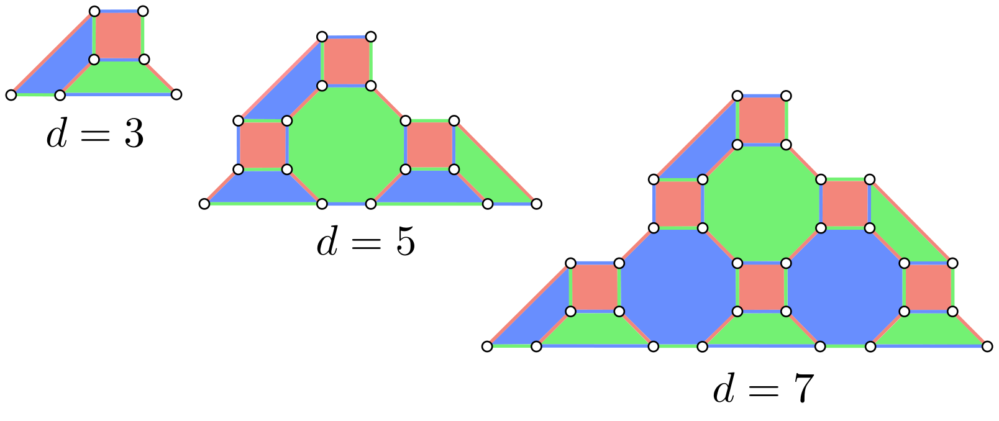

**图 1。** 不同码距 $d$ 的 (4.8.8) 色码。白色圆圈表示数据量子比特。

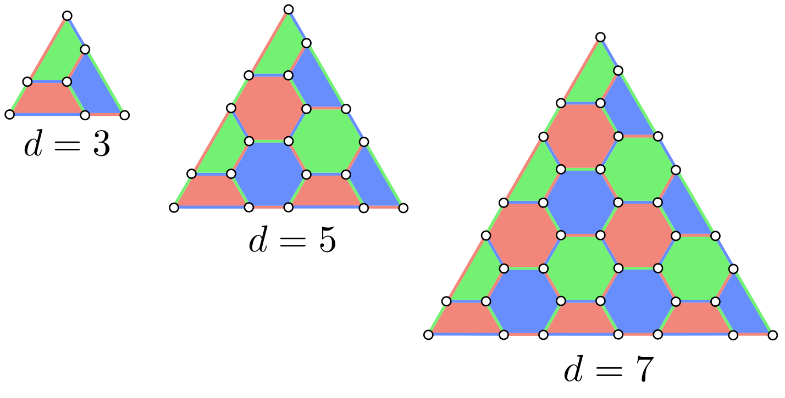

**图 2。** 不同码距 $d$ 的 (6.6.6) 色码。

### B. 使用整数规划译码器在电路级噪声下译码

本节说明电路级噪声模型，以及如何使用整数规划译码器在该噪声模型下译码。电路级噪声模型假设，量子电路中的每一种操作——包括态制备、门操作、空闲操作（即不执行任何操作时）和测量——都可能发生错误。

为定义电路级噪声模型，先引入退极化信道：

$$
\mathcal{E}_1(\rho_1)
=(1-p)\rho_1+\frac{p}{3}\sum_{P\in\{X,Y,Z\}}P\rho_1P,
\tag{3}
$$

$$
\begin{aligned}
\mathcal{E}_2(\rho_2)
={}&(1-p)\rho_2+\frac{p}{15}\\
&\times\sum_{\substack{P_1,P_2\in\{I,X,Y,Z\}\\P_1\otimes P_2\neq I\otimes I}}
(P_1\otimes P_2)\rho_2(P_1\otimes P_2),
\end{aligned}
\tag{4}
$$

其中，$p$ 是物理错误概率，$\rho_1$ 是单量子比特密度算子，$\rho_2$ 是双量子比特密度算子。电路级噪声模型定义如下：

(i) 每个单量子比特门（包括恒等门）先理想作用，随后以概率 $p$ 受到单量子比特退极化信道 $\mathcal{E}_1$ 的作用。

(ii) 每个双量子比特门先理想作用，随后以概率 $p$ 受到双量子比特退极化信道 $\mathcal{E}_2$ 的作用。

(iii) 每次态制备以概率 $p$ 失败，并制备出正交态。

(iv) 每次测量以概率 $p$ 失败，测量结果随之翻转。

译码的任务，是在给定综合征后估计最可能发生的错误。在电路级噪声下，由于存在测量错误，综合征并不可靠。因此，如果只测量一次综合征并据此译码，译码准确率会显著下降。在这种情形下，可以多次重复综合征测量（本文重复 $d$ 次），以抑制测量错误造成的性能下降；然后根据所得时空综合征，分别对 $X$ 错误和 $Z$ 错误译码。

若噪声模型假设数据错误与测量错误独立同分布（independently and identically distributed, i.i.d.），即采用现象学噪声模型，则给定综合征后，可以通过最小化错误总数来估计最可能的错误。然而，在电路级噪声下，每一轮的累积数据错误与测量错误概率——也就是译码图中各条边被触发的概率——并不相同，因为错误在不同量子比特上的发生与传播方式不同。由纠缠门造成的相关错误又使这些错误彼此不独立。因此，为确定最可能的错误，必须依据实际的错误概率分布进行估计。

下面说明如何使用整数规划译码器在电路级噪声下译码；其中，译码问题被表述为整数规划问题。这一译码表述扩展了文献 [42] 针对现象学噪声模型给出的表述。这里只说明 $X$ 错误的译码，$Z$ 错误也使用同一算法译码。在该译码器中，错误和综合征值都用二元变量表示。定义二元变量 $u_v^{(t)}\in\{0,1\}$，表示截至时间 $t$ 顶点 $v$ 上的量子比特所累积的数据错误；定义二元变量 $r_f^{(t)}\in\{0,1\}$，表示时间 $t$ 面 $f$ 上发生的测量错误。于是，时间 $t$ 在面 $f$ 上测得的综合征值可写成二元值 $s_f^{(t)}\in\{0,1\}$：

$$
s_f^{(t)}
=\bigoplus_{v\in\delta f}u_v^{(t)}\oplus r_f^{(t)}.
\tag{5}
$$

时间 $t$ 与 $t-1$ 之间的综合征差，即 $s_f^{(t)}\oplus s_f^{(t-1)}$，会探测时间 $t$ 发生的数据错误。因此，综合征值应满足

$$
\bigoplus_{v\in\delta f}x_v^{(t)}
\oplus r_f^{(t)}\oplus r_f^{(t-1)}
=s_f^{(t)}\oplus s_f^{(t-1)}
\qquad \forall f,
\tag{6}
$$

其中二元变量 $x_v^{(t)}\in\{0,1\}$ 表示时间 $t$ 新发生的数据错误，它对应于 $u_v^{(t)}$ 与 $u_v^{(t-1)}$ 的异或。若 $x_v^{(t)}=1$，表示时间 $t$ 相应的数据量子比特上新发生了数据错误；反之，若 $x_v^{(t)}=0$，则表示没有新发生数据错误。为每个错误设置权重，并在满足式 (6) 的错误中最小化加权错误数，便可以依据错误概率分布进行译码。因此，电路级噪声下的译码问题可表述为如下整数规划问题：

$$
\min\quad
\sum_{v,t}w_v^{(t)}x_v^{(t)}
+\sum_{f,t}w_f^{(t)}r_f^{(t)},
\tag{7}
$$

$$
\mathrm{s.t.}\quad
\bigoplus_{v\in\delta f}x_v^{(t)}
\oplus r_f^{(t)}\oplus r_f^{(t-1)}
=s_f^{(t)}\oplus s_f^{(t-1)}
\qquad \forall f.
\tag{8}
$$

这里，$w_v^{(t)}$ 和 $w_f^{(t)}$ 分别是数据错误和测量错误的权重。传统上，它们定义为 [30]

$$
w_v^{(t)}
=-\log\frac{p\!\left(x_v^{(t)}=1\right)}{1-p\!\left(x_v^{(t)}=1\right)},
\tag{9}
$$

$$
w_f^{(t)}
=-\log\frac{p\!\left(r_f^{(t)}=1\right)}{1-p\!\left(r_f^{(t)}=1\right)}.
\tag{10}
$$

权重定义的细节见附录 A。

需要注意的是，式 (9) 和式 (10) 所用的错误概率分布必须加以估计。对此，人们已经提出若干方法。文献 [13, 28, 39, 43] 通过解析计数可能的错误事件来估计错误概率分布。文献 [44, 45] 根据适当的综合征数据计算综合征期望值，由此估计错误概率分布。文献 [46] 则通过对所得综合征反复译码来估计错误概率分布。

### C. 传统综合征测量电路

综合征测量必须在不破坏编码态的情况下完成。直接测量数据量子比特会破坏叠加态，因此综合征测量采用间接测量。传统方法 [9, 23] 使用单个辅助量子比特分别测量 $X$ 和 $Z$ 稳定子生成元，如图 3(a) 和图 3(b) 所示。

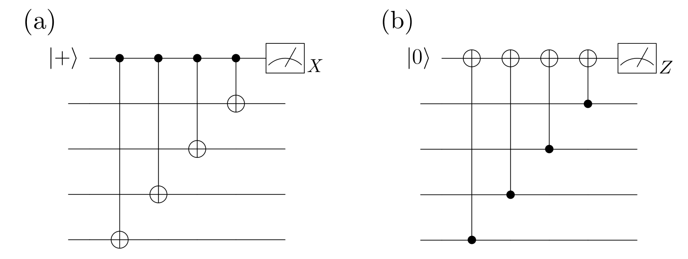

**图 3。** 传统综合征测量电路。(a) 测量 $X^{\otimes4}$ 的电路；(b) 测量 $Z^{\otimes4}$ 的电路。

在这种方法中，稳定子生成元作用的数据量子比特越多，综合征测量电路就越深，可能发生错误的位置也就越多。此外，与一个辅助量子比特相互作用的数据量子比特越多，错误传播路径就越多，错误因而可能广泛传播。这里，错误传播路径是指电路中一个已发生错误会沿之传播的一组位置。因此，与稳定子生成元权重至多为 4 的表面码相比，具有高权重稳定子生成元的色码更容易受到错误影响。这正是色码在电路级噪声下阈值较低的原因。

这里考虑的 CNOT 调度先执行 $X$ 稳定子测量，再执行 $Z$ 稳定子测量。文献 [23] 已证明，使用这种综合征测量电路时，(4.8.8) 色码的阈值约为 $0.08\%$。图 4 和图 5 分别给出 (4.8.8) 色码与 (6.6.6) 色码的一种可行 CNOT 次序。包括数据量子比特和辅助量子比特在内，所需量子比特总数分别为

$$
n_{4.8.8}^{\mathrm{single}}(d)=\frac{3d^2+6d-5}{4}
$$

和

$$
n_{6.6.6}^{\mathrm{single}}(d)=\frac{9d^2-1}{8}.
$$

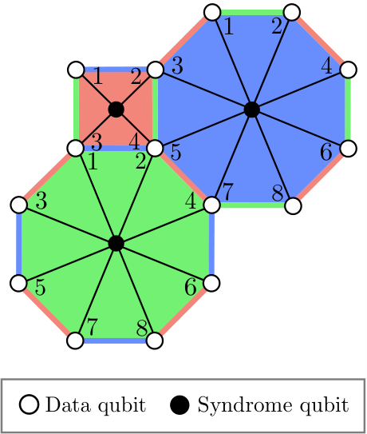

**图 4。** 每个面使用一个辅助量子比特时，(4.8.8) 色码的 CNOT 次序。黑色数字表示施加 CNOT 门的时间步，黑线表示量子比特之间的相互作用。该方法所需量子比特总数为 $n_{4.8.8}^{\mathrm{single}}(d)=(3d^2+6d-5)/4$。图中文字：`Syndrome qubit` 为“综合征量子比特”，`Data qubit` 为“数据量子比特”。

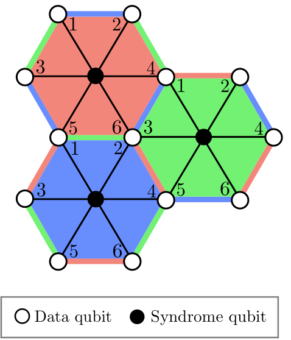

**图 5。** 每个面使用一个辅助量子比特时，(6.6.6) 色码的 CNOT 次序。该方法所需量子比特总数为 $n_{6.6.6}^{\mathrm{single}}(d)=(9d^2-1)/8$。图中文字：`Syndrome qubit` 为“综合征量子比特”，`Data qubit` 为“数据量子比特”。

图 6 和图 7 还分别给出 (4.8.8) 色码与 (6.6.6) 色码各类面的 $X$ 稳定子测量电路。$Z$ 稳定子测量电路与之类似，只需把测量基改为 $Z$ 基，并反转 CNOT 门的方向。(4.8.8) 色码需要实现深度为 8 的 CNOT 门，而 (6.6.6) 色码需要实现深度为 6 的 CNOT 门。

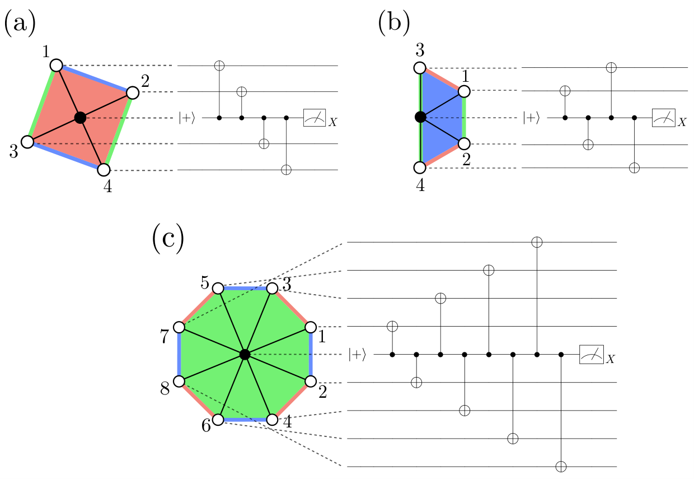

**图 6。** 每个面使用一个辅助量子比特时，(4.8.8) 色码的 $X$ 稳定子测量电路。(a) 正方形面；(b) 梯形面；(c) 八边形面。

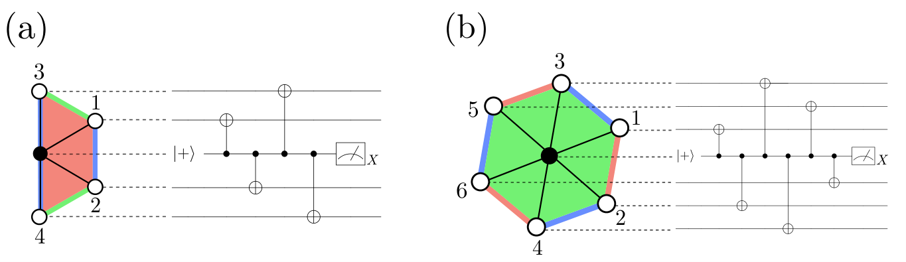

**图 7。** 每个面使用一个辅助量子比特时，(6.6.6) 色码的 $X$ 稳定子测量电路。(a) 梯形面；(b) 六边形面。

## III 提高容错色码量子计算的阈值

由于色码具有高权重稳定子生成元，使用传统综合征测量电路和传统权重会导致较低的阈值。这里，我们提出一种方法，以提高色码在电路级噪声下的阈值。下面先介绍本文采用的综合征测量电路，再说明如何设置译码器权重。为进一步改善性能，还将介绍去旗标过程。此外，我们提出一种估计条件错误概率的方法，这也是本文的主要贡献之一。

### A. 综合征测量组件

在综合征测量中，我们不再为每个面使用单个辅助量子比特，而是为每个面使用一个*旗标组件*来提取综合征。图 8 给出 $X$ 稳定子测量所用的两类旗标组件：双量子比特旗标组件 [25] 和四量子比特旗标组件 [47]。在这些组件中，制备为 $|+\rangle$ 的量子比特充当综合征量子比特，制备为 $|0\rangle$ 的量子比特充当旗标量子比特。反转测量基和 CNOT 门方向，即可得到用于 $Z$ 稳定子测量的旗标组件。

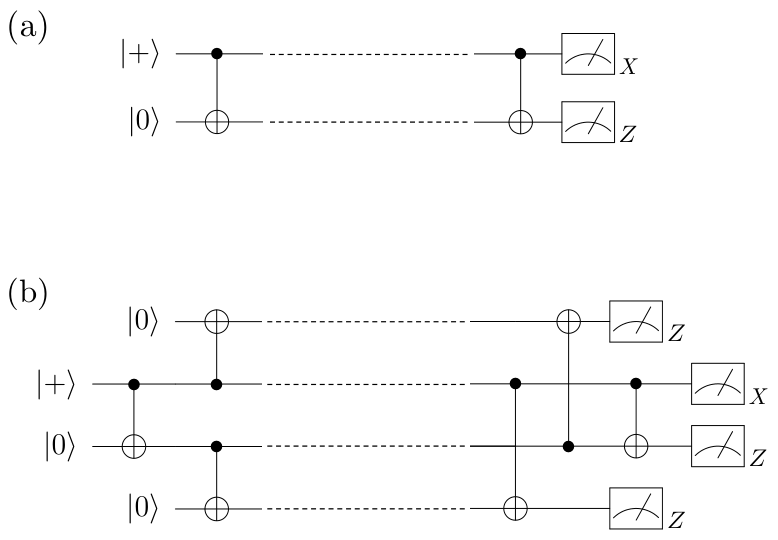

**图 8。** 用于 $X$ 稳定子测量的旗标组件。(a) 双量子比特旗标组件；(b) 四量子比特旗标组件。电路中的虚线表示与数据量子比特的相互作用。$X$ 基测量给出综合征值，$Z$ 基测量给出旗标值。

这些组件可以从测量结果中标记某些类型的错误，同时给出综合征。它们首先制备如下定义的猫态：

$$
|\mathrm{cat}\rangle
=\frac{|0\rangle^{\otimes n}+|1\rangle^{\otimes n}}{\sqrt{2}}.
\tag{11}
$$

制备猫态后，组件与数据量子比特相互作用，最后进行后处理与测量。猫态使 CNOT 门得以并行化，并降低综合征测量的深度，从而减少空闲噪声。此外，错误传播路径减少也会抑制错误传播。

对于 (4.8.8) 色码，与文献 [24] 相同，权重为 8 的稳定子测量使用四量子比特旗标组件，权重为 4 的稳定子测量使用双量子比特旗标组件。图 9 给出使用旗标组件时 (4.8.8) 色码的 CNOT 次序。组件中的每个量子比特分别向相邻的两个数据量子比特施加 CNOT 门。对于 (6.6.6) 色码，每次稳定子测量均使用双量子比特旗标组件，其 CNOT 次序见图 10。测量权重为 6 的稳定子时，组件中的每个量子比特向相邻的三个数据量子比特施加 CNOT 门；测量权重为 4 的稳定子时，则向相邻的两个数据量子比特施加 CNOT 门。

与传统综合征测量电路相比，一个辅助量子比特只与两个或三个数据量子比特相互作用，因而抑制了错误从辅助量子比特向数据量子比特传播。此外，在两类格上，作用于数据量子比特的 CNOT 门深度均降至三个时间步；这是色码情形下的最小深度。原因在于，对一个色码数据量子比特而言，最多有三个稳定子生成元与之相关，而任一时刻对任一量子比特至多只能施加一个操作。

这种综合征测量方式所需的数据量子比特与辅助量子比特总数为

$$
n_{4.8.8}^{\mathrm{FWO}}(d)=\frac{5d^2+4d-5}{4}
$$

和

$$
n_{6.6.6}^{\mathrm{FWO}}(d)=\frac{3d^2-1}{2},
$$

分别对应 (4.8.8) 色码和 (6.6.6) 色码。图 11 和图 12 分别给出这两类色码各个面的 $X$ 稳定子测量电路。

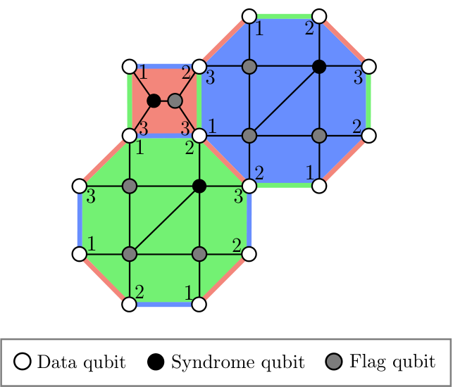

**图 9。** (4.8.8) 色码使用旗标组件时的 CNOT 次序。该方法所需量子比特总数为 $n_{4.8.8}^{\mathrm{FWO}}(d)=(5d^2+4d-5)/4$。图中文字：`Flag qubit` 为“旗标量子比特”，`Syndrome qubit` 为“综合征量子比特”，`Data qubit` 为“数据量子比特”。

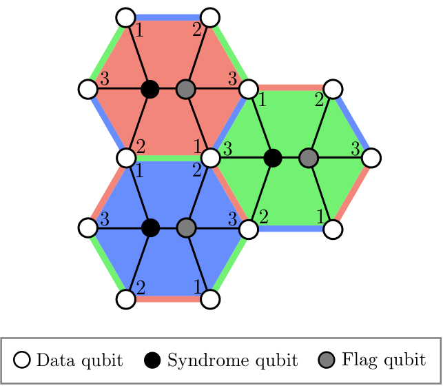

**图 10。** (6.6.6) 色码使用旗标组件时的 CNOT 次序。该方法所需量子比特总数为 $n_{6.6.6}^{\mathrm{FWO}}(d)=(3d^2-1)/2$。图中文字：`Flag qubit` 为“旗标量子比特”，`Syndrome qubit` 为“综合征量子比特”，`Data qubit` 为“数据量子比特”。

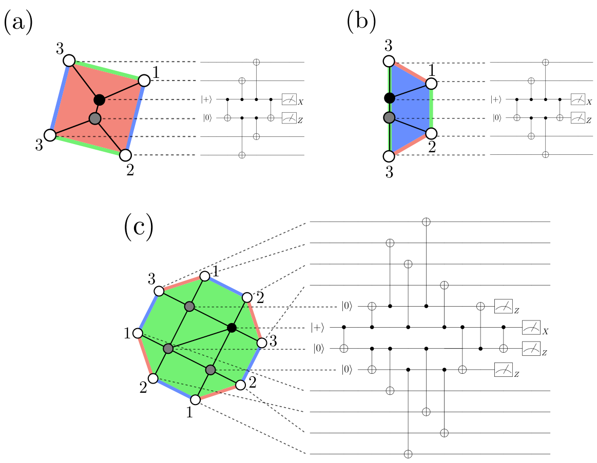

**图 11。** (4.8.8) 色码使用旗标组件时的 $X$ 稳定子测量电路。(a) 正方形面；(b) 梯形面；(c) 八边形面。

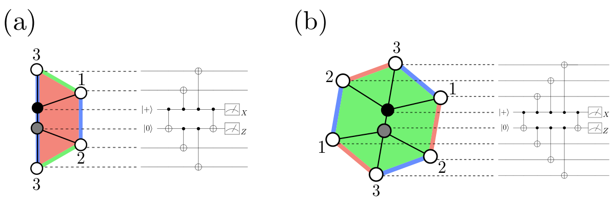

**图 12。** (6.6.6) 色码使用旗标组件时的 $X$ 稳定子测量电路。(a) 梯形面；(b) 六边形面。

### B. 旗标权重优化

下面说明译码器权重的设置方法。如图 13 所示，每个综合征测量周期都先执行 $X$ 稳定子测量，再执行 $Z$ 稳定子测量。先考虑 $X$ 错误纠正。若 $X$ 稳定子测量所用辅助量子比特上发生的 $X$ 错误以钩形错误的形式传播到数据量子比特，它会在随后的 $Z$ 稳定子测量中被探测到。因此，时间 $t$ 的 $X$ 稳定子测量旗标值提供了有关时间 $t$ 的 $X$ 数据错误的信息。需要注意的是，旗标值并不完美，因为旗标量子比特本身也可能发生错误。

为把旗标信息纳入式 (9) 和式 (10) 定义的译码器权重，我们使用以旗标值为条件的条件错误概率来设置权重。对于与 $X$ 数据错误对应的边，其权重使用这样一种条件错误概率：以同一时间步内、作用于相应数据量子比特的所有 $X$ 稳定子测量的全部旗标值为条件，即

$$
w_v^{(t)}
=-\log
\frac{
p\!\left(
x_v^{(t)}=1\,\middle|\,
\displaystyle\bigcup_{f:v\in\delta f}\mathcal{F}_{f,X}^{(t)}
\right)
}{
1-p\!\left(
x_v^{(t)}=1\,\middle|\,
\displaystyle\bigcup_{f:v\in\delta f}\mathcal{F}_{f,X}^{(t)}
\right)
}.
\tag{12}
$$

这里，$\mathcal{F}_{f,\sigma}^{(t)}$ 是旗标组件在时间 $t$ 测量面 $f$ 上所定义的 $\sigma\in\{X,Z\}$ 稳定子时得到的旗标值集合。$Z$ 稳定子测量的旗标值只会显式提供辅助量子比特上所发生 $Z$ 错误的信息，但也会隐式提供辅助量子比特上所发生 $X$ 错误的信息。具体而言，一个平凡的（即未翻转的）旗标值意味着：在某一位置，要么发生了一个不与 $Z$ 错误相关的 $X$ 错误，要么没有发生错误。因此，对于与测量错误对应的边，其权重使用以相应综合征的 $Z$ 稳定子测量旗标值为条件的条件错误概率：

$$
w_f^{(t)}
=-\log
\frac{p\!\left(r_f^{(t)}=1\mid\mathcal{F}_{f,Z}^{(t)}\right)}
{1-p\!\left(r_f^{(t)}=1\mid\mathcal{F}_{f,Z}^{(t)}\right)}.
\tag{13}
$$

另一方面，在执行 $Z$ 错误纠正时，与 $Z$ 数据错误和测量错误对应的边权重设置为

$$
w_v^{(t)}=
\begin{cases}
-\displaystyle\log
\frac{p\!\left(z_v^{(1)}=1\right)}
{1-p\!\left(z_v^{(1)}=1\right)},
& t=1,\\[1.2em]
-\displaystyle\log
\frac{
p\!\left(
z_v^{(t)}=1\,\middle|\,
\displaystyle\bigcup_{f:v\in\delta f}\mathcal{F}_{f,Z}^{(t-1)}
\right)
}{
1-p\!\left(
z_v^{(t)}=1\,\middle|\,
\displaystyle\bigcup_{f:v\in\delta f}\mathcal{F}_{f,Z}^{(t-1)}
\right)
},
& \text{其他情形},
\end{cases}
\tag{14}
$$

$$
w_f^{(t)}
=-\log
\frac{p\!\left(r_f^{(t)}=1\mid\mathcal{F}_{f,X}^{(t)}\right)}
{1-p\!\left(r_f^{(t)}=1\mid\mathcal{F}_{f,X}^{(t)}\right)}.
\tag{15}
$$

在式 (14) 中，对于初始时间步与 $Z$ 数据错误对应的边权重，我们不使用旗标信息。这是因为一个综合征测量周期先执行 $X$ 稳定子测量，再执行 $Z$ 稳定子测量，所以在初始时间步不存在可用于 $Z$ 数据错误的旗标信息。

存储这些权重所需的内存随数据量子比特数线性增长，因为每个数据错误或测量错误的发生概率只以局部旗标量子比特的测量结果为条件，而这些局部旗标量子比特的数目是常数。把该方法用于译码器时，译码计算开销的增加仅来自这样一项成本：依据旗标值从已存信息中检索权重。这项开销与常见权重设置过程相近。

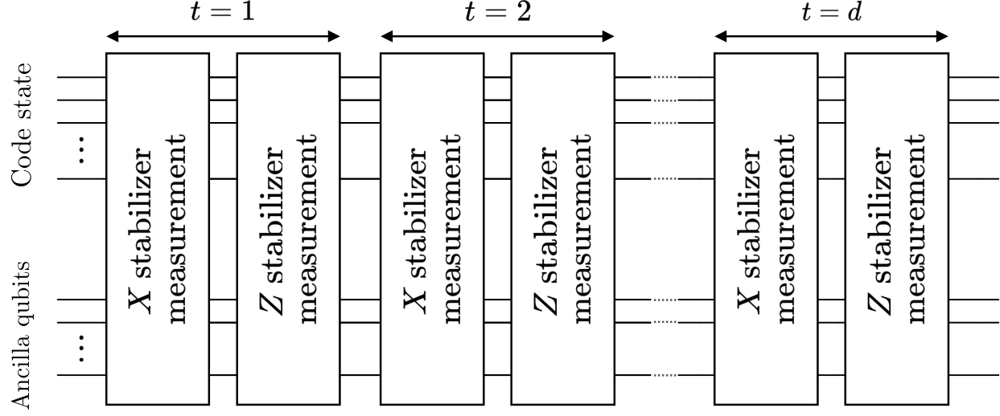

**图 13。** 综合征测量流程。图中文字：`Code state` 为“码态”，`Ancilla qubits` 为“辅助量子比特”，`X stabilizer measurement` 与 `Z stabilizer measurement` 分别为“$X$ 稳定子测量”与“$Z$ 稳定子测量”。

### C. 去旗标

除 FWO 外，我们还执行文献 [38, 39] 提出的去旗标过程：立即在数据量子比特上施加与旗标值所指示错误相对应的泡利算子。也可以不直接把泡利算子施加到数据量子比特上，而只把这些泡利算子记录为经典信息并更新泡利框架 [48, 49]；这样能够实现同样的操作。在估计条件错误概率时同样执行去旗标。去旗标过程使我们能够纠正一些仅凭 FWO 无法纠正的错误。去旗标过程的细节及其改善逻辑错误率的方式见附录 B。

### D. 估计条件错误概率

译码前必须估计式 (12)–(15) 中的条件错误概率。这里，我们提出一种准确、高效的估计方法，即使底层噪声先验未知也能使用。该方法通过多次运行一个专门定制的量子电路来估计条件错误概率。我们使用量子电路 $C_X$ 和 $C_Z$，分别专用于估计 $X$ 错误纠正译码器和 $Z$ 错误纠正译码器中边权重所用的条件错误概率。

这些量子电路是在单周期综合征测量电路基础上修改而成的：改变某些量子比特的初态，并在最后横向测量数据量子比特。在 $C_X$ 中，把所有数据量子比特以及辅助量子比特初始化为 $|0\rangle$，先执行 $X$ 稳定子测量电路，再执行 $Z$ 稳定子测量；随后在 $Z$ 基中横向测量数据量子比特。对于 $C_Z$，我们使用一个先执行 $Z$ 稳定子测量、再执行 $X$ 稳定子测量的单周期综合征测量电路。所有数据量子比特以及 $Z$ 稳定子测量所用辅助量子比特的初态均制备为 $|+\rangle$；最后在 $X$ 基中横向测量数据量子比特。

这些电路不仅能够*直接*探测数据错误，也能估计电路中可能发生的测量错误。这里，“直接探测”是指仅根据某个量子比特自身的单量子比特测量结果，探测该量子比特上发生的错误。图 14 给出距离为 3 的 (4.8.8) 色码所对应的 $C_X$。

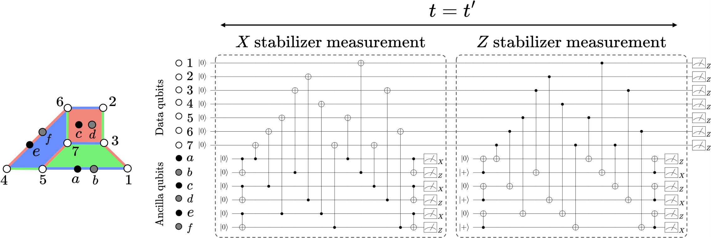

**图 14。** 距离为 3 的 (4.8.8) 色码的量子电路 $C_X$。该电路专用于估计 $X$ 错误纠正译码器权重所需的条件错误概率。图中文字：`Data qubits` 为“数据量子比特”，`Ancilla qubits` 为“辅助量子比特”，`X stabilizer measurement` 与 `Z stabilizer measurement` 分别为“$X$ 稳定子测量”与“$Z$ 稳定子测量”。

使用 $C_X$ 估计条件错误概率的流程如下：

i. 在执行去旗标的同时运行 $C_X$。

ii. 分别从数据量子比特和旗标量子比特的测量结果中记录数据错误与旗标值。

iii. 对所得数据错误进行适当组合的异或，计算这些数据错误应当给出的理想综合征。把该理想综合征与综合征量子比特测量结果给出的综合征相比较；若二者中有不一致的综合征值，则记录相应综合征值上发生了测量错误。

iv. 充分多次重复上述步骤。随后，为估计在观察到某组旗标结果的条件下发生某一数据错误或测量错误的概率，用“该组旗标结果出现时相应错误被观察到的总次数”除以“该组旗标结果被观察到的总次数”。

由于综合征测量会重复进行，因此这一流程估计出的条件错误概率可用于所有时间步。需要注意的是，在 $C_X$ 和 $C_Z$ 中，按上述方式制备初态是直接探测数据错误所必需的。若不这样修改初态，综合征测量电路结束时对数据量子比特进行横向测量所得的各个测量结果，便不能用于直接探测数据错误。原因在于，探测 $X$（$Z$）错误时，数据量子比特以及 $X$（$Z$）稳定子测量电路所用的辅助量子比特处于叠加态。条件错误概率一旦离线估计完成，其数值便可用于此后的所有译码。

## IV 数值模拟

### A. 设置

我们进行蒙特卡洛模拟，以计算在电路级噪声下把所提方法用于整数规划译码器时的逻辑错误率。蒙特卡洛模拟的样本数为 $10^6$。为评估逻辑错误率，需要比较输入逻辑态和输出逻辑态。由于完成时空译码和恢复操作后的量子态未必处于码空间内，我们在最终时间片执行一次理想错误纠正 [23, 49]，把该量子态投影到码空间。

作为比较，我们还计算一种已有方法的逻辑错误率；该方法在每次综合征测量中使用一个辅助量子比特，并采用均匀的译码器权重。下文把这种已有方法称为*单辅助量子比特方法*。我们使用 Stim [50] 实现量子电路，使用 CPLEX [51] 作为整数规划求解器。所用源代码可在 GitHub 上获取 [52]。

通常认为 FTQC 会在远低于阈值的物理错误率下运行，因此低物理错误率区域中的逻辑错误率行为至关重要。当物理错误率足够低时，逻辑错误率 $p_{\mathrm L}$ 按如下关系标度 [9]：

$$
p_{\mathrm L}
=c\left(\frac{p}{p_{\mathrm{th}}^*}\right)^{\alpha\left(\frac{d+1}{2}\right)}.
\tag{16}
$$

这里，$c$ 是常数，$p$ 是物理错误率，$p_{\mathrm{th}}^*$ 是阈值，$d$ 是码距，$\alpha$ 是表征有效码距的常数。我们把由式 (16) 得到的阈值 $p_{\mathrm{th}}^*$ 称为*标度阈值*。使用式 (16) 拟合逻辑错误率时，以 $c$、$p_{\mathrm{th}}^*$ 和 $\alpha$ 为拟合参数。

我们还计算不同码距数据曲线交点给出的阈值。当码距 $d$ 足够大时，电路级噪声下阈值附近的逻辑错误率 $p_{\mathrm L}$ 预计具有如下行为 [23, 53]：

$$
p_{\mathrm L}
=A+B\bigl(p-p_{\mathrm{th}}^\times\bigr)d^{1/\nu_0}
+C\bigl(p-p_{\mathrm{th}}^\times\bigr)^2d^{2/\nu_0}.
\tag{17}
$$

这里，$A$、$B$ 和 $C$ 是常数，$p$ 是物理错误率，$p_{\mathrm{th}}^\times$ 是阈值，$d$ 是码距，$\nu_0$ 是临界指数。我们把由式 (17) 得到的阈值 $p_{\mathrm{th}}^\times$ 称为*交叉阈值*。使用式 (17) 拟合逻辑错误率时，以 $A$、$B$、$C$、$p_{\mathrm{th}}^\times$ 和 $\nu_0$ 为拟合参数。

### B. 结果

图 15 给出 (4.8.8) 色码在各物理错误率下的逻辑 $X$ 与逻辑 $Z$ 错误率，图 16 给出 (6.6.6) 色码的相应结果。

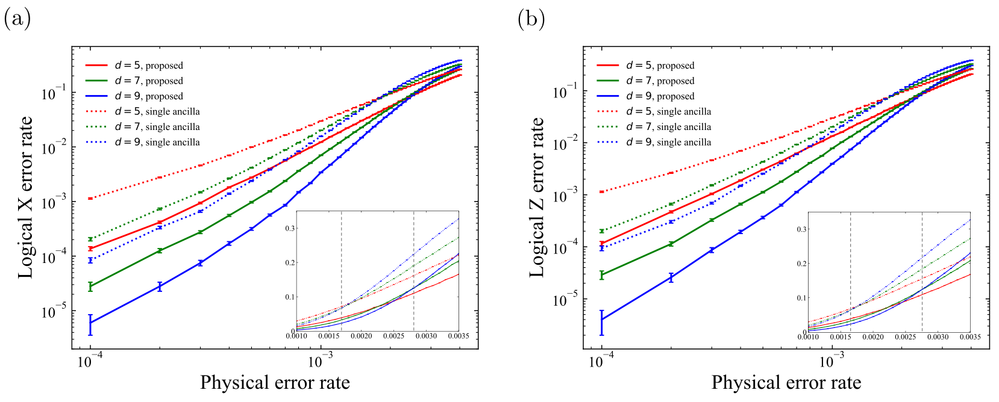

**图 15。** 不同码距下 (4.8.8) 色码的逻辑错误率。综合征测量执行 $d$ 轮。图中灰色竖直虚线表示用 $d=7$ 和 $d=9$ 的数据计算得到的交叉阈值。(a) 逻辑 $X$ 错误率。所提方法（实线）的标度阈值和交叉阈值分别为 $p_{\mathrm{th}}^*=0.29(1)\%$ 和 $p_{\mathrm{th}}^\times=0.279(1)\%$；单辅助量子比特方法（点线）的相应阈值分别为 $p_{\mathrm{th}}^*=0.16(1)\%$ 和 $p_{\mathrm{th}}^\times=0.1694(5)\%$。(b) 逻辑 $Z$ 错误率。所提方法（实线）的相应阈值分别为 $p_{\mathrm{th}}^*=0.268(9)\%$ 和 $p_{\mathrm{th}}^\times=0.276(1)\%$；单辅助量子比特方法（点线）的相应阈值分别为 $p_{\mathrm{th}}^*=0.14(1)\%$ 和 $p_{\mathrm{th}}^\times=0.164(2)\%$。图中文字：`Physical error rate` 为“物理错误率”，`Logical X/Z error rate` 为“逻辑 $X/Z$ 错误率”，`proposed` 为“所提方法”，`single ancilla` 为“单辅助量子比特方法”。

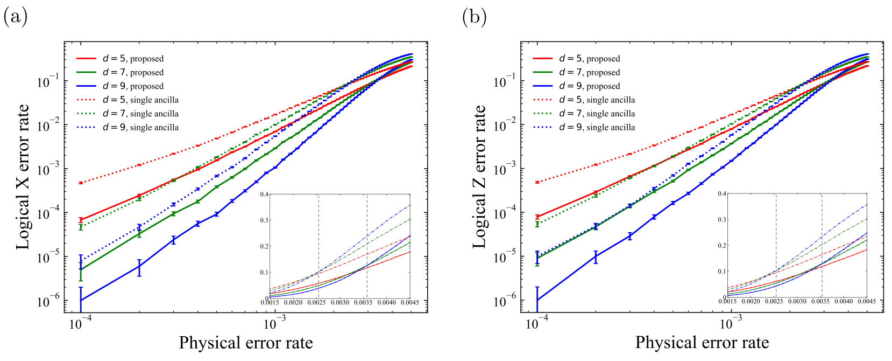

**图 16。** 不同码距下 (6.6.6) 色码的逻辑错误率。综合征测量重复 $d$ 次。灰色竖直虚线表示用 $d=7$ 和 $d=9$ 的数据计算得到的交叉阈值。(a) 逻辑 $X$ 错误率。所提方法（实线）的标度阈值和交叉阈值分别为 $p_{\mathrm{th}}^*=0.37(1)\%$ 和 $p_{\mathrm{th}}^\times=0.3575(6)\%$；单辅助量子比特方法（点线）的相应阈值分别为 $p_{\mathrm{th}}^*=0.274(6)\%$ 和 $p_{\mathrm{th}}^\times=0.2547(8)\%$。(b) 逻辑 $Z$ 错误率。所提方法（实线）的相应阈值分别为 $p_{\mathrm{th}}^*=0.363(9)\%$ 和 $p_{\mathrm{th}}^\times=0.352(1)\%$；单辅助量子比特方法（点线）的相应阈值分别为 $p_{\mathrm{th}}^*=0.270(6)\%$ 和 $p_{\mathrm{th}}^\times=0.2528(8)\%$。图中文字：`Physical error rate` 为“物理错误率”，`Logical X/Z error rate` 为“逻辑 $X/Z$ 错误率”，`proposed` 为“所提方法”，`single ancilla` 为“单辅助量子比特方法”。

对两类色码，我们均使用 $d=7$ 与 $d=9$ 的数据，并以式 (16) 和式 (17) 拟合逻辑错误率。用式 (16) 拟合时，我们选取物理错误率 $p$ 远低于阈值的数据，即 $p\lessapprox p_{\mathrm{th}}^\times/2$ 的范围 [27]。除 (4.8.8) 色码的单辅助量子比特方法外，我们使用 $p\in[10^{-4},10^{-3}]$ 范围内的数据；对于这一例外情形，则使用 $p\in[10^{-4},5\times10^{-4}]$，以确保数据可视为远低于阈值。用式 (17) 拟合逻辑错误率时，我们使用阈值附近的五个数据点。

由图 15 中 (4.8.8) 色码的逻辑 $X$ 与逻辑 $Z$ 错误率拟合得到的数值，分别列于表 I 和表 II。由图 16 中 (6.6.6) 色码的逻辑 $X$ 与逻辑 $Z$ 错误率拟合得到的数值，分别列于表 III 和表 IV。

**表 I。** (4.8.8) 色码逻辑 $X$ 错误率的拟合参数。

| 方法 | $c$ | $\alpha$ | $p_{\mathrm{th}}^*$ | $p_{\mathrm{th}}^\times$ |
|---|---:|---:|---:|---:|
| 所提方法 | 0.13(2) | 0.69(1) | 0.0029(1) | 0.00279(1) |
| 单辅助量子比特方法 | 0.035(6) | 0.47(1) | 0.0016(1) | 0.001694(5) |

**表 II。** (4.8.8) 色码逻辑 $Z$ 错误率的拟合参数。

| 方法 | $c$ | $\alpha$ | $p_{\mathrm{th}}^*$ | $p_{\mathrm{th}}^\times$ |
|---|---:|---:|---:|---:|
| 所提方法 | 0.11(1) | 0.679(9) | 0.00268(9) | 0.00276(1) |
| 单辅助量子比特方法 | 0.031(5) | 0.49(1) | 0.0014(1) | 0.00164(2) |

如表 I 所示，所提方法用于 (4.8.8) 色码时，$X$ 错误标度阈值为 $p_{\mathrm{th}}^*=0.29(1)\%$，几乎是单辅助量子比特方法的 1.8 倍。由表 II 可见，所提方法的 $Z$ 错误标度阈值为 $p_{\mathrm{th}}^*=0.268(9)\%$，几乎是单辅助量子比特方法的 1.9 倍。$Z$ 错误标度阈值略低于 $X$ 错误标度阈值，主要原因是在初始时间步没有可用于 $Z$ 数据错误的旗标信息。因此，$Z$ 错误标度阈值 $p_{\mathrm{th}}^*=0.268(9)\%$ 决定了总体标度阈值。

如表 III 和表 IV 所示，所提方法用于 (6.6.6) 色码时，$X$ 与 $Z$ 错误标度阈值分别为 $p_{\mathrm{th}}^*=0.37(1)\%$ 和 $p_{\mathrm{th}}^*=0.363(9)\%$。与单辅助量子比特方法相比，$X$ 错误标度阈值约高 1.4 倍，$Z$ 错误标度阈值约高 1.3 倍。在所有情形下，所得交叉阈值都与标度阈值几乎相同。

与既有研究报告的阈值相比，对于 (4.8.8) 色码，我们超过了此前所有研究的阈值 [23, 24]。对于 (6.6.6) 色码，在采用相同噪声模型的既有研究中，我们达到的阈值与最高阈值 $0.37(1)\%$ [26] 在统计误差范围内相同。需要注意的是，文献 [28] 达到了约 $0.47\%$ 的交叉阈值，但它采用的噪声模型所假设的态制备与测量错误比本文噪声模型更少。文献 [27] 得到约 $0.46\%$ 的交叉阈值，但其标度阈值约为 $0.32\%$，低于本文的 $0.36\%$。还应注意，较高的阈值并不必然保证在远低于阈值时具有更低的逻辑错误率，因为逻辑错误率还受有效码距影响。

就有效码距而言，所提方法在两类色码中都提高了 $\alpha$。因此，当物理错误率较低，即约为 $p=10^{-4}$ 时，图 15 和图 16 中所提方法在相同码距下的逻辑错误率几乎都比单辅助量子比特方法低一个数量级。不过，在给定可用物理量子比特数时，以相同码距比较两种方法的逻辑错误率并不总是公平的。对于模拟采用的码距范围 $d\in\{5,7,9\}$，数据量子比特与辅助量子比特的总数满足

$$
n_{4.8.8}^{\mathrm{FWO}}(d-2)
<n_{4.8.8}^{\mathrm{single}}(d)
<n_{4.8.8}^{\mathrm{FWO}}(d),
\tag{18}
$$

$$
n_{6.6.6}^{\mathrm{FWO}}(d-2)
<n_{6.6.6}^{\mathrm{single}}(d)
<n_{6.6.6}^{\mathrm{FWO}}(d).
\tag{19}
$$

只有假设可用物理量子比特数 $n'$ 满足

$$
n_{4.8.8}^{\mathrm{FWO}}(d)<n'<n_{4.8.8}^{\mathrm{single}}(d+2)
$$

（对 (6.6.6) 色码则为 $n_{6.6.6}^{\mathrm{FWO}}(d)<n'<n_{6.6.6}^{\mathrm{single}}(d+2)$）时，以相同码距 $d$ 比较两种方法的逻辑错误率才是合理的。相反，若允许使用的 $n'$ 个物理量子比特满足

$$
n_{4.8.8}^{\mathrm{single}}(d)<n'<n_{4.8.8}^{\mathrm{FWO}}(d)
$$

（对 (6.6.6) 色码则为 $n_{6.6.6}^{\mathrm{single}}(d)<n'<n_{6.6.6}^{\mathrm{FWO}}(d)$），则应把码距为 $d$ 的单辅助量子比特方法与码距为 $d-2$ 的所提方法相比较。

由图 15 可见，对于 (4.8.8) 色码，码距为 5（7）的所提方法的逻辑错误率低于码距为 7（9）的单辅助量子比特方法；这意味着，即使把可用量子比特数限制在任意特定数目，所提方法相较单辅助量子比特方法仍能降低逻辑错误率。对于 (6.6.6) 色码，当物理错误率为 $p=10^{-4}$ 时，码距为 5 的所提方法的逻辑错误率略高于码距为 7 的单辅助量子比特方法；但在其他物理错误率区域，码距为 5（7）的所提方法的逻辑错误率都低于或等于码距为 7（9）的单辅助量子比特方法。

**表 III。** (6.6.6) 色码逻辑 $X$ 错误率的拟合参数。

| 方法 | $c$ | $\alpha$ | $p_{\mathrm{th}}^*$ | $p_{\mathrm{th}}^\times$ |
|---|---:|---:|---:|---:|
| 所提方法 | 0.12(1) | 0.72(1) | 0.0037(1) | 0.003575(6) |
| 单辅助量子比特方法 | 0.116(6) | 0.610(5) | 0.00274(6) | 0.002547(8) |

**表 IV。** (6.6.6) 色码逻辑 $Z$ 错误率的拟合参数。

| 方法 | $c$ | $\alpha$ | $p_{\mathrm{th}}^*$ | $p_{\mathrm{th}}^\times$ |
|---|---:|---:|---:|---:|
| 所提方法 | 0.117(7) | 0.675(6) | 0.00363(9) | 0.00352(1) |
| 单辅助量子比特方法 | 0.111(6) | 0.600(5) | 0.00270(6) | 0.002528(8) |

## V 结论

本文提出了旗标权重优化（FWO）：利用以旗标量子比特测量结果为条件的条件错误概率来优化译码器权重。利用旗标值可以设置更优化的权重，从而实现更准确的译码。正如文献 [24] 所指出的，猫态还可降低综合征测量电路的深度，进而抑制错误的影响。把该方法用于整数规划译码器后，我们将 (4.8.8) 色码的电路级阈值从已有的 $0.14\%$ 提高到约 $0.27\%$。对于 (6.6.6) 色码，我们实现了约 $0.36\%$ 的电路级阈值；在采用相同噪声模型的既有工作中，这与最高值 $0.37(1)\%$ 在统计误差范围内相同。

在两种情形下，相比单辅助量子比特方法，有效码距也得到提高；这意味着 FWO 有助于纠正由较少故障引起的大范围钩形错误。因此，在低物理错误率下，本文所得逻辑错误率几乎比相同码距的单辅助量子比特方法低一个数量级。需要指出的是，这里得到的阈值使用最大到 $d=9$ 的码距计算。在更大码距下进行数值实验非常重要，但留待未来研究。

我们还验证了：即使拿本文方法与码距更高、但所需量子比特数相近的单辅助量子比特方法比较，本文方法在大多数情形下仍能达到更低的逻辑错误率。利用这一思路，能够横向实现所有逻辑 Clifford 门、基于色码的 FTQC 有望成为更具前景的方案。该方法可用于其他基于权重的译码器，也可用于提高更广泛类别 QECC 的阈值，例如具有高权重稳定子生成元的高码率量子 LDPC 码。

关于猫态的使用，猫态具有降低硬件连接度要求、提高有效码距和减小电路深度等优点，但也会增加量子比特数和电路宽度。若纯粹从改善逻辑错误率的角度考虑，并计入增加的量子比特数，使用猫态测量综合征是否值得通常仍是一个开放问题。不过，如第 IV 节所述，我们已经验证：在执行 FWO 和去旗标时，即使考虑增加的量子比特数，猫态仍值得采用以改善逻辑错误率。

本文使用旗标信息来优化译码图中的边权重。另一方面，也可以把旗标信息用作额外奇偶校验：在译码图中添加与每个旗标量子比特对应的节点，并添加把这些节点连接到其他相关节点的边。这种方法或许能比 FWO 达到更低的逻辑错误率，但 FWO 相比之下有一项优势。如果向译码图添加与各旗标量子比特对应的节点和相关边，译码的计算复杂度会显著增加；更重要的是，某些译码器无法处理这些额外节点和边，因而其译码算法将不再适用。FWO 则不会向译码图添加额外节点和边。因此，只要一个译码器能在现象学噪声模型下工作，我们就能把 FWO 与该译码器结合，用于电路级噪声模型。

我们认为这一优势很重要，因为未来可能会出现这样的译码器：就译码时间或准确率而言，它比现有译码器更有前景，但对译码图有所限制。因此，一种可用于更多种译码器的通用方法很有价值。

## 致谢

作者感谢 Theerapat Tansuwannont 的有益讨论。本工作得到日本文部科学省量子飞跃旗舰计划（MEXT Q-LEAP，项目编号 JPMXS0118067394 和 JPMXS0120319794）、日本科学技术振兴机构 COI-NEXT（项目编号 JPMJPF2014）以及日本科学技术振兴机构登月型研发计划（项目编号 JPMJMS2061）的支持。

## 附录 A：权重的细节

下面推导式 (9) 和式 (10) 所定义的译码器权重 [30]。考虑数据错误与测量错误彼此独立发生、但各个错误的发生概率并不相同的情形。在这种情形下，某个错误事件 $E$ 的发生概率为

$$
p(E)
=\prod_{e_i\in E}p(e_i)
\prod_{e_i\notin E}\bigl(1-p(e_i)\bigr),
\tag{A1}
$$

$$
p(E)
=\prod_{e_i\in E}\frac{p(e_i)}{1-p(e_i)}
\prod_{e_i}\bigl(1-p(e_i)\bigr),
\tag{A2}
$$

$$
p(E)
\propto\prod_{e_i\in E}\frac{p(e_i)}{1-p(e_i)},
\tag{A3}
$$

其中 $e_i$ 表示第 $i$ 个数据错误或测量错误。译码的任务是在给定综合征 $S$ 后估计最可能的错误，即估计

$$
E(S)=\underset{E}{\operatorname{arg\,max}}\;p(E\mid S).
\tag{A4}
$$

由于对数函数具有单调性，$E(S)$ 也可写成

$$
E(S)=\underset{E}{\operatorname{arg\,min}}\;\bigl(-\log p(E\mid S)\bigr).
\tag{A5}
$$

因此，在各个数据错误与测量错误的发生概率并不全都相同的假设下，译码的任务是估计满足综合征约束、并使下列数值之和最小的错误：

$$
w_i=-\log\frac{p(e_i)}{1-p(e_i)}.
\tag{A6}
$$

所以，把译码器权重设置为式 (A6) 定义的数值，便能在译码时计入各个错误概率之间的差异。

## 附录 B：去旗标的细节

这里说明本文所执行去旗标过程的细节。对于双量子比特旗标组件，我们施加泡利算子的方式与文献 [38, 39] 略有不同。在文献 [38, 39] 中，当一个旗标被触发时，会把一个泡利算子施加到与旗标量子比特相连的某个数据量子比特上。本文则在双量子比特旗标组件中的旗标被触发时，把适当类型的泡利算子施加到与综合征量子比特相连的所有数据量子比特上。这里，“适当类型”是指：对于在 $X$ 稳定子测量期间触发的旗标，施加 $X$ 型泡利算子；对于在 $Z$ 稳定子测量期间触发的旗标，施加 $Z$ 型泡利算子。

当去旗标过程与 FWO 一同执行时，我们验证了：本文去旗标过程对逻辑错误率的改善，与执行文献 [38, 39] 所提去旗标过程时的改善在误差条范围内相同。因此，两种去旗标方式均可使用。对于四量子比特旗标组件，若三个旗标全部触发，则对图 8(b) 中与最上方旗标量子比特及综合征量子比特相连的所有数据量子比特施加适当类型的泡利算子。

下面给出一个典型错误事件：除 FWO 外再执行去旗标后，该错误事件便可以得到纠正。我们以物理错误率 $p=10^{-4}$ 时距离为 5 的 (4.8.8) 色码为例。为展示这一典型例子，考虑错误只在一个时间步发生、其他时间步均不发生的情形。为简明起见，这里不显示与测量错误对应的边权重。我们考虑 $X$ 错误纠正；也就是说，关注 $X$ 数据错误，下文所考虑的综合征与旗标都表示 $X$ 错误的发生。数值模拟中，当某两个旗标触发时所估计出的条件数据错误概率见图 17。

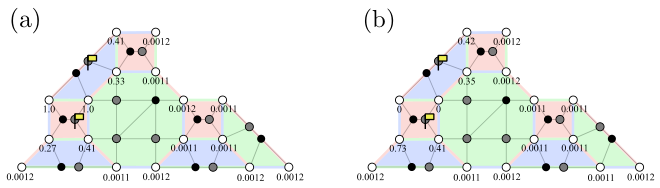

**图 17。** 去旗标过程如何改变条件错误概率的一个典型例子。(a) 不执行去旗标；(b) 执行去旗标。图中的黄色旗帜表示被触发的旗标测量。图中数值表示仅这两个旗标触发时各数据错误的条件错误概率。估计条件错误概率所用的采样次数为 $10^6$。

图 17(a) 和图 17(b) 分别给出不执行与执行去旗标过程时的条件数据错误概率。需要注意的是，所估计的条件概率会产生统计涨落，其大小取决于样本数以及该组旗标被触发的概率。

假设综合征测量电路中发生了一些错误，并产生图 18(a) 左图所示的测量结果。图中还标出了实际数据错误，尽管在真实情形下无法辨认这些错误。使用由图 17(a) 条件错误概率确定的权重进行译码，会估计出图 18(a) 右图所示的错误事件。根据这一译码结果执行恢复操作将导致逻辑错误。

另一方面，对该错误事件执行去旗标过程后，会得到图 18(b) 中图所示的情形。需要注意的是，这里考虑的是 $X$ 错误纠正，因此去旗标过程中施加的泡利算子为 $X$ 型。使用由图 17(b) 条件错误概率确定的权重进行译码，会估计出图 18(b) 最右图所示的错误事件，从而成功纠正错误。

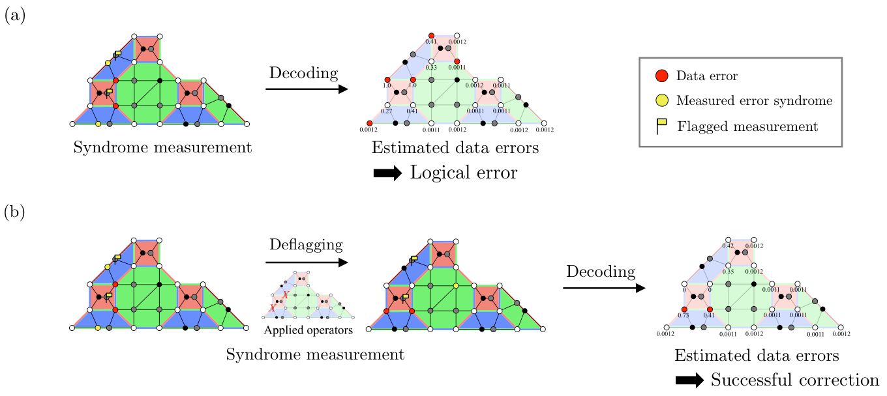

**图 18。** 在 $X$ 错误纠正中，去旗标过程改善性能的一个典型例子。图中数据错误为 $X$ 型，综合征和旗标均表示 $X$ 错误的发生。(a) 不执行去旗标。综合征测量电路发生错误并产生左图所示测量结果后，依据图 17(a) 的条件错误概率进行译码，会得到右图所示的错误估计；执行恢复操作后将产生逻辑错误。左图还显示了实际数据错误，尽管它们在真实情形下无法辨认。(b) 执行去旗标。先进行去旗标，再依据图 17(b) 的条件错误概率译码，得到最右图所示的错误估计，从而成功纠正错误。图中文字：`Syndrome measurement` 为“综合征测量”，`Decoding` 为“译码”，`Estimated data errors` 为“估计的数据错误”，`Logical error` 为“逻辑错误”，`Deflagging` 为“去旗标”，`Applied operators` 为“所施加的算子”，`Successful correction` 为“成功纠错”；图例中的 `Data error`、`Measured error syndrome` 和 `Flagged measurement` 分别为“数据错误”“测得的错误综合征”和“被触发的旗标测量”。

以上只是一种典型情形，因此我们还通过比较逻辑错误率来验证去旗标过程能否改善性能。图 19 给出执行和不执行去旗标过程时 (4.8.8) 色码的逻辑 $Z$ 错误率。图 19 表明，去旗标过程确实改善了逻辑错误率。

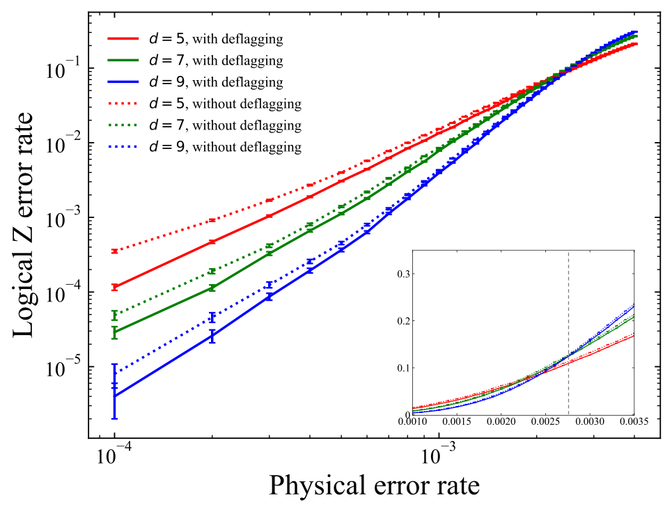

**图 19。** (4.8.8) 色码执行与不执行去旗标过程时的逻辑 $Z$ 错误率。图中文字：`Physical error rate` 为“物理错误率”，`Logical Z error rate` 为“逻辑 $Z$ 错误率”，`with deflagging` 为“执行去旗标”，`without deflagging` 为“不执行去旗标”。

## 附录 C：FWO 所实现改进的分析

第 IV 节的数值结果来自第 III 节所述多种技术的共同贡献，即猫态、FWO 和去旗标的共同作用。因此，主要提议技术 FWO 本身对这些结果贡献了多少尚不清楚。为明确 FWO 本身使性能提高了多少，我们计算使用猫态并执行去旗标、但不执行 FWO 时的逻辑错误率，再与第 IV 节所得结果比较。

图 20 中的点线给出不执行 FWO、但使用猫态并执行去旗标时，(4.8.8) 色码的逻辑 $Z$ 错误率。图 20 中的实线数据与图 15(b) 中的实线数据相同。我们还用式 (16) 和式 (17) 拟合图 20 点线所示逻辑错误率，并在表 V 中给出拟合结果。由图 20 可见，执行 FWO 会显著降低逻辑错误率。比较表 V 与表 II 还可发现，FWO 显著提高了 $p_{\mathrm{th}}^*$、$p_{\mathrm{th}}^\times$ 和有效码距。这些结果表明，FWO 本身对第 IV 节中观察到的改善作出了重要贡献。

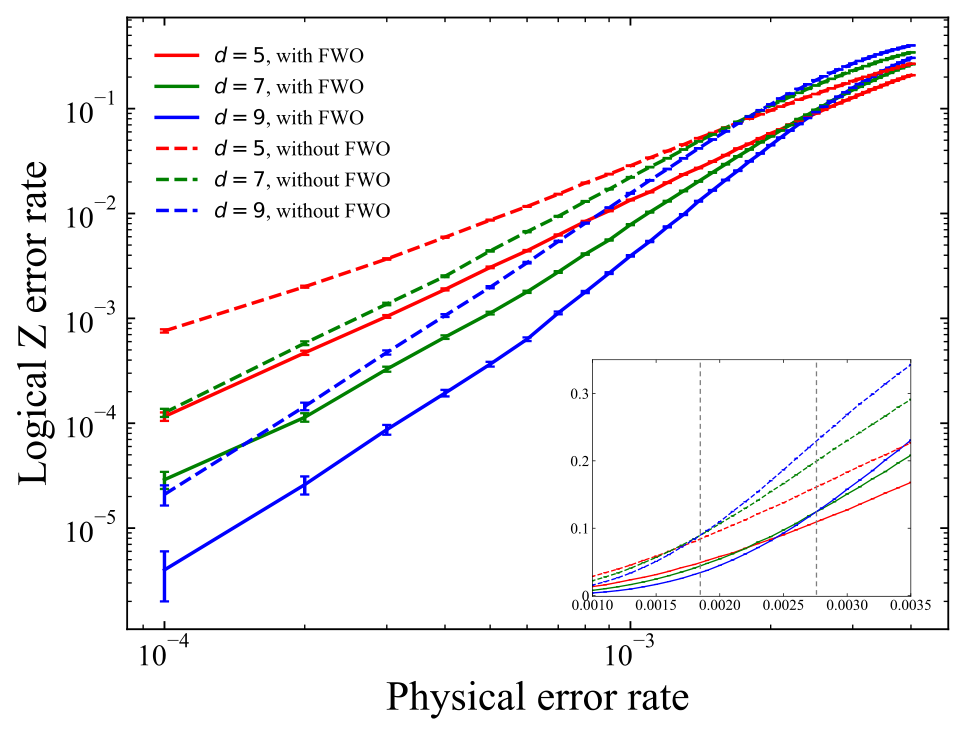

**图 20。** (4.8.8) 色码执行与不执行 FWO 时的逻辑 $Z$ 错误率。点线数据所得标度阈值与交叉阈值分别为 $p_{\mathrm{th}}^*=0.183(2)\%$ 和 $p_{\mathrm{th}}^\times=0.1843(9)\%$。图中文字：`Physical error rate` 为“物理错误率”，`Logical Z error rate` 为“逻辑 $Z$ 错误率”，`with FWO` 为“执行 FWO”，`without FWO` 为“不执行 FWO”。

**表 V。** 不执行 FWO 时，(4.8.8) 色码逻辑 $Z$ 错误率的拟合参数。

| 方法 | $c$ | $\alpha$ | $p_{\mathrm{th}}^*$ | $p_{\mathrm{th}}^\times$ |
|---|---:|---:|---:|---:|
| 不执行 FWO | 0.090(3) | 0.583(3) | 0.00183(2) | 0.001843(9) |

## 参考文献

以下条目保留原文格式。

[1] P. W. Shor, Polynomial-time algorithms for prime factorization and discrete logarithms on a quantum computer, SIAM Journal on Computing 26, 1484 (1997).

[2] R. P. Feynman, Simulating physics with computers, International Journal of Theoretical Physics 21, 467 (1982).

[3] A. Kitaev, Fault-tolerant quantum computation by anyons, Annals of Physics 303, 2 (2003).

[4] S. Krinner, N. Lacroix, A. Remm, A. Di Paolo, E. Genois, C. Leroux, C. Hellings, S. Lazar, F. Swiadek, J. Herrmann, et al., Realizing repeated quantum error correction in a distance-three surface code, Nature 605, 669 (2022).

[5] Y. Zhao, Y. Ye, H.-L. Huang, Y. Zhang, D. Wu, H. Guan, Q. Zhu, Z. Wei, T. He, S. Cao, et al., Realization of an error-correcting surface code with superconducting qubits, Phys. Rev. Lett. 129, 030501 (2022).

[6] R. Acharya, I. Aleiner, R. Allen, T. I. Andersen, M. Ansmann, F. Arute, K. Arya, A. Asfaw, J. Atalaya, R. Babbush, et al., Suppressing quantum errors by scaling a surface code logical qubit, Nature 614, 676 (2023).

[7] D. Bluvstein, S. J. Evered, A. A. Geim, S. H. Li, H. Zhou, T. Manovitz, S. Ebadi, M. Cain, M. Kalinowski, D. Hangleiter, et al., Logical quantum processor based on reconfigurable atom arrays, Nature 626, 58 (2024).

[8] A. M. Stephens, Fault-tolerant thresholds for quantum error correction with the surface code, Phys. Rev. A 89, 022321 (2014).

[9] A. G. Fowler, M. Mariantoni, J. M. Martinis, and A. N. Cleland, Surface codes: Towards practical large-scale quantum computation, Phys. Rev. A 86, 032324 (2012).

[10] C. Chamberland, A. Kubica, T. J. Yoder, and G. Zhu, Triangular color codes on trivalent graphs with flag qubits, New Journal of Physics 22, 023019 (2020).

[11] R. Raussendorf and J. Harrington, Fault-tolerant quantum computation with high threshold in two dimensions, Phys. Rev. Lett. 98, 190504 (2007).

[12] A. G. Fowler, A. C. Whiteside, and L. C. L. Hollenberg, Towards practical classical processing for the surface code, Phys. Rev. Lett. 108, 180501 (2012).

[13] D. S. Wang, A. G. Fowler, and L. C. L. Hollenberg, Surface code quantum computing with error rates over 1%, Phys. Rev. A 83, 020302 (2011).

[14] H. Poulsen Nautrup, N. Friis, and H. J. Briegel, Fault-tolerant interface between quantum memories and quantum processors, Nature Communications 8, 1321 (2017).

[15] C. Horsman, A. G. Fowler, S. Devitt, and R. Van Meter, Surface code quantum computing by lattice surgery, New Journal of Physics 14, 123011 (2012).

[16] M. Gutiérrez, M. Müller, and A. Bermúdez, Transversality and lattice surgery: Exploring realistic routes toward coupled logical qubits with trapped-ion quantum processors, Phys. Rev. A 99, 022330 (2019).

[17] H. Bombin and M. A. Martin-Delgado, Topological quantum distillation, Phys. Rev. Lett. 97, 180501 (2006).

[18] H. Bombin and M. A. Martin-Delgado, Topological computation without braiding, Phys. Rev. Lett. 98, 160502 (2007).

[19] M. S. Kesselring, F. Pastawski, J. Eisert, and B. J. Brown, The boundaries and twist defects of the color code and their applications to topological quantum computation, Quantum 2, 101 (2018).

[20] A. Kubica and M. E. Beverland, Universal transversal gates with color codes: A simplified approach, Phys. Rev. A 91, 032330 (2015).

[21] C. Ryan-Anderson, J. G. Bohnet, K. Lee, D. Gresh, A. Hankin, J. P. Gaebler, D. Francois, A. Chernoguzov, D. Lucchetti, N. C. Brown, T. M. Gatterman, S. K. Halit, K. Gilmore, J. A. Gerber, B. Neyenhuis, D. Hayes, and R. P. Stutz, Realization of real-time fault-tolerant quantum error correction, Phys. Rev. X 11, 041058 (2021).

[22] C. Ryan-Anderson, N. Brown, M. Allman, B. Arkin, G. Asa-Attuah, C. Baldwin, J. Berg, J. Bohnet, S. Braxton, N. Burdick, et al., Implementing fault-tolerant entangling gates on the five-qubit code and the color code, arXiv:2208.01863 (2022).

[23] A. J. Landahl, J. T. Anderson, and P. R. Rice, Fault-tolerant quantum computing with color codes, arXiv:1108.5738 (2011).

[24] A. M. Stephens, Efficient fault-tolerant decoding of topological color codes, arXiv:1402.3037 (2014).

[25] P. Baireuther, M. D. Caio, B. Criger, C. W. Beenakker, and T. E. O’Brien, Neural network decoder for topological color codes with circuit level noise, New Journal of Physics 21, 013003 (2019).

[26] M. E. Beverland, A. Kubica, and K. M. Svore, Cost of universality: A comparative study of the overhead of state distillation and code switching with color codes, PRX Quantum 2, 020341 (2021).

[27] S.-H. Lee, A. Li, and S. D. Bartlett, Color code decoder with improved scaling for correcting circuit-level noise, arXiv:2404.07482 (2024).

[28] J. Zhang, Y.-C. Wu, and G.-P. Guo, Facilitating practical fault-tolerant quantum computing based on color codes, Phys. Rev. Res. 6, 033086 (2024).

[29] B. Criger and B. Terhal, Noise thresholds for the [4, 2, 2]-concatenated toric code, Quantum Information & Computation 16, 1261 (2016).

[30] E. Dennis, A. Kitaev, A. Landahl, and J. Preskill, Topological quantum memory, Journal of Mathematical Physics 43, 4452 (2002).

[31] S. Huang, M. Newman, and K. R. Brown, Fault-tolerant weighted union-find decoding on the toric code, Phys. Rev. A 102, 012419 (2020).

[32] A. Kubica and N. Delfosse, Efficient color code decoders in $d\geq 2$ dimensions from toric code decoders, Quantum 7, 929 (2023).

[33] T. J. Yoder and I. H. Kim, The surface code with a twist, Quantum 1, 2 (2017).

[34] R. Chao and B. W. Reichardt, Quantum error correction with only two extra qubits, Phys. Rev. Lett. 121, 050502 (2018).

[35] C. Chamberland and M. E. Beverland, Flag fault-tolerant error correction with arbitrary distance codes, Quantum 2, 53 (2018).

[36] T. Tansuwannont, C. Chamberland, and D. Leung, Flag fault-tolerant error correction, measurement, and quantum computation for cyclic Calderbank-Shor-Steane codes, Phys. Rev. A 101, 012342 (2020).

[37] R. Chao and B. W. Reichardt, Flag fault-tolerant error correction for any stabilizer code, PRX Quantum 1, 010302 (2020).

[38] E. H. Chen, T. J. Yoder, Y. Kim, N. Sundaresan, S. Srinivasan, M. Li, A. D. Córcoles, A. W. Cross, and M. Takita, Calibrated decoders for experimental quantum error correction, Phys. Rev. Lett. 128, 110504 (2022).

[39] N. Sundaresan, T. J. Yoder, Y. Kim, M. Li, E. H. Chen, G. Harper, T. Thorbeck, A. W. Cross, A. D. Córcoles, and M. Takita, Demonstrating multi-round subsystem quantum error correction using matching and maximum likelihood decoders, Nature Communications 14, 2852 (2023).

[40] N. P. Breuckmann and J. N. Eberhardt, Quantum low-density parity-check codes, PRX Quantum 2, 040101 (2021).

[41] C. Chamberland and E. T. Campbell, Circuit-level protocol and analysis for twist-based lattice surgery, Physical Review Research 4, 023090 (2022).

[42] Y. Takada, Y. Takeuchi, and K. Fujii, Ising model formulation for highly accurate topological color codes decoding, Phys. Rev. Res. 6, 013092 (2024).

[43] C. Chamberland, G. Zhu, T. J. Yoder, J. B. Hertzberg, and A. W. Cross, Topological and subsystem codes on low-degree graphs with flag qubits, Phys. Rev. X 10, 011022 (2020).

[44] S. T. Spitz, B. Tarasinski, C. W. Beenakker, and T. E. O’Brien, Adaptive weight estimator for quantum error correction in a time-dependent environment, Advanced Quantum Technologies 1, 1800012 (2018).

[45] Z. Chen, K. J. Satzinger, J. Atalaya, A. N. Korotkov, A. Dunsworth, D. Sank, C. Quintana, M. McEwen, R. Barends, P. V. Klimov, et al., Exponential suppression of bit or phase errors with cyclic error correction, Nature 595, 383 (2021).

[46] H. Wang, P. Liu, Y. Liu, J. Gu, J. Baker, F. T. Chong, and S. Han, Dgr: Tackling drifted and correlated noise in quantum error correction via decoding graph re-weighting, arXiv:2311.16214 (2023).

[47] D. P. DiVincenzo and P. Aliferis, Effective fault-tolerant quantum computation with slow measurements, Phys. Rev. Lett. 98, 020501 (2007).

[48] E. Knill, Quantum computing with realistically noisy devices, Nature 434, 39 (2005).

[49] P. Aliferis, D. Gottesman, and J. Preskill, Quantum accuracy threshold for concatenated distance-3 codes, Quantum Inf. Comput. 6, 97 (2005).

[50] C. Gidney, Stim: a fast stabilizer circuit simulator, Quantum 5, 497 (2021).

[51] IBM ILOG CPLEX Optimizer, https://www.ibm.com/products/ilog-cplex-optimization-studio/cplex-optimizer.

[52] Y. Takada, FWO-color-code, https://github.com/yugotakada/FWO-color-code.

[53] C. Wang, J. Harrington, and J. Preskill, Confinement-Higgs transition in a disordered gauge theory and the accuracy threshold for quantum memory, Annals of Physics 303, 31 (2003).
