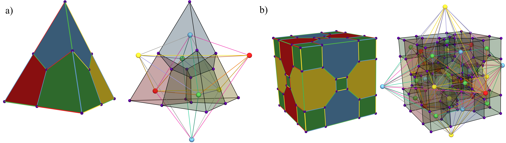
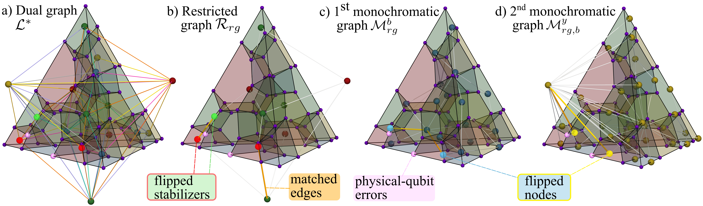
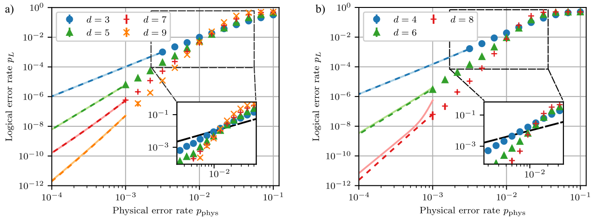
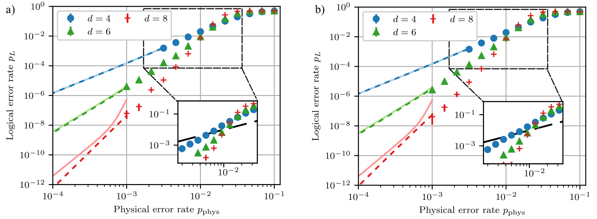
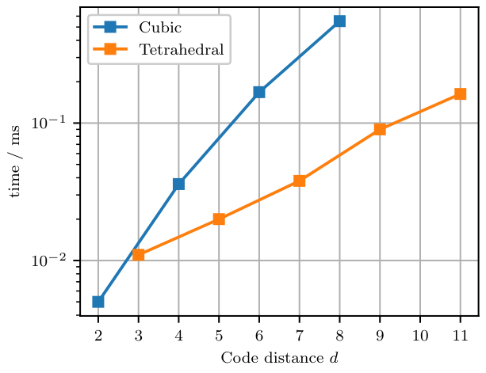
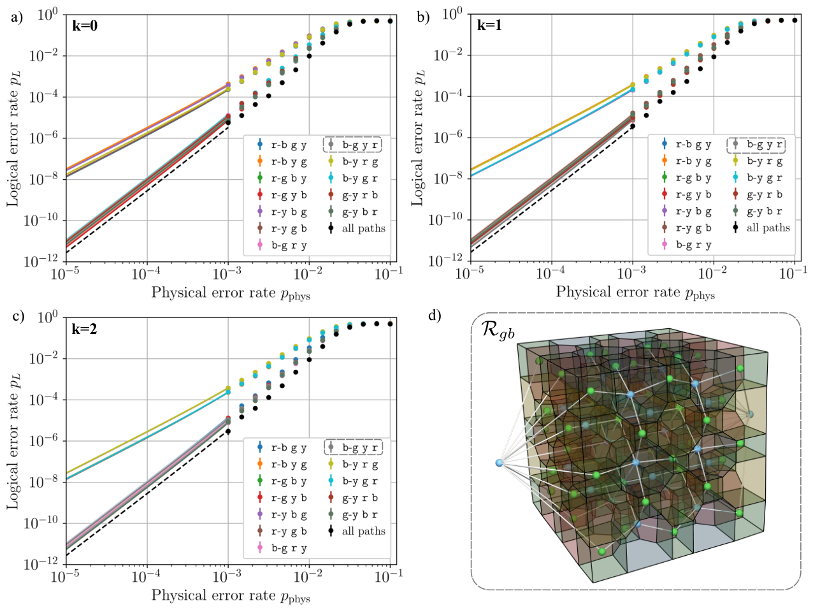

# 带边界三维色码的译码

## 译文信息

- 文献 ID：S005
- 原文：[S005_2025_Butt_decoding_3D_color_codes.pdf](../Papers/S005_2025_Butt_decoding_3D_color_codes.pdf)
- 原文版本：arXiv:2512.13436v2（PDF 首页日期为 2025-12-23）
- 翻译类型：全文翻译
- 覆盖范围：所登记 PDF 的全部 14 页，包括题名、作者、单位、日期、摘要、正文第 I–VI 节、致谢、作者贡献、附录 A–E、公式 (1)–(9) 与 (A1)–(A6)、图 1–6 的图注与必要图内文字、表 I–III 和参考文献 [1]–[76]；不含 qCodePlot3D、PyMatching 等代码仓库、网页附加内容或其他版本
- 印刷页码：有；1–14（首页未显式印出页码 1）
- PDF 页序：从 1 开始；1–14
- 页码对应关系：印刷页码与 PDF 页序一一对应，即印刷页码 $p$ = PDF 页序 $p$
- 状态：已核对
- 待核对项：无

| 原文章节 | 印刷页码 | PDF 页序 | 状态 | 待核对 |
|---|---:|---:|---|---|
| Title, Authors, Affiliations, Abstract | 1 | 1 | 已核对 | 无 |
| I Introduction | 1–2 | 1–2 | 已核对 | 无 |
| II Construction of 3D Color Codes without boundaries | 2–3 | 2–3 | 已核对 | 无 |
| II.A 3D Color Codes with Boundaries | 3 | 3 | 已核对 | 无 |
| Tetrahedral 3D Color Codes; Cubic 3D Color Codes | 3 | 3 | 已核对 | 无 |
| III Decoding 3D color codes with boundaries | 4–6 | 4–6 | 已核对 | 无 |
| Minimum-Weight Perfect Matching (MWPM) | 4–5 | 4–5 | 已核对 | 无 |
| 3D Concatenated MWPM Decoder | 5–6 | 5–6 | 已核对 | 无 |
| IV Numerical results | 6–7 | 6–7 | 已核对 | 无 |
| V Python framework for visualization: qCodePlot3D | 7 | 7 | 已核对 | 无 |
| VI Discussion | 7–8 | 7–8 | 已核对 | 无 |
| Acknowledgements; Author contributions | 8 | 8 | 已核对 | 无 |
| Appendix A Numerical Methods | 9–10 | 9–10 | 已核对 | 无 |
| Appendix B Explicit code parameters for d < 10 color codes | 10 | 10 | 已核对 | 无 |
| Appendix C Runtime analysis | 10–11 | 10–11 | 已核对 | 无 |
| Appendix D Logical error rate of logical qubits in a cubic color code | 11 | 11 | 已核对 | 无 |
| Appendix E Optimal decoding path for cubic color codes | 11–12 | 11–12 | 已核对 | 无 |
| References | 13–14 | 13–14 | 已核对 | 无 |

## 术语表

| 原文 | 统一译名 | 说明 |
|---|---|---|
| color code | 色码 | |
| quantum error correction (QEC) | 量子纠错（QEC） | |
| fault-tolerant (FT) | 容错（FT） | |
| transversal gate | 横向门 | |
| decoder / decoding | 译码器／译码 | |
| syndrome | 综合征 | |
| code-capacity noise | 码容量噪声 | |
| primal lattice / dual lattice | 原格／对偶格 | |
| vertex / edge / face / cell | 顶点／边／面／胞腔 | |
| boundary / border | 边界／边棱 | “边棱”特指分隔两个边界面的边集 |
| restricted graph | 限制图 | |
| monochrome graph | 单色图 | |
| Minimum-Weight Perfect Matching (MWPM) | 最小权完美匹配（MWPM） | |
| lifting procedure | 提升过程 | |
| decoding path | 译码路径 | |
| logical error rate / logical failure rate | 逻辑错误率／逻辑失效率 | |
| pseudothreshold / cross-threshold / asymptotic threshold | 伪阈值／交叉阈值／渐近阈值 | |
| sub-threshold scaling | 阈值下标度 | |
| effective distance | 有效码距 | |
| direct Monte-Carlo sampling | 直接蒙特卡洛采样 | |
| Subset Sampling | 子集采样 | |

---

## 标题、作者与摘要

**带边界三维色码的译码**

Friederike Butt$^{1,2,*}$、Lars Esser$^{1,2}$、Markus Müller$^{1,2}$

1. 德国于利希，于利希研究中心理论纳米电子学研究所（PGI-2）
2. 德国亚琛，亚琛工业大学量子信息研究所

$^*$ 通讯邮箱：`f.butt@fz-juelich.de`

（日期：2025 年 12 月 23 日）

### 摘要

实用的大规模量子计算既需要高效纠错，也需要稳健地实现逻辑操作。三维（3D）色码支持横向非 Clifford 门，因而是容错量子计算的一类很有前景的候选方案，但高效译码仍颇具挑战。本文把先前针对二维色码的译码器 [1] 推广到三维；这些译码器的基础，是把译码问题限制到量子比特格的一个子集上。通过纳入三维色码的边界，我们证明三维限制译码器可实现逻辑错误率的最优标度，并在码容量比特翻转与相位翻转噪声下达到 $1.55(6)\%$ 的阈值，几乎是该码族先前报告结果的两倍 [2, 3]。此外，我们还给出 Python 软件包 qCodePlot3D，用于可视化二维和三维色码、错误构型及译码路径，从而支持这类译码器的开发与分析。这些进展使三维色码向着探索容错量子计算的一种更实用选择又迈进一步。

## I. 引言

量子纠错（quantum error correction, QEC）把分布在多个物理量子比特上的信息编码为逻辑量子比特 [4–7]，从而能够探测并纠正在计算过程中出现的错误。结合在编码量子比特上执行任意且稳健操作的能力，QEC 使可靠的大规模计算成为可能。近期实验不仅在 QEC 方面取得了显著进展 [8–17]，也推进了编码量子比特上的容错（fault-tolerant, FT）逻辑计算 [18–25]。在这些方案中，操作的实现方式会限制错误传播，使少量错误仍保持可纠正。色码 [26, 27] 因其天然的横向门 [28] 而格外有前景：某些逻辑门只需局域操作即可实现，从机制上避免错误不受控制地扩散。尤其值得注意的是，三维色码支持横向非 Clifford 门；这类资源通常需要魔法态蒸馏等代价高昂的制备流程 [29]。

近来，人们首次实现了小规模的三维（3D）色码实例 [20, 22, 30]，以执行容错逻辑操作，例如通过码切换来实现 [31–33]。这种方法结合三维与二维色码互补的横向门集，从而实现通用门集；它已经在囚禁离子量子处理器 [18, 20] 和中性原子平台 [22] 上得到实现。然而，要充分发挥色码的优势，还需要通过识别并纠正错误来有效执行 QEC。所谓*译码*，是指解释错误综合征的测量结果，据此推断发生了哪些物理错误，并计算一个合适的纠正操作，以期恢复逻辑态。该过程的准确性与可靠性直接决定码的阈值；低于该阈值时，总错误率会受到抑制，长时间量子计算才成为可能 [34]。

表面码和环面码已有成熟且阈值较高的译码器；相比之下，由于色码内在的结构性质，人们通常认为色码更难译码 [35]。现有二维色码译码器一般把问题限制到完整量子比特格的一个子集 [1–3, 36–42]，从而能够应用基于匹配的技术。其他方法包括并查集译码 [2, 43]、张量网络或神经网络 [44, 45]，以及其他策略 [46–48]。近期，*vibe* 译码 [49] 和神经网络译码 [50] 在电路级噪声设定下，都使二维色码达到了可与表面码相比的性能。基于限制的译码器已经推广到无边界三维码 [2]，但其性能仍低于理论预测的最优阈值与阈值下标度 [3, 42, 51]。本文通过为带边界的三维色码构造一种基于限制的译码器来解决这一局限。我们的译码器实现了最优阈值下标度，并把这一设定下先前报告的阈值提高了近一倍 [3, 42]。

本文余下部分安排如下。第 II 节简要回顾三维色码的一般构造，包括边界，并讨论四面体色码与立方色码。第 III 节概述最小权完美匹配，并介绍我们的级联 MWPM 译码器；随后，第 IV 节给出数值结果。第 V 节介绍我们为可视化三维码及译码图而开发的 Python 软件包 qCodePlot3D；第 VI 节给出结论。

**图 1。四面体与立方色码的原格和对偶格。** (a) 码距为 3 的四面体色码与 (b) 码距为 4 的立方色码的原格（左）和对偶格（右）。原格顶点以紫色表示。为便于观察，我们把对偶格叠画在原格上：原格的边用黑色表示，原格胞腔以透明颜色显示。对偶格的顶点与边使用明亮颜色；对偶边颜色的映射为：`rb` 是粉色，`rg` 是棕色，`ry` 是金色，`bg` 是橄榄绿色，`by` 是灰色，`gy` 是紫色。为提高可读性，原格的面和对偶格的胞腔未着色。

## II. 无边界三维色码的构造

本节回顾无边界三维色码的形式构造 [27, 52–55]，即三维色码的体区结构；下一节再讨论带边界的构造。三维色码可以嵌入三维格

$$
\mathcal L=(V,E,F,C),
$$

其中包含顶点 $v\in V$、边 $e\in E$、面 $f\in F$ 和胞腔 $c\in C$。这里，顶点集 $V$ 中的顶点对构成边集 $E$：

$$
E\subseteq\left\{\{v_1,v_2\}\mid v_1,v_2\in V\land v_1\ne v_2\right\}.
\tag{1}
$$

顶点的子集构成图的胞腔集 $C$，且每个胞腔所含顶点数是 4 的倍数：

$$
C\subseteq\left\{c\mid c\in\mathcal P(V)\land |c|=4k\ \text{，其中}\ k\in\mathbb N\right\},
\tag{2}
$$

其中 $c$ 是一个连通顶点集。胞腔之间的界面对应于图的面 $F$；这些面是由三个或更多顶点组成的集合：

$$
F=\left\{c_1\cap c_2\mid c_1,c_2\in C\land c_1\ne c_2\right\}.
\tag{3}
$$

> [!note] 译注
> 原文正文说明面由三个或更多顶点组成，但式 (3) 本身没有写出对交集大小的限制。译文保留原式，不补入额外条件。

下文用

$$
\begin{aligned}
\texttt{cells}(v)&=\left\{c\mid v\in c\land c\in C\right\},\\
\texttt{cells}(e)&=\left\{c\mid e\subset c\land c\in C\right\},\\
\texttt{cells}(f)&=\left\{c\mid f\subset c\land c\in C\right\}
\end{aligned}
\tag{4}
$$

分别表示包含顶点 $v$、边 $e$ 或面 $f$ 的胞腔集合。现在可以为顶点、边、面与胞腔赋色，以此作记录 [27]。所赋颜色要么是红（`r`）、绿（`g`）、蓝（`b`）、黄（`y`）中的一种*单色*，要么是两种颜色的组合，即 `rg`、`by` 之类的混合色。

色码通常有两种定义惯例 [27, 55, 56]：把量子比特放在最低维对象——顶点——上，或放在最高维对象——胞腔——上。这两种定义彼此同构，但会产生不同类型的镶嵌，并对格结构提出不同要求。下面分别讨论。

*原格* $\mathcal L$ [27] 能够直观展示一个码。三维色码的原图必须满足以下两项要求：

1. 顶点为 4 价，即每个顶点都通过边与另外四个顶点相连。
2. 胞腔可 4 着色，即 $\mathcal L$ 的每个胞腔都能赋以四种单色之一，并使共享一个面的胞腔颜色不同。

此外，每条边被赋以其所连接两个胞腔的单色颜色，每个面则被赋以它所分隔的两个胞腔所对应的混合色。现在可以用这张图定义一个量子码：在 $\mathcal L$ 的每个顶点放置一个量子比特。每个胞腔 $c$ 支撑一个 $X$ 型稳定子生成元 $S_c^X$，每个面 $f$ 支撑一个 $Z$ 型稳定子生成元 $S_f^Z$：

$$
\begin{aligned}
S_c^X&\coloneqq\bigotimes_{v\in c}X_v,\\
S_f^Z&\coloneqq\bigotimes_{v\in f}Z_v.
\end{aligned}
\tag{5}
$$

> [!note] 译注
> 原文把原格中的“边”表述为连接两个胞腔并取其“单色颜色”，紧接着又把“面”表述为分隔两个胞腔并取混合色；两句在字面上的关联关系并不一致。这里保留原文表述，不静默改写其定义。

*对偶格* $\mathcal L^*$ [55] 是一种有助于译码的工具，并满足以下两项要求：

1. 胞腔为四面体，即每个胞腔支撑在四个顶点上。
2. 顶点可 4 着色，即 $\mathcal L^*$ 的每个顶点都能赋以四种单色之一，并使共享一条边的顶点颜色不同。

此外，每个面被赋以其各顶点均未使用的那种单色，每条边被赋以它所连接两个顶点的混合色。与原格不同，现在把量子比特放在 $\mathcal L^*$ 的胞腔上。$\mathcal L^*$ 的每个顶点 $v$ 支撑一个 $X$ 型稳定子 $S_v^X$，每条边 $e$ 支撑一个 $Z$ 型稳定子 $S_e^Z$：

$$
\begin{aligned}
S_v^X&\coloneqq\bigotimes_{c\in\texttt{cells}(v)}X_c,\\
S_e^Z&\coloneqq\bigotimes_{c\in\texttt{cells}(e)}Z_c.
\end{aligned}
\tag{6}
$$

在这一构造中，原图的一个顶点对应对偶图的一个胞腔，原图的一个面对应对偶图的一条边，反之亦然。式 (5) 与式 (6) 两种定义给出相同的稳定子定义。

**图 2。码距为 5 的四面体色码上，三维级联 MWPM 译码器的一条示例译码路径。** (a) 带边界、码距为 5 的四面体色码的对偶图表示；原格的物理量子比特以紫色显示，错误位于粉色所示的物理量子比特上。对这一示例错误构型，相邻的两个红色稳定子和一个绿色稳定子发生翻转，对偶格上明亮的大节点表示这些翻转。(b) 从对偶格 $\mathcal L^*$ 中移除所有蓝色、黄色顶点及所有相关边，构造限制图 $\mathcal R_{\mathtt{rg}}$。在该限制格上运行 MWPM，得到一组匹配边（橙色粗线）。(c) 在所有红—绿面以及原图的所有蓝色胞腔上放置蓝色节点，得到第一单色图 $\mathcal M_{\mathtt{rg}}^{\mathtt b}$。凡是对应于限制图上匹配边的节点，都标记为翻转（例如两个高亮的浅蓝色节点）；所有初始时已违背的蓝色节点也作同样标记。再次对该实例运行 MWPM，得到一组匹配边。(d) 在原图的所有黄色边与黄色胞腔上放置黄色节点，构造第二单色图 $\mathcal M_{\mathtt{rg,b}}^{\mathtt y}$。把对应于上一步匹配边的所有节点，以及初始图中一开始就翻转的所有黄色胞腔标记出来，并再次运行 MWPM。最后这次匹配就是该译码路径所建议的纠正。

**图中文字：** (a) “对偶图 $\mathcal L^*$”；(b) “限制图 $\mathcal R_{\mathtt{rg}}$”；(c) “第一单色图 $\mathcal M_{\mathtt{rg}}^{\mathtt b}$”；(d) “第二单色图 $\mathcal M_{\mathtt{rg,b}}^{\mathtt y}$”；标注框依次为“翻转的稳定子”“匹配边”“物理量子比特错误”“翻转的节点”。

### A. 带边界的三维色码

把有限码距的三维色码嵌入三维格时，只需顶点保持局域连接，并且会出现边界。因此，我们需要把前面的定义推广到带边界的紧致三维空间。

在原格表示中，拓扑边界上存在角顶点 $V_{\mathrm{cor}}$；它们只有 3 价，而非 4 价。这类 3 价顶点的数量取决于格的镶嵌方式，因码而异。类似地，拓扑格边界上的某些边只属于两个面而非三个面，某些面也只属于一个胞腔而非两个胞腔。拓扑边界上连接两个角顶点的这类边所组成的集合称为一个*边棱*（border）。由边棱分割拓扑边界所得到的各个面集称为图的*边界*（boundary）。为纳入边界，我们把原格的要求修改为：

1. 角顶点为 3 价，其他所有顶点为 4 价。
2. 胞腔与边界合在一起可 4 着色：每个胞腔和每个边界都能赋以四种单色之一，并使共享一个面的胞腔与边界颜色不同，也使共享一条边棱的边界颜色不同。

此外，连接一个胞腔与一个边界的面或边，其颜色由相应胞腔和边界的颜色决定。与面对照，边棱（即边的集合）被赋以它所分隔两个边界的两种颜色。

我们以类似方式调整对偶格 $\mathcal L^*$ 的定义。对于 $\mathcal L$ 的每个单色边界，在 $\mathcal L^*$ 中添加一个同色的新顶点；这些顶点就是 $\mathcal L^*$ 的边界。对于一个胞腔与一个边界之间的每个面 $f$，在 $\mathcal L^*$ 中相应的边界顶点与 $\mathcal L^*$ 的顶点之间添加一条边。如果 $\mathcal L$ 的两个相应边界共有一条边棱，则在 $\mathcal L^*$ 的两个边界顶点之间添加一条边。此外，把前两步产生的所有面与胞腔也加入 $\mathcal L^*$。对偶格作此推广后，前述要求自动得到满足。图上的量子比特与稳定子定义不变，只有两点例外：边界上不定义 $X$ 稳定子，边棱上不定义 $Z$ 稳定子。

下面两个小节给出带边界三维色码的两个例子，以说明上述原格和对偶格构造。

#### 四面体三维色码

四面体色码有四个边界，如图 1(a) 所示，并编码 $k=1$ 个逻辑量子比特。最小支撑的逻辑 $X$ 算子定义在任一边界上，逻辑 $Z$ 算子定义在一条边棱上。表 I 汇总了给定码距 $d$ 时物理量子比特数、独立面数和独立胞腔数。原图的体区胞腔是截角八面体，包含 6 个正方形面、8 个六边形面和 24 个顶点，如图 2 所示。位于边界的胞腔会被截为以下形状之一：立方体；具有 6 个正方形面、2 个六边形面和 12 个顶点的多面体；或具有 6 个正方形面、5 个六边形面和 18 个顶点的多面体。

#### 立方三维色码

立方色码有六个边界，如图 1(b) 所示。相对的边界颜色相同，该码编码 $k=3$ 个逻辑量子比特。立方色码的六个边界归属三种不同颜色，每种颜色对应两个相对边界。我们把每个逻辑量子比特分配给一种边界颜色 `c`。逻辑 $X$ 算子定义在 `c` 色边界上，相应的逻辑 $Z$ 算子则定义在连接两个 `c` 色边界的边棱上。

原图的体区胞腔包括两类：一类是具有 6 个正方形面和 8 个顶点的立方体；另一类是倒角立方体 [57]，即各条边被对称切去的立方体，具有 6 个正方形面、12 个六边形面和 32 个顶点。边界上的倒角立方体会被截为以下形状之一：普通立方体；具有 6 个正方形面、7 个六边形面和 22 个顶点的多面体；或具有 7 个正方形面、8 个六边形面、1 个八边形面和 28 个顶点的多面体。表 I 汇总了立方色码的性质。

| 量 | 四面体 | 立方 |
|---|---:|---:|
| $n$ | $\frac12(d^3+d)$ | $5d^3-12d^2+16$ |
| 面 | $\frac14\left(\frac53d^3-d^2+\frac73d-3\right)$ | $4d^3-\frac{21}{2}d^2+3d+8$ |
| 胞腔 | $\frac14\left(\frac13d^3+d^2-\frac13d-1\right)$ | $d^3-\frac32d^2-3d+5$ |

**表 I。色码度量。** 对于给定码距 $d$，表中列出物理量子比特数 $n$ 以及图中独立面和独立胞腔的数量；四面体色码编码 $k=1$ 个逻辑量子比特，立方色码族编码 $k=3$ 个逻辑量子比特。

## III. 带边界三维色码的译码

本节首先简要回顾*最小权完美匹配*（Minimum-Weight Perfect Matching, MWPM）[58]，以及把 MWPM 用作子程序的已有色码译码器。随后，我们介绍一种新的三维色码译码器——三维级联 MWPM 译码器。它建立在文献 [1] 针对二维色码提出的级联 MWPM 译码器之上。

### 最小权完美匹配（MWPM）

MWPM [58] 在图中把一组顶点两两匹配，使每个顶点恰好匹配一次。这种译码策略选择总边代价最小的配对，即总边权最小的配对。已有研究证明，MWPM 能使环面码和表面码达到较高阈值 [59–63]，并可高效运行 [61, 64, 65]，即其复杂度随系统规模作多项式标度。然而，MWPM 不能直接用于色码译码，因为一般而言，单量子比特错误可能翻转奇数个稳定子，不满足应用 MWPM 得到完美匹配的条件 [42, 61]。

一种克服方法是限制色码综合征，只考虑某个颜色子集的稳定子。在限制格上，单个错误必定产生偶数个被违背的稳定子，因而可以用 MWPM 译码。译码器的主要任务随之变为：用一个*提升过程*把各限制匹配组合起来，得到原始色码上的纠正 [2, 3, 41, 42]。限制译码器已用于二维色码译码 [1, 2, 37]：在全部三个双色限制图上运行 MWPM，再由提升过程把它们组合为初始码上的纠正。另一种类似方法 [42] 只需在三个双色限制图中的两个上运行 MWPM，并且一个经过修改的*局域*提升过程可以保证返回全局纠正。

该译码器后来被推广到高维色码 [3]，但它没有计入边界，并且所得逻辑失效率的领头阶不能随物理错误率达到最优标度，而是

$$
p_{\mathrm L}\propto\mathcal O\!\left(\frac d3\right).
$$

文献 [1] 给出一种带边界二维色码译码器；它同样建立在限制方法上，但采用了一种提升方案，克服了权重为 $\mathcal O(d/3)$ 的错误不可纠正这一问题。本文把文献 [1] 的译码器推广到三维色码。

> [!note] 译注
> 上式依原文写作 $p_{\mathrm L}\propto\mathcal O(d/3)$；它把逻辑失效率与一个不含物理错误率的量直接联系起来，与本段所谓“随物理错误率的标度”在字面上不一致。译文未擅自补入原文没有给出的幂次或变量。

**图 3。使用级联 MWPM 译码器译码时的逻辑错误率。** (a) 码距 $d=3,5,7,9$ 的三维四面体色码；(b) 码距 $d=4,6,8$ 的立方色码。当物理错误率 $p_{\mathrm{phys}}>10^{-3}$ 时，数据点由直接蒙特卡洛采样确定。在较低物理错误率下，我们使用子集采样 [66, 67]（实线）计算逻辑错误率的上界（浅色实线）和下界（深色虚线）。插图放大了 (a) $p_{\mathrm{phys}}=0.014$ 与 (b) $p_{\mathrm{phys}}=0.015$ 附近的逻辑错误率；低于相应数值时，增大码距会抑制逻辑错误率。(b) 显示三个已编码逻辑量子比特中一个的逻辑错误率；同一立方色码另外两个逻辑量子比特的逻辑错误率在同一次计算中提取，表现相近，见附录图 4。

**图中文字：** 横轴为“物理错误率 $p_{\mathrm{phys}}$”，纵轴为“逻辑错误率 $p_{\mathrm L}$”；图例给出各条曲线的码距 $d$。

### 三维级联 MWPM 译码器

本节介绍用于三维色码的级联 MWPM 译码器。其总体思路是：在一组具有层级关系的简化图上依次应用 MWPM，以纠正三维色码中的错误。每一层刻画错误如何影响不同颜色子集的稳定子。按顺序译码这些层，算法便能根据观测到的综合征，高效重构最可能的一组物理量子比特错误。

首先引入三种额外的图：限制图、第一单色图和第二单色图。设对偶图

$$
\mathcal L^*=(V_D,E_D,F_D,C_D)
$$

的顶点颜色为 `c`、`d`、`e`、`f`。删除所有 `e` 色和 `f` 色顶点，以及所有包含 `e` 色或 `f` 色顶点的边，即构造出颜色 `c`、`d` 的*限制图*

$$
\mathcal R_{\mathtt{cd}}=(V_R,E_R),
$$

其中

$$
\begin{aligned}
V_R&=\left\{v\mid \texttt{color}(v)\in\{\mathtt c,\mathtt d\}\land v\in V_D\right\},\\
E_R&=\left\{\{v_1,v_2\}\mid v_1,v_2\in V_R\land v_1\ne v_2\right\}.
\end{aligned}
\tag{7}
$$

例如，图 $\mathcal R_{\mathtt{rg}}$ 只含红、绿顶点，并且只含连接红、绿顶点的边。

> [!note] 译注
> 式 (7) 的 $E_R$ 依原文转写；该式按字面会包含 $V_R$ 中任意两个不同顶点组成的边，而正文说的是从原对偶图删除特定顶点及其关联边。原式未写出“该边属于 $E_D$”之类的限制条件，译文不作静默修正。

接着构造*第一单色图* $\mathcal M_{\mathtt{cd}}^{\mathtt e}$。它以前述限制图 $\mathcal R_{\mathtt{cd}}$ 为基础，在 $\mathcal R_{\mathtt{cd}}$ 的所有边（即原图中 `cd` 色的面）以及 $\mathcal L^*$ 的所有 `e` 色顶点上放置 `e` 色顶点，因此只包含 `e` 色节点。给定限制图 $\mathcal R_{\mathtt{cd}}$，颜色 `e` 的单色图定义为

$$
\mathcal M_{\mathtt{cd}}^{\mathtt e}=(V_{M_1},E_{M_1}),
$$

其中

$$
\begin{aligned}
V_{M_1}
&=E_R\cup\left\{\{v\}\mid \texttt{color}(v)=\mathtt e\land v\in V_D\right\},\\
E_{M_1}
&=\left\{\{v_1,v_2\}\mid v_1\cup v_2\in F_D\land v_1,v_2\in V_{M_1}\right\}.
\end{aligned}
\tag{8}
$$

例如，$\mathcal M_{\mathtt{rg}}^{\mathtt b}$ 只包含蓝色顶点；这些顶点放置在所有 `rg` 边以及 $\mathcal L^*$ 的蓝色顶点上，如图 2(c) 所示。第一单色图的两个顶点相连，当且仅当它们对应 $\mathcal L^*$ 的一个 `f` 色面；换言之，其中一个是 $\mathcal R_{\mathtt{cd}}$ 的一条边，另一个是 $\mathcal L^*$ 的一个 `e` 色顶点。

最后，以类似方式构造颜色 `f` 的*第二单色图* $\mathcal M_{\mathtt{cd,e}}^{\mathtt f}$：在第一单色图 $\mathcal M_{\mathtt{cd}}^{\mathtt e}$ 的边（即原图中 `f` 色的边）和 $\mathcal L^*$ 的全部 `f` 色顶点上放置 `f` 色顶点。基于 $\mathcal M_{\mathtt{cd}}^{\mathtt e}$，定义

$$
\mathcal M_{\mathtt{cd,e}}^{\mathtt f}=(V_{M_2},E_{M_2}),
$$

其中

$$
\begin{aligned}
V_{M_2}
&=E_{M_1}\cup\left\{\{v\}\mid \texttt{color}(v)=\mathtt f\land v\in V_D\right\},\\
E_{M_2}
&=\left\{\{v_1,v_2\}\mid v_1\cup v_2\in C_D\land v_1,v_2\in V_{M_2}\right\}.
\end{aligned}
\tag{9}
$$

例如，$\mathcal M_{\mathtt{rg,b}}^{\mathtt y}$ 只包含黄色顶点；这些顶点放置在 $\mathcal L$ 的所有黄色边和 $\mathcal L^*$ 的黄色顶点上，如图 2(d) 所示。第二单色图的两个顶点相连，当且仅当其中一个是 $\mathcal M_{\mathtt{cd}}^{\mathtt e}$ 的一条边，另一个是 $\mathcal L^*$ 的一个 `f` 色顶点。

下面正式介绍*三维级联 MWPM 译码器*。先考虑由胞腔型 $X$ 稳定子探测的 $Z$ 型错误。对给定码，可以构造相应的对偶图

$$
\mathcal L^*=(V_D,E_D,F_D,C_D),
$$

并追踪综合征 $S\subset V_D$；该综合征来源于物理量子比特上的一组 $Z$ 错误。图 2(a) 以对偶格形式显示码距为 5 的四面体色码以及一个示例错误构型。每个错误以粉色高亮；每个翻转的稳定子显示为明亮的大节点，未翻转的稳定子则使用较暗颜色。

第一步，构造限制图 $\mathcal R_{\mathtt{rg}}$，并标记每个对应于被违背红色或绿色稳定子的节点，如图 2(b) 所示。根据构造，在限制图上，单量子比特错误至多翻转两个稳定子；由于限制图只包含两种颜色，每种颜色至多翻转一个稳定子。因此，可以使用 MWPM 匹配限制格上已标记的节点（图 2(b) 中的橙色粗边）。

第二步，构造第一单色图 $\mathcal M_{\mathtt{rg}}^{\mathtt b}$，并标记对应于翻转的蓝色稳定子或先前匹配边的节点，如图 2(c) 所示。每个单量子比特错误至多标记两个同色节点：一个节点对应蓝色稳定子，另一个节点对应先前的一条匹配边。因此，可以再次运行 MWPM，匹配全部已标记节点。

第三步，构造第二单色图 $\mathcal M_{\mathtt{rg,b}}^{\mathtt y}$，并标记对应于翻转的黄色稳定子或先前匹配边的节点，如图 2(d) 所示。再次运行 MWPM，得到最终匹配；该匹配的每条边都对应码的一个物理量子比特。最终匹配所给出的量子比特集合，就是译码路径 `rg,b,y` 建议的纠正。

| 码 | 伪阈值 | 交叉阈值 | 阈值下标度 | 有效码距 |
|---|---:|---:|---:|---:|
| 四面体色码 | $1.13(2)\%$ | $1.48(2)\%$ | $p_{\mathrm{phys}}^{(d+1)/2}$ | $d$ |
| 立方色码 | $0.60(6)\%$ | $1.55(6)\%$ | $p_{\mathrm{phys}}^{d/2}$ | $d-1$ |

**表 II。级联 MWPM 译码器的阈值。** 我们确定了四面体色码与立方色码的伪阈值、交叉阈值、阈值下标度和有效码距。这些值由图 3 所示的数值模拟提取。

第一、二、三步还要对其他所有颜色组合重复执行，例如限制图 $\mathcal R_{\mathtt{by}}$、第一单色图 $\mathcal M_{\mathtt{by}}^{\mathtt r}$ 与第二单色图 $\mathcal M_{\mathtt{by,r}}^{\mathtt g}$。$\mathcal L^*$ 有四种顶点颜色，而限制图选取其中两种，因此共有 $\binom42=6$ 个限制图。对每个限制图，第一与第二单色图有两种构造顺序，于是可能的译码路径共有 $6\cdot2=12$ 条。全部 12 条路径都可独立求值，也可并行运行。因此，总运行时间由一条译码路径的耗时决定；每条路径包含三个 MWPM 子程序，进一步讨论见附录 C。求值全部 12 条译码路径后，我们选择权重最低的建议纠正。

我们的译码器面向胞腔型稳定子设计，因此能够直接纠正 $Z$ 错误。它也能纠正 $X$ 错误：把面型稳定子的测量结果相乘，将面型稳定子综合征合并成胞腔型稳定子综合征。把面型稳定子合并为胞腔型稳定子，会把纠正 $X$ 错误的最大码距 $d_x$ 降到与 $Z$ 错误的码距 $d_z=d$ 相同。例如，图 1(a) 所示的四面体 $[[15,1,3]]$ 码若求值全部 10 个面型 $Z$ 稳定子，就能纠正权重不超过 3 的 $X$ 错误，并通过查找表译码器达到 $d_x=7$。若只计入四个 $Z$ 胞腔，则码距降为 $d_x=d_z=3$，因为此时只能纠正一个 $X$ 错误。

更一般地，对四面体色码和立方色码而言，三维色码的 $Z$ 错误码距 $d_z$ 随支撑逻辑算子 $Z_{\mathrm L}$ 的三维格边棱长度线性增长。$X$ 错误码距 $d_x$ 则随 $X_{\mathrm L}$ 算子的大小增长；这些算子支撑在边界上，例如四面体格或立方格某一侧的面集。因此，$d_x\propto d_z^2$，因为边界大小随其边棱长度的平方增长。换言之，级联 MWPM 译码器只使用胞腔型稳定子，因而把码距 $d_x$ 缩减到了平方根量级；此前关于三维色码译码的研究也观察到这一点。立方色码与四面体色码的有效码距汇总于表 II。然而，对任意输入态而言，总码距始终受任意类型错误中最小权不可纠正错误构型的限制，因而保持不变。

下一节使用上述译码策略，译码码距不超过 9 的立方色码和四面体色码上的错误。

## IV. 数值结果

在码容量噪声下，我们用数值方法模拟上述色码级联 MWPM 译码器的成功率。具体而言，先制备无误差的逻辑态 $|0\rangle_{\mathrm L}$ 和 $|+\rangle_{\mathrm L}$，随后在全部数据量子比特上施加有噪声的空闲信道。对逻辑态 $|0\rangle_{\mathrm L}$，只在每个物理量子比特上以概率 $p_{\mathrm{phys}}$ 施加比特翻转错误；对逻辑态 $|+\rangle_{\mathrm L}$，则只施加相位翻转错误；随后执行无噪声纠错。最后，对两个逻辑输入态的总逻辑失效率取平均。逻辑错误率通过蒙特卡洛采样和子集采样 [66, 67] 确定，详见附录 A。图 3 给出码距最高为 $d=9$ 的四面体色码和码距最高为 $d=8$ 的立方色码所得逻辑错误率。

我们确定了*伪阈值* [23, 68–70] 和*交叉阈值* [9, 22, 68–70]。前者是最低权纠错码的物理错误率与逻辑错误率达到收支平衡之处；后者是同类码在不同码距下逻辑失效率曲线的交点。对一个能在给定码规模下纠正理论上最大错误数的最优译码器，当 $d\to\infty$ 时，这两个阈值都会收敛到*渐近阈值* [68–70]。

我们还分析了低于阈值时逻辑错误率随物理错误率的标度，即*阈值下标度*。由于

$$
p_{\mathrm L}\propto p_{\mathrm{phys}}^{\lfloor(d+1)/2\rfloor},
$$

这种标度决定有效码距。表 II 汇总了对三维四面体色码与立方色码运行级联 MWPM 译码器时的伪阈值、交叉阈值和阈值下标度。如前所述，总码距由最小权不可纠正错误构型决定，因而由胞腔型稳定子算子的数量固定。重要的是，我们发现级联 MWPM 译码器在四面体色码上达到 $1.48(2)\%$ 的交叉阈值，在立方色码上达到 $1.55(6)\%$。通过统计力学映射，针对一般三维色码上的线状逻辑算子，理想渐近阈值估计为 $p_{\mathrm{3DCC}}\approx1.9\%$ [51]。先前工作对无边界三维色码报告了 $0.77\%$ 的交叉阈值 [42]，对带边界三维色码报告了 $0.7\%$–$0.8\%$ 的交叉阈值 [3]。因此，我们的译码器把先前报告的阈值提高了近一倍。

此外，我们还能为立方色码找出一种只含一条译码路径的颜色组合；无需求值全部 12 条路径，它就能达到表 II 所列逻辑错误率标度。这样只需对一条路径求值，也就是只需运行三个 MWPM 实例，进一步讨论见附录 E。这里，我们选择一个包含绿色的限制图，从而在译码过程早期就有效定位错误。这样选择的理由是：全体绿色稳定子的支撑覆盖每一个物理量子比特。

所需 MWPM 子程序实例数由此可以减少：原先需要在全部 6 个限制图上各运行一次 MWPM；对每个限制图，单色图有两种组合，而每种组合还要运行两次 MWPM。因此，对一条单独译码路径求值时，MWPM 子程序总数可以从

$$
(1+2+2)\cdot6=30
$$

降至 3。虽然逻辑失效率的标度与求值全部 12 条译码路径时相同，但可纠正的较高权错误构型数会减少，使伪阈值降至 $0.42(6)\%$，交叉阈值降至 $1.02(6)\%$，见图 6。

## V. Python 可视化框架：qCodePlot3D

我们开发了一个用于可视化二维、三维色码及其译码过程的 Python 框架。它使用由 Python 软件包 `pyvista` [72] 封装的 `Visualization Toolkit`（`VTK`）[71]。该框架以一张在对偶图表示下描述色码的图 $G=(V,E)$ 为输入，并提供原图表示下色码的交互式三维可视化。每个色码族都需要特定的后处理，才能得到最佳布局。四面体色码与立方色码所需的后处理已经实现，也可作为可视化三维格结构的指导示例。

此外，我们提供了针对任意给定偶数／奇数码距，分别创建立方／四面体色码对偶图的功能。在原图和对偶图两种表示中，软件包都能放置错误并追踪其译码路径。为便于使用，我们还创建了图形用户界面：输入所需码参数后，它会直接构造相应的交互式图。

qCodePlot3D 以公开 Python 软件包形式发布：<https://pypi.org/project/qCodePlot3D>。本文所有展示三维色码及其图结构的图片均由 qCodePlot3D 创建。

## VI. 讨论

本文开发了一种专门用于带边界三维色码的新译码器；它建立在已有二维色码译码器和无边界三维码译码器之上 [1, 42]。本文的主要贡献，是把这些译码器 [1, 42] 推广到三维并纳入边界，使所得阈值几乎达到此前这一设定下报告值的两倍 [3]。这一进展是三维色码实用译码道路上的重要一步；三维色码能够天然承载通用量子计算所需的容错逻辑操作。

未来工作包括优化本文译码器，探索运行时间与性能之间的权衡。三维色码本来就能纠正比 $Z$ 型错误更多的 $X$ 型错误，因此，把译码器适配到某一错误类型更频繁的偏置噪声模型，或许能进一步改善性能。做到这一点需要在译码中使用全部面型稳定子，而不只是由面算子乘积形成的胞腔型算子。

除了偏置噪声以外，纳入测量错误、擦除错误和有噪声电路元件等现实错误源，可以使译码器更接近实验环境中的实际部署 [18, 20, 22]。在电路级噪声设定下，还可以探索比标准 MWPM 子程序更复杂的译码策略，进一步改善性能。一种可能的方法是分别译码共同组成一个三维码实例的各层二维色码，并结合 *vibe* 译码 [49] 或神经网络译码 [50]；在这种噪声模型下，这些方法已经表现良好。总而言之，本文工作为一系列后续推广奠定了基础；这些推广有望从性能和计算效率两方面，使三维色码译码器更接近实用。

## 致谢

我们感谢 Sascha Heußen 就四面体色码的布局所作的有益讨论，也感谢 Lukas Bödecker 围绕匹配图边权所作的深刻交流。

我们诚挚感谢以下项目的支持：欧盟“地平线欧洲”研究与创新计划，资助协议编号 101114305（欧盟项目 “MILLENION-SGA1”）；德国联邦研究、技术与航天部（BMFTR）“量子系统”研究计划中的研究项目 13N17317（“SQale”）；BMFTR 项目 MUNIQC-ATOMS（资助编号 13N16070）；以及美国情报高级研究计划局（IARPA）的 Entangled Logical Qubits 计划，合作协议编号 W911NF-23-2-0216。

本研究也是慕尼黑量子谷（Munich Quantum Valley，K-8）的一部分；巴伐利亚州政府通过 Hightech Agenda Bayern Plus 提供资金支持。我们还感谢欧洲研究委员会 ERC Starting Grant QNets（资助编号 804247）的支持，以及德国科学基金会（DFG）在德国卓越战略下对卓越集群 “Matter and Light for Quantum Computing（ML4Q）EXC 2004/1”（编号 390534769）的支持。

本文所含观点与结论均属作者，不应被解读为代表 IARPA、美国陆军研究办公室或美国政府明示或默示的官方政策。无论本文载有何种版权标记，美国政府均获授权为政府用途复制并分发其重印本。

我们感谢亚琛工业大学 NHR 中心 NHR4CES 提供计算时间（项目编号 p0020074）。该计算资源由德国联邦教育与研究部以及各参与州政府依据德国联邦与州教育规划和研究促进委员会（GWK）关于高校国家高性能计算的决议资助。

## 作者贡献

F.B. 与 L.E. 开发了本文所述方案，L.E. 对本文译码器作了数值实现。L.E. 开发了 Python 软件包 qCodePlot。L.E. 与 F.B. 执行数值模拟并分析结果。F.B. 与 L.E. 撰写论文，所有作者均作出贡献。M.M. 监督本项目。

> [!note] 译注
> 作者贡献部分的原文把软件包写作 “QCodePlot”，而正文和软件包链接均写作 “qCodePlot3D”；这里保留该处原名。

# 附录

**图 4。使用级联 MWPM 译码器对立方色码译码时，逻辑量子比特 2 和 3 的逻辑错误率。** 对码距 $d=4,6,8$ 的立方色码，(a) 给出逻辑量子比特 2 的逻辑错误率，(b) 给出逻辑量子比特 3 的逻辑错误率。当物理错误率 $p_{\mathrm{phys}}>10^{-3}$ 时，数据点由直接蒙特卡洛采样确定。在较低物理错误率下，我们用子集采样计算逻辑错误率的上界（浅色实线）与下界（深色虚线）。插图放大 $p_{\mathrm{phys}}=1.5\%$ 附近的逻辑错误率；低于该数值时，增大码距会抑制逻辑错误率。三个逻辑量子比特的表现相近。

**图中文字：** 横轴为“物理错误率 $p_{\mathrm{phys}}$”，纵轴为“逻辑错误率 $p_{\mathrm L}$”；图例给出码距 $d=4,6,8$。

## 附录 A：数值方法

我们用数值方法确定逻辑失效率，以评估本文译码器的性能。对于较高物理错误率，使用*直接蒙特卡洛采样*模拟逻辑失效率；对于较低物理错误率，即错误事件罕见时，则使用*子集采样* [66, 67]。

### 直接蒙特卡洛

我们使用 Python 软件包 Stim [73] 执行蒙特卡洛模拟 [74, 75]。Stim 提供了一个借助稳定子表表示 [73] 分析 QEC 电路的框架。数值实现以下流程：

1. 在 QEC 码 $C$ 中的每个逻辑量子比特 $k$ 上编码 $|0\rangle_{\mathrm L}$／$|1\rangle_{\mathrm L}$。
2. 按照码容量噪声模型 [76]，以概率 $p_{\mathrm{phys}}$ 对每个物理量子比特施加一个 $X$ 错误。
3. 在 $Z$ 基中作投影测量，用测量结果确定逻辑算子 $Z_{\mathrm L}^{(k)}$ 的值和 $Z$ 综合征。
4. 使用译码器 $D$ 对综合征译码，得到一个泡利纠正。
5. 对每个 $Z_{\mathrm L}^{(k)}$ 的测量结果作后处理：对于同时位于 $Z_{\mathrm L}^{(k)}$ 支撑和纠正中的每个量子比特，翻转相应测量结果。
6. 检查每个 $Z_{\mathrm L}^{(k)}$ 经后处理的测量结果是否为 $+1$／$-1$。若并非如此，则相应逻辑量子比特 $k$ 上发生了逻辑错误。

纠正 $Z$ 错误时，对初态 $|+\rangle_{\mathrm L}$／$|-\rangle_{\mathrm L}$ 使用相同流程。重复该过程 $m$ 次，即可估计相应逻辑算子的期望值，以及每个逻辑量子比特 $k$ 的逻辑失效率：

$$
p_{\mathrm L}^{(k)}(p_{\mathrm{phys}})
=\frac{\text{逻辑量子比特 $k$ 上的逻辑错误数}}{m}.
\tag{A1}
$$

当 $m$ 很大时，采样的标准差可写为 [75]

$$
\varepsilon_{\mathrm L}^{(k)}
\sim\sqrt{\frac{p_{\mathrm L}^{(k)}\!\left(1-p_{\mathrm L}^{(k)}\right)}{m}}.
\tag{A2}
$$

### 子集采样

原则上，直接蒙特卡洛模拟可以确定任意小 $p_{\mathrm{phys}}$ 下的逻辑失效率。然而，当 $p_{\mathrm{phys}}$ 很小时，这种方法效率很低，因为实际错误事件十分罕见。要使结果的标准差足够小，就需要极大的重复次数 $m$。

当物理错误率 $p_{\mathrm{phys}}$ 较小时，*子集采样* [66, 67] 能够更高效地使用计算资源；它分别采样不同的错误权重。为便于阅读，下面省略逻辑量子比特指标 $k$。当 $p_{\mathrm{phys}}$ 足够小时，直接蒙特卡洛模拟中概率最高的情形完全不含物理量子比特错误。若已经知道译码器能够正确处理平凡错误构型，那么采样这个所谓的 0 故障子集不会提供任何新信息。概率次高的情形含有一个物理量子比特错误，即 1 故障子集；随后是含两个物理量子比特错误的 2 故障子集，依此类推。

可以分别确定每个 $\omega$ 故障子集的逻辑失效率 $p_{\mathrm L}^{(\omega)}$，再把它们合成为总逻辑失效率

$$
p_{\mathrm L}(p_{\mathrm{phys}})
=\sum_{\omega=0}^{n}
\binom n\omega
p_{\mathrm{phys}}^\omega
(1-p_{\mathrm{phys}})^{n-\omega}
p_{\mathrm L}^{(\omega)}.
\tag{A3}
$$

每个 $p_{\mathrm L}^{(\omega)}$ 都可通过 $m^{(\omega)}$ 次重复单独采样。现在选定最大的截断子集 $\omega_{\max}$。对每个 $\omega'>\omega_{\max}$，分别考虑 $p_{\mathrm L}^{(\omega')}=0$ 与 $p_{\mathrm L}^{(\omega')}=1$，即可估计 $p_{\mathrm L}$ 的下界与上界。下界是所有 $\omega<\omega_{\max}$ 子集贡献之和，因为取 $p_{\mathrm L}^{(\omega')}=0$ 会使全部 $\omega'>\omega_{\max}$ 项消失。上界还包含 $\omega'>\omega_{\max}$ 的额外贡献

$$
\delta(p_{\mathrm{phys}})
=1-\sum_{\omega=0}^{\omega_{\max}}
\binom n\omega
p_{\mathrm{phys}}^\omega
(1-p_{\mathrm{phys}})^{n-\omega}.
\tag{A4}
$$

> [!note] 译注
> 上一段依原文把下界写成 $\omega<\omega_{\max}$ 的贡献之和，而式 (A4) 的截断和包含 $\omega=\omega_{\max}$。严格不等号与求和上限在原文中并不一致，译文保留二者。

每次单独采样 $\omega$ 故障子集 $p_{\mathrm L}^{(\omega)}$ 时的标准差 $\varepsilon_{\mathrm L}^{(\omega)}$ 由式 (A2) 描述。全部子集采样贡献合成后的标准差为

$$
\varepsilon_{\mathrm L}(p_{\mathrm{phys}})
=\sqrt{
\sum_{\omega=1}^{\omega_{\max}}
\left[
\binom n\omega
p_{\mathrm{phys}}^\omega
(1-p_{\mathrm{phys}})^{n-\omega}
\varepsilon_{\mathrm L}^{(\omega)}
\right]^2
}.
\tag{A5}
$$

总逻辑失效率的下界和上界，由 $p_{\mathrm L}(p_{\mathrm{phys}})$ 的下、上界与全部采样的合成标准差共同给出：

$$
\begin{aligned}
p_{\mathrm L}^{\mathrm{lower}}(p_{\mathrm{phys}})
&=p_{\mathrm L}(p_{\mathrm{phys}})
-\varepsilon_{\mathrm L}(p_{\mathrm{phys}}),\\
p_{\mathrm L}^{\mathrm{upper}}(p_{\mathrm{phys}})
&=p_{\mathrm L}(p_{\mathrm{phys}})
+\delta(p_{\mathrm{phys}})
+\varepsilon_{\mathrm L}(p_{\mathrm{phys}}).
\end{aligned}
\tag{A6}
$$

我们不使用 Stim 对 $p_{\mathrm L}^{(\omega)}$ 作数值估计，而是直接根据物理错误集合确定逻辑算子的测量结果和稳定子综合征。如果一个稳定子与错误集合共有偶数／奇数个量子比特，测量结果就是 $+1$／$-1$。给定翻转的稳定子集合后，即可运行级联 MWPM 译码器。由于初始制备的逻辑态已知，我们可以追踪最初放置的错误，并确定相应逻辑态最终是否翻转。

### 最小权完美匹配

每个 MWPM 子程序都使用 PyMatching [61]。它是一个开源 Python 软件包，地址为 <https://github.com/oscarhiggott/PyMatching>。

> [!note] 译注
> 本小节英文标题原文写作 “Minimum-Wight Perfect Matching”，其中 “Wight” 疑为 “Weight” 的拼写错误；正文与全文其他位置均使用 “Minimum-Weight Perfect Matching”。译文标题按统一术语译出，但在此保留对原文拼写的说明。

## 附录 B：$d<10$ 色码的显式码参数

表 III 给出码距 $d<10$ 时，四面体色码和立方色码的物理量子比特数、独立面数与独立胞腔数。我们显式构造每张图，再对相应对象计数，从而得到这些数值。表 I 则汇总了这些量关于码距 $d$ 的解析表达式。

| (a) $d$ | $n$ | $Z$ 生成元数 | $X$ 生成元数 |
|---:|---:|---:|---:|
| 3 | 15 | 10 | 4 |
| 5 | 65 | 48 | 16 |
| 7 | 175 | 134 | 40 |
| 9 | 369 | 288 | 80 |

| (b) $d$ | $n$ | $Z$ 生成元数 | $X$ 生成元数 |
|---:|---:|---:|---:|
| 2 | 8 | 4 | 1 |
| 4 | 144 | 108 | 33 |
| 6 | 664 | 512 | 149 |
| 8 | 1808 | 1408 | 397 |

**表 III。色码度量。** 表中列出前四个 (a) 四面体色码与 (b) 立方色码族成员的码距 $d$、物理量子比特数 $n$、独立 $Z$ 生成元数（定义在面上）和独立 $X$ 生成元数（定义在胞腔上）。四面体色码编码 $k=1$ 个逻辑量子比特，立方色码族编码 $k=3$ 个逻辑量子比特。

## 附录 C：运行时间分析

图 5 显示数值模拟一条译码路径时，运行时间的标度；一条路径包含三个 MWPM 子程序。译码给定码距 $d$ 的立方色码，比译码下一个最接近码距 $d+1$ 的四面体色码耗时更长，因为立方色码格中的胞腔、面与边数量明显更多。在限制图和单色图中，胞腔、面与边都对应译码图中的节点，而译码复杂度会随待匹配节点数增长。例如，$d=4$ 的立方码含 33 个胞腔、108 个面和 144 个顶点，而 $d=5$ 的四面体码只有 16 个胞腔、48 个面和 65 个顶点，详见表 I 与表 III。

**图 5。级联译码器的运行时间。** 我们在一台笔记本电脑（Apple M1 Pro）上，测定级联 MWPM 译码器对立方色码（蓝色）和四面体色码（橙色）执行一条译码路径的模拟运行时间。该时间包括三个 MWPM 子程序，以及为每个子程序生成综合征图所需的时间。

**图中文字：** 横轴为“码距 $d$”，纵轴为“时间／毫秒”；图例中的 “Cubic” 为“立方”，“Tetrahedral” 为“四面体”。

图 5 给出对完整译码路径求值时的数值运行时间。除此之外，若忽略有限尺寸效应和构造综合征图带来的额外开销，还可以估计本文译码流程中 MWPM 的预期运行时间。PyMatching 使用 *blossom* 算法 [61] 在完整综合征图上译码。对大规模格，其运行时间按

$$
\mathcal O\!\left(|\mathbf s|^3\log|\mathbf s|\right)
$$

标度，其中 $\mathbf s$ 为综合征向量，$|\mathbf s|$ 为其长度。

级联 MWPM 译码器的一条译码路径包含三个匹配子程序。第一个子程序在限制图上执行匹配，综合征向量长度随胞腔数标度：

$$
|\mathbf s_1|\propto \#\mathrm{cells}.
$$

第二个子程序在第一单色图上执行 MWPM；该图包含位于面和胞腔上的节点，因而

$$
|\mathbf s_2|\propto \#\mathrm{cells}+\#\mathrm{faces}.
$$

类似地，第三个子程序匹配置于边和胞腔上的节点，因此

$$
|\mathbf s_3|\propto \#\mathrm{cells}+\#\mathrm{edges}.
$$

如表 I 所示，胞腔、面与边的数量都随 $d^3$ 标度，所以 MWPM 匹配译码器的总运行时间按

$$
\mathcal O\!\left(d^9\log d\right)
$$

标度。

## 附录 D：立方色码中逻辑量子比特的逻辑错误率

图 3 给出编码在 $d=4,6,8$ 立方色码中的逻辑量子比特 1 所对应的逻辑错误率。对另外两个已编码逻辑量子比特，我们得到相近的伪阈值与交叉阈值，如图 4 所示。

**图 6。$d=6$ 立方色码的单独译码路径。** 对逻辑量子比特 (a) 0、(b) 1、(c) 2，分别求值全部 12 条译码路径的逻辑错误率。存在一些单独路径，使三个逻辑量子比特的逻辑错误率都随物理错误率按 $p_{\mathrm L}\propto p_{\mathrm{phys}}^3$ 标度，例如 `b-g,y,r` 路径。这意味着存在一条能够纠正任意权重 2 错误的单独译码路径，其有效码距与表 II 所示相同。(d) `b-g` 限制格。全部绿色胞腔的联合支撑覆盖所有物理量子比特。

**图中文字：** (a)–(c) 横轴为“物理错误率 $p_{\mathrm{phys}}$”，纵轴为“逻辑错误率 $p_{\mathrm L}$”；“all paths”表示“全部路径”，其余图例为各颜色译码路径；(d) 显示限制格 $\mathcal R_{\mathtt{gb}}$。

## 附录 E：立方色码的最优译码路径

我们的目标是减少必须求值的译码路径数，从而降低计算资源需求。若不能并行求值各条译码路径，那么较少的路径意味着较短的运行时间，因为 MWPM 子程序数可以减少。

我们发现，考虑立方色码中的全部三个逻辑量子比特时，只需一条译码路径就足以达到最优阈值下标度。例如，图 6 对码距为 6 的立方色码，给出每个逻辑量子比特 $k=0,1,2$ 的全部 12 条单独译码路径。可以找出一些单独路径，例如 `(bg,y,r)` 或 `(rg,y,b)`，使三个逻辑量子比特都达到所需的 $p_{\mathrm{phys}}\propto p^3$ 标度。

> [!note] 译注
> 上一句公式依原文写作 $p_{\mathrm{phys}}\propto p^3$；同一图的图注则明确写作 $p_{\mathrm L}\propto p_{\mathrm{phys}}^3$。译文保留正文原式，不把图注表达静默代入正文。

这里，所有最优单独译码路径的限制图都包含绿色。其原因可归结为：全部绿色稳定子的联合支撑覆盖所有物理量子比特，而另外三种颜色 `r`、`b`、`y` 均不具备这一性质。这意味着，只要在第一张限制图中纳入绿色，我们就能在译码过程的早期有效定位任一物理量子比特上的错误。

我们总能选择一条最优译码路径，从而减少所需 MWPM 子程序数。原先，对 6 个限制图中的每一个，都必须考虑后续两张单色图上的两种 MWPM 组合，总计

$$
(1+2+2)\cdot6=30
$$

个 MWPM 实例。若只取一条译码路径，则可降为

$$
1+1+1=3.
$$

然而，这会使伪阈值从 $0.60(6)\%$ 降至 $0.42(6)\%$，交叉阈值从 $1.55(6)\%$ 降至 $1.02(6)\%$。对于四面体码，我们没有找到最优的单独译码路径，因为不存在一种单色稳定子集合，其支撑能覆盖全部物理量子比特。

## 参考文献

以下条目保留原文格式。

[1] S.-H. Lee, A. Li, and S. D. Bartlett, Color code decoder with improved scaling for correcting circuit-level noise, Quantum 9, 1609 (2025).

[2] N. Delfosse, Decoding color codes by projection onto surface codes, Phys. Rev. A 89, 012317 (2014).

[3] S. Turner, J. Hanish, E. Blanchard, N. Davis, and B. La Cour, A decoder for the color code with boundaries (2020), Preprint at arXiv:2003.11602.

[4] D. Gottesman, Theory of fault-tolerant quantum computation, Phys. Rev. A 57, 127 (1998).

[5] D. Aharonov and M. Ben-Or, Fault-tolerant quantum computation with constant error, in Proceedings of the twenty-ninth annual ACM symposium on Theory of computing (1997) pp. 176–188.

[6] E. Knill, R. Laflamme, and W. H. Zurek, Resilient quantum computation, Science 279, 342 (1998).

[7] J. Preskill, Reliable quantum computers, Proceedings of the Royal Society of London 454, 385 (1998).

[8] S. Krinner, N. Lacroix, A. Remm, A. Di Paolo, E. Genois, C. Leroux, C. Hellings, S. Lazar, F. Swiadek, J. Herrmann, et al., Realizing repeated quantum error correction in a distance-three surface code, Nature 605, 669 (2022).

[9] Quantum error correction below the surface code threshold, Nature 638, 920 (2025).

[10] C. Ryan-Anderson, N. Brown, C. Baldwin, J. Dreiling, C. Foltz, J. Gaebler, T. Gatterman, N. Hewitt, C. Holliman, C. Horst, et al., High-fidelity teleportation of a logical qubit using transversal gates and lattice surgery, Science 385, 1327 (2024).

[11] C. Ryan-Anderson, J. G. Bohnet, K. Lee, D. Gresh, A. Hankin, J. Gaebler, D. Francois, A. Chernoguzov, D. Lucchetti, N. C. Brown, et al., Realization of real-time fault-tolerant quantum error correction, Phys. Rev. X 11, 041058 (2021).

[12] B. W. Reichardt, D. Aasen, R. Chao, A. Chernoguzov, W. van Dam, J. P. Gaebler, D. Gresh, D. Lucchetti, M. Mills, S. A. Moses, et al., Demonstration of quantum computation and error correction with a tesseract code (2024), Preprint at arXiv:2409.04628.

[13] S. Huang, K. R. Brown, and M. Cetina, Comparing Shor and Steane error correction using the Bacon-Shor code, Science Advances 10, eadp2008 (2024).

[14] L. Postler, F. Butt, I. Pogorelov, C. D. Marciniak, S. Heußen, R. Blatt, P. Schindler, M. Rispler, M. Müller, and T. Monz, Demonstration of fault-tolerant Steane quantum error correction, PRX Quantum 5, 030326 (2024).

[15] N. H. Nguyen, M. Li, A. M. Green, C. Huerta Alderete, Y. Zhu, D. Zhu, K. R. Brown, and N. M. Linke, Demonstration of Shor encoding on a trapped-ion quantum computer, Phys. Rev. Appl. 16, 024057 (2021).

[16] Y. Zhao, Y. Ye, H.-L. Huang, Y. Zhang, D. Wu, H. Guan, Q. Zhu, Z. Wei, T. He, S. Cao, et al., Realization of an error-correcting surface code with superconducting qubits, Phys. Rev. Lett. 129, 030501 (2022).

[17] D. Bluvstein, S. J. Evered, A. A. Geim, S. H. Li, H. Zhou, T. Manovitz, S. Ebadi, M. Cain, M. Kalinowski, D. Hangleiter, et al., Logical quantum processor based on reconfigurable atom arrays, Nature 626, 58 (2024).

[18] I. Pogorelov, F. Butt, L. Postler, C. D. Marciniak, P. Schindler, M. Müller, and T. Monz, Experimental fault-tolerant code switching, Nature Physics 21, 298 (2025).

[19] L. Postler, S. Heußen, I. Pogorelov, M. Rispler, T. Feldker, M. Meth, C. D. Marciniak, R. Stricker, M. Ringbauer, R. Blatt, et al., Demonstration of fault-tolerant universal quantum gate operations, Nature 605, 675 (2022).

[20] L. Daguerre, R. Blume-Kohout, N. C. Brown, D. Hayes, and I. H. Kim, Experimental demonstration of high-fidelity logical magic states from code switching (2025), Preprint at arXiv:2506.14169.

[21] N. Lacroix, A. Bourassa, F. J. Heras, L. M. Zhang, J. Bausch, A. W. Senior, T. Edlich, N. Shutty, V. Sivak, A. Bengtsson, et al., Scaling and logic in the color code on a superconducting quantum processor, Nature 645, 614 (2025).

[22] D. Bluvstein, A. A. Geim, S. H. Li, S. J. Evered, J. Ataides, G. Baranes, A. Gu, T. Manovitz, M. Xu, M. Kalinowski, et al., Architectural mechanisms of a universal fault-tolerant quantum computer (2025), Preprint at arXiv:2506.20661.

[23] R. S. Gupta, N. Sundaresan, T. Alexander, C. J. Wood, S. T. Merkel, M. B. Healy, M. Hillenbrand, T. Jochym-O’Connor, J. R. Wootton, T. J. Yoder, et al., Encoding a magic state with beyond break-even fidelity, Nature 625, 259 (2024).

[24] W. C. Chung, D. C. Cole, P. Gokhale, E. B. Jones, K. W. Kuper, D. Mason, V. Omole, A. G. Radnaev, R. Rines, M. H. Teo, et al., Fault-tolerant operation and materials science with neutral atom logical qubits, npj Quantum Information (2025).

[25] S. Dasu, S. Burton, K. Mayer, D. Amaro, J. A. Gerber, K. Gilmore, D. Gresh, D. DelVento, A. C. Potter, and D. Hayes, Breaking even with magic: demonstration of a high-fidelity logical non-Clifford gate (2025), Preprint at arXiv:2506.14688.

[26] H. Bombin and M. A. Martin-Delgado, Topological quantum distillation, Phys. Rev. Lett. 97, 180501 (2006).

[27] H. Bombin and M. A. Martin-Delgado, Topological computation without braiding, Phys. Rev. Lett. 98, 160502 (2007).

[28] M. A. Nielsen and I. L. Chuang, Quantum Computation and Quantum Information: 10th Anniversary Edition (Cambridge University Press, 2010).

[29] S. Bravyi and J. Haah, Magic-state distillation with low overhead, Phys. Rev. A 86, 052329 (2012).

[30] D. Honciuc Menendez, A. Ray, and M. Vasmer, Implementing fault-tolerant non-Clifford gates using the $[[8,3,2]]$ color code, Phys. Rev. A 109, 062438 (2024).

[31] F. Butt, S. Heußen, M. Rispler, and M. Müller, Fault-tolerant code-switching protocols for near-term quantum processors, PRX Quantum 5, 020345 (2024).

[32] H. Bombín, Dimensional jump in quantum error correction, New J. Phys. 18, 043038 (2016).

[33] J. T. Anderson, G. Duclos-Cianci, and D. Poulin, Fault-tolerant conversion between the Steane and Reed-Muller quantum codes, Phys. Rev. Lett. 113, 080501 (2014).

[34] P. Aliferis, D. Gottesman, and J. Preskill, Quantum accuracy threshold for concatenated distance-3 codes (2005), Preprint at arXiv:quant-ph/0504218.

[35] Y. Takada, Y. Takeuchi, and K. Fujii, Ising model formulation for highly accurate topological color codes decoding, Phys. Rev. Res. 6, 013092 (2024).

[36] C. Gidney and C. Jones, New circuits and an open source decoder for the color code (2023), Preprint at arXiv:2312.08813.

[37] C. Chamberland, A. Kubica, T. J. Yoder, and G. Zhu, Triangular color codes on trivalent graphs with flag qubits, New J. Phys. 22, 023019 (2020).

[38] C. Chamberland, G. Zhu, T. J. Yoder, J. B. Hertzberg, and A. W. Cross, Topological and subsystem codes on low-degree graphs with flag qubits, Phys. Rev. X 10, 011022 (2020).

[39] A. M. Stephens, Efficient fault-tolerant decoding of topological color codes (2014), Preprint at arXiv:1402.3037.

[40] D. S. Wang, A. G. Fowler, C. D. Hill, and L. C. Hollenberg, Graphical algorithms and threshold error rates for the 2D colour code (2009), Preprint at arXiv:0907.1708.

[41] K. Sahay and B. J. Brown, Decoder for the triangular color code by matching on a Möbius strip, PRX Quantum 3, 010310 (2022).

[42] A. Kubica and N. Delfosse, Efficient color code decoders in $d\geq2$ dimensions from toric code decoders, Quantum 7, 929 (2023).

[43] H. Bombín, Gauge color codes: optimal transversal gates and gauge fixing in topological stabilizer codes, New J. Phys. 17, 083002 (2015).

[44] P. Baireuther, M. D. Caio, B. Criger, C. W. Beenakker, and T. E. O’Brien, Neural network decoder for topological color codes with circuit level noise, New J. Phys. 21, 013003 (2019).

[45] C. T. Chubb, General tensor network decoding of 2D Pauli codes (2021), Preprint at arXiv:2101.04125.

[46] L. A. Beni, O. Higgott, and N. Shutty, Tesseract: A search-based decoder for quantum error correction (2025), Preprint at arXiv:2503.10988.

[47] P. Sarvepalli and R. Raussendorf, Efficient decoding of topological color codes, Phys. Rev. A 85, 022317 (2012).

[48] H. Bombin, G. Duclos-Cianci, and D. Poulin, Universal topological phase of two-dimensional stabilizer codes, New J. Phys. 14, 073048 (2012).

[49] S. Koutsioumpas, T. Noszko, H. Sayginel, M. Webster, and J. Roffe, Colour codes reach surface code performance using vibe decoding (2025), Preprint at arXiv:2508.15743.

[50] A. W. Senior, T. Edlich, F. J. H. Heras, L. M. Zhang, O. Higgott, J. S. Spencer, T. Applebaum, S. Blackwell, J. Ledford, A. Žemgulytė, A. Žídek, N. Shutty, A. Cowie, Y. Li, G. Holland, P. Brooks, C. Beattie, M. Newman, A. Davies, C. Jones, S. Boixo, H. Neven, P. Kohli, and J. Bausch, A scalable and real-time neural decoder for topological quantum codes (2025), Preprint at arXiv:quant-ph/2512.07737.

[51] A. Kubica, M. E. Beverland, F. Brandão, J. Preskill, and K. M. Svore, Three-dimensional color code thresholds via statistical-mechanical mapping, Phys. Rev. Lett. 120, 180501 (2018).

[52] H. Bombin, R. W. Chhajlany, M. Horodecki, and M.-A. Martin-Delgado, Self-correcting quantum computers, New J. Phys. 15, 055023 (2013).

[53] A. Kubica and M. E. Beverland, Universal transversal gates with color codes: A simplified approach, Phys. Rev. A 91, 032330 (2015).

[54] H. Bombin, Transversal gates and error propagation in 3D topological codes (2018), Preprint at arXiv:1810.09575.

[55] A. Kubica, B. Yoshida, and F. Pastawski, Unfolding the color code, New J. Phys. 17, 083026 (2015).

[56] E. Dennis, A. Kitaev, A. Landahl, and J. Preskill, Topological quantum memory, J. Math. Phys. 43, 4452 (2002).

[57] E. W. Weisstein, Chamfered cube (2024), MathWorld – A Wolfram Web Resource.

[58] J. Edmonds, Paths, trees, and flowers, Canadian Journal of Mathematics 17, 449–467 (1965).

[59] A. Kitaev, Fault-tolerant quantum computation by anyons, Annals of Physics 303, 2 (2003).

[60] E. Dennis, A. Kitaev, A. Landahl, and J. Preskill, Topological quantum memory, J. Math. Phys. 43, 4452 (2002).

[61] O. Higgott, Pymatching: A python package for decoding quantum codes with minimum-weight perfect matching, ACM Transactions on Quantum Computing 3, 1 (2022).

[62] A. G. Fowler, A. M. Stephens, and P. Groszkowski, High-threshold universal quantum computation on the surface code, Phys. Rev. A 80, 052312 (2009).

[63] S. Bravyi, G. Duclos-Cianci, D. Poulin, and M. Suchara, Subsystem surface codes with three-qubit check operators (2012), Preprint at arXiv:207.1443.

> [!note] 译注
> 参考文献 [63] 在原 PDF 和原始书目字段中均写作 `arXiv:207.1443`；随 arXiv 源文件提供的链接则指向 `arXiv:1207.1443`。这里保留 PDF 所列条目，并记录这一不一致。

[64] A. G. Fowler, Optimal complexity correction of correlated errors in the surface code (2023), Preprint at arXiv:1310.0863.

[65] A. Paler and A. G. Fowler, Pipelined correlated minimum weight perfect matching of the surface code, Quantum 7, 1205 (2023).

[66] M. Li, M. Gutiérrez, S. E. David, A. Hernandez, and K. R. Brown, Fault tolerance with bare ancillary qubits for a $[[7,1,3]]$ code, Phys. Rev. A 96, 032341 (2017).

[67] S. Heußen, D. Winter, M. Rispler, and M. Müller, Dynamical subset sampling of quantum error-correcting protocols, Phys. Rev. Res. 6, 013177 (2024).

[68] A. Paetznick and B. W. Reichardt, Fault-tolerant ancilla preparation and noise threshold lower bounds for the 23-qubit golay code (2011), Preprint at arXiv:1106.2190.

[69] K. M. Svore, A. W. Cross, I. L. Chuang, and A. V. Aho, A flow-map model for analyzing pseudothresholds in fault-tolerant quantum computing (2005), Preprint at arXiv:quant-ph/0508176.

[70] C. Chamberland, T. Jochym-O’Connor, and R. Laflamme, Thresholds for universal concatenated quantum codes, Phys. Rev. Lett. 117, 010501 (2016).

[71] G. Wills, Visualization toolkit software, Wiley Interdisciplinary Reviews: Computational Statistics 4, 474 (2012).

[72] C. B. Sullivan and A. Kaszynski, PyVista: 3D plotting and mesh analysis through a streamlined interface for the Visualization Toolkit (VTK), Journal of Open Source Software 4, 1450 (2019).

[73] C. Gidney, Stim: a fast stabilizer circuit simulator, Quantum 5, 497 (2021).

[74] N. Metropolis and S. Ulam, The Monte Carlo method, Journal of the American Statistical Association 44, 335 (1949), pMID: 18139350.

[75] G. Rubino and B. Tuffin, Rare event simulation using Monte Carlo methods (John Wiley & Sons, Ltd, 2009).

[76] A. J. Landahl, J. T. Anderson, and P. R. Rice, Fault-tolerant quantum computing with color codes (2011), Preprint at arXiv:quant-ph/1108.5738.
