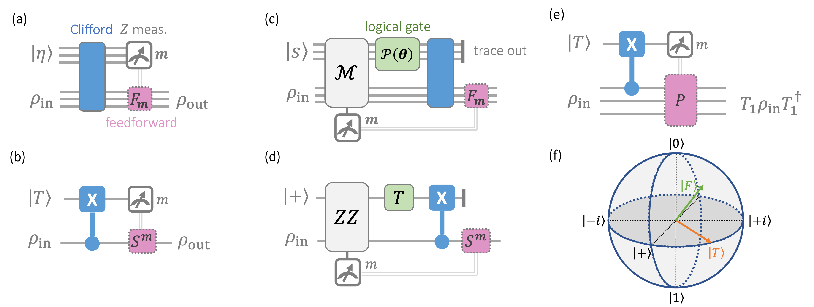
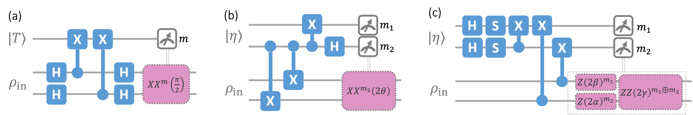
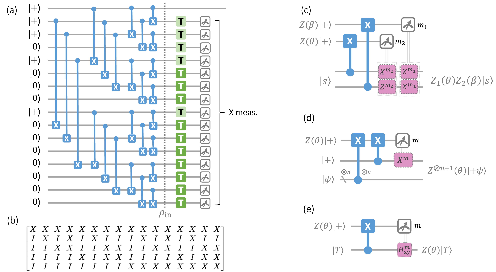

# 魔法门传态：结构、有用资源态与更简单的前馈

## 译文信息

- 文献 ID：S006
- 原文：[S006_2026_Zheng_magic_gate_teleportation.pdf](../Papers/S006_2026_Zheng_magic_gate_teleportation.pdf)
- 原文版本：arXiv:2607.08508v1 [quant-ph]（PDF 首页日期为 2026-07-09）
- 翻译类型：全文翻译
- 覆盖范围：所登记 PDF 的全部 11 页，包括题名、作者、单位、摘要、正文第 I–VII 节、致谢、附录 A、公式 (1)–(33) 与 (A1)–(A4)、算法 1–2、图 1–3 的图注与必要图内文字，以及参考文献 [1]–[62]；不含 supplementary material、ancillary files、网页附加内容或其他版本
- 印刷页码：有；1–11（首页未显式印出页码 1）
- PDF 页序：从 1 开始；1–11
- 页码对应关系：印刷页码与 PDF 页序一一对应，即印刷页码 $p$ = PDF 页序 $p$
- 状态：已核对
- 待核对项：无

| 原文章节 | 印刷页码 | PDF 页序 | 状态 | 待核对 |
|---|---:|---:|---|---|
| Title, Authors, Affiliations, Abstract | 1 | 1 | 已核对 | 无 |
| I Introduction | 1–2 | 1–2 | 已核对 | 无 |
| II Preliminaries | 2–3 | 2–3 | 已核对 | 无 |
| II.A Stabilizer formalism and the Clifford hierarchy | 2 | 2 | 已核对 | 无 |
| II.B Magic gate teleportation | 3 | 3 | 已核对 | 无 |
| III Structure of MGT protocols | 3–4 | 3–4 | 已核对 | 无 |
| IV Constraints on useful resource states | 4–6 | 4–6 | 已核对 | 无 |
| IV.A Single-qubit states | 4–5 | 4–5 | 已核对 | 无 |
| IV.B Multi-qubit states | 5–6 | 5–6 | 已核对 | 无 |
| V Circuit implementation of MGT | 6–7 | 6–7 | 已核对 | 无 |
| VI When feedforward is “simple” | 7–9 | 7–9 | 已核对 | 无 |
| VI.A Criterion for Pauli feedforward | 7 | 7 | 已核对 | 无 |
| VI.B Connection to algorithmic fault tolerance | 7–8 | 7–8 | 已核对 | 无 |
| VI.C Ancilla-assisted Pauli feedforward | 8–9 | 8–9 | 已核对 | 无 |
| VI.D Extension to general feedforward operators | 9 | 9 | 已核对 | 无 |
| VII Discussion | 9 | 9 | 已核对 | 无 |
| Acknowledgments | 9 | 9 | 已核对 | 无 |
| Appendix A Constructing decoding circuits for stabilizer codes | 10 | 10 | 已核对 | 无 |
| References | 10–11 | 10–11 | 已核对 | 无 |

## 术语表

| 原文 | 统一译名 | 说明 |
|---|---|---|
| quantum gate teleportation | 量子门传态 | |
| magic gate teleportation (MGT) | 魔法门传态（MGT） | |
| resource state | 资源态 | |
| stabilizer state / non-stabilizer state | 稳定子态／非稳定子态 | |
| stabilizer code | 稳定子码 | |
| feedforward operator | 前馈算子 | |
| backpropagated measurement | 反向传播测量 | 指把末端测量经 Clifford 电路共轭回协议起点所得的泡利测量 |
| heralded by an outcome | 由结果标示 | 不表示后选择 |
| Clifford hierarchy | Clifford 层级 | |
| stabilizer nullity | 稳定子零度 | |
| Pauli rotation | 泡利旋转 | |
| Pauli frame | 泡利框架 | |
| algorithmic fault tolerance | 算法式容错 | |
| correlated decoding | 关联译码 | |
| stabilizer tableau | 稳定子表 | |
| decoding circuit | 解码电路 | 指编码电路的逆，不是错误综合征译码器 |
| computational basis | 计算基 | |
| free operation | 自由操作 | |
| diagonal state | 对角态 | |

---

## 标题、作者与摘要

**魔法门传态：结构、有用资源态与更简单的前馈**

Yunzhe Zheng$^{1,*}$、Allen Zang$^{2}$、Aleksander Kubica$^{1,\dagger}$

1. 美国康涅狄格州纽黑文，耶鲁大学耶鲁量子研究所与应用物理系
2. 美国伊利诺伊州芝加哥，芝加哥大学普利兹克分子工程学院

$^*$ `yunzhe.zheng@yale.edu`  
$^\dagger$ `a.kubica@yale.edu`

### 摘要

量子门传态是容错量子计算中的一项关键技术，它利用资源态实现逻辑门。本文建立一套量子门传态协议理论：这类协议在任意输入态上实现非 Clifford 门，同时不泄露输入态的任何信息；我们称之为魔法门传态（magic gate teleportation, MGT）。我们揭示了 MGT 中隐藏的结构——把泡利测量反向传播之后，可以把 MGT 协议视为先将输入态编码进一个由测量结果标示的稳定子码，再施加一个逻辑非 Clifford 门。利用这一结构，我们为任何通过对稳定子态施加一组相互对易的泡利旋转而得到的资源态构造 MGT 协议，并给出一种高效算法来综合其电路实现。

反过来，我们证明，对 MGT 有用的资源态——即能够通过 MGT 协议用于实现非 Clifford 门的态——必然与对角态 Clifford 等价；特别地，$[[5,1,3]]$ 协议蒸馏出的输出态对 MGT 并无用处。最后，我们确定了可用泡利算子实现前馈算子的条件；这既阐明了算法式容错范式，也简化了量子计算所需的前馈操作。

## I. 引言

为了可靠执行量子算法 [3, 4]，量子计算机必须采用容错逻辑操作 [1, 2]。实现这类操作最简单的方法之一是使用横向门。许多量子纠错（quantum error-correcting, QEC）码 [5–7] 允许横向 Clifford 门；然而，要实现通用计算，还必须能够容错地实现非 Clifford 门。遗憾的是，一项不可能定理 [8, 9] 排除了任何非平凡 QEC 码拥有通用横向门集的可能性；类似限制也适用于近似 QEC 码 [10, 11]。此外，非 Clifford 门通常更难实现，这也说明了如下常见假设的合理性：在逻辑层面，Clifford 操作容易实现，而主要资源成本来自非 Clifford 操作 [12–14]。

实现通用性的一种常用方法，是利用通常被称为魔法态的资源态，通过量子门传态 [15, 16] 实现非 Clifford 门。典型例子是 $T$ 门传态 [15, 17]：它使用 $|T\rangle$ 态，并与 Clifford 门一起实现通用量子计算。更一般地，任意酉算子都可以用 Clifford 门与 $T$ 门（近似）表示，继而编译成 $|0\rangle$ 态和 $|T\rangle$ 态的制备，再接多量子比特泡利测量；这些测量可能以前面测量的结果为条件 [18]。事实上，这是使用量子低密度奇偶校验码进行容错计算的一种典范方法 [19–21]。

$|T\rangle$ 态只是非 Clifford 门资源态的一个例子；其他资源态也可以通过量子门传态用于实现不同的门。从资源理论的观点看，非稳定子态应当被视为计算资源 [22–27]，而 $|T\rangle$ 以外的非稳定子态仍可能产生有用的非 Clifford 门。然而，如何从一般的非稳定子态出发，并通过量子门传态消耗它们以实现非 Clifford 门，仍不清楚。特别地，人们希望不仅把量子算法编译成 Clifford 门和 $T$ 门 [28–32]，还把它编译成由更奇特的魔法态所提供的泡利旋转 [33–39]，从而降低电路综合开销。量子门传态与有用资源态的一般理论仍未得到充分探索；我们对门传态协议的本质结构以及不同资源态的有用性，理解都很有限。鉴于这一方向对使用量子低密度奇偶校验码开展量子计算十分重要，现在探索它正当其时。

本文研究魔法门传态（MGT）：这是一类使用非稳定子资源态、在任意输入态上实现非 Clifford 门且不泄露这些输入态信息的量子门传态。在容错量子计算中，漫长计算期间不能泄露中间态，因此这一设定尤为重要。我们说明，如何利用由相互对易的泡利旋转作用于稳定子态所得的非稳定子资源态，通过 MGT 实现非 Clifford 门。反过来，我们证明，若资源态能够用于 MGT，它们就必须具有一种特定形式；尤其对单量子比特资源态，我们证明 MGT 中的有用态必然与

$$
\frac{1}{\sqrt{2}}\left(|0\rangle+e^{i\theta}|1\rangle\right)
$$

Clifford 等价，其中角度 $\theta$ 任意。

我们还把这一结果推广到多量子比特情形，并证明：在一大类 MGT 协议中，有用态必然与计算基中的对角态 Clifford 等价。我们的结果凸显出一个细微之处：若要求量子门传态不泄露输入态的任何信息，并非每一个非稳定子态都对量子计算有用。我们还给出一种算法，用来构造魔法门传态协议的显式电路实现。最后，我们研究 MGT 协议中的前馈算子何时可以用泡利算子实现。我们的结果阐明了算法式容错范式 [40–42]，并对下述现象给出另一种解释：某些控制前馈逻辑 Clifford 算子的逻辑测量可以由“掷硬币”取代，再通过泡利框架更新加以记录。

**图 1。** (a) 魔法门传态（MGT）是一类量子门传态：它使用非稳定子资源态 $|\eta\rangle$，在不泄露任意输入态 $\rho_{\mathrm{in}}$ 的任何信息的情况下实现一个非 Clifford 门。MGT 由一个 Clifford 电路以及随后对资源寄存器中所有量子比特进行的泡利 $Z$ 测量组成；对测量结果 $\boldsymbol m$ 施加前馈算子 $F_{\boldsymbol m}$，便得到确定性 MGT 协议。(b) 使用 $|T\rangle=T|+\rangle$ 并实现 $T$ 门的典范 MGT 协议。(c) 对任何使用 $|\eta\rangle=\mathcal P(\boldsymbol\theta)|s\rangle$ 的 MGT 协议，若 $\mathcal P(\boldsymbol\theta)$ 与反向传播测量 $\mathcal M$ 对易，就可以把协议视为先将 $\rho_{\mathrm{in}}$ 编码进一个由测量结果 $\boldsymbol m$ 标示的稳定子码，再通过 $\mathcal P(\boldsymbol\theta)\otimes I$ 实现一个逻辑门。(d) 对 (b) 中的 MGT 协议，反向传播测量 $Z\otimes Z$ 把 $\rho_{\mathrm{in}}$ 编码进一个双量子比特重复码，而 $T\otimes I$ 实现一个逻辑门。(e) 当输入态 $\rho_{\mathrm{in}}$ 由某些泡利算子稳定时，MGT 中的前馈算子可以替换为泡利算子。这一观察阐明了算法式容错范式 [40]，并可减少量子计算中的前馈 Clifford 算子数量。(f) 并非每个非稳定子态都对 MGT 有用。例如，所有有用的单量子比特资源态都位于 Bloch 球的三个大圆（蓝色）上，而五量子比特蒸馏协议 [17] 所得的态

$$
|F\rangle\langle F|=\frac{1}{2}I+\frac{1}{2\sqrt{3}}(X+Y+Z)
$$

不能用于 MGT。图中文字：`Z meas.` 为“$Z$ 测量”，`feedforward` 为“前馈”，`logical gate` 为“逻辑门”，`trace out` 为“取偏迹并舍弃”。

## II. 预备知识

本节先简要回顾稳定子形式体系 [43]，再讨论魔法门传态——一种在不泄露任意输入态任何信息的情况下实现非 Clifford 门的方法。

### A. 稳定子形式体系与 Clifford 层级

对一个 $n$ 量子比特纯态 $|\psi\rangle$，若 $n$ 量子比特泡利算子 $P$ 满足

$$
P|\psi\rangle=|\psi\rangle,
$$

就称 $P$ 稳定 $|\psi\rangle$。进而，把所有稳定 $|\psi\rangle$ 的泡利算子所生成的群定义为 $|\psi\rangle$ 的稳定子群 $\mathcal S$。沿用文献 [25]，可以定义稳定子零度

$$
\nu(|\psi\rangle)=n-r,
$$

其中 $r$ 是 $\mathcal S$ 的独立生成元数；稳定子零度为零的态称为稳定子态。

我们还会在 QEC 的语境中使用稳定子群。具体而言，对一个 $n$ 量子比特系统，稳定子码 $\mathcal Q$ 的码空间，是 $n$ 量子比特泡利群中某个阿贝尔子群 $\mathcal S$ 的所有元素的共同 $+1$ 本征空间，其中 $-I\notin\mathcal S$。本文谈论稳定子码 $\mathcal Q$ 时，不仅指它的码空间，还包含逻辑泡利算子的一项具体选择。

下面引入一组便于使用的记号。令

$$
\mathcal P=\{P_1,P_2,\ldots\},\qquad
\boldsymbol\theta=\{\theta_1,\theta_2,\ldots\}
$$

分别为 $n$ 量子比特泡利算子和角度的有序列表。定义

$$
\mathcal P(\boldsymbol\theta)
=\prod_j P_j(\theta_j)
=\cdots P_2(\theta_2)P_1(\theta_1),
\tag{1}
$$

其中

$$
P_j(\theta_j)=\exp(-i\theta_jP_j/2)
$$

是绕 $n$ 量子比特泡利算子 $P_j$、旋转角为 $\theta_j$ 的泡利旋转。忽略整体相位，任意酉算子都可以分解成泡利旋转的乘积 $\mathcal P(\boldsymbol\theta)$ [3, 44]。

我们还会使用 Clifford 层级 [8, 16, 45, 46]。Clifford 层级的第一层 $\mathcal C_1$ 定义为 $n$ 量子比特泡利群；对 $k\geq2$，第 $k$ 层递归定义为

$$
\mathcal C_k
=\left\{\text{$n$ 量子比特酉算子 $U$}\ \middle|\ 
\forall P\in\mathcal C_1:\ UPU^\dagger\in\mathcal C_{k-1}\right\},
\tag{2}
$$

其中忽略整体相位 [8]。

对 Clifford 层级中对角门的刻画 [47, 48] 表明：若一个对角门 $U\in\mathcal C_k$，则它存在表示 $U=\mathcal P(\boldsymbol\theta)$，其中 $\mathcal P$ 是一组相互对易的泡利算子，并且每个 $\theta_j\in\boldsymbol\theta$ 都满足

$$
\theta_j\in\left(\frac{\pi}{2^{k-1}}\right)\mathbb Z.
$$

例如，$\mathcal C_3$ 中任何具有这种形式的门，都可以用满足 $\theta_j\in(\pi/4)\mathbb Z$ 的泡利旋转角表示。这包括熟悉的例子

$$
T=Z\!\left(\frac{\pi}{4}\right)
$$

以及 $CCZ=\mathcal P(\boldsymbol\theta)$；对后者，忽略整体相位时

$$
\begin{aligned}
\mathcal P={}&\{Z_1,Z_2,Z_3,Z_1Z_2,Z_1Z_3,Z_2Z_3,Z_1Z_2Z_3\},\\
\boldsymbol\theta={}&\left(\frac\pi4,\frac\pi4,\frac\pi4,-\frac\pi4,-\frac\pi4,-\frac\pi4,\frac\pi4\right).
\end{aligned}
$$

### B. 魔法门传态

量子门传态 [15, 16] 是一种在未知的任意输入态 $\rho_{\mathrm{in}}$ 上实现目标门 $U$ 的方法。为此，它消耗某个资源态 $|\eta\rangle$（本文假定它是纯态），并使用一组指定的自由操作。我们聚焦于非 Clifford 门的量子门传态，并采用以下自由操作：在计算基中制备态、Clifford 门，以及单量子比特泡利 $Z$ 测量；见图 1(a)。

重要的是，本文始终要求输入态可以从量子门传态的输出中恢复；换言之，协议不能泄露 $\rho_{\mathrm{in}}$ 的任何信息。这一要求源于如下事实：量子门传态用于在容错量子计算期间实现逻辑门，而编码态不能在计算中途被泄露。具体而言，我们考虑这样的协议：对任意输入态 $\rho_{\mathrm{in}}$，它返回输出态

$$
\rho_{\mathrm{out}}(\boldsymbol m)
=U_{\boldsymbol m}\rho_{\mathrm{in}}U_{\boldsymbol m}^\dagger,
\tag{3}
$$

其中 $U_{\boldsymbol m}$ 是一个酉算子，以单量子比特泡利 $Z$ 测量的结果 $\boldsymbol m\in\{0,1\}^*$ 为条件。由于我们关心的是实现非 Clifford 门，集合 $\{U_{\boldsymbol m}\}$ 中至少应有一个酉算子是非 Clifford 的；本文假定它是 $U_{\boldsymbol0}$。为简洁起见，我们把这类协议称为魔法门传态（MGT）。我们称一个 MGT 协议使用资源态 $|\eta\rangle$，并实现由结果 $\boldsymbol m$ 标示的 $U_{\boldsymbol m}$。

此外，对结果 $\boldsymbol m$ 施加前馈算子

$$
F_{\boldsymbol m}=U_{\boldsymbol0}U_{\boldsymbol m}^\dagger,
\tag{4}
$$

便可修改任意 MGT 协议，使其确定性地实现非 Clifford 酉算子 $U_{\boldsymbol0}$。于是，无论 $\boldsymbol m$ 为何，输出都是

$$
\rho_{\mathrm{out}}
=U_{\boldsymbol0}\rho_{\mathrm{in}}U_{\boldsymbol0}^\dagger.
$$

我们把这类协议称为确定性 MGT。

讨论 MGT 时，把泡利 $Z$ 测量反向传播到协议起点会很方便；见图 1(c)。这样一来，可以把 MGT 看作先在联合态 $|\eta\rangle\langle\eta|\otimes\rho_{\mathrm{in}}$ 上测量一组独立且相互对易的泡利算子

$$
\mathcal M=\{V^\dagger(Z_j\otimes I)V\},
$$

再施加 Clifford 电路 $V$。这里约定第一个（第二个）寄存器为资源（输入）态，而 $Z_j$ 是资源寄存器中第 $j$ 个量子比特上的泡利 $Z$ 算子。我们把 $\mathcal M$ 称为反向传播测量。不失一般性，假定 $\mathcal M$ 中每个元素在资源寄存器和输入寄存器上都具有非平凡支撑；否则，我们测量的就会是资源态——从而把它改成另一个资源态——或者输入态——从而泄露它的一些信息。

> [!note] 译注
> 这里的“反向传播”不是把同一个 $Z_j$ 测量原封不动地穿过可能与之不对易的 $V$，而是把测量投影按 $V$ 共轭回拉。令
> $$
> \sigma=|\eta\rangle\langle\eta|\otimes\rho_{\mathrm{in}},
> \qquad
> P_{\boldsymbol m}=\prod_j\frac{I+(-1)^{m_j}(Z_j\otimes I)}2,
> \qquad
> \widetilde P_{\boldsymbol m}=V^\dagger P_{\boldsymbol m}V,
> $$
> 则每个测量分支的未归一化状态满足
> $$
> P_{\boldsymbol m}V\sigma V^\dagger P_{\boldsymbol m}
> =V\widetilde P_{\boldsymbol m}\sigma\widetilde P_{\boldsymbol m}V^\dagger.
> $$
> 因而“先施加 $V$、再测量 $Z_j$”与“先测量 $M_j=V^\dagger(Z_j\otimes I)V$、再施加 $V$”给出相同的分支概率和条件输出；这里不要求 $Z_j\otimes I$ 与 $V$ 对易。不对易只会使反向传播后的测量算符发生变化。由于 $V$ 是 Clifford，每个 $M_j$ 仍是泡利算子；而酉共轭保持对易关系和独立性（即没有冗余生成元），所以末端那组独立、相互对易的 $Z$ 测量在反向传播后仍有这些性质。
>
> 以 [[State injection]] 中的 $T$-state injection 为例，$V=\operatorname{CNOT}_{d\to a}$，末端测量资源量子比特上的 $Z_a$，于是
> $$
> V^\dagger Z_aV=Z_dZ_a.
> $$
> 因此移到起点的是联合奇偶校验测量 $Z_dZ_a$，不是分别测量 $Z_d$ 和 $Z_a$；前者只分辨总奇偶性，不会测出输入量子比特的 $Z_d$ 值。由于 $\langle T|Z|T\rangle=0$，对任意输入态都有
> $$
> p(m)=\frac12\left[1+(-1)^m\langle T|Z|T\rangle\operatorname{Tr}(Z\rho_{\mathrm{in}})\right]=\frac12,
> $$
> 所以测量结果不泄露输入信息，这也与 [[State injection]] 中两个分支的概率一致。又因为 $|T\rangle=T_a|+\rangle$ 中的 $T_a$ 与 $Z_dZ_a$ 对易，才可以进一步把 $T_a$ 移到该联合测量之后，并把过程解释为“先编码进重复码，再施加逻辑 $T$”。这个进一步换序才需要下文式 (6) 的对易条件；若该条件不成立，测量经 $V$ 的反向传播仍然有效，但引理 1 的逻辑门解释不再自动成立。

此外，输入态总能从 MGT 协议输出中恢复这一假设，等价于反向传播测量 $\mathcal M$ 不泄露 $\rho_{\mathrm{in}}$ 的任何信息。再结合 MGT 必须适用于任意输入态 $\rho_{\mathrm{in}}$ 的要求，就得到条件

$$
\operatorname{Tr}\!\left[M_j\bigl(|\eta\rangle\langle\eta|\otimes\rho_{\mathrm{in}}\bigr)\right]=0
\tag{5}
$$

对每个 $M_j\in\mathcal M$ 都成立。

## III. MGT 协议的结构

下面描述隐藏在 MGT 协议内部的稳定子码结构。核心观察是：把末端测量反向传播到协议起点后，可以把协议视为先将输入态编码进一个由测量结果标示的稳定子码，再施加一个非 Clifford 逻辑门。下面的引理刻画了一般一类 MGT 协议背后的这一直觉。

**引理 1。** 考虑一个使用资源态

$$
|\eta\rangle=\mathcal P(\boldsymbol\theta)|s\rangle
$$

的 MGT 协议，其中 $\mathcal P$ 是一组非平凡、相互对易的泡利算子，而 $|s\rangle$ 是不被 $\mathcal P$ 中任何元素稳定的稳定子态。令 $\mathcal M=\{M_j\}$ 为反向传播测量，$\boldsymbol m=\{m_j\}$ 为相应结果。若对每个 $M_j\in\mathcal M$ 都有

$$
[M_j,\mathcal P(\boldsymbol\theta)\otimes I]=0,
\tag{6}
$$

那么，在 $|\eta\rangle\langle\eta|\otimes\rho_{\mathrm{in}}$ 上测量 $\mathcal M$，等价于把 $\rho_{\mathrm{in}}$ 编码进一个由 $\boldsymbol m$ 标示的稳定子码 $\mathcal Q_{\boldsymbol m}$，并通过 $\mathcal P(\boldsymbol\theta)\otimes I$ 在 $\mathcal Q_{\boldsymbol m}$ 上实现一个逻辑门。

**证明。** 由于 $\mathcal P(\boldsymbol\theta)\otimes I$ 与每个 $M_j$ 对易，在 $|\eta\rangle\langle\eta|\otimes\rho_{\mathrm{in}}$ 上测量 $\mathcal M$，等价于先在 $|s\rangle\langle s|\otimes\rho_{\mathrm{in}}$ 上测量 $\mathcal M$，再施加 $\mathcal P(\boldsymbol\theta)\otimes I$。测量结果为 $\boldsymbol m$ 时，码空间投影算子为

$$
\Pi_{\boldsymbol m}\propto\prod_j\left(I+(-1)^{m_j}M_j\right).
\tag{7}
$$

因此，该测量把 $\rho_{\mathrm{in}}$ 编码进稳定子码 $\mathcal Q_{\boldsymbol m}$，其码空间由 $\Pi_{\boldsymbol m}$ 定义。又因为

$$
[\mathcal P(\boldsymbol\theta)\otimes I,\Pi_{\boldsymbol m}]=0,
$$

所以 $\mathcal P(\boldsymbol\theta)\otimes I$ 保持每个 $\Pi_{\boldsymbol m}$ 的码空间不变，并充当一个逻辑门。$\square$

据我们所知，所有已知的 MGT 协议 [15–17, 33, 49, 50] 都由引理 1 覆盖；图 1(c) 展示了这一结构。

**例 1。** 考虑使用资源态 $|T\rangle=T|+\rangle$、实现 $T$ 门的确定性 MGT 协议 [17]；见图 1(b)。反向传播测量为 $\mathcal M=\{ZZ\}$，结果为 $m$。引理 1 把相应稳定子码识别为一个双量子比特重复码：其稳定子为 $(-1)^mZZ$，逻辑泡利算子为

$$
\overline X=XX,\qquad \overline Z=(-1)^mZI;
$$

而门 $TI$ 充当逻辑门 $\overline T\,\overline S^m$。MGT 协议根据 $m$ 实现 $T$ 门或 $T^\dagger$ 门；施加前馈算子 $S^m$ 后，它便成为确定性实现 $T$ 门的 MGT 协议；见图 1(d)。

下面利用引理 1 构造一类 MGT 协议，它们使用可表示为“泡利旋转作用于稳定子态”的资源态。

**定理 1。** 令

$$
|\eta\rangle=\mathcal P(\boldsymbol\theta)|s\rangle
$$

为资源态，其中 $\mathcal P=\{P_j\}$ 是一组非平凡、相互对易的泡利算子，而 $|s\rangle$ 是不被 $\mathcal P$ 中任何元素稳定的稳定子态。令 $\{P'_j\}$ 为 $\mathcal P$ 的一组独立生成元，并用指标集 $\mathcal I_j$ 定义

$$
P_j=\prod_{k\in\mathcal I_j}P'_k.
$$

对任何这样的 $\{P'_j\}$，都存在一个使用 $|\eta\rangle$ 的 MGT 协议，它实现

$$
U_{\boldsymbol m}=\prod_jP_j\!\left((-1)^{q_j}\theta_j\right),
\tag{8}
$$

其中该门由结果 $\boldsymbol m=\{m_k\}$ 标示，且

$$
q_j=\sum_{k\in\mathcal I_j}m_k.
$$

由于 Clifford 门是 MGT 中的自由操作，定理 1 也为任意与之 Clifford 等价、由结果标示的门 $C_1U_{\boldsymbol m}C_2$ 给出 MGT 协议，其中 $C_1$ 和 $C_2$ 可以是任意 Clifford 算子。

**证明。** 我们将构造一个 MGT 协议，其输入态与资源态具有相同维数。不失一般性，假定资源态 $|\eta\rangle$ 满足 $\nu(|\eta\rangle)=n$；否则，当 $\nu(|\eta\rangle)<n$ 时，可以使用 MGT 中的自由操作，把 $|\eta\rangle$ 转换成一个 $\nu(|\eta\rangle)$ 量子比特态 $|\eta'\rangle$，使 $\nu(|\eta'\rangle)$ 等于新状态的量子比特数。

> [!note] 译注
> 这里的“维数相同”是说输入寄存器与资源寄存器含有相同数量的量子比特，因而希尔伯特空间维数相同。原文随后重复使用 $n$，容易掩盖其中的一次压缩与重新命名。为把这一步写清楚，设原资源态有 $N$ 个量子比特，并有 $r$ 个独立泡利稳定子；令
> $$
> k=\nu(|\eta\rangle)=N-r.
> $$
> 可以选择一个 Clifford 算子 $C$，把这 $r$ 个稳定子化为 $Z_1,\ldots,Z_r$，于是
> $$
> C|\eta\rangle=|0\rangle^{\otimes r}\otimes|\eta'\rangle.
> $$
> 其中 $|\eta'\rangle$ 是一个 $k$ 量子比特态，而且不再有非平凡泡利稳定子；否则，$|\eta\rangle$ 原本就会有多于 $r$ 个独立稳定子。因此 $\nu(|\eta'\rangle)=k$，恰好等于 $|\eta'\rangle$ 的量子比特数。$C$ 与 $C^\dagger$ 都是自由的 Clifford 操作，分离出的 $|0\rangle$ 可以做自由的 $Z$ 测量后忽略，反过来也可以免费制备，故这一步只剥离了稳定子自由度，没有损失非稳定子资源。作者随后把 $k$ 重新记作 $n$；并不是说任意 $n$ 量子比特态都满足 $\nu=n$。
>
> 例如，对一般的非 Clifford 角度 $\theta$，资源态
> $$
> |\eta\rangle=XX(\theta)|00\rangle
> $$
> 被 $ZZ$ 稳定，所以它虽有两个量子比特，却只有 $\nu(|\eta\rangle)=1$。施加 $\operatorname{CNOT}_{1\to2}$ 后，
> $$
> \operatorname{CNOT}_{1\to2}|\eta\rangle
> =\bigl(X(\theta)|0\rangle\bigr)\otimes|0\rangle,
> $$
> 真正承载非稳定子资源的部分只有一个量子比特。相应的双量子比特旋转并未丢失，因为
> $$
> XX(\theta)
> =\operatorname{CNOT}_{1\to2}
> \bigl(X(\theta)\otimes I\bigr)
> \operatorname{CNOT}_{1\to2};
> $$
> 它可以由压缩后的单量子比特旋转配合前后的自由 Clifford 操作恢复。

**选择**反向传播测量

$$
\mathcal M=\{P'_j\otimes P'_j\}_{j=1}^n.
$$

> [!note] 译注
> 这里生成元指标能够取到 $n$，并不是仅由“资源态有 $n$ 个量子比特”直接得到的，还用到了上一段经过压缩后的假设 $\nu(|\eta\rangle)=n$。暂且令
> $$
> g=\operatorname{rank}\langle\mathcal P\rangle
> $$
> 表示 $\mathcal P$ 的独立泡利生成元数。$n$ 量子比特上相互对易的独立泡利算子至多有 $n$ 个，所以 $g\le n$。
>
> 为具体说明另一侧的界，取稳定子态 $|s\rangle$ 的一组独立稳定子生成元 $S_1,\ldots,S_n$。它的任意稳定子都可写成
> $$
> S(\boldsymbol x)=\prod_{i=1}^n S_i^{x_i},
> \qquad x_i\in\{0,1\}.
> $$
> 定义一个 $g\times n$ 的二进制对易矩阵 $A$：
> $$
> A_{ai}=
> \begin{cases}
> 0,&[P'_a,S_i]=0,\\
> 1,&\{P'_a,S_i\}=0.
> \end{cases}
> $$
> 对易或反对易的符号在稳定子相乘时相乘，因此
> $$
> P'_aS(\boldsymbol x)
> =(-1)^{\sum_iA_{ai}x_i}
> S(\boldsymbol x)P'_a.
> $$
> 所以，$S(\boldsymbol x)$ 同时与所有 $P'_1,\ldots,P'_g$ 对易，当且仅当
> $$
> A\boldsymbol x=0\pmod 2.
> $$
> 矩阵 $A$ 只有 $g$ 行，故 $\operatorname{rank}A\le g$，从而
> $$
> \dim\ker A
> =n-\operatorname{rank}A
> \ge n-g.
> $$
> 核空间中的独立向量对应独立的稳定子乘积，因此至少有 $n-g$ 个独立稳定子同时与所有 $P'_a$ 对易。它们也就与由这些生成元构成的 $\mathcal P(\boldsymbol\theta)$ 对易，并在 $|\eta\rangle=\mathcal P(\boldsymbol\theta)|s\rangle$ 中继续充当稳定子。因此，若 $r_\eta$ 是 $|\eta\rangle$ 的独立稳定子数，则
> $$
> r_\eta\ge n-g,
> \qquad
> \nu(|\eta\rangle)=n-r_\eta\le g\le n.
> $$
> 结合 $\nu(|\eta\rangle)=n$，只能有 $g=n$。所以压缩后的 $\mathcal P$ 确实具有恰好 $n$ 个独立生成元，作者才把它们记为 $\{P'_j\}_{j=1}^n$，并为每个生成元选取一次联合测量 $P'_j\otimes P'_j$。这里 $j$ 标记的是独立生成元，不是物理量子比特；每个 $P'_j$ 都可以是作用于多个量子比特的泡利串。若不先压缩，这个数不必等于原资源态的量子比特数：上一译注中的 $XX(\theta)|00\rangle$ 就是两个量子比特却只有一个独立旋转生成元的例子。

根据引理 1，测量 $\mathcal M$ 会把 $\rho_{\mathrm{in}}$ 编码进一个稳定子码，而 $\mathcal P(\boldsymbol\theta)\otimes I$ 将充当该稳定子码的一个逻辑门。

以结果 $\boldsymbol m=\{m_k\}$ 测量 $\mathcal M$ 后，

$$
\{(-1)^{m_k}P'_k\otimes P'_k\}
$$

将生成该码的稳定子群。该码的所有逻辑泡利算子 $\overline P_j$ 可以取为

$$
\overline P_j=I\otimes P_j,
$$

因为它们与 $\mathcal M$ 的所有元素对易。

> [!note] 译注
> 原文这里的“所有逻辑泡利算子 $\overline P_j$”应理解为：对所有出现在 $\mathcal P$ 中的 $P_j$，下文所需的对应逻辑泡利代表都可以这样选；它不是说 $\{I\otimes P_j\}$ 构成该码的完整逻辑泡利群。测量结果为 $\boldsymbol m$ 时，稳定子群为
> $$
> \mathcal S_{\boldsymbol m}
> =\left\langle
> (-1)^{m_k}P'_k\otimes P'_k
> \right\rangle_{k=1}^n.
> $$
> 因为 $P_j$ 与每个 $P'_k$ 对易，所以 $I\otimes P_j$ 与所有稳定子生成元对易，因而属于 $\mathcal S_{\boldsymbol m}$ 的中心化子。不过，对易本身只是成为逻辑算子的必要条件；还要确认它不是稳定子。这里稳定子群中的元素都形如 $\pm Q\otimes Q$，其中 $Q\in\langle P'_1,\ldots,P'_n\rangle$。由于 $P_j\ne I$，只作用在输入寄存器上的 $I\otimes P_j$ 不可能具有这种形式，故它确实代表一个非平凡逻辑泡利算子。
>
> 另一方面，该码有 $2n$ 个物理量子比特和 $n$ 个独立稳定子生成元，因此编码 $n$ 个逻辑量子比特；完整逻辑泡利群需要 $2n$ 个独立生成元，而 $I\otimes P_j$ 全部彼此对易，只给出了一个“逻辑 $Z$ 型”的对易子群。例如在 $T$ 门传态中，$P'_1=Z$，这里给出 $IZ$，但完整的单逻辑量子比特泡利还需要与它反对易的 $XX$。本证明只需要与旋转 $P_j(\theta_j)$ 对应的这些逻辑泡利代表，所以无须补全整个逻辑泡利基。

现在考察 $\mathcal P(\boldsymbol\theta)\otimes I$ 作为逻辑门的作用。由 $P_j=\prod_{k\in\mathcal I_j}P'_k$ 可知，算子 $(-1)^{q_j}P_j\otimes P_j$ 属于稳定子群。因此，在码空间上有

$$
\begin{aligned}
\mathcal P(\boldsymbol\theta)\otimes I
&=\prod_j P_j(\theta_j)\otimes I\\
&=I\otimes\prod_jP_j\!\left((-1)^{q_j}\theta_j\right)\\
&=\prod_j\overline P_j\!\left((-1)^{q_j}\theta_j\right).
\end{aligned}
\tag{9}
$$

所以，实现的门正是由 $\boldsymbol m$ 标示的

$$
U_{\boldsymbol m}=\prod_jP_j\!\left((-1)^{q_j}\theta_j\right),
$$

结论得证。$\square$

**推论 1。** 定理 1 中的 MGT 协议可以提升为确定性 MGT 协议，实现门

$$
U_{\boldsymbol0}=\mathcal P(\boldsymbol\theta).
\tag{10}
$$

具体做法是，对结果 $\boldsymbol m=\{m_k\}$ 施加前馈算子

$$
F_{\boldsymbol m}=\prod_jP_j^{q_j}(2\theta_j),
\tag{11}
$$

其中

$$
q_j=\left(\sum_{k\in\mathcal I_j}m_k\right)\bmod 2.
$$

此外，若 $U_{\boldsymbol0}\in\mathcal C_k$，则 $F_{\boldsymbol m}\in\mathcal C_{k-1}$。

特别地，如果要求前馈算子为 Clifford 算子，即 $F_{\boldsymbol m}\in\mathcal C_2$，那么这一确定性 MGT 协议只能实现 $\mathcal C_3$ 中的门。推论 1 中的层级陈述，与文献 [15, 16] 观察到的“待实现门与前馈算子之间的关系”一致。

**证明。** 只需利用式 (8) 验证式 (4) 中的确定性前馈条件。由相互对易性可得

$$
\begin{aligned}
F_{\boldsymbol m}U_{\boldsymbol m}
&=\prod_jP_j^{q_j}(2\theta_j)
  \prod_jP_j\!\left((-1)^{q_j}\theta_j\right)\\
&=\prod_jP_j(\theta_j)=U_{\boldsymbol0},
\end{aligned}
\tag{12}
$$

其中使用了每个 $P_j$ 两两对易，以及

$$
P_j^{q_j}(2\theta_j)P_j\!\left((-1)^{q_j}\theta_j\right)=P_j(\theta_j).
$$

因此，前馈消除了对结果 $\boldsymbol m$ 的依赖，把 MGT 协议提升为确定性实现门 $U_{\boldsymbol0}$ 的协议。

再证明层级陈述。由于每个 $P'_k$ 两两对易，可以选择一组泡利算子 $\{R_k\}$，使

$$
\{R_k,P'_k\}=0,\qquad [R_k,P'_\ell]=0\quad(\ell\ne k).
$$

令

$$
R_{\boldsymbol m}=\prod_kR_k^{m_k}.
$$

由 $P_j=\prod_{k\in\mathcal I_j}P'_k$ 可得

$$
R_{\boldsymbol m}P_jR_{\boldsymbol m}=(-1)^{q_j}P_j,
\tag{13}
$$

因而 $U_{\boldsymbol m}=R_{\boldsymbol m}U_{\boldsymbol0}R_{\boldsymbol m}$。所以

$$
F_{\boldsymbol m}
=U_{\boldsymbol0}U_{\boldsymbol m}^\dagger
=U_{\boldsymbol0}R_{\boldsymbol m}U_{\boldsymbol0}^\dagger R_{\boldsymbol m}.
\tag{14}
$$

若 $U_{\boldsymbol0}\in\mathcal C_k$，则根据 Clifford 层级的定义，$U_{\boldsymbol0}R_{\boldsymbol m}U_{\boldsymbol0}^\dagger\in\mathcal C_{k-1}$。右乘一个泡利算子不改变其所在的 Clifford 层级，故 $F_{\boldsymbol m}\in\mathcal C_{k-1}$。$\square$

值得注意的是，到目前为止，这一构造只确立了这类 MGT 协议的抽象存在性；第 V 节将给出一种显式电路实现。

## IV. 对有用资源态的约束

下面转向上一节的逆问题：给定一个资源态，它使某个 MGT 协议能够对任意输入态实现非 Clifford 门，那么这一资源态必须满足哪些约束？

### A. 单量子比特态

我们先分析单量子比特资源态。对这种情形，式 (5) 的条件使我们能够完整刻画有用态。

**定理 2。** 令 $|\eta\rangle$ 为一个单量子比特纯态。若存在使用 $|\eta\rangle$ 的 MGT 协议，则

$$
|\eta\rangle=CZ(\theta)|+\rangle,
\tag{15}
$$

其中 $C$ 是 Clifford 算子。

定理 2 表明，并非每个单量子比特非稳定子态都能通过 MGT 协议用于实现非 Clifford 门。具体而言，有用的单量子比特非稳定子态位于 Bloch 球的三个大圆上，如图 1(f) 所示。因此，五量子比特魔法态蒸馏协议 [17] 所蒸馏出的态

$$
|F\rangle\langle F|
=\frac12\left(I+\frac{X+Y+Z}{\sqrt3}\right)
$$

对本文考虑的任何 MGT 协议都没有用。这与稳定子多面体的观点 [24, 51, 52] 形成对比：从该观点看，$|F\rangle$ 是一个极端单量子比特非稳定子态，并且离稳定子八面体最远。若要使用 $|F\rangle$ 态，可以对两个 $|F\rangle$ 态额外执行一次宇称测量与后选择，把它们转换成 $Z(\pi/3)|+\rangle$ 态 [17]。

**证明。** 任意单量子比特态都可以写成

$$
|\eta\rangle=CX(\phi)Z(\theta)|+\rangle,
$$

其中 $C$ 是 Clifford 算子，$\phi,\theta$ 是旋转角 [3]。Clifford 算子 $C$ 可以吸收到 MGT 协议的 Clifford 部分中，因此不失一般性地取 $C=I$。对非稳定子态 $|\eta\rangle$，假定其中的对角分量是非 Clifford 的，即

$$
\theta\notin(\pi/2)\mathbb Z.
$$

考虑一个 MGT 协议中出现的反向传播测量 $M=A\otimes B$，其中 $A$ 和 $B$ 分别支撑在资源寄存器与输入寄存器上。$A$ 与 $B$ 都必须是非平凡的；否则，协议就不是在实现 MGT，而是在测量资源态或输入态。式 (5) 的条件要求，对任意输入态 $\rho_{\mathrm{in}}$ 都有

$$
\operatorname{Tr}\!\left[M\bigl(|\eta\rangle\langle\eta|\otimes\rho_{\mathrm{in}}\bigr)\right]
=\langle\eta|A|\eta\rangle\operatorname{Tr}[B\rho_{\mathrm{in}}]
=0.
\tag{16}
$$

所以必有 $\langle\eta|A|\eta\rangle=0$。

下面用反证法证明，存在 MGT 协议会迫使 $\phi\in(\pi/2)\mathbb Z$。假设 $\phi\notin(\pi/2)\mathbb Z$。对 $|\eta\rangle=X(\phi)Z(\theta)|+\rangle$，所有可能的非平凡 $A\in\{X,Y,Z\}$ 的期望值为

$$
\begin{aligned}
\langle\eta|X|\eta\rangle&=\cos\theta,\\
\langle\eta|Y|\eta\rangle&=\cos\phi\sin\theta,\\
\langle\eta|Z|\eta\rangle&=\sin\phi\sin\theta.
\end{aligned}
\tag{17}
$$

由于 $\phi,\theta\notin(\pi/2)\mathbb Z$，这些期望值没有一个为零。因此，任何非平凡泡利算子 $A\in\{X,Y,Z\}$ 都不能满足式 (16)，这与存在一个保持任意输入态的 MGT 测量矛盾。故必有 $\phi\in(\pi/2)\mathbb Z$，于是 $X(\phi)$ 可以吸收到 Clifford 算子 $C$ 中。因此，$|\eta\rangle=CZ(\theta)|+\rangle$。$\square$

### B. 多量子比特态

我们希望把定理 2 推广到多量子比特资源态。为此，下面的引理将很有用。

**引理 2。** 令 $|\eta\rangle$ 为一个 $n$ 量子比特纯态。下列陈述等价。

1. 存在一组由 $n$ 个独立且相互对易的泡利算子组成的集合 $\mathcal R=\{R_1,\ldots,R_n\}$，使

   $$
   \langle\eta|R_j|\eta\rangle=0,
   \qquad \forall R_j\in\mathcal R.
   $$

2. 存在 Clifford 算子 $C$ 和在计算基中对角的酉算子

   $$
   D=\sum_{\boldsymbol x\in\{0,1\}^n}e^{i\theta_{\boldsymbol x}}|\boldsymbol x\rangle\langle\boldsymbol x|,
   $$

   使得

   $$
   |\eta\rangle=CD|+\rangle^{\otimes n}.
   $$

3. 存在一组非平凡、相互对易的泡利算子 $\mathcal P$，以及一个不被 $\mathcal P$ 中任何元素稳定的稳定子态 $|s\rangle$，使

   $$
   |\eta\rangle=\mathcal P(\boldsymbol\theta)|s\rangle.
   $$

**证明。** $(1)\Rightarrow(2)$。由于 $\mathcal R$ 是一组极大的独立对易泡利算子，存在 Clifford 酉算子 $C$，使所有 $j$ 都满足 $C^\dagger R_jC=Z_j$。令 $|\phi\rangle=C^\dagger|\eta\rangle$，并写成

$$
|\phi\rangle
=\sum_{\boldsymbol x\in\{0,1\}^n}a_{\boldsymbol x}|\boldsymbol x\rangle.
\tag{18}
$$

每个 $R_j$ 在 $|\eta\rangle$ 上的期望值均为零这一假设，等价于 $\{Z_j\}$ 的测量结果服从均匀分布。换言之，对每个 $\boldsymbol x$，存在某个 $\theta_{\boldsymbol x}$ 使

> [!note] 译注
> 上述“每个生成元的期望值为零”只保证各个二值测量的边缘分布均匀，不足以推出完整联合分布均匀。对相互对易的 $R_1,\ldots,R_n$，联合结果的概率为
> $$
> p(\boldsymbol m)
> =2^{-n}\sum_{\boldsymbol y\in\mathbb F_2^n}
> (-1)^{\boldsymbol m\cdot\boldsymbol y}
> \left\langle\eta\left|
> \prod_jR_j^{y_j}
> \right|\eta\right\rangle.
> $$
> 因此要得到均匀联合分布，必须对每个 $\boldsymbol y\ne\boldsymbol0$ 都有
> $$
> \left\langle\eta\left|
> \prod_jR_j^{y_j}
> \right|\eta\right\rangle=0,
> $$
> 而原文的前提只给出 $\boldsymbol y=\boldsymbol e_j$ 的情形。例如，对 $|\eta\rangle=(|00\rangle+|11\rangle)/\sqrt2$ 取 $R_1=Z_1$、$R_2=Z_2$，有 $\langle R_1\rangle=\langle R_2\rangle=0$，但联合测量只以各 $1/2$ 的概率得到 $00$ 和 $11$。所以这里从逐生成元零期望推出式 (19) 的等幅展开，按原文当前条件尚缺少对所有非平凡生成元乘积的假设。

$$
a_{\boldsymbol x}=2^{-n/2}e^{i\theta_{\boldsymbol x}},
$$

从而

$$
|\phi\rangle
=\left(\sum_{\boldsymbol x}e^{i\theta_{\boldsymbol x}}|\boldsymbol x\rangle\langle\boldsymbol x|\right)|+\rangle^{\otimes n}
=D|+\rangle^{\otimes n}.
\tag{19}
$$

因此，$|\eta\rangle=CD|+\rangle^{\otimes n}$。

$(2)\Rightarrow(1)$。若 $|\eta\rangle=CD|+\rangle^{\otimes n}$，令

$$
\mathcal R=\{CZ_jC^\dagger\}_{j=1}^n.
$$

容易验证

$$
\langle\eta|CZ_jC^\dagger|\eta\rangle=0,
\qquad \forall j.
\tag{20}
$$

$(2)\Rightarrow(3)$。由于 $D$ 是对角算子，可以把它分解为

$$
D=\prod_jP_j^{\mathrm z}(\theta_j),
$$

其中每个 $P_j^{\mathrm z}$ 都是由恒等算子与泡利 $Z$ 的张量积构成的多量子比特泡利算子。因此，原文给出

$$
|\eta\rangle
=C^\dagger D|+\rangle^{\otimes n}
=\prod_j\left(C^\dagger P_j^{\mathrm z}(\theta_j)C\right)C^\dagger|+\rangle^{\otimes n}.
\tag{21}
$$

令

$$
\mathcal P=\{C^\dagger P_j^{\mathrm z}C\},
\qquad |s\rangle=C^\dagger|+\rangle^{\otimes n},
$$

便得到 $|\eta\rangle=\mathcal P(\boldsymbol\theta)|s\rangle$。

> [!note] 译注
> 引理陈述 (2) 写作 $|\eta\rangle=CD|+\rangle^{\otimes n}$，而原文在证明 $(2)\Rightarrow(3)$ 的式 (21) 中改写成 $C^\dagger D|+\rangle^{\otimes n}$；随后关于 $C$ 如何映射 $|s\rangle$ 的措辞也采用了相应的逆方向。这里保留原文的算式与记号，不静默替换 $C$ 或 $C^\dagger$。

$(3)\Rightarrow(2)$。由于 $|s\rangle$ 不被 $\mathcal P$ 中任何元素稳定，存在一个 Clifford 酉算子 $C$，它把 $\mathcal P$ 中的每个元素对角化，并把 $|s\rangle$ 映到 $|+\rangle^{\otimes n}$ [43]。于是有 $|s\rangle=C|+\rangle^{\otimes n}$，并且 $C^\dagger\mathcal P(\boldsymbol\theta)C$ 是对角算子。令

> [!note] 译注
> 按本文式 (1) 附近把 $\mathcal P$ 视为所列泡利旋转轴的读法，“每个列出的 $P_j$ 都不稳定 $|s\rangle$”不足以推出这个 simultaneous Clifford。忽略 Pauli 整体相位，令 $A=\operatorname{span}\{P_j\}$ 是这些旋转轴生成的二进制辛子空间，$L_s$ 是 $|s\rangle$ 的稳定子 Lagrangian 子空间。同时满足
> $$
> C|+\rangle^{\otimes n}=|s\rangle,
> \qquad
> C^\dagger P_jC\ \text{为 $Z$ 型}
> $$
> 的 Clifford 存在的正确条件是
> $$
> A\cap L_s=\{0\}.
> $$
> 这等价于：由 $P_j$ 生成的整个子群中，没有非平凡元素使 $|s\rangle$ 成为其 $\pm1$ 本征态。在此条件下，$A$ 与 $L_s$ 之间的辛配对在 $A$ 一侧非退化，可把两者扩充成完整辛基；文献 [43] 的稳定子标准形再给出实现该辛基变换的 Clifford。
>
> 原条件不足的反例是
> $$
> |s\rangle=|00\rangle,
> \qquad
> P_1=X_1,
> \qquad
> P_2=X_1Z_2.
> $$
> $P_1$ 与 $P_2$ 独立、对易，且二者都不稳定 $|00\rangle$；但 $P_1P_2=Z_2$ 稳定 $|00\rangle$。若同一 Clifford 把 $P_1,P_2$ 都变为 $Z$ 型并把 $|00\rangle$ 变为 $|++\rangle$，那么它也会把非平凡的 $Z_2=P_1P_2$ 变成一个稳定 $|++\rangle$ 的 $Z$ 型 Pauli，这不可能。因此，若原文意在用“$\mathcal P$ 中任何元素”指生成子群的所有非平凡元素，则需要明说这一点；若只指列出的旋转轴，则原文的存在性断言按字面不成立。另外，与后续 $D=C^\dagger\mathcal P(\boldsymbol\theta)C$ 一致的方向应是 $C|+\rangle^{\otimes n}=|s\rangle$，即 $C^\dagger$ 把 $|s\rangle$ 映到 $|+\rangle^{\otimes n}$；原文句子中的方向与紧随其后的等式相反。

$$
D=C^\dagger\mathcal P(\boldsymbol\theta)C,
$$

便有

$$
|\eta\rangle
=\mathcal P(\boldsymbol\theta)|s\rangle
=CD|+\rangle^{\otimes n}.
$$

引理得证。$\square$

**定理 3。** 令 $|\eta\rangle$ 为一个 $n$ 量子比特纯态。若存在一个使用 $|\eta\rangle$ 的 MGT 协议，其反向传播测量为

$$
\mathcal M=\{A_j\otimes B_j\},
$$

并且所有 $A_j$ 两两对易，那么 $|\eta\rangle$ 与一个对角态 Clifford 等价，即

$$
|\eta\rangle=CD|+\rangle^{\otimes n},
\tag{22}
$$

其中 $C$ 是 Clifford 算子，$D$ 是在计算基中对角的酉算子。

定理 3 考察的 MGT 协议类额外假定所有 $A_j$ 两两对易；尽管如此，这一类仍足够广，包含所有已知的 MGT 协议。在这一类中，任何有用资源态都必须与对角态 Clifford 等价。这就凸显出两种“资源”概念之间的区别：一般资源理论 [22–27] 中作为资源的非稳定子态，与它们在 MGT 协议中的实际用途并不相同。此外，结合引理 2 中陈述 2 与 3 的等价性，定理 3 还表明，MGT 中任何有用资源态都必须属于定理 1 所考虑的资源态类别。因此，定理 1 也覆盖了范围广泛的 MGT 协议。

**证明。** 回忆 $\mathcal M$ 中每个元素都彼此独立，并且在资源寄存器与输入寄存器上均有非平凡支撑。因此，所有 $A_j$ 必须相互独立；否则，$\mathcal M$ 中某些元素的乘积将只支撑在输入寄存器上。式 (5) 的条件给出

$$
\langle\eta|A_j|\eta\rangle
\operatorname{Tr}[B_j\rho_{\mathrm{in}}]=0
\tag{23}
$$

对任意 $j$ 和任意输入态 $\rho_{\mathrm{in}}$ 都成立。因此，对所有 $j$ 都有 $\langle\eta|A_j|\eta\rangle=0$。利用引理 2 中陈述 1 与 2 的等价性，便得到

$$
|\eta\rangle=CD|+\rangle^{\otimes n},
$$

其中 $C$ 是 Clifford 算子，$D$ 是对角酉算子。$\square$

**图 2。** 使用算法 1 得到的确定性 MGT 协议的电路实现。(a)、(b)、(c) 分别对应例 2、例 3、例 4。

## V. MGT 的电路实现

下面描述 MGT 的一种显式实现。原则上，可以通过以下步骤实现确定性 MGT 协议：对资源寄存器与输入寄存器施加一个 Clifford 电路，在 $Z$ 基中测量资源寄存器的量子比特，再对输出量子比特施加推论 1 中相应的前馈算子。虽然到目前为止我们一直把 Clifford 操作视为自由操作，但在实际情形中，它们仍会贡献物理实现成本。因此，最好用经过优化的 Clifford 电路实现 MGT 协议，并在可能时把相邻的 Clifford 门作为被传态非 Clifford 门的基变换来实现。

事实上，在一个由 Clifford 门 $C_j$ 与非 Clifford 门 $U_j$ 交错组成的电路中，可以把每个 $C_j$ 向前传播，使最后只剩一个累积 Clifford 门。例如，

$$
U_iC_i\cdots U_1C_1
=D_i(D_i^\dagger U_iD_i)\cdots(D_1^\dagger U_1D_1),
\tag{24}
$$

其中 $D_j=C_j\cdots C_1$。因此，除最后累积的 Clifford 门 $D_i$ 外，可以通过传态经 Clifford 共轭的非 Clifford 门 $D_j^\dagger U_jD_j$ 来实现电路，而无须实现中间的 Clifford 门。受这一观察启发，我们给出下面的算法 1，用来构造 MGT 协议的电路实现。

**算法 1：构造确定性 MGT 协议的电路实现**

**输入：** 满足定理 1 条件的资源态 $|\eta\rangle=\mathcal P(\boldsymbol\theta)|s\rangle$，以及对某个 Clifford 算子 $C$ 而言形如 $U_{\boldsymbol0}=C\mathcal P(\boldsymbol\theta)C^\dagger$ 的共轭非 Clifford 门。  
**输出：** Clifford 电路 $V$；见图 1(a)。

1. 找出一组生成 $\mathcal P$ 的非平凡独立泡利算子 $\{P'_j\}$。
2. 构造反向传播测量

   $$
   \mathcal M=\{P'_j\otimes CP'_jC^\dagger\}.
   $$

3. 使用稳定子表更新规则，从 $\mathcal M$ 和 $|s\rangle$ 得到稳定子码 $\mathcal Q$。
4. 得到 $\mathcal Q$ 的解码电路 $V$。

下面详细说明算法 1。前两步是直接的。在第 3 步中，把态 $|s\rangle\langle s|\otimes\rho_{\mathrm{in}}$ 解释为一个由 $\mathcal S_s\otimes I$ 稳定的码，其中 $\mathcal S_s$ 是 $|s\rangle$ 的稳定子群。逻辑算子可以选择为

$$
\overline X_j=I\otimes X_j,
\qquad
\overline Z_j=I\otimes Z_j.
$$

令 $\mathcal M$ 的测量结果为 $\boldsymbol m=\{m_j\}$，并定义

$$
\mathcal M(\boldsymbol m)=\{(-1)^{m_j}M_j\}.
$$

测量 $\mathcal M$ 后得到的新稳定子码 $\mathcal Q_{\boldsymbol m}$，由

$$
\langle\mathcal C(\mathcal M),\mathcal M(\boldsymbol m)\rangle
$$

稳定；这里 $\mathcal C(\mathcal M)$ 由 $\mathcal S_s\otimes I$ 中所有与 $\mathcal M$ 对易的元素组成。每次测量后，可能需要更新逻辑算子 $\{\overline L\}$，以保证它们与新的稳定子群对易。具体地，测量 $\widetilde M\in\mathcal M$ 时，若 $\{\overline L,\widetilde M\}=0$，就从测量 $\widetilde M$ 之前的稳定子群中任取一个满足 $\{g,\widetilde M\}=0$ 的元素 $g$，再更新

$$
\overline L'=g\overline L,
$$

使 $[\overline L',\widetilde M]=0$；若本来就对易，则无须更新。可以利用稳定子表模拟 [12] 高效确定这一更新。

在第 4 步中，我们使用文献 [43] 的算法综合一个 Clifford 解码电路 $W_{\mathrm{dec}}$：它把 $\mathcal Q_{\boldsymbol m}$ 中的逻辑态解码到输入寄存器，并把稳定子生成元映到辅助寄存器中的泡利 $Z$，至多相差一个符号。不同 $\boldsymbol m$ 对应的 $\mathcal Q_{\boldsymbol m}$ 只在稳定子符号上有别，因此共享同一个电路 $V$；细节见附录 A。得到 Clifford 电路后，在 $Z$ 基中测量资源寄存器的全部量子比特。最后，根据 $\boldsymbol m$，对解码后的态施加式 (11) 的前馈算子。

> [!note] 译注
> 算法 1 把输出解码电路记为 $V$，但紧随其后的原文一度把所综合的解码电路记为 $W_{\mathrm{dec}}$，随后又恢复为 $V$。译文保留这两种原文记号。

下面给出几个由算法 1 得到的确定性 MGT 协议实例。

**例 2。** 使用 $|T\rangle$ 并实现 $XX(\pi/4)$ 门的确定性 MGT 协议，是通过测量

$$
\mathcal M=\{Z_1X_2X_3\}
$$

得到的。对应的稳定子码 $\mathcal Q$ 是一个 $[[3,2]]$ 码，由

$$
\mathcal S=\langle Z_1X_2X_3\rangle
$$

稳定；对 $j=1,2$，逻辑算子为

$$
\overline X_j=X_{j+1},
\qquad
\overline Z_j=X_1Z_{j+1}.
$$

当结果 $m=1$ 时，前馈算子为 $XX(\pi/2)$；见图 2(a)。

**例 3。** 使用

$$
|\eta\rangle=XX(\theta)|0\rangle^{\otimes2}
$$

并实现 $XX(\theta)$ 门的确定性 MGT 协议，是通过测量

$$
\mathcal M=\{X_1X_2X_3X_4,Z_1Z_2\}
$$

得到的。对应的稳定子码 $\mathcal Q$ 是一个 $[[4,2]]$ 码，由

$$
\mathcal S=\langle X_1X_2X_3X_4,Z_1Z_2\rangle
$$

稳定；对 $j=1,2$，逻辑算子为

$$
\overline X_j=X_{j+2},
\qquad
\overline Z_j=Z_1Z_{j+2}.
$$

当结果 $m_2=1$ 时，前馈算子为 $XX(2\theta)$；见图 2(b)。需要指出的是，在这一例子中，无须记录最后一个量子比特的测量结果，因为它不影响前馈算子。

**例 4。** 使用

$$
|\eta\rangle=X_1X_2(\alpha)X_1(\beta)X_2(\gamma)|+i\rangle^{\otimes2}
$$

并实现门

$$
Z_1(\alpha)Z_2(\beta)Z_1Z_2(\gamma)
$$

的确定性 MGT 协议，是通过测量

$$
\mathcal M=\{X_1X_2Z_3,X_1Z_4\}
$$

得到的。对应的稳定子码 $\mathcal Q$ 是一个 $[[4,2]]$ 码，由

$$
\mathcal S=\langle X_1X_2Z_3,X_1Z_4\rangle
$$

稳定；逻辑算子为

$$
\overline X_1=Y_2X_3,
\qquad
\overline X_2=Y_1Y_2X_4,
\qquad
\overline Z_j=Z_{j+2}\quad(j=1,2).
$$

前馈算子为

$$
Z_1(2\alpha)^{m_1}
Z_2(2\beta)^{m_2}
Z_1Z_2(2\gamma)^{m_1\oplus m_2};
$$

见图 2(c)。

## VI. 前馈何时是“简单的”

下面讨论 MGT 中的前馈算子何时是“简单的”。具体而言，我们找出能够保证泡利前馈算子存在的条件，并讨论 Clifford 前馈算子的情形。我们的结果阐明了算法式容错范式 [40]，并可减少量子计算中的前馈 Clifford 算子数量。

### A. 泡利前馈判据

**定理 4。** 考虑定理 1 所描述的 MGT 协议。假定输入态 $\rho_{\mathrm{in}}$ 由一组泡利算子 $\{G_k\}$ 稳定，即

$$
G_k\rho_{\mathrm{in}}G_k^\dagger=\rho_{\mathrm{in}},
$$

并且对所有 $k$ 及 $\ell\ne k$ 都有

$$
\{G_k,P'_k\}=0,
\qquad
[G_k,P'_\ell]=0.
\tag{25}
$$

那么，这一 MGT 协议可以提升为确定性 MGT 协议，用泡利前馈算子

$$
F_{\boldsymbol m}=\prod_kG_k^{m_k}
\tag{26}
$$

实现 $U_{\boldsymbol0}=\mathcal P(\boldsymbol\theta)$，其中测量结果为 $\boldsymbol m=\{m_k\}$。

**证明。** 根据式 (9)，施加前馈算子之前、由结果标示的输出态为

$$
\rho_{\mathrm{out}}(\boldsymbol m)
=U_{\boldsymbol m}\rho_{\mathrm{in}}U_{\boldsymbol m}^\dagger,
$$

其中

$$
U_{\boldsymbol m}=\prod_jP_j\!\left((-1)^{q_j}\theta_j\right).
$$

因为 $P_j=\prod_{k\in\mathcal I_j}P'_k$，式 (25) 的对易关系推出

$$
F_{\boldsymbol m}P_jF_{\boldsymbol m}^\dagger=(-1)^{q_j}P_j.
\tag{27}
$$

所以对每个 $j$ 都有

$$
F_{\boldsymbol m}P_j\!\left((-1)^{q_j}\theta_j\right)
=P_j(\theta_j)F_{\boldsymbol m},
$$

进而

$$
F_{\boldsymbol m}U_{\boldsymbol m}=U_{\boldsymbol0}F_{\boldsymbol m}.
\tag{28}
$$

把 $F_{\boldsymbol m}$ 施加到 $\rho_{\mathrm{out}}(\boldsymbol m)$ 上，得到

$$
\begin{aligned}
F_{\boldsymbol m}\rho_{\mathrm{out}}(\boldsymbol m)F_{\boldsymbol m}^\dagger
&=U_{\boldsymbol0}F_{\boldsymbol m}\rho_{\mathrm{in}}F_{\boldsymbol m}^\dagger U_{\boldsymbol0}^\dagger\\
&=U_{\boldsymbol0}\rho_{\mathrm{in}}U_{\boldsymbol0}^\dagger,
\end{aligned}
\tag{29}
$$

其中使用了每个 $F_{\boldsymbol m}$ 也稳定 $\rho_{\mathrm{in}}$ 这一事实。因此，前馈算子 $\{F_{\boldsymbol m}\}$ 对指定输入态 $\rho_{\mathrm{in}}$ 给出确定性 MGT 协议。$\square$

值得注意的是，若 $\rho_{\mathrm{in}}$ 是稳定子态，那么只要生成元 $\{P'_j\}$ 不稳定 $\rho_{\mathrm{in}}$，定理 4 对输入态的条件总可以得到满足。（如果 $\{P'_j\}$ 中某个生成元稳定 $\rho_{\mathrm{in}}$，那么所实现门中与该生成元对应的部分会在输入上平凡作用。）因此，可以选择 $\rho_{\mathrm{in}}$ 的一组相互对易的稳定子 $\{G'_k\}$，使其满足式 (25)。定理 4 由此表明，对稳定子输入态，这类 MGT 协议总能用泡利前馈提升为确定性 MGT。

**例 5。** 考虑使用 $|T\rangle$ 并实现 $T$ 门的确定性 MGT 协议。当输入态为

$$
\rho_{\mathrm{in}}=|+\rangle\langle+|
$$

时，例 1 中的前馈算子 $S^m$ 可以替换成泡利算子 $X^m$。这是因为 $X$ 稳定 $|+\rangle$，且 $\{X,Z\}=0$。

**例 6。** 考虑使用

$$
Z_1(\beta)Z_2(\theta)|+\rangle^{\otimes2}
$$

并实现 $Z_1(\theta)Z_2(\beta)$ 的确定性 MGT 协议。对由

$$
\langle X_1Z_2,Z_1X_2\rangle
$$

稳定的输入态 $|s\rangle$，前馈算子可以替换成

$$
(X_1Z_2)^{m_2}(Z_1X_2)^{m_1};
$$

见图 3(c)。

**图 3。** (a) 15 到 1 蒸馏电路（改编自文献 [53]），其中 $\rho_{\mathrm{in}}$ 是紧邻 $T$ 门层之前的稳定子态。量子比特从上到下编号为 1 至 16。用黑色文字标出的五个 $T$ 门，可以采用具有泡利前馈算子的确定性 MGT 实现。(b) 此处列出 $\rho_{\mathrm{in}}$ 的五个 $X$ 型稳定子。(c) 一个展示“简单”前馈算子的双量子比特例子：对适当稳定的输入态 $|s\rangle$，依次传态 $X_1(\theta)$ 与 $Z_1(\beta)$ 时的前馈算子可以用适当的泡利算子实现，得到 $Z_1(\theta)Z_2(\beta)|s\rangle$。(d) 对任意 $n$ 量子比特输入态 $|\psi\rangle$ 的辅助态 MGT：一个处于 $|+\rangle$ 的辅助量子比特，使非 Clifford 前馈算子可以替换为辅助量子比特上的泡利 $X$ 算子。输出为 $Z^{\otimes n+1}(\theta)|+\psi\rangle$；更一般地，对任意泡利算子 $\widetilde P$，输出为 $(Z\otimes\widetilde P)(\theta)|+\psi\rangle$。(d) 在对 $|T\rangle$ 传态 $Z(\theta)$ 时，可以把通常的非 Clifford 前馈算子 $Z(2\theta)$ 替换成 Clifford 算子 $H_{\mathrm{xy}}=(X+Y)/\sqrt2$。

图 3(b) 中的列依次对应量子比特 1 至 16；五个 $X$ 型稳定子从上到下为矩阵的五行：

$$
\begin{bmatrix}
X&X&X&X&X&X&X&X&X&X&X&X&X&X&X&X\\
I&X&I&X&I&X&I&I&I&X&I&X&I&X&I&I\\
I&I&X&X&I&I&X&X&I&I&X&X&I&I&X&X\\
I&I&I&I&X&I&X&X&I&I&I&I&X&I&X&X\\
I&I&I&I&I&I&I&I&X&X&X&X&X&X&X&X
\end{bmatrix}.
$$

> [!note] 译注
> 原文图 3 的五个分图在图注中依次标为 (a)、(b)、(c)、(d)、(d)，但第 VI.D 节把最后一个分图引用为图 3(e)。此外，第 VI.B 节谈到 15 到 1 蒸馏电路时写作“见图 3(d)”，而图注把该电路标为 (a)。译文保留原图注和正文的编号，不静默改号。

### B. 与算法式容错的联系

算法式容错范式 [40–42] 主张：由横向 Clifford 操作组成、并辅以 $|T\rangle$ 态来实现非 Clifford $T$ 门的逻辑电路，可以得到容错执行，而无须在每一对相邻操作之间都进行多轮重复的综合征提取。值得注意的是，这一范式适用于包括表面码 [54, 55] 在内的一大类 QEC 码，并不局限于具有单次 QEC 性质的 QEC 码 [56–59]。因此，它可以把容错量子计算的时空开销降低一个数量级。

算法式容错的关键在于，逻辑测量结果分成两类：要么可以使用综合征历史的关联译码可靠推断，要么独立于此前的所有结果，因而是各占一半概率的随机结果。在后一种情形下，逻辑测量结果可以替换成一次无偏掷硬币。

乍看之下，这种替换可能有问题，因为相应结果可能控制一个前馈 Clifford 算子；$T$ 门传态协议是这一表面困难最简单的例子，见图 1(b)。若用掷硬币替代实际结果，那么我们对计算状态的描述与物理量子态之间可能相差一个 Clifford 算子。一般的 Clifford 纠正无法吸收到泡利框架中，因此这种差异似乎不可能在以后通过经典后处理纠正；例如，随后可能会在错误的基中执行逻辑测量。

对于算法式容错范式内、由 $T$ 门传态协议产生的前馈 Clifford 算子，我们可以为这一难题给出清楚而直观的解释。每当一个逻辑测量结果既独立又以各 $50\%$ 的概率随机取值时，该时刻的量子态就可以解释为具有定理 4 所描述的形式。在这种情形下，可以用适当的泡利算子替换原来的前馈 Clifford 算子。所得纠正因而可以通过泡利框架更新加以记录。所以，即便当时错误地推断了逻辑测量结果——源于一次不一致的掷硬币——这种差异仍留在泡利框架内，并且总能在以后通过经典后处理纠正。

从实用角度看，我们的观察能够减少前馈 Clifford 算子的数量。例如，考虑 15 到 1 蒸馏协议；见原文所引的图 3(d)。就在 $T$ 门层之前，电路制备出稳定子态 $\rho_{\mathrm{in}}$，其稳定子群包含图 3(b) 所列的五个独立 $X$ 型稳定子。利用定理 4，这些稳定子使十五个前馈 $S$ 门中的五个可以替换成泡利算子。例如，这五个 $X$ 型稳定子可以依次替换量子比特 2、4、3、5、9 上 $T$ 门的前馈；另一种选择是替换量子比特 3、2、8、15、13 上的前馈。这为文献 [40]“State Distillation Factories”（态蒸馏工厂）一节中的观察提供了依据。

### C. 辅助态协助的泡利前馈

定理 4 有一个有趣的推广：引入稳定子辅助态后，可以消除对输入态的依赖。下面的推论允许把确定性 MGT 协议中的前馈算子，替换成辅助系统上的泡利前馈算子。

**推论 2。** 考虑定理 1 所描述的资源态 $|\eta\rangle$。令 $|\widetilde s\rangle$ 为一个稳定子态，它具有一组独立稳定子生成元 $\{G_k\}$。任取一组相互对易的泡利算子 $\{Q_k\}$，使所有 $k$ 及 $\ell\ne k$ 都满足

$$
\{G_k,Q_k\}=0,
\qquad
[G_k,Q_\ell]=0.
\tag{30}
$$

则存在一个使用 $|\eta\rangle$ 的确定性 MGT 协议，在态 $|\widetilde s\rangle\langle\widetilde s|\otimes\rho_{\mathrm{in}}$ 上实现

$$
\widetilde U_{\boldsymbol0}=\prod_j\widetilde P_j(\theta_j),
\tag{31}
$$

其中

$$
\widetilde P'_k=Q_k\otimes P'_k,
\qquad
\widetilde P_j=\prod_{k\in\mathcal I_j}\widetilde P'_k;
$$

对结果 $\boldsymbol m=\{m_k\}$，泡利前馈算子为

$$
F_{\boldsymbol m}=\prod_kG_k^{m_k}\otimes I.
\tag{32}
$$

**证明。** 注意，这一 MGT 协议的输入态是

$$
\widetilde\rho_{\mathrm{in}}
=|\widetilde s\rangle\langle\widetilde s|\otimes\rho_{\mathrm{in}}.
$$

由于每个 $G_k$ 都稳定 $|\widetilde s\rangle$，$G_k\otimes I$ 稳定 $\widetilde\rho_{\mathrm{in}}$。此外，由 $\widetilde P'_k=Q_k\otimes P'_k$ 可知，对所有 $k$ 及 $\ell\ne k$，

$$
\{G_k\otimes I,\widetilde P'_k\}=0,
\qquad
[G_k\otimes I,\widetilde P'_\ell]=0.
\tag{33}
$$

因此，该 MGT 协议以 $|\widetilde s\rangle\langle\widetilde s|\otimes\rho_{\mathrm{in}}$ 为输入态时满足定理 4 的条件，关于泡利前馈算子的结论立即成立。$\square$

下面给出推论 2 中单生成元情形的一个例子。

**例 7。** 令辅助态为 $|\widetilde s\rangle=|+\rangle$。对任意 $n$ 量子比特输入态 $\rho_{\mathrm{in}}$ 和资源态 $Z(\theta)|+\rangle$，存在一个确定性 MGT 协议：它在 $|+\rangle\langle+|\otimes\rho_{\mathrm{in}}$ 上实现

$$
(Z\otimes Z^{\otimes n})(\theta),
$$

并使用泡利前馈

$$
F_m=X^m\otimes I;
$$

见图 3(d)。

通常，实现 $Z^{\otimes n}(\theta)$ 的确定性 MGT 协议需要前馈算子

$$
Z^{\otimes n}(2\theta)^m,
$$

而它将是非 Clifford 的。辅助态方案允许把这一前馈算子替换成泡利算子 $X^m\otimes I$；代价是，它在 $|+\rangle\langle+|\otimes\rho_{\mathrm{in}}$ 上实现门 $(Z\otimes Z^{\otimes n})(\theta)$，而不是在 $\rho_{\mathrm{in}}$ 上实现 $Z^{\otimes n}(\theta)$。这种权衡可能对逻辑态制备有用，例如制备变分拟设时 [60–62]。

### D. 推广到一般前馈算子

定理 4 的一个自然推广问题是：当前馈算子可以是一般酉算子时，同一机制是否仍然成立？放宽这一限制，会扩大可以把前馈算子替换成潜在更简单前馈算子的输入态类别。下面给出这样的推广。除了稳定输入态的算子可以是任意酉算子、而不必是泡利算子之外，它在形式上与定理 4 相同。

**推论 3。** 定理 4 中 $\{G_k\}$ 必须是泡利算子的条件可以放宽。也就是说，若 $\{G_k\}$ 是 $\rho_{\mathrm{in}}$ 的酉稳定算子，并且与 $\{P'_k\}$ 满足式 (25) 中相同的对易条件，则仍可作相同的前馈替换

$$
F_{\boldsymbol m}=\prod_kG_k^{m_k}.
$$

这里省略证明，因为证明策略与定理 4 完全相同。下面考虑一个例子。

**例 8。** 考虑使用 $Z(\theta)|+\rangle$ 并实现 $Z(\theta)$ 门的确定性 MGT 协议。若输入态为

$$
\rho_{\mathrm{in}}=|T\rangle\langle T|,
$$

则前馈算子 $Z^m(2\theta)$ 可以替换成 Clifford 前馈算子 $H_{\mathrm{xy}}^m$，其中

$$
H_{\mathrm{xy}}=\frac{X+Y}{\sqrt2};
$$

见图 3(e)。

$|T\rangle$ 不被任何与 $Z$ 反对易的泡利算子稳定，因此定理 4 不适用。不过，$|T\rangle$ 由 Clifford 算子

$$
H_{\mathrm{xy}}=\frac{X+Y}{\sqrt2}
$$

稳定，并且

$$
H_{\mathrm{xy}}|T\rangle=|T\rangle,
\qquad
\{H_{\mathrm{xy}},Z\}=0.
$$

因此，在一个根据结果 $m$ 实现 $Z((-1)^m\theta)$ 的确定性 MGT 协议中，施加 $H_{\mathrm{xy}}^m$ 作为前馈算子，就得到一个在输入态 $\rho_{\mathrm{in}}=|T\rangle\langle T|$ 上确定性实现 $Z(\theta)$ 的 MGT 协议；见图 3(e)。

## VII. 讨论

本文分析了 MGT 的结构及其约束。我们证明，若要求 MGT 协议不泄露输入态的任何信息，那么并非每个非稳定子态都具有计算用途；这一要求在长时间量子计算的语境中尤为重要。我们还确定了一组充分条件，使 MGT 协议中的前馈算子可以用泡利算子实现。进而，这可以把前馈算子吸收到泡利框架更新中，从而简化某些态蒸馏协议。

本文工作可以沿几个方向推广。第一，把定理 3 推广到任意 MGT 协议，再与定理 1 结合，就能给出多量子比特资源态对 MGT 有用的充要条件。第二，从实用角度看，设计并优化 MGT 的电路实现，使其充分利用现成但并不完美的量子硬件，是一项重要工作。第三，更奇特的资源态自然会产生超越“编译成 Clifford 门与 $T$ 门”的策略，这让人联想到 STAR 架构 [36]。值得详细研究的是：如何利用不同的门降低编译开销，以及能否制备复杂资源态来同时实现多个门，从而降低量子计算的整体时空开销。

## 致谢

Y.Z. 感谢与 Charles Cao、Mark Howard、Liang Jiang 和 Adam Paetznick 进行的有益讨论。本研究由美国国家科学基金会 NSF（QLCI，项目编号 OMA-2120757）以及美国陆军研究办公室（ARO，资助编号 W911NF-23-1-0051）资助。本文所含观点与结论均属作者，不应被解释为代表 ARO 或美国政府明示或暗示的官方政策。

## 附录 A：构造稳定子码的解码电路

一个 $[[n,k]]$ 稳定子码可以由辛矩阵

$$
H'=[H'_X\mid H'_Z]
$$

指定，其中 $H'_X$ 与 $H'_Z$ 都定义在 $\mathbb F_2^{(n-k)\times n}$ 上。通过高斯消元，可以把奇偶校验矩阵化成标准形式

$$
H=[H_X\mid H_Z]
=\left[
\begin{array}{ccc|ccc}
I&A_1&A_2&B&0&C\\
0&0&0&D&I&E
\end{array}
\right],
\tag{A1}
$$

其中两个单位块的行数分别为

$$
r=\operatorname{rank}(H_X)
\quad\text{和}\quad
n-k-r,
$$

三个列块的列数分别为 $r$、$n-k-r$ 和 $k$。奇偶校验矩阵化为标准形式后，可以立即读出逻辑算子：

$$
L_X=\left[
\begin{array}{ccc|ccc}
0&E^T&I&C^T&0&0
\end{array}
\right],
\tag{A2}
$$

$$
L_Z=\left[
\begin{array}{ccc|ccc}
0&0&0&A_2^T&0&I
\end{array}
\right].
\tag{A3}
$$

每一行对应一个独立逻辑算子。使用 Gottesman 的算法 [43]，可以从标准形式矩阵高效求出 $\mathcal Q$ 的标准形式所对应的编码电路 $W_{\mathrm{enc}}$；随后通过

$$
V=W_{\mathrm{enc}}^\dagger
$$

得到解码电路。下面只考虑编码电路的构造。算法 2 给出一种显式方法，为标准形式的稳定子码构造 $W_{\mathrm{enc}}$。

算法 2 的逻辑很直接。$W_{\mathrm{enc}}$ 应当把前 $n-k$ 个量子比特上的单量子比特泡利 $Z$ 算子，映到由 $H$ 定义的稳定子生成元；并把最后 $k$ 个量子比特上的单量子比特泡利 $X$（$Z$）算子，映到由 $L_X$（$L_Z$）定义的逻辑 $X$（$Z$）算子。第一重循环使用逻辑 $X$ 算子 $L_X$ 的支撑，把与每个逻辑量子比特对应的物理量子比特，耦合到相应编码逻辑 $X$ 必须作用的那些物理量子比特上。这样，单量子比特泡利 $X$ 算子便传播成正确的逻辑 $X$ 算子。

第二重循环再传播稳定子。在每个量子比特上施加 Hadamard 门，会把泡利 $Z$ 映到泡利 $X$；随后，由 $H_X$ 指定的 $CX$ 门把这些 $X$ 算子传播到前 $r$ 行稳定子上，而这些稳定子支撑在整个码块上。由 $H_Z$ 决定的 $CZ$ 门类似地把 $Z$ 算子传播到后 $n-k-r$ 行中的其余稳定子上。最后，$S$ 门负责处理含泡利 $Y$ 算子的稳定子。

**算法 2：构造编码电路 $W_{\mathrm{enc}}$**

**输入：** $H_X,H_Z\in\mathbb F_2^{(n-k)\times k}$，$L_X\in\mathbb F_2^{k\times2n}$。  
**输出：** 一个作用于 $n$ 个量子比特的量子电路。

| 行 | 操作 |
|---:|---|
| 1 | `for` $j=1$ `to` $k$ `do` |
| 2 | $\quad$ `for` $\ell=1$ `to` $n$ `do` |
| 3 | $\qquad$ `if` $L_X[j,\ell]=1$ `then` |
| 4 | $\qquad\quad$ 添加 $\operatorname{CX}(n-k+j,\ell)$ |
| 5 | $\qquad$ `end if` |
| 6 | $\quad$ `end for` |
| 7 | `end for` |
| 8 | `for` $j=1$ `to` $r$ `do` |
| 9 | $\quad$ 在量子比特 $j$ 上添加 Hadamard 门 $H$ |
| 10 | $\quad$ `for` $\ell=1$ `to` $n$ `do` |
| 11 | $\qquad$ `if` $H_X[j,\ell]=1$ `then` |
| 12 | $\qquad\quad$ 添加 $\operatorname{CX}(j,\ell)$ |
| 13 | $\qquad$ `end if` |
| 14 | $\qquad$ `if` $H_Z[j,\ell]=1$ `then` |
| 15 | $\qquad\quad$ `if` $\ell\ne j$ `then` |
| 16 | $\qquad\qquad$ 添加 $\operatorname{CZ}(j,\ell)$ |
| 17 | $\qquad\quad$ `end if` |
| 18 | $\qquad$ `end if` |
| 19 | $\quad$ `end for` |
| 20 | $\quad$ `if` $H_Z[j,j]=1$ `then` |
| 21 | $\qquad$ 在量子比特 $j$ 上添加相位门 $S$ |
| 22 | $\quad$ `end if` |
| 23 | `end for` |

> [!note] 译注
> 附录开头把 $H_X,H_Z$ 定义为 $\mathbb F_2^{(n-k)\times n}$ 中的矩阵，算法 2 的原文输入行却写成 $\mathbb F_2^{(n-k)\times k}$，同时算法又令列指标 $\ell$ 遍历到 $n$。译文保留算法输入行的原始维数，不静默改为 $n$。

得到标准形式表示 $H$ 的编码电路 $W_{\mathrm{enc}}$ 后，可以通过撤销高斯消元，得到原始表示 $H'$ 的编码电路 $W'_{\mathrm{enc}}$。初等矩阵操作有直接对应的电路操作：把第 $j$ 行加到第 $k$ 行，可以用一个控制端在量子比特 $j$、目标端在量子比特 $k$ 的 $CX$ 实现；交换第 $j$ 列与第 $k$ 列，则对应量子比特 $j$ 与量子比特 $k$ 之间的 $\operatorname{SWAP}$ 门。追踪这些操作，就可以构造出对应高斯消元步骤的 Clifford 电路 $W_{\mathrm{ge}}$。因此，原始表示的编码电路为

$$
W'_{\mathrm{enc}}=W_{\mathrm{ge}}^\dagger W_{\mathrm{enc}},
\tag{A4}
$$

而与 $H'$ 关联的解码电路为

$$
V=(W'_{\mathrm{enc}})^\dagger.
$$

## 参考文献

以下参考文献条目按原文格式保留，题名不译。

[1] P. Shor, in *Proceedings of 37th Conference on Foundations of Computer Science, SFCS-96* (IEEE Comput. Soc. Press, 1996) p. 56–65.

[2] J. Preskill, Proceedings of the Royal Society of London. Series A: Mathematical, Physical and Engineering Sciences **454**, 385–410 (1998).

[3] M. A. Nielsen and I. L. Chuang, *Quantum computation and quantum information* (Cambridge university press, 2010).

[4] A. M. Dalzell, S. McArdle, M. Berta, P. Bienias, C.-F. Chen, A. Gilyén, C. T. Hann, M. J. Kastoryano, E. T. Khabiboulline, A. Kubica, G. Salton, S. Wang, and F. G. S. L. Brandão, *Quantum Algorithms: A Survey of Applications and End-to-end Complexities* (Cambridge University Press, 2025).

[5] P. W. Shor, Physical Review A **52**, R2493–R2496 (1995).

[6] A. M. Steane, Physical Review Letters **77**, 793–797 (1996).

[7] D. Gottesman, Physical Review A **54**, 1862–1868 (1996).

[8] B. Zeng, A. Cross, and I. L. Chuang, *Transversality versus Universality for Additive Quantum Codes* (2007), arXiv:0706.1382 [quant-ph].

[9] B. Eastin and E. Knill, Physical Review Letters **102**, 110502 (2009).

[10] P. Faist, S. Nezami, V. V. Albert, G. Salton, F. Pastawski, P. Hayden, and J. Preskill, Physical Review X **10**, 041018 (2020).

[11] A. Kubica and R. Demkowicz-Dobrzański, Physical Review Letters **126**, 150503 (2021).

[12] S. Aaronson and D. Gottesman, Physical Review A **70**, 052328 (2004), arXiv:quant-ph/0406196.

[13] A. G. Fowler, M. Mariantoni, J. M. Martinis, and A. N. Cleland, Physical Review A **86**, 032324 (2012).

[14] E. T. Campbell, B. M. Terhal, and C. Vuillot, Nature **549**, 172–179 (2017).

[15] X. Zhou, D. W. Leung, and I. L. Chuang, Physical Review A **62**, 052316 (2000), arXiv:quant-ph/0002039.

[16] D. Gottesman and I. L. Chuang, Nature **402**, 390 (1999).

[17] S. Bravyi and A. Kitaev, Physical Review A **71**, 022316 (2005).

[18] D. Litinski, Quantum **3**, 128 (2019), arXiv:1808.02892 [quant-ph].

[19] D. Horsman, A. G. Fowler, S. Devitt, and R. V. Meter, New Journal of Physics **14**, 123011 (2012), arXiv:1111.4022 [quant-ph].

[20] L. Z. Cohen, I. H. Kim, S. D. Bartlett, and B. J. Brown, Science Advances **8**, eabn1717 (2022).

[21] Z. He, A. Cowtan, D. J. Williamson, and T. J. Yoder, *Extractors: QLDPC Architectures for Efficient Pauli-Based Computation* (2025), arXiv:2503.10390 [quant-ph].

[22] V. Veitch, S. A. Hamed Mousavian, D. Gottesman, and J. Emerson, New Journal of Physics **16**, 013009 (2014).

[23] M. Howard and E. T. Campbell, Physical Review Letters **118**, 090501 (2017), arXiv:1609.07488 [quant-ph].

[24] M. Heinrich and D. Gross, Quantum **3**, 132 (2019), arXiv:1807.10296 [quant-ph].

[25] M. Beverland, E. Campbell, M. Howard, and V. Kliuchnikov, Quantum Science and Technology **5**, 035009 (2020), arXiv:1904.01124 [quant-ph].

[26] X. Wang, M. M. Wilde, and Y. Su, Physical Review Letters **124**, 090505 (2020), arXiv:1812.10145 [quant-ph].

[27] L. Leone, S. F. E. Oliviero, and A. Hamma, Physical Review Letters **128**, 050402 (2022), arXiv:2106.12587 [quant-ph].

[28] C. M. Dawson and M. A. Nielsen, Quantum Information and Computation **6**, 81 (2006), arXiv:quant-ph/0505030.

[29] V. Kliuchnikov, D. Maslov, and M. Mosca, Physical Review Letters **110**, 190502 (2013).

[30] P. Selinger, *Efficient Clifford+T approximation of single-qubit operators* (2014), arXiv:1212.6253 [quant-ph].

[31] V. Kliuchnikov, D. Maslov, and M. Mosca, IEEE Transactions on Computers **65**, 161 (2016), arXiv:1212.6964 [quant-ph].

[32] N. J. Ross and P. Selinger, Quantum Information and Computation **16**, 901 (2016), arXiv:1403.2975 [quant-ph].

[33] A. J. Landahl and C. Cesare, *Complex instruction set computing architecture for performing accurate quantum Z rotations with less magic* (2013), arXiv:1302.3240 [quant-ph].

[34] M. Howard and H. Dawkins, The European Physical Journal D **70**, 55 (2016).

[35] H. Choi, F. T. Chong, D. Englund, and Y. Ding, *Fault Tolerant Non-Clifford State Preparation for Arbitrary Rotations* (2023), arXiv:2303.17380 [quant-ph].

[36] Y. Akahoshi, K. Maruyama, H. Oshima, S. Sato, and K. Fujii, PRX Quantum **5**, 010337 (2024).

[37] N. Yoshioka, A. Seif, P. Groszkowski, A. Cross, and A. Javadi-Abhari, *Theory and architecture of syndrome-resolved logical gates* (2025), arXiv:2510.08290 [quant-ph].

[38] R. Ismail, I.-C. Chen, C. Zhao, R. Weiss, F. Liu, H. Zhou, S.-T. Wang, A. Sornborger, and M. Kornjača, PRX Quantum **7**, 020343 (2026), arXiv:2509.18294 [quant-ph].

[39] Y. Zheng and D. E. Liu, Quantum **9**, 1858 (2025), arXiv:2412.04402 [quant-ph].

[40] H. Zhou, C. Zhao, M. Cain, D. Bluvstein, N. Maskara, C. Duckering, H.-Y. Hu, S.-T. Wang, A. Kubica, and M. D. Lukin, Nature **646**, 303 (2025), arXiv:2406.17653 [quant-ph].

[41] M. Cain, D. Bluvstein, C. Zhao, S. Gu, N. Maskara, M. Kalinowski, A. A. Geim, A. Kubica, M. D. Lukin, and H. Zhou, *Fast correlated decoding of transversal logical algorithms* (2025), arXiv:2505.13587 [quant-ph].

[42] M. Serra-Peralta, M. H. Shaw, and B. M. Terhal, PRX Quantum **7**, 010335 (2026).

[43] D. Gottesman, *Stabilizer Codes and Quantum Error Correction*, Ph.D. thesis, California Institute of Technology (1997), arXiv:quant-ph/9705052.

[44] S. S. Hegde, K. R. K. Rao, and T. S. Mahesh, *Pauli decomposition over commuting subsets: Applications in gate synthesis, state preparation, and quantum simulations* (2016), arXiv:1603.06867 [quant-ph].

[45] B. Zeng, X. Chen, and I. L. Chuang, Physical Review A **77**, 042313 (2008).

[46] J. T. Anderson and T. Jochym-O’Connor, Quantum Information and Computation **16**, 771 (2016).

[47] S. X. Cui, D. Gottesman, and A. Krishna, Physical Review A **95**, 012329 (2017), arXiv:1608.06596 [quant-ph].

[48] J. T. Anderson, Quantum **8**, 1370 (2024), arXiv:2212.05398 [quant-ph].

[49] C. Jones, Physical Review A **87**, 022328 (2013).

[50] B. Eastin, Physical Review A **87**, 032321 (2013).

[51] W. van Dam and M. Howard, Physical Review A **83**, 032310 (2011), arXiv:1011.2497 [quant-ph].

[52] M. Howard and J. Vala, Physical Review A **86**, 022316 (2012), arXiv:1206.1598 [quant-ph].

[53] M. E. Beverland, A. Kubica, and K. M. Svore, PRX Quantum **2**, 020341 (2021).

[54] A. Kitaev, Annals of Physics **303**, 2–30 (2003).

[55] E. Dennis, A. Kitaev, A. Landahl, and J. Preskill, Journal of Mathematical Physics **43**, 4452–4505 (2002).

[56] H. Bombin, Physical Review X **5**, 031043 (2015).

[57] E. T. Campbell, Quantum Science and Technology **4**, 025006 (2019).

[58] A. Kubica and M. Vasmer, Nature Communications **13**, 6272 (2022).

[59] S. Gu, E. Tang, L. Caha, S. H. Choe, Z. He, and A. Kubica, Communications in Mathematical Physics **405**, 85 (2024).

[60] A. Peruzzo, J. McClean, P. Shadbolt, M.-H. Yung, X.-Q. Zhou, P. J. Love, A. Aspuru-Guzik, and J. L. O’Brien, Nature Communications **5**, 4213 (2014).

[61] A. Kandala, A. Mezzacapo, K. Temme, M. Takita, M. Brink, J. M. Chow, and J. M. Gambetta, Nature **549**, 242 (2017).

[62] E. Farhi, J. Goldstone, and S. Gutmann, *A quantum approximate optimization algorithm* (2014), arXiv:1411.4028 [quant-ph].
