# 中性原子阵列上高码率量子乘积码的架构与编译协同设计

## 译文信息

- 文献 ID：S007
- 原文：[S007_2026_Liu_architecture_compilation_codesign.pdf](../Papers/S007_2026_Liu_architecture_compilation_codesign.pdf)
- 原文版本：arXiv:2608.20164v1 [quant-ph]（提交于 2026-08-20）
- 翻译类型：全文翻译
- 覆盖范围：所登记 PDF 的全部 20 页，包括题名、作者、单位、摘要、关键词、正文第 1–8 节、致谢、附录 A–C、全部公式与约束编码、图 1–16 的图注与必要图内文字，以及参考文献 [1]–[54]；不含 supplementary material、ancillary files、网页附加内容或其他版本
- 印刷页码：有；1–20（首页未显式印出页码 1）
- PDF 页序：从 1 开始；1–20
- 页码对应关系：印刷页码与 PDF 页序一一对应，即印刷页码 $p$ = PDF 页序 $p$
- 状态：已核对
- 待核对项：无

| 原文章节 | 印刷页码 | PDF 页序 | 状态 | 待核对 |
|---|---:|---:|---|---|
| Title, Authors, Affiliations, Abstract, Keywords | 1 | 1 | 已核对 | 无 |
| 1 Introduction | 1–2 | 1–2 | 已核对 | 无 |
| 2 Preliminaries | 2–3 | 2–3 | 已核对 | 无 |
| 2.1 Neutral-Atom Quantum Computing | 3 | 3 | 已核对 | 无 |
| 2.2 Structured Quantum Error Correction | 3 | 3 | 已核对 | 无 |
| 3 Overview | 3–6 | 3–6 | 已核对 | 无 |
| 3.1 Architecture Protocol | 3–4 | 3–4 | 已核对 | 无 |
| 3.2 Compilation Pipeline | 4–6 | 4–6 | 已核对 | 无 |
| 4 Evaluation | 6–10 | 6–10 | 已核对 | 无 |
| 4.1 Experimental Setup | 6 | 6 | 已核对 | 无 |
| 4.2 Main Results | 6–8 | 6–8 | 已核对 | 无 |
| 4.2.1 High-Rate HGP Code Application | 6–7 | 6–7 | 已核对 | 无 |
| 4.2.2 1D Physical Execution Analysis | 7–8 | 7–8 | 已核对 | 无 |
| 4.3 Ablation Study | 8–9 | 8–9 | 已核对 | 无 |
| 4.3.1 Pipeline Stage Contribution | 8 | 8 | 已核对 | 无 |
| 4.3.2 Formulation Breakdown | 8–9 | 8–9 | 已核对 | 无 |
| 4.4 Scalability Analysis | 9–10 | 9–10 | 已核对 | 无 |
| 5 Architecture Adaptation: Zoned Layouts | 10–12 | 10–12 | 已核对 | 无 |
| 6 Code Generalization: Lifted Product | 12–13 | 12–13 | 已核对 | 无 |
| 7 Discussion | 13 | 13 | 已核对 | 无 |
| 8 Conclusion | 13 | 13 | 已核对 | 无 |
| Acknowledgments | 13 | 13 | 已核对 | 无 |
| Appendix A Algorithm Details | 14–16 | 14–16 | 已核对 | 无 |
| A.1 Depth-Optimal SMT Encoding | 14 | 14 | 已核对 | 无 |
| A.1.1 Problem Statement | 14 | 14 | 已核对 | 无 |
| A.1.2 Bidirectional Deepening | 14 | 14 | 已核对 | 无 |
| A.2 Movement Compaction via MILP | 14–15 | 14–15 | 已核对 | 无 |
| A.2.1 Invariant Topology Extraction | 14–15 | 14–15 | 已核对 | 无 |
| A.2.2 MILP Formulation | 15 | 15 | 已核对 | 无 |
| A.3 Iterative Refinement via Feedback | 15–16 | 15–16 | 已核对 | 无 |
| A.3.1 Local Duration Tightening | 15 | 15 | 已核对 | 无 |
| A.3.2 Global Duration Tightening | 15–16 | 15–16 | 已核对 | 无 |
| A.4 Compilation-Time Parallelism | 16 | 16 | 已核对 | 无 |
| A.4.1 Seed Portfolio Parallelism | 16 | 16 | 已核对 | 无 |
| A.4.2 Bound Speculation Parallelism | 16 | 16 | 已核对 | 无 |
| Appendix B Fidelity Analysis | 16–17 | 16–17 | 已核对 | 无 |
| Appendix C Parallelism Analysis | 17–19 | 17–19 | 已核对 | 无 |
| C.1 Parallelism Configuration | 17 | 17 | 已核对 | 无 |
| C.2 Portfolio Parallelism | 17–18 | 17–18 | 已核对 | 无 |
| C.3 Speculation Parallelism | 17–19 | 17–19 | 已核对 | 无 |
| References | 19–20 | 19–20 | 已核对 | 无 |

## 术语表

| 原文 | 统一译名 | 说明 |
|---|---|---|
| architecture and compilation co-design | 架构与编译协同设计 | |
| fault-tolerant quantum computing (FTQC) | 容错量子计算（FTQC） | |
| quantum error correction (QEC) | 量子纠错（QEC） | |
| quantum low-density parity-check (qLDPC) code | 量子低密度奇偶校验（qLDPC）码 | |
| encoding rate / coding rate | 编码率／码率 | |
| neutral-atom array | 中性原子阵列 | |
| optical tweezer | 光镊 | |
| spatial light modulator (SLM) | 空间光调制器（SLM） | |
| acousto-optic deflector (AOD) | 声光偏转器（AOD） | |
| atom rearrangement | 原子重排 | |
| interaction site | 相互作用位点 | |
| syndrome extraction | 综合征提取 | |
| stabilizer / stabilizer generator | 稳定子／稳定子生成元 | |
| data qubit / check ancilla | 数据量子比特／校验辅助量子比特 | |
| hypergraph product (HGP) code | 超图乘积（HGP）码 | |
| lifted-product (LP) code | 提升乘积（LP）码 | |
| classical seed code | 经典种子码 | |
| Tanner graph | Tanner 图 | 保留人名拼写 |
| physical execution plan | 物理执行计划 | |
| execution depth / duration | 执行深度／执行时长 | |
| gate stage | 门阶段 | 一组可并行门 |
| no-crossing constraint | 不交叉约束 | |
| Satisfiability Modulo Theories (SMT) | 可满足性模理论（SMT） | |
| mixed-integer linear programming (MILP) | 混合整数线性规划（MILP） | |
| anytime optimization | 随时可用优化 | 可随时返回当前最优解 |
| movement compaction | 移动紧凑化 | |
| iterative feedback | 迭代反馈 | |
| monolithic / zoned layout | 一体式／分区式布局 | |
| clock rate | 时钟速率 | |
| logical error rate | 逻辑错误率 | |

---

## 标题、作者与摘要

**中性原子阵列上高码率量子乘积码的架构与编译协同设计**

Adrian Liu$^{1}$、Wan-Hsuan Lin$^{2}$、Daniel Bochen Tan$^{3}$、Qian Xu$^{4}$、Jason Cong$^{1}$

1. 美国加利福尼亚州洛杉矶，加利福尼亚大学洛杉矶分校（`adrianliu@ucla.edu`；`cong@cs.ucla.edu`）
2. 美国马萨诸塞州波士顿，QuEra Computing Inc.（`wlin@quera.com`）
3. 美国马萨诸塞州剑桥，哈佛大学（`danieltan@g.harvard.edu`）
4. 美国加利福尼亚州帕萨迪纳，加利福尼亚理工学院（`qianxu@caltech.edu`）

### 摘要

要在实用规模上实现容错量子计算，需要具有高编码率的量子纠错（quantum error correction, QEC）码。量子低密度奇偶校验（quantum low-density parity-check, qLDPC）码是一个很有希望的候选方案，尤其是在中性原子阵列兴起之后：这类阵列可通过移动原子提供动态的长程连接。

一般而言，为 QEC 综合出有效且高效的物理执行计划，是一个可证明困难的组合问题；随着码规模增大，它会成为愈发严重的关键编译瓶颈。为克服这种复杂性，我们聚焦于 qLDPC 码中一类具有降维性质的重要乘积码族，并提出 ONEX。该框架把复杂的二维物理执行规划分解为彼此独立的一维子问题，并在实用编译时间内把每个子问题求解到最优执行深度。

首先，我们用显式的可满足性模理论（satisfiability modulo theories, SMT）编码来表述一维执行计划。该协议能够给出可证明深度最优的解，并显著缩短执行时长。其次，我们开发了一条多阶段编译流水线，其中包含随时可用优化、移动紧凑化和迭代反馈。这条流水线把实际墙钟时间维持在可用范围内，同时提供渐进式细化以及按需取回高质量解的能力。

第三，我们在映射到中性原子阵列的超图乘积（hypergraph product, HGP）码存储器上评估 ONEX。相较于构造式一维算法和通用二维编译器，其时钟速率分别提高 $3.7\times$–$6.1\times$ 和 $29.8\times$–$42.1\times$，同时还能高效扩展到含 2,500 个数据量子比特的码。最后，我们把 ONEX 扩展到分区式布局，揭示相关权衡中的架构洞见，并通过一个代表性示例说明它适用于更广泛的提升乘积（lifted-product, LP）码族。

**关键词：**量子纠错；中性原子阵列

## 1. 引言

容错量子计算（fault-tolerant quantum computing, FTQC）需要用 QEC 来保护逻辑信息免受物理噪声影响 [1–3, 24, 33]。众所周知的表面码 [11] 具有很高的错误阈值，但其编码率会随码距 $d$ 按 $\mathcal O(1/d^2)$ 消失。这种低效编码意味着巨大的资源开销；据估计，执行具有实际意义的算法可能需要数百万个物理量子比特 [13, 14]。相比之下，高码率 qLDPC 码提供了一条根本不同的扩展路径 [5, 19, 26, 42]。这类 qLDPC 码把恒定编码率与大码距结合起来，有望把物理开销降低若干个数量级，从而使约 10,000 个物理量子比特也足以支持实际应用 [6]。因此，高码率 qLDPC 码是通往实用规模、资源高效 QEC 的一条可行路径，并已成为近期研究的重点。

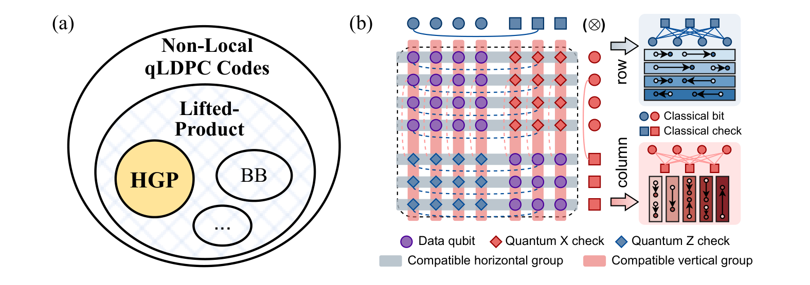

**图 1：动机。** (a) 乘积构造是许多高码率 qLDPC 码族的基础，这里以 HGP 码为主要示例。(b) 在与乘积结构对齐的中性原子布局上执行 HGP 综合征提取。紫色圆点表示数据量子比特原子；红色／蓝色菱形表示 $X/Z$ 校验辅助原子。每个经典种子码沿一个乘积坐标复制，形成水平组（灰色）与竖直组（粉色）。右侧面板给出相应的一维行／列子问题；短条表示一份含重排步骤的一维执行计划。相容的组可以并行执行。

图中文字：`Non-Local qLDPC Codes` 为“非局域 qLDPC 码”，`Lifted-Product` 为“提升乘积”，`Data qubit` 为“数据量子比特”，`Quantum X/Z check` 为“量子 $X/Z$ 校验”，`Classical bit/check` 为“经典比特／校验”，`Compatible horizontal/vertical group` 为“相容水平／竖直组”，`row/column` 为“行／列”。

与几何局域的拓扑码不同，重要的 qLDPC 码在执行综合征提取时需要超出最近邻连接的非局域量子比特相互作用。中性原子阵列已成为满足这一要求最有希望的平台之一。通过把单个原子俘获在可重构的光镊阵列中，这类系统可借助物理原子重排提供动态的长程连接 [4, 16, 31]。近期实验已展示包含数千量子比特的处理器 [23, 25, 27]，使这一平台处于大规模量子计算的前沿。

然而，原子重排的灵活性也给 QEC 的高效执行、尤其是综合征提取，带来了严峻的编译挑战。声光偏转器（acousto-optic deflector, AOD）的物理控制约束，使得重排综合即使在一维也成为可证明 NP-hard 的组合问题 [18, 20]。为应对这种复杂性，现有通用编译流程往往不得不把重排问题拆成彼此分离的放置与路由阶段，而这两个阶段会过早收敛到局部极小值 [21, 35, 41]。对许多 qLDPC 实例而言，即使采用使电路深度近乎最优的调度 [41]，通用编译所得的方案仍可能比本文高度优化的方案慢 40 倍以上（见第 4.2.1 节）。重排是执行时长的主导部分，因此次优的重排会直接限制量子处理器的时钟速率。

另一些研究利用特定对称性，为特定码设计布局，并在受限的模式下实现高效重排 [22, 44, 45, 47, 52]；然而，这些方法无法推广到不满足其假设的实例，包括本文研究的实例。更广泛的 qLDPC 码类别仍拥有庞大的设计空间，有待探索。

在这一图景中，许多重要 qLDPC 码族有一个显著的结构共性：它们由经典分量码的广义乘积构造而来 [5, 26, 42]（图 1(a)）。关键在于，乘积构造会把稳定子相互作用自然分解为沿正交维度对齐的独立组。这种分解具有直接的架构意义，因为它决定了综合征提取期间应如何组织并行化双量子比特门。尽管如此，现有框架都未能充分利用这些结构机会来整体综合物理执行；这种综合需要把量子比特映射、门执行和原子重排联合优化。

现有启发式方法只在局部生成重排而缺乏全局协调，因此解的质量受限；即便采用相同的结构分解，渐近最优的局部启发式算法 [50] 在实践中仍可能需要比本文所得精确深度最优解多至 $9\times$ 的重排步骤（见第 4.2.2 节）。

本文提出 ONEX（**O**ptimal dimensional **N**eutral-atom **Ex**ecution compiler，最优维度中性原子执行编译器），这是一套面向中性原子阵列上可扩展高码率量子纠错的架构与编译协同设计框架。ONEX 利用乘积 qLDPC 码族的结构，把稳定子相互作用自然分成两个独立组，并将它们直接映射到 AOD 的笛卡尔控制轴上；图 1(b) 以 HGP 码 [42] 为例说明了这一点。

我们的核心洞见是：这种对应关系允许把复杂的二维物理执行规划分解成正交、并行且可最优求解的一维子问题，从而把编译复杂度由 $\mathcal O(2^{n^2})$ 降至 $\mathcal O(2^n)$。这种方法也与近期的实际工作一致：它们把结构可分解性视为超高码率码的一项设计准则 [54]。

我们聚焦于具有乘积结构的 qLDPC 码，这类似于 20 世纪 80 年代超大规模集成电路（VLSI）布局设计选择切片平面规划（slicing floorplan）。切片平面规划虽然只是一般平面规划的一个子集，却具有高效编码和紧凑搜索空间 [37]，常能给出优于一般平面规划的解，因而在实践中得到广泛采用 [49, 53]。

具体而言，本文作出如下贡献：

- **高效的一维执行协议。** 我们把最优一维原子执行规划表述为形式化的 SMT 抽象。相较基线 [50]，该协议给出深度最优解，并将时长改善 $8.4\times$，从而提高时钟速率并抑制错误累积。

- **多阶段编译框架。** 我们开发了一条三阶段流水线，把随时可用求解、移动紧凑化、迭代反馈和多层并行机制集成起来。该框架能够渐进地细化解、按需返回结果，并把墙钟编译时间控制在实用范围内。

- **应用级 QEC 映射与评估。** 我们在中性原子阵列上展示高码率 HGP 存储器架构；相较一维构造式路由算法和通用二维编译器，所得时钟速率分别提高 $3.7\times$–$6.1\times$ 和 $29.8\times$–$42.1\times$。该方法可扩展到超过 2,500 个数据量子比特的码，并普遍改善逻辑错误率。我们还研究了向更广泛 LP 码族的推广，并在近期工作 [6] 的一个实例上加以展示。

- **面向分区式布局的架构适配。** 我们把 ONEX 扩展到分区式布局，并将多种执行策略与现有分区式编译器比较。据我们所知，这是首项分析分区式中性原子处理器在区间与区内 QEC 执行之间权衡的研究。

## 2. 预备知识

本节介绍中性原子硬件模型与结构化量子纠错码；这两者共同构成 ONEX 协同设计方法的动机。

### 2.1. 中性原子量子计算

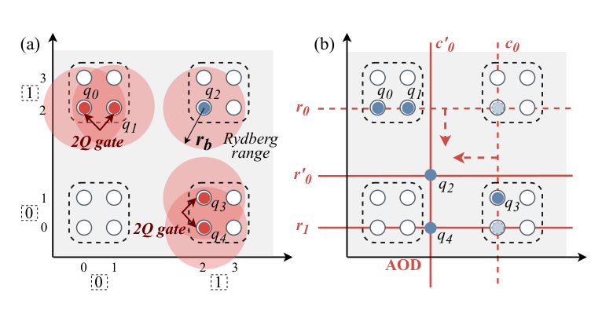

**图 2：中性原子硬件模型。** (a) 二维光镊阵列，其中原子（实点）被俘获在阱（圆圈）中。相邻的一对阱构成相互作用位点（虚线框），可在其中执行 Rydberg 纠缠门。(b) 利用行轴与列轴 AOD 交点传输原子。

图中文字：`2Q gate` 为“双量子比特门”，`Rydberg range` 为“Rydberg 作用范围”；$r_0,r_1$ 与 $c_0,c'_0$ 分别表示行、列 AOD 通道。

中性原子量子处理器把单个原子俘获在称为光镊的强聚焦激光束中，并将这些光镊排列成二维网格（图 2(a)）。空间光调制器（spatial light modulator, SLM）生成的静态光镊定义固定阱，而由 AOD 驱动的动态光镊则在阱之间传输原子。

纠缠门通过 Rydberg 阻塞执行：把两个原子放进同一相互作用位点，其中相邻阱位于彼此的照明区内，因而能够执行受控操作 [32]。根据是否设置专用存储区，可把中性原子处理器分成一体式与分区式架构；两类架构分别需要专门的编译工作 [17, 21, 30, 34–36, 38–41, 46]。本文先让 ONEX 聚焦于一体式情形，再在第 5 节讨论如何适配分区式布局。

图 2(b) 给出 AOD 控制几何。每个 AOD 通道沿单一轴（行或列）偏转原子，移动阱形成于活跃行、列通道的交点。共享同一通道的所有原子同时移动，而多个 AOD 之间的协调施加了严格的不交叉约束。具体而言，同一维度的 AOD 通道（例如 $r_0$ 与 $r_1$）不能相互穿越。这条保持顺序的规则可防止原子受热。正是这一要求把中性原子重排与一般置换区分开来，并成为问题组合复杂性的主要来源。

门阶段之间的原子重排带来两类主要代价。执行深度统计离散重排步骤数；每个步骤都由三阶段序列组成：

1. **激活（activate）：** 原子从静态 SLM 阱转移到动态 AOD 控制网格，从而允许相应移动；

2. **移动（move）：** 所有原子并行移动到目标位置，时长由最大位移决定；

3. **停用（deactivate）：** 原子转移回静态 SLM 阱。

深度越大，原子转移越频繁，原子损失与退相干的概率也越高。此外，物理执行时长包含重排与门操作的总墙钟时间，而其中又以每个周期的物理位移为主。这一时长直接决定处理器的时钟速率以及传输期间累积的空闲错误；因此，对高保真、大规模计算而言，最小化它至关重要。

### 2.2. 结构化量子纠错

容错量子计算需要用 QEC 保护逻辑信息免受物理噪声影响。稳定子码 $[\![n,k,d]\!]$ 通过指定一组稳定子生成元，把 $k$ 个逻辑量子比特编码到 $n$ 个物理量子比特中，并具有码距 $d$ [7, 15]。每一轮综合征提取都通过校验量子比特与数据量子比特之间的一系列双量子比特纠缠门，测量每个稳定子。

qLDPC 码是一类稳定子码，其中每个稳定子仅作用于有界数量的量子比特，而每个量子比特也仅参与有界数量的稳定子。这种稀疏性使每轮综合征提取只需 $\mathcal O(n)$ 个门，因而使这类码适合可扩展 QEC。

HGP 码 [19, 42] 从两个经典种子码
$H_1\in\mathbb F_2^{r_1\times n_1}$ 与 $H_2\in\mathbb F_2^{r_2\times n_2}$ 通过如下乘积构造量子码：

$$
\mathcal H_X=\bigl[\,H_1\!\otimes\! I_{n_2}\;\big|\;I_{r_1}\!\otimes\!H_2^{\mathsf T}\,\bigr],\qquad
\mathcal H_Z=\bigl[\,I_{n_1}\!\otimes\!H_2\;\big|\;H_1^{\mathsf T}\!\otimes\!I_{r_2}\,\bigr].
\tag{1}
$$

所得码同时具有高码率、大码距与有界权重稳定子，因此相较表面码具有更有利的开销扩展关系 [50]。

这种分解可以直接从式 (1) 读出。把两个 HGP 数据量子比特块分别记作 $q^A_{j,\ell}$，其中 $(j,\ell)\in[n_1]\times[n_2]$；以及 $q^B_{i,m}$，其中 $(i,m)\in[r_1]\times[r_2]$。把 $X$、$Z$ 校验辅助量子比特分别记作 $x_{i,\ell}$ 和 $z_{j,m}$。非零矩阵元恰好诱导出四类边：

$$
H_1(i,j)=1\Rightarrow
\bigl\{(x_{i,\ell},q^A_{j,\ell}),(z_{j,m},q^B_{i,m})\bigr\},
$$

$$
H_2(m,\ell)=1\Rightarrow
\bigl\{(x_{i,\ell},q^B_{i,m}),(z_{j,m},q^A_{j,\ell})\bigr\}.
$$

前两种关系是在固定 $\ell$ 或 $m$ 时 $H_1$ Tanner 图的副本；后两种关系则是在固定 $i$ 或 $j$ 时 $H_2$ Tanner 图的副本。因此，每条综合征提取边都固定一个乘积坐标、只让另一个坐标变化；不存在对角支撑的边。把这些指标集放进图 1(b) 的四个象限，就会把 $H_1$ 边映射成水平一维子问题，把 $H_2$ 边映射成竖直一维子问题。

这种精确的边划分而非启发式图切分，正是让 ONEX 能够独立求解每个一维子问题、并在笛卡尔 AOD 几何上组合行／列阶段的结构保证。相关的乘积形式码族——包括一般 LP 码 [26]——也具有类似的因子化结构。为具体且简明起见，本文聚焦 HGP 码；不过，ONEX 的方法对这些码也有更广泛的适用性，可以把类似的底层乘积结构作为关键子程序处理。第 6 节将通过一个代表性案例加以讨论。

## 3. 概览

本节概述 ONEX：它包括一套架构协议，可用一系列一维执行计划在中性原子处理器上综合布局；还包括一条多阶段优化流水线，用来产生经过优化的深度最优解。

### 3.1. 架构协议

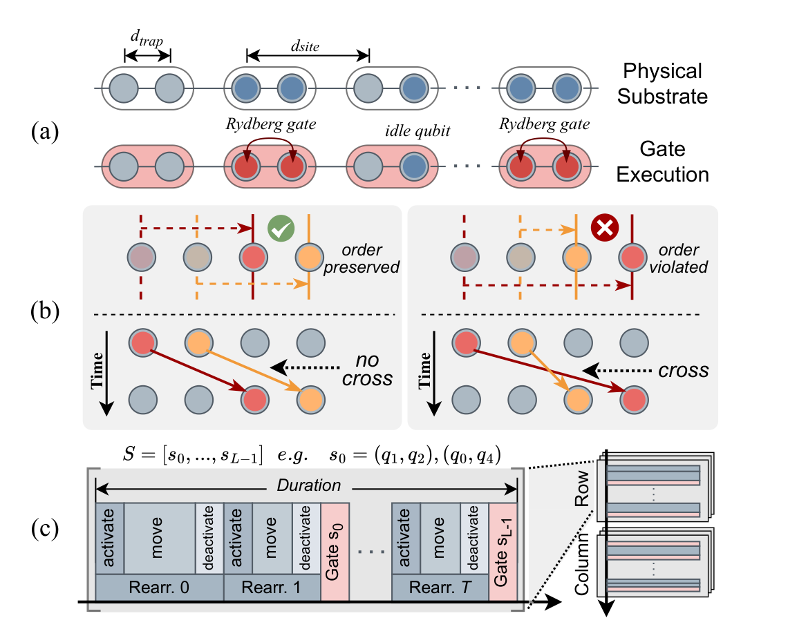

**图 3：一维物理执行的架构协议。** (a) 一维相互作用模型：门所对应的量子比特对共处同一位置以执行 Rydberg 门，而空闲量子比特彼此隔离。(b) 不交叉约束：同时发生的 AOD 移动必须保持原子顺序。(c) 执行时间线：重排步骤与已调度的门阶段交错，并在乘积码执行中沿行／列组合。

图中文字：`Physical Substrate` 为“物理基底”，`Gate Execution` 为“门执行”，`idle qubit` 为“空闲量子比特”，`order preserved/violated` 为“顺序保持／被破坏”，`no cross/cross` 为“不交叉／交叉”，`Duration` 为“时长”，`activate/move/deactivate` 为“激活／移动／停用”，`Rearr.` 为“重排”，`Row/Column` 为“行／列”。

乘积结构 qLDPC 码与正交中性原子控制天然相容。受此启发，我们把每个乘积因子分解成一份一维原子执行计划，其中包含沿行方向或列方向进行的一系列一维重排和门操作。把二维化简为一维，大幅降低了约束空间的复杂度。再加上问题规模缩小 $\mathcal O(n^2)$，这种变换使我们能够得到每个子问题的深度最优解，并由此定义形式化的一维执行协议。

图 3(a) 描绘了该协议的物理基底和相互作用模型。量子比特被俘获在一维阵列中，每一对相邻阱都定义一个相互作用位点。在利用 Rydberg 阻塞产生纠缠时，共处同一位点的任意两个量子比特相互作用并执行双量子比特门。第 2.1 节详述的中性原子硬件核心不交叉约束，在一维协议中得到降维简化（图 3(b)）。

与以往研究 [21, 41, 46] 中复杂的二维协调不同，一维重排只要求共同移动的原子不能相互超越。形式地说，同一时间步内移动的任意两个原子，都必须保持其相对空间顺序。

图 3(c) 左侧展示执行时间线。给定输入门调度——即一列有序的并行门阶段——ONEX 会产生一份有效的执行计划，指定每个时间步所需的原子重排，并把这些重排与门操作交错排列。重排步骤把目标量子比特聚到一起后，再执行双量子比特门。总执行时长是重排与门操作时长之和，其中以前者为主。

利用正交分解，这些导出的一维物理执行计划可以自然扩展到乘积 QEC 码的二维架构。具体而言，该协议先为一个因子并行执行所有逐行的一维重排，再进入另一因子的逐列阶段；前文图 1(b) 已对此作出说明，图 3(c) 右侧则给出执行方式。

尤为重要的是，该协议在量子比特放置方面的灵活性揭示了一项更深层的架构洞见：ONEX 不只是生成重排调度，还会主动探索 QEC 码到物理硬件的映射。该表述同时优化量子比特到阱的指派与由此产生的重排，把物理映射和逻辑相互作用模式作为同一个统一规划问题来处理。这种集成式协同优化捕捉到了以往仅关注孤立移动启发式方法的工作经常忽略的一项关键优势。

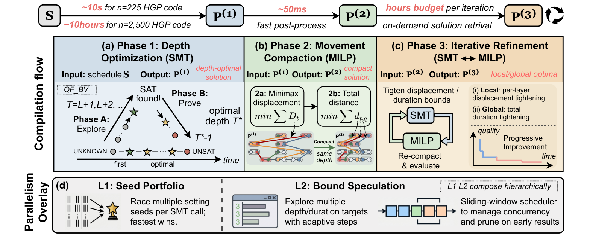

**图 4：ONEX 编译流水线概览，重点标出运行时数据流。** (a) 通过 SMT 优化深度。(b) 通过 MILP 实现移动紧凑化。(c) 带反馈回路的迭代细化。(d) 并行机制叠加层。

图中文字：`Compilation flow` 为“编译流程”，`Phase 1/2/3` 为“阶段 1/2/3”，`Depth Optimization` 为“深度优化”，`Movement Compaction` 为“移动紧凑化”，`Iterative Refinement` 为“迭代细化”，`Parallelism Overlay` 为“并行机制叠加层”，`Seed Portfolio` 为“种子组合”，`Bound Speculation` 为“边界推测”，`Progressive Improvement` 为“渐进式改善”。SAT、UNSAT 与 UNKNOWN 保留求解器结果记号。

### 3.2. 编译流水线

物理执行时长决定中性原子处理器的时钟速率。然而，优化该时长涉及重排深度、组合拓扑与物理位移之间的复杂耦合，因而无法实用地一步完成。为解决这一问题，ONEX 接收门调度作为输入，并通过三个连续阶段把它变成经过充分优化的物理执行方案；各阶段有不同的优化重点，并采用不同的算法技术。

输入门调度由边着色导出，使电路深度接近最优 [41]。为进一步加速编译，这些阶段还配有两层并行机制，以确保实际可用性。图 4 给出完整流水线：主流程包含三个优化阶段，下方叠加并行机制。多阶段运行时剖面体现出渐进式细化策略：代价更高但粒度更细的优化放到较后阶段执行，从而为随时可用求解与按需返回解提供稳健基础。

**阶段 1：通过 SMT 优化深度。** 深度是决定执行时长的关键因素，因此我们首先优化协议深度 $T$，即离散时间步总数。为利用现代 SMT 求解器的推理能力，我们把物理执行规划表述成一个无量词位向量（quantifier-free bit-vector, QF_BV）可满足性实例 [9, 39]，再用双向深化搜索最小深度 $T^*$。

如图 4(a) 插图所示，该搜索沿两个方向进行：先向上探索，以递增深度快速试探一个可满足指派；再向下证明，通过证明 $T^*-1$ 不可行来验证最优性。因此，阶段 1 产生可证明深度最优的执行计划；它有利于把并行重排步骤数最大化，相较基线将执行时长缩短 80% 以上。阶段 1 的具体表述见附录 A.1。

**阶段 2：通过 MILP 实现移动紧凑化。** 深度最优解最大化了并行度，但没有考虑物理距离。阶段 2 对阱—位点指派进行紧凑化，首先最小化每个重排步骤中的最大物理位移，其次最小化所有量子比特的总位移。

这些目标与混合整数线性规划（mixed-integer linear programming, MILP）求解最小最大问题的优势十分契合，因此阶段 2 使用图 4(b) 所标出的 MILP 表述。每次紧凑化所得解的总位移比阶段 1 输出再缩小 11%–16%。关键在于，MILP 会保留已发现的拓扑，从而在维持深度最优性的同时显著降低问题本身的复杂度。阶段 2 的细节见附录 A.2。

**阶段 3：通过反馈迭代细化。** 阶段 1 和 2 以馈送方式工作：SMT 求解器找到一个深度最优的组合拓扑，MILP 再将它压紧。然而，在可能极其庞大的深度最优拓扑空间中，有些拓扑天然比另一些更容易紧凑化。

阶段 3 借助图 4(c) 所示的迭代反馈回路来弥合这一差距：它交替地 (a) 收紧 SMT 表述中的物理位移或时长上界，(b) 用 MILP 重新紧凑化所得解。这种细化还能把时长再缩短至多 27%。具体采用两种策略：(1) **局部时长收紧**识别当前瓶颈重排步骤并降低其最大位移上界，直到无法进一步改善为止；(2) **全局时长收紧**把总时长直接编码进 SMT 表述，并自适应地收紧该上界直到收敛。阶段 3 的细节见附录 A.3。

**表 1：高码率 HGP 码展示。** 比较 Xu 等 [50]、Enola [41] 与本文方法。时钟速率指综合征提取频率 $1/\text{时长}$（Hz）。对深度，$\Delta=\text{基线}/\text{本文}$；对时钟速率，$\Delta=\text{本文}/\text{基线}$。

|  $n$ | Xu 等深度 |    $\Delta$ | Enola 深度 |     $\Delta$ | 本文深度 | Xu 等时长 (ms) | Enola 时长 (ms) | 本文时长 (ms) | Xu 等速率 (Hz) |    $\Delta$ | Enola 速率 (Hz) |     $\Delta$ | 本文速率 (Hz) |
| ---: | -----: | ----------: | -------: | -----------: | ---: | ----------: | ------------: | --------: | ----------: | ----------: | ------------: | -----------: | --------: |
|  225 |     96 | $8.0\times$ |      366 | $30.5\times$ |   12 |       13.34 |         88.13 |      2.20 |       74.97 | $6.1\times$ |         11.35 | $40.1\times$ |    455.23 |
|  625 |    108 | $6.8\times$ |      450 | $28.1\times$ |   16 |       17.13 |        133.90 |      4.50 |       58.39 | $3.8\times$ |          7.47 | $29.8\times$ |    222.46 |
| 1225 |    112 | $7.0\times$ |      568 | $35.5\times$ |   16 |       20.20 |        200.12 |      5.18 |       49.52 | $3.9\times$ |          5.00 | $38.6\times$ |    192.99 |
| 2500 |    126 | $7.0\times$ |      684 | $38.0\times$ |   18 |       24.39 |        280.36 |      6.66 |       41.01 | $3.7\times$ |          3.57 | $42.1\times$ |    150.10 |

**并行机制叠加层。** 除三阶段流水线外，ONEX 还利用两层并行机制缩短编译墙钟时间，图 4(d) 对此作了总结。种子组合并行（L1）让每次 SMT 调用的多个随机种子变体相互竞速，以利用运行时间固有的差异。边界推测并行（L2）同时探索多个深度或时长目标，并由滑动窗口调度器管理。

该调度器会动态剪除因较早结果而变得无关或不可行的候选项，从而加快收敛。这两种机制按层级组合，每个实例内部同时采用种子组合与边界推测。单种子情形还利用增量求解，在迭代之间保留已学习子句。编译时并行机制的细节见附录 A.4。

## 4. 评估

### 4.1. 实验设置

ONEX 以 Python 实现，核心编译流水线建立在两个求解器后端之上。基于 SMT 的阶段通过 Python API 调用 Z3 求解器 v4.16.0 [9]；基于 MILP 的紧凑化阶段由 SciPy v1.14.1 中的 HiGHS 求解 [43]。在 QEC 评估中，我们用 Stim v1.15.0 [12] 模拟综合征提取电路，并用置信传播加有序统计译码（belief propagation plus ordered-statistics decoding, BP-OSD）译码器 [28, 29] 译码综合征。所有实验都在一台配有 2.4 GHz、192 核 AMD EPYC 9654 处理器的服务器上进行；每个 SMT 实例最多分配 5 GB 内存。

**基准。** 我们沿用先前工作 [50] 的方法，在两类基准上评估 ONEX。对高码率 HGP 码应用，采用参数良好的现有超图乘积码，码规模从 $[\![225,9,4]\!]$ 到 $[\![2500,100,12]\!]$。对一维物理执行分析，则从随机生成的经典 $(3,4)$-正则 Tanner 图出发，用边着色构造门调度。这类 Tanner 图定义变量节点与校验节点之间的二部连接，并广泛用于 qLDPC 码综合征提取模式。

**基线。** 我们与 Xu 等 [50] 的先进启发式方法比较；该方法适用于任意一维重排，深度按 $\mathcal O(\log n)$ 扩展。由于本文架构模型采用一体式布局，我们还与 Enola [41] 比较；Enola 是专门为类似调度下的二维一体式布局综合设计的领先编译器。为公平起见，所有基线和本文方法都在同一种中性原子阵列架构上评估：对每个维度上的 $N$ 量子比特子问题，每行或每列设置 $N$ 个相互作用位点。

**物理模型与参数。** 重排时长由式 (3) 的运动学模型给出。我们采用文献 [3, 21] 的物理参数：Rydberg 纠缠门时长 $t_{\mathrm{gate}}=0.36\,\mu\mathrm{s}$，阱转移时间 $t_{\mathrm{transfer}}=15\,\mu\mathrm{s}$，原子加速度 $\alpha=2.75\times10^{-3}\,\mu\mathrm{m}/\mu\mathrm{s}^2$，位点间距 $d_{\mathrm{site}}=12\,\mu\mathrm{m}$，位点内阱间距 $d_{\mathrm{trap}}=2\,\mu\mathrm{m}$。

整个综合征提取周期的时长是评价编译质量的主要指标，并直接决定容错操作的时钟速率与错误预算。具体而言，我们沿用文献 [50] 的电路级噪声模型和非空闲错误信道，并把原子重排期间累积的空闲错误建模为门错误 $p_g$ 的线性近似：

$$
p_i=\frac{t_{\mathrm{rearrange}}}{T_c}\frac{p_g}{p_0},
$$

其中 $T_c=10\,\mathrm{s}$ 是原子相干时间，而 $p_0=0.005$ 是文献 [10] 展示的当前 CZ 门不保真度。

### 4.2. 主要结果

#### 4.2.1. 高码率 HGP 码应用

我们用 ONEX 编译映射到中性原子阵列上的 HGP 码完整综合征提取周期，码参数从 $[\![225,9,4]\!]$ 到 $[\![2500,100,12]\!]$。

表 1 比较高码率 HGP 码展示中的关键性能指标。相较 Enola 的通用二维编译，ONEX 在所有码规模上把执行深度缩小 $28.1\times$–$38.0\times$。即便已经进行维度分解，ONEX 相较 Xu 等的渐近一维构造算法仍把深度缩小 $6.8\times$–$8.0\times$，使综合征提取周期降至个位数毫秒。绝对时长差距也随码规模增大：从 $n=225$ 时的 $11.1\,\mathrm{ms}$ 增至 $n=2{,}500$ 时的 $17.7\,\mathrm{ms}$；这反映了 ONEX 近恒定深度解相较基线对数扩展深度的优势日益扩大。

关键在于，周期时长缩短会直接转化为量子处理器更高的时钟速率：相较以路由为中心的 Xu 等算法提高 $3.7\times$–$6.1\times$，相较 Enola 的通用解提高 $29.8\times$–$42.1\times$。这些结果证实，在中性原子架构上，以全局视角和码性质协同优化原子重排，可以显著提升 FTQC 性能；这里重排占综合征提取时长的 99% 以上。这种感知乘积结构的协同优化能够自然推广到 HGP 码之外，第 6 节稍后的代表性案例将作说明。

在扩展性方面，通过分解行、列子问题，ONEX 让计算代价只取决于一维问题规模，而非量子比特总数。借助这种分解，它能在数小时内高效编译超过 2,500 个数据量子比特的系统（第 4.4 节）；对于一次性的离线 QEC 流程，这一运行时间完全可以接受。

#### 4.2.2. 一维物理执行分析

除了特定 HGP 码应用，我们还在一维物理执行子程序上评估 ONEX，以分析它在不同规模与拓扑上的性能。表 2 汇总 Xu 等基线 [50]、领先的二维一体式编译器 Enola [41] 与 ONEX 在五种基准规模上的比较。

**表 2：一维物理执行质量比较。** 比较 Xu 等 [50]、Enola [41] 与本文方法；$\Delta=\text{基线}/\text{本文}$。

| 规模 | Xu 等深度 | $\Delta$ | Enola 深度 | $\Delta$ | 本文深度 | Xu 等时长 (ms) | $\Delta$ | Enola 时长 (ms) | $\Delta$ | 本文时长 (ms) |
|---:|---:|---:|---:|---:|---:|---:|---:|---:|---:|---:|
| 14 | 30.4 | $7.6\times$ | 14.4 | $3.6\times$ | 4.0 | 3.74 | $8.0\times$ | 2.05 | $4.4\times$ | 0.47 |
| 21 | 37.0 | $9.0\times$ | 18.2 | $4.4\times$ | 4.1 | 4.98 | $8.9\times$ | 3.06 | $5.5\times$ | 0.56 |
| 28 | 37.0 | $8.6\times$ | 21.9 | $5.1\times$ | 4.3 | 5.57 | $8.3\times$ | 4.34 | $6.5\times$ | 0.67 |
| 35 | 41.0 | $8.7\times$ | 24.5 | $5.2\times$ | 4.7 | 6.37 | $8.6\times$ | 5.39 | $7.3\times$ | 0.74 |
| 42 | 42.5 | $8.5\times$ | 29.2 | $5.8\times$ | 5.0 | 7.06 | $8.4\times$ | 7.31 | $8.7\times$ | 0.84 |
| $\Delta$ 平均值 | — | $8.5\times$ | — | $4.8\times$ | — | — | $8.4\times$ | — | $6.5\times$ | — |

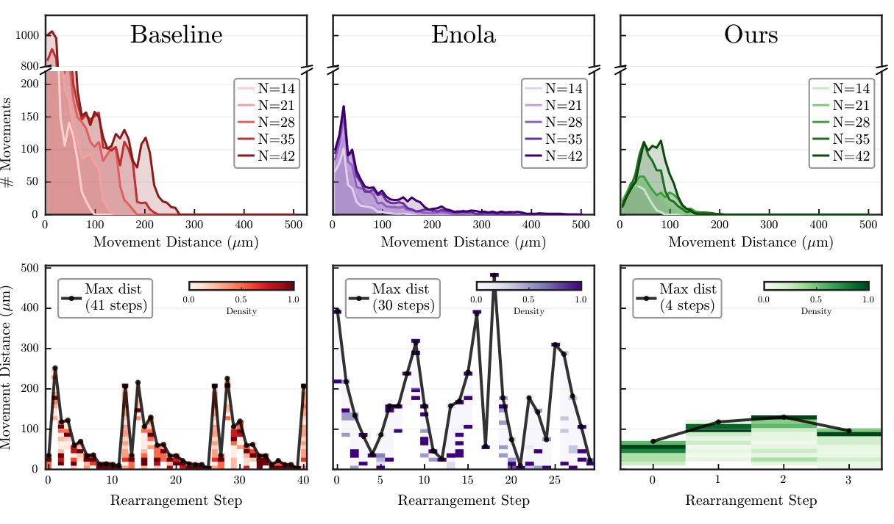

**图 5：Xu 等基线、Enola 与本文方法在一维执行基准上的移动剖面。** 上排：所有问题规模上的单原子位移距离分布。下排：一个代表性 $N=42$ 实例的逐步移动剖面；颜色强度表示给定距离处的移动密度，黑色包络线描出每步的最大位移。

图中文字：`Baseline/Enola/Ours` 为“基线／Enola／本文”，`# Movements` 为“移动次数”，`Movement Distance` 为“移动距离”，`Rearrangement Step` 为“重排步骤”，`Max dist` 为“最大距离”，`Density` 为“密度”。

**执行深度。** 最小化重排步骤数 $T$ 是本文编译的核心目标。步骤越少，并行度越高，便能让更多原子同时移动，从而缩短总执行时长。反之，步骤越多，原子转移次数越多，原子损失错误的累积和转移时间开销也越大。

Xu 等的构造算法产生 30–43 个步骤，并随问题规模按 $\mathcal O(\log N)$ 增长。Enola 通过相互分离的放置与路由编译得到 14–29 个步骤。ONEX 在所有受测规模上都得到近乎恒定的 4–5 步深度，相较 Xu 等缩小 86.8%–88.9%。这种近恒定深度来自 ONEX 具有全局视角的 SMT 表述；它能发现并行度最大的拓扑，充分释放同时移动的潜力。值得注意的是，一维子程序的性能差距比完整 HGP 应用还大；后者的多轮综合征提取施加了严格的循环调度约束，我们使用一个轻量求解器来处理返回初始放置的问题。

**执行时长。** 执行时长是主要性能指标，它决定操作之间的间隔，并直接规定中性原子系统的时钟速率。在所有规模上，ONEX 相较 Xu 等基线加速 $8.0\times$–$8.9\times$，相较 Enola 加速 $4.4\times$–$8.7\times$。这种缩短直接转化为更高时钟速率，缓解架构瓶颈并提高执行效率。此外，它还减轻空闲噪声与原子损失，从而提升系统总体保真度。

执行时长的大幅缩短同时来自深度降低与移动距离紧凑化。图 5 用位移分布（上排）和代表性实例的逐步移动剖面（下排）说明这一点。上排清楚显示不同方法分配位移的差异：Xu 等基线包含大量低于 $100\,\mu\mathrm m$ 的短距离移动；Enola 减少了移动次数，却产生超过 $400\,\mu\mathrm m$ 的重尾；ONEX 的分布则很紧凑，集中在 $150\,\mu\mathrm m$ 以下且没有重尾。

下排揭示了为何只降低深度仍可能不够。Enola 虽把深度从 41 步降到 30 步，每步最大位移却从 $252\,\mu\mathrm m$ 跃升至 $482\,\mu\mathrm m$；其关键路径位移表明，这些长程穿梭并未得到良好组织以相互重叠，因而完全抵消了深度收益。相比之下，ONEX 在控制最大位移的同时把调度压缩至 4 步，使总时长相较 Xu 等改善 $7.8\times$、相较 Enola 改善 $8.8\times$，显示出联合优化深度与位移的有效性。

### 4.3. 消融研究

#### 4.3.1. 流水线各阶段的贡献

为分离编译各阶段的贡献，我们评估 ONEX 流水线每一阶段的中间输出：阶段 1（SMT 深度优化）、阶段 2（MILP 移动紧凑化）、阶段 3.1（局部时长收紧）以及阶段 3.2（全局时长收紧）。

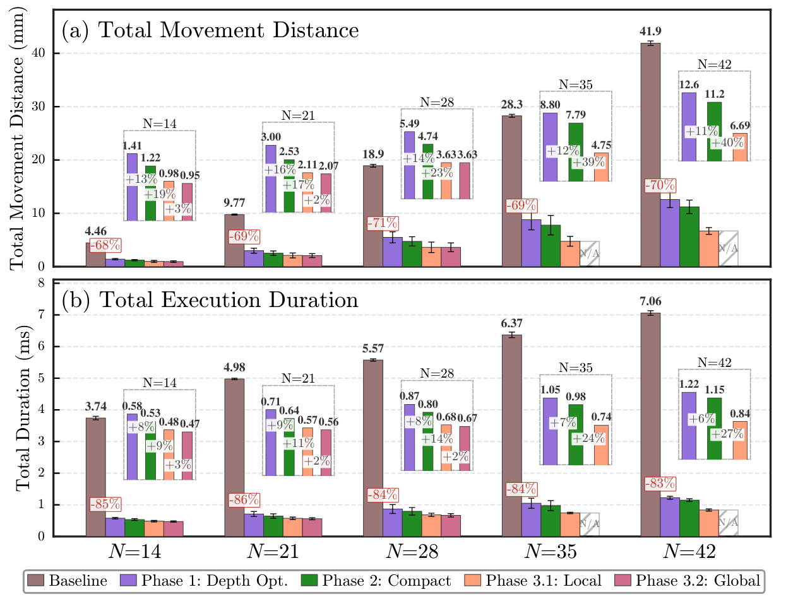

**图 6：流水线阶段贡献。** (a) 总移动距离；(b) 执行时长。主柱状图在五种问题规模上比较基线与各流水线阶段；插图放大各阶段带来的改善。

图中文字：`Total Movement Distance` 为“总移动距离”，`Total Execution Duration` 为“总执行时长”，`Depth Opt.` 为“深度优化”，`Compact` 为“紧凑化”，`Local/Global` 为“局部／全局”；`N/A` 表示“不适用”。

**位移紧凑化。** 图 6(a) 给出每个流水线阶段之后的总移动距离。凭借深度最优拓扑，阶段 1 已相较 Xu 等基线大幅缩短 68%–71%；它消除了基线递归策略中固有而不必要的长程穿梭。阶段 2 在固定拓扑内重新指派位置，以最小化每个周期的位移，因此再缩短 11%–16%。阶段 3.1 又带来 17%–40% 的改善，尤其在更大规模下，更多状态转换留有收紧空间。

图 6(a) 的插图放大每种问题规模上的流水线阶段，并标出每一步的增量缩减百分比。由此可以看出明确趋势：MILP 紧凑化与局部反馈相互补充；前者在固定拓扑内优化，后者则把 SMT 求解器引向本身更为紧凑的拓扑。

**时长演进。** 图 6(b) 按相同分解方式给出总物理执行时长。其定性模式与移动距离缩短相似，但平方根模型会调制它对时长的具体影响。由于时长对每一步中最长的移动很敏感，总距离与时长能够同步改善，说明 ONEX 的确优化了瓶颈移动，而非只改善平均情形指标。

实验结果显示，阶段 3.2 的全局搜索对距离与时长都只带来很小的进一步缩减。这验证了前述局部搜索的有效性：它与全局最优值之间只留下很窄的最优性间隙。此外，全局搜索运行开销很高而收益有限，凸显了在更大规模上直接做全局优化的固有困难，也证实高效馈送方法在实践中不可或缺。

#### 4.3.2. 表述分解

除了编译流水线本身，我们还在相同的维度分解下进一步分离 ONEX 问题表述所作的贡献。

为此，我们在 Xu 等方法上构造一个求解器增强基线：把它的构造算法替换成 SMT 与 MILP 求解，但保留其局部、以路由为中心的表述。与之相对，ONEX 把编译视为全局优化问题，联合探索量子比特映射、放置和重排，以优化完整执行计划。

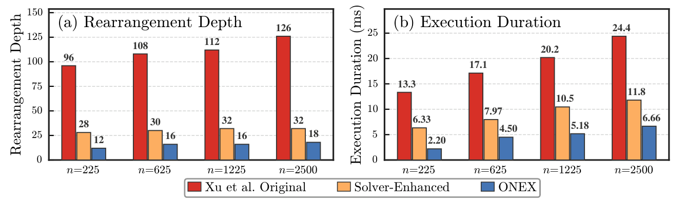

**图 7：问题表述贡献的分解。** (a) 重排深度；(b) 执行时长。柱状图在四个 HGP 码上比较 Xu 等的构造式基线、没有全局表述的求解器增强基线，以及 ONEX。

图中文字：`Rearrangement Depth` 为“重排深度”，`Execution Duration` 为“执行时长”，`Xu et al. Original` 为“Xu 等原始方法”，`Solver-Enhanced` 为“求解器增强”。

图 7 给出这种表述层面的解质量分解。只采用局部最优求解，求解器增强基线相较原始基线便已在深度上改善 $3.43\times$–$3.94\times$、在时长上改善 $1.93\times$–$2.15\times$。ONEX 相较这一增强基线又在深度上改善 $1.78\times$–$2.33\times$、在时长上改善 $1.77\times$–$2.88\times$。这种乘法式分解表明，基于求解器的优化与全局问题表述都对最终解质量作出显著且互补的贡献。

### 4.4. 扩展性分析

我们通过两个实验分析扩展性：编译时间随问题规模的变化，以及反馈阶段解质量的收敛行为。由于基于 MILP 的紧凑化始终能在 100 ms 内结束，扩展性分析聚焦于阶段 1 的求解时间和反馈过程。

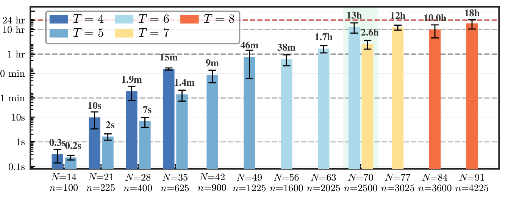

**图 8：阶段 1 求解时间与问题规模 $N$ 的关系。** 下方标签给出相应 HGP 数据量子比特数 $n$；每组柱表示不同执行深度 $T$。虚线标出参考时间预算。

图中文字中的 `s`、`m`、`h` 分别表示秒、分钟、小时；右侧绿色阴影标出 $N=70$、$n=2500$ 附近的实际编译边界。

**编译时间与问题规模。** 图 8 报告了一维问题规模从 $N=14$ 到 $N=91$ 时，在不同深度获得可行解所需的阶段 1 求解时间；这些规模对应 100 至 4,225 个量子比特的 HGP 码。正如 NP-hard 组合问题表述所预期，编译时间随问题规模呈指数增长。

实际编译边界约为 $N=70$（HGP $n=2{,}500$），此时深度 $T=6$ 的解平均需要 12.8 小时；在 $N=91$（HGP $n=4{,}225$）时，不使用推测并行编译的 $T=8$ 解平均需要 17.6 小时。然而，由于 QEC 编译是一次性离线任务，为获得更高质量的解，这些时间尺度可以接受。在实际应用中，ONEX 的随时可用求解性质与推测并行也能缓和这种指数增长，帮助更快返回首个解。

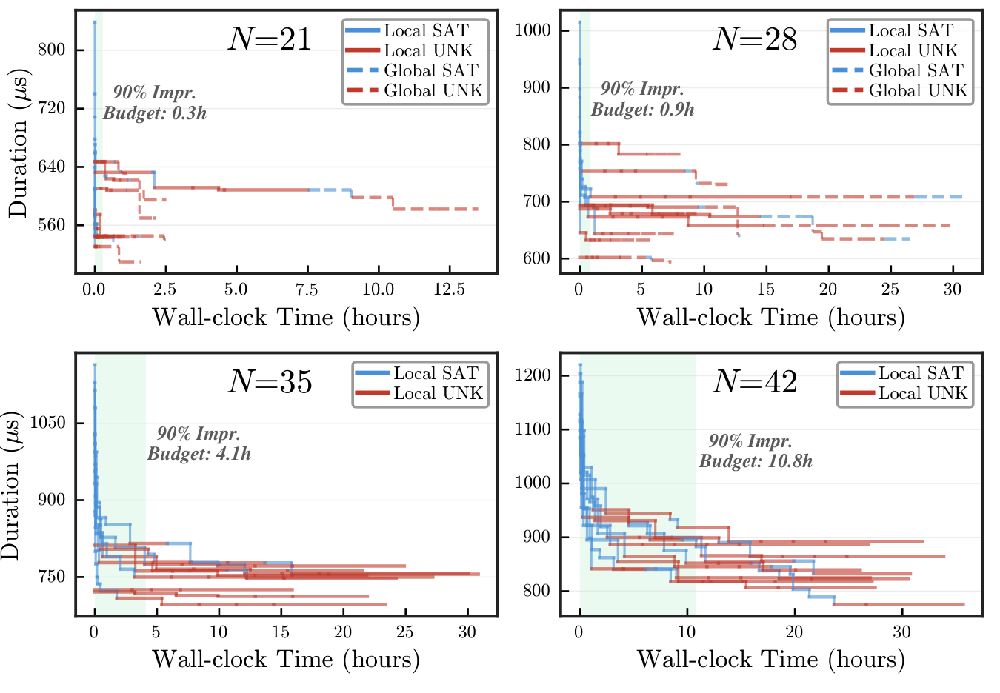

**图 9：四种问题规模（$N=21$–$42$）在反馈阶段中的解质量演进，并按求解器结果分解。** 线段颜色编码求解结果（蓝：sat；红：unsat／超时）；线型编码搜索阶段（实线：局部；虚线：全局）。绿色阴影表示各规模达到 90% 改善所需的时间预算。

图中文字：`Duration` 为“时长”，`Wall-clock Time` 为“墙钟时间”，`Local/Global SAT` 为“局部／全局 SAT”，`Local/Global UNK` 为“局部／全局未知或超时”，`90% Impr. Budget` 为“达到 90% 改善的预算”。

**解质量与编译时间。** 图 9 给出四种基准规模上，迭代反馈阶段的物理执行时长如何随墙钟时间变化，并按求解器结果分解每一轮迭代线段。

收敛曲线呈现典型的收益递减形状。局部搜索在反馈过程早期通过一次陡降取得大部分改善。随后的迭代遇到愈发严格的上界，并以 unsat 或超时告终，收益也逐渐缩小。全局搜索主要只在较小规模上提供少量额外收益，因为求解器在这些规模下能于时间预算内完成足够多轮迭代，从而有效探索边界空间。

这种收敛行为进一步证明随时可用策略的时间管理是合理的：它可以尽早获得最显著的改善，同时避开优化平台期的漫长尾部。具体而言，我们计算出达到总收益 90% 的时间预算（绿色阴影），在解质量与编译时间之间给出实用平衡。这些预算只用适中的时间比例就获得总收益的 90%，从 $N=21$ 时的 0.3 小时到 $N=42$ 时的 10.8 小时不等。

## 5. 架构适配：分区式布局

除了主要评估采用的一体式架构，ONEX 还提供了一条自然适配分区式架构 [3] 的路径，与当前中性原子硬件的发展方向相符。

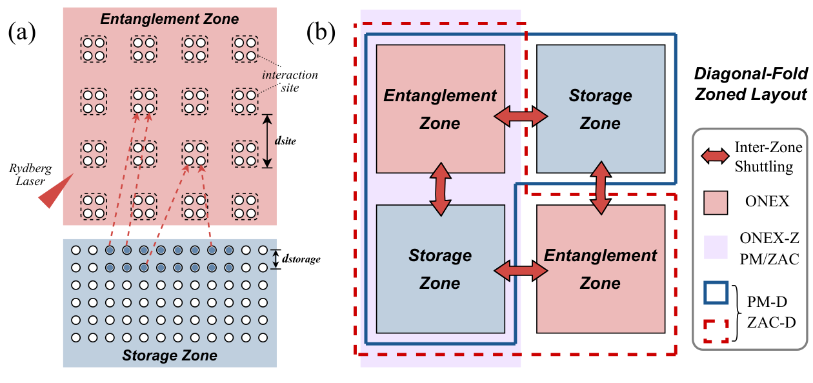

**图 10：分区式中性原子量子计算架构。** (a) 相互分离的纠缠区与存储区。(b) 不同编译策略对应的布局。

图中文字：`Entanglement Zone` 为“纠缠区”，`Storage Zone` 为“存储区”，`Rydberg Laser` 为“Rydberg 激光”，`interaction site` 为“相互作用位点”，`Diagonal-Fold Zoned Layout` 为“对角折叠分区式布局”，`Inter-Zone Shuttling` 为“区间穿梭”。

图 10(a) 展示典型分区式架构，它具有彼此分离的纠缠门区与量子比特存储区。Rydberg 激光仅限于纠缠区，用来激活同一相互作用位点内的量子比特并执行门操作；存储区中的量子比特则密集排列，以最大化容量。

图 10(b) 描绘了本文探索中不同编译策略使用的硬件布局。由于物理基底与执行方向对齐，ONEX 的执行计划无需存储区即可直接应用到纠缠区，因此我们继续以 ONEX 表示这一策略。

为了让 ONEX 适配完整的分区式架构并利用存储区的优势，我们还实现了一种分区式执行策略 ONEX-Z。它把重排映射到高密度存储区，并增加装载与卸载步骤，在存储区和纠缠区之间穿梭量子比特以执行门。

作为基线，我们考虑现有先进分区式架构编译器 PowerMove [30]（PM）与 ZAC [21]；它们依赖启发式方法，在不同区域之间重排量子比特以执行门，从而生成有效的电路执行计划。除了它们原有的通用二维编译流程，我们还把 ONEX 所用的同一种分解策略应用到这些基线，分别记作 PM-D 与 ZAC-D，以分离维度简化的影响。

在这种分解下，我们提出一种新的对角折叠分区式布局，用来原生映射它们的解。每一类区域沿对角线放置，从而可对称地访问两个方向，并直接支持所得一维解。

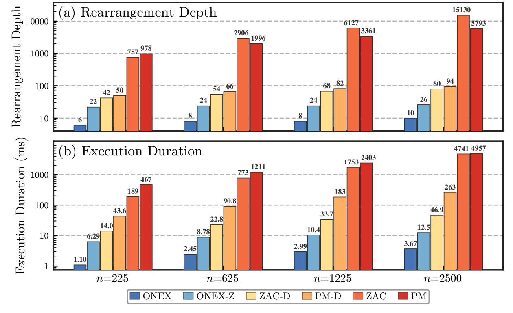

**图 11：分区式架构适配。** (a) 重排深度；(b) 执行时长。两个纵轴都采用对数刻度，虚线标出十倍量级参考线。

图例中的 ONEX、ONEX-Z、ZAC-D、PM-D、ZAC 与 PM 对应正文定义的六种编译策略。

图 11 在不同问题规模上比较上述分区式策略。由于 PM 与 ZAC 原生不支持多轮重排，这里在单轮综合征提取电路上收集结果。相较 PM 与 ZAC 的通用二维分区式编译流程，ONEX 获得显著加速；当问题规模达到 $n=2{,}500$ 时，时长缩短超过 $1{,}000\times$。

借助分解策略和对角折叠布局，PM-D 与 ZAC-D 相较原始版本也获得显著改善，从而证实维度简化与精细布局设计在分区式情形中的有效性。值得注意的是，ONEX 仍分别比 PM-D 和 ZAC-D 快 $37.1\times$–$71.5\times$ 与 $9.3\times$–$12.8\times$；这说明 ONEX 只使用纠缠区仍能生成更优的解。

ONEX 与 ONEX-Z 的比较直接揭示了区内重排与区间穿梭之间权衡的架构洞见。ONEX-Z 利用高密度存储区进行区内重排，相较 ONEX 将移动距离缩短 50% 以上。然而，在区域之间穿梭量子比特所需的额外装载、卸载步骤带来显著开销，使总时长反而比 ONEX 增加 $3.4\times$–$5.7\times$。

这种开销来自两个内在因素。第一，本文的综合征提取电路具有很高的门操作密度，因而需要频繁在区域之间穿梭；采用深度最优解时尤为如此。第二，分解会诱导一种使并行度最大化的分块式放置，限制了把量子比特聚集到区域界面附近的机会，进一步放大穿梭代价。

我们预计，即使计入区间穿梭开销，门密度较低的工作负载仍会更多受益于紧凑的区内重排。分区式执行对保真度的影响超出本文范围，留待后续研究。

## 6. 码的推广：提升乘积码

为进一步展示 ONEX 超越 HGP 码的通用性与可扩展性，我们为一个特定 LP 码给出示例解。该示例采用文献 [6] 中提升大小 $l=45$ 的 $[\![2610,744,d\leq16]\!]$ LP 码 [2]；人们提出它可作为一种很有希望的高码率存储码，支持 Shor 算法的实际应用。据我们所知，此前还没有人给出该码的具体执行策略。

$$
A=
\begin{pmatrix}
x^{29}&x^{21}&x^{31}&x^{15}&x^{37}&x^{25}&x^{27}\\
x^{13}&x^{25}&x^{19}&x^{26}&x^{11}&x^{18}&x^{29}\\
x^{31}&x^{2}&x^{27}&x^{32}&x^{41}&x^{41}&x^{18}
\end{pmatrix}.
\tag{2}
$$

**图 12：LP 码的提升与乘积对齐执行。** (a) 提升间相互作用图连接提升后的数据量子比特、$X$ 校验量子比特与 $Z$ 校验量子比特。(b) 每个多项式项 $x^k$ 都在 $\ell$ 个提升副本之间诱导一次循环移位。(c) 提升后的数据量子比特与校验量子比特在相互作用位点对齐，以并行执行门。(d) 对角停放支持水平、竖直取向布局之间的定向转移。

图中文字：`Data/X Check/Z Check Lift` 为“数据／$X$ 校验／$Z$ 校验提升”，`compatible in-bounds/overflow shift` 为“相容的界内／溢出移位”，`align in the same row` 为“在同一行对齐”，`Gate Execution` 为“门执行”，`Directional Transfer` 为“定向转移”，`to-diagonal/from-diagonal movements` 为“移向／移离对角线”。

简言之，一般 LP 码的执行框架包含四个阶段，图 12 用上述示例加以说明：

1. **(a) 提升间重排。** 从种子基矩阵出发，把每个数据提升或校验提升视为一个调度单元，并通过边着色得到调度。随后把 ONEX 应用于这些单元，确定元层级移动；它们构成 LP 码的提升间重排。

2. **(b) 提升内重排。** 在每个活跃的数据提升内部，使用基矩阵相应的多项式元素执行启发式二维循环移动，由此生成提升内重排。对示例 LP 码 [2]，多项式元素只是单项式，因此可直接映射成一维移位。

3. **(c) 门执行。** 完成提升间与提升内重排后，所有数据量子比特和校验量子比特都在指定位置对齐，以执行门。同 HGP 展示一样，相容组内的门可以并行执行。

4. **(d) 定向转移与重复阶段。** 沿一个维度执行完毕后，把布局转移到另一维度，并重复前三个阶段。在本文示例中，我们采用带对角停放的双层转移方案，使完整布局在水平与竖直维度之间切换。

该框架以层级方式处理提升间与提升内结构，从而反映提升乘积的理论构造。再结合跨乘积维度的分解，它使一般 LP 码拥有可行的执行计划。

在上述框架基础上，我们得到 $[\![2610,744,d\leq16]\!]$ LP 码的一条具体执行流水线，性能估算汇总于表 3。与密集的 HGP 综合征提取不同，该 LP 码示例中反复进行的提升内重排降低了有效门执行密度。因此，分区式执行分别把提升内与提升间重排时间缩短约 46% 和 28%。即使计入额外的区间穿梭开销，ONEX-Z 仍把总周期时长缩短约 10%。

**表 3：$[\![2610,744,d\leq16]\!]$ LP 码的估算执行时间分解。** 所有数值单位均为毫秒。

| 方法 | 总计 | 提升间 | 提升内 | 门 | 转移 | 穿梭 |
|---|---:|---:|---:|---:|---:|---:|
| ONEX | 23.731 | 10.573 | 11.280 | 0.005 | 1.873 | 0 |
| ONEX-Z | 21.405 | 7.560 | 6.060 | 0.005 | 0.996 | 6.783 |

值得注意的是，ONEX 仍是该框架的关键执行骨干，因为它提供核心的提升层级执行计划。LP 码采用层级构造，所以每个孤立的提升层级子问题都远小于同等规模 HGP 码的子问题。问题规模缩小进一步缓解了 ONEX 的扩展压力，同时仍能生成高质量执行计划。

此外，这项探索表明，ONEX 的构成单元本身可以代表复杂的二维模式，而不必只是单个量子比特。这一视角也带来集成更精细提升内设计的机会，第 7 节会进一步讨论。

## 7. 讨论

**与多样码结构的集成。** ONEX 旨在利用众多 qLDPC 码共享的外层乘积结构。因此，面向乘积结构的优化与利用内层码结构的技术——例如循环对称性或群代数正则性 [44, 45, 47]——彼此正交。这些方法作用于码层级的不同层次，优化目标并不冲突。

后续研究的一条自然方向，是把乘积结构分解与感知内层结构的编译组合起来。这种组合式方法可以把适用范围扩展到更广泛的码族，同时保留各组成技术的优势。

有利的内层码结构同时具有密集布局与高效循环重排。以第 6 节的 LP 码为例，每个提升内部的量子比特只沿一个方向相互作用，因此更适合映射到线性布局，而非紧凑的二维区块。这种映射会增大提升内位移，并产生可观的时长开销。相比之下，允许使用密集区块的码能更高效地利用可用空间。

此外，线性布局中基于移位的循环重排，可以用方向相反的两次并行移动实现；更复杂的二维循环则可能需要额外启发式方法或 AOD 资源，才能在相容组之间保持高效重排。

**向容错逻辑操作的推广。** 容错量子计算不仅需要存储器，还需要晶格手术、横向门等逻辑操作来操纵逻辑信息。许多此类操作——尤其是某些乘积码族的手术协议——在门相互作用模式中仍然保留底层乘积结构 [8, 48, 51]。

此外，逻辑操作布局通常不如存储器布局规则，缺少综合征提取中可直接产生并行性的常见循环结构。这种不规则性扩大了朴素执行与优化执行之间的差距，而这恰好是 ONEX 基于求解器的方法最能发挥作用的场景。

因此，把 ONEX 扩展到逻辑操作编译，将有助于更完整地刻画容错编译栈，并展示该框架对各类 FTQC 架构原语的普遍用途。

**对近期架构的适用性。** 本文协议虽然为容错 QEC 而开发，却直接从门调度生成物理执行计划，因而也广泛适用于一般量子电路编译。它能高效管理数十个量子比特，尤其适合噪声中等规模量子（noisy intermediate-scale quantum, NISQ）设备中规模较小的电路。

此外，许多量子算法需要大量重复测量；本文的一维协议可以把电路复制到多行并行执行。对相容物理执行的这种原生支持，能够显著缩短硬件总运行时间，对 NISQ 应用的实际效用而言是一项关键优势。

## 8. 结论

要利用中性原子阵列上的高码率 qLDPC 码扩展容错量子计算，就必须高效编译物理执行计划。本文提出 ONEX：一个面向具有降维性质 qLDPC 码的结构感知编译框架。ONEX 利用乘积结构，把二维物理规划分解成正交的一维子问题，并通过一条实用的多阶段编译流水线得到经过优化的深度最优解。

在多达 2,500 个数据量子比特的 HGP 存储器基准上，ONEX 显著缩短综合征提取周期；相较现有的一维构造式算法和通用二维编译器，其时钟速率分别提高 $3.7\times$–$6.1\times$ 与 $29.8\times$–$42.1\times$。此外，对分区式布局的适配揭示了相关的架构权衡。最后，一个代表性案例把该框架进一步推广到更广泛的 LP 码族。

## 致谢

本工作得到美国国家科学基金会以下项目资助：项目编号 2533041，NQVL:QSTD 第二阶段——ORAQL：开放栈 Rydberg 原子量子计算实验室（Open-Stack Rydberg Atom Quantum Computing Laboratory），这是 DLPQC（项目编号 2410716）的第二阶段延续；以及项目编号 2016245，量子计算挑战研究所（Challenge Institute for Quantum Computation）。

## 附录 A：算法细节

本附录给出 ONEX 编译流水线的形式化问题表述与三个连续优化阶段。我们将介绍深度最优搜索的 SMT 编码（附录 A.1）、移动紧凑化的 MILP 表述（附录 A.2）、细化时长的迭代反馈策略（附录 A.3），以及叠加的多层并行机制（附录 A.4）。

### A.1. 深度最优 SMT 编码

#### A.1.1. 问题陈述

给定 $M$ 个阱上的 $N$ 个量子比特 $\mathcal Q$、$T$ 个离散时间步，以及包含 $L$ 个阶段的门调度 $\mathbf S=[s_0,\ldots,s_{L-1}]$；其中每个阶段 $s_k$ 是一组需要作为并行双量子比特门执行的量子比特对 $\{(u,v)\}$。编译过程应确定：

- **量子比特放置** $\pi_q^t\in\{0,1,\ldots,M-1\}$：量子比特 $q$ 在时间步 $t$ 所在阱的索引。每个阱索引还可以分解为
  $\pi_q^t=2\sigma_q^t+\hat\ell_q^t$，其中 $\sigma_q^t=\lfloor\pi_q^t/2\rfloor$ 是相互作用位点索引，$\hat\ell_q^t=\pi_q^t\bmod2$ 是位点内偏移。

- **执行阶段时刻** $\mathbf t=[t_0,t_1,\ldots,t_{L-1}]$：执行每个门阶段的时间步。

任何有效重排都必须满足以下约束。

1. **单射性：** 任意时间步内，两个量子比特不能占据同一个阱：

   $$
   \forall t,\ \forall q_1\ne q_2\in\mathcal Q:\qquad
   \pi_{q_1}^t\ne\pi_{q_2}^t.
   $$

2. **调度先后关系：** 门阶段必须按给定调度 $\mathbf S$ 指定的顺序执行：

   $$
   \forall k\in\{0,\ldots,L-2\}:\qquad t_k<t_{k+1}.
   $$

3. **门执行：** 成对量子比特必须在已调度时刻共享一个相互作用位点，才能执行纠缠门：

   $$
   \forall t,\ \forall k,\ \forall(u,v)\in s_k:\qquad
   (t_k=t)\Longrightarrow(\sigma_u^t=\sigma_v^t).
   $$

4. **位点互斥性：** 门阶段中，空闲量子比特必须占据不同的相互作用位点，以防发生非预期相互作用。令
   $\mathcal I_k=\mathcal Q\setminus\bigcup_{(u,v)\in s_k}\{u,v\}$ 为阶段 $s_k$ 的空闲量子比特集，则

   $$
   \forall t,\ \forall k,\ \forall i\ne j\in\mathcal I_k:\qquad
   (t_k=t)\Longrightarrow(\sigma_i^t\ne\sigma_j^t).
   $$

5. **保持顺序：** 并行传输时，共同移动的量子比特不能相互穿越。令
   $m_q^t=\mathbf1[\pi_q^t\ne\pi_q^{t+1}]$ 表示 $q$ 在 $t$ 到 $t+1$ 之间发生移动，则

   $$
   \forall t,\ \forall q_i,q_j:\quad
   \bigl(m_{q_i}^t\wedge m_{q_j}^t\bigr)
   \Longrightarrow
   \left(\pi_{q_i}^t>\pi_{q_j}^t\iff
   \pi_{q_i}^{t+1}>\pi_{q_j}^{t+1}\right).
   $$

我们把完整约束集编码为 QF_BV 可满足性问题，以利用现代 SMT 求解器中经过优化的位爆破（bit-blasting）判定过程。

#### A.1.2. 双向深化

我们不求解一个复杂的一次性问题，而是对深度参数 $T$ 做深化搜索，并利用问题的单调结构：如果深度 $T$ 下不存在有效重排，那么任何 $T'<T$ 下也不存在解。我们进行双向搜索，先快速向上寻找一个可行解，再迭代向下搜索最优深度。

具体而言，$L$ 个阶段的深度下界为 $T_{\mathrm{lb}}=L$，因为调度约束要求每个门阶段至少占用一个专门时间步。实践中，我们从 $T=T_{\mathrm{lb}}+c$ 开始，其中 $c$ 是一个较小常数（例如 $c=2$）；采用较短超时不断增大深度，直到返回可行解。之后使用更大时间预算向下深化，寻找更优解或确认最优性。

当求解器返回不可满足，或到达理论下界 $T_{\mathrm{lb}}$ 时，深化过程终止。无论哪种情形，该阶段结束时都会得到包含 $T^*$ 个时间步的深度最优放置 $\mathbf P^{(1)}$ 与阶段时刻 $\mathbf t^{(1)}$。

### A.2. 通过 MILP 实现移动紧凑化

阶段 1 的深度最优解可能因为存在不必要的长距离移动而不是时长最优，如图 13(a) 所示。在本阶段，ONEX 以深度最优解为起点，重新指派阱—位点位置，在保持组合拓扑的同时最小化物理位移；这样既缩小搜索空间，又能高效求解（图 13(b)）。由于时长由最长位移主导，这种紧凑化自然形成一个适合 MILP 求解器的最小最大问题。

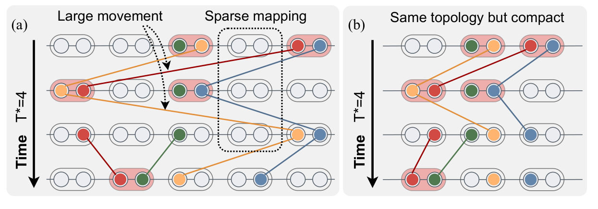

**图 13：ONEX 馈送方式下的示例解演进。** (a) 深度最优的组合拓扑。(b) 物理位移紧凑化。

图中文字：`Large movement` 为“大幅移动”，`Sparse mapping` 为“稀疏映射”，`Same topology but compact` 为“拓扑相同但更紧凑”。

#### A.2.1. 提取不变拓扑

$\mathbf P^{(1)}$ 中有两个关键结构不变量，MILP 必须保留它们。

第一是置换顺序 $\rho^t$，表示在每个时间步 $t$ 按阶段 1 放置排序后的量子比特索引序列。它隐式保持单射性和不交叉性质。

第二是静止模式
$\mathcal S^t=\{q\mid\pi_q^t=\pi_q^{t+1}\}$，表示在每次 $t\to t+1$ 转换中不移动的量子比特集合。该模式可防止引入可能破坏当前相容性的非必要移动。

#### A.2.2. MILP 表述

我们围绕放置变量 $\pi_q^t$（整数）、$\sigma_q^t$（整数）和 $\hat\ell_q^t$（二元变量）构造紧凑化 MILP。为编码最大物理位移，对每次 $t\to t+1$ 转换引入一个连续变量 $D_t$。

除了类似 SMT 编码的基本有效性约束（例如单射性、门执行等），我们还用更具体的置换顺序保持约束与静止约束取代一般不交叉约束，以保持前述不变拓扑。

1. **保持置换顺序：** 对时间步 $t$ 的有序序列中相邻量子比特 $\rho^t(i)$ 与 $\rho^t(i+1)$，要求

   $$
   \pi_{\rho^t(i)}^t-\pi_{\rho^t(i+1)}^t\leq-1.
   $$

   该约束同时保证单射性与不交叉性质。

2. **静止性：** 静止量子比特在转换前后必须留在同一个阱：

   $$
   \forall q\in\mathcal S^t:\qquad
   \pi_q^t=\pi_q^{t+1}.
   $$

紧凑化的目标是移动距离。由于阱间距并不均匀，移动距离不是阱索引差的简单正比函数。量子比特 $q$ 在一次转换中的物理位移，是各分解分量的线性函数；其中 $d_{\mathrm{site}}$ 与 $d_{\mathrm{trap}}$ 分别表示相邻位点间、同一位点两个阱之间的物理距离。我们把每次转换的最大位移约束为

$$
D_t\geq
\left|
d_{\mathrm{site}}\!\left(\sigma_q^t-\sigma_q^{t+1}\right)
+d_{\mathrm{trap}}\!\left(\hat\ell_q^t-\hat\ell_q^{t+1}\right)
\right|,qquad
\forall q\in\mathcal Q,
$$

再把它线性化为两条标准不等式。

该 MILP 进行全面紧凑化：首先最小化整个重排中每次转换最大位移的总和，再把总位移作为次级目标最小化：

$$
O_1=\min\sum_{t=0}^{T-2}D_t,qquad
O_2=\min\sum_{t=0}^{T-2}\sum_{q=0}^{N-1}a_q^t,
$$

其中 $a_q^t$ 是每个量子比特位移的辅助变量，并受第一目标导出的 $D_t$ 上界约束。

注意，MILP 最小化的是线性位移，而非用运动学模型 [21] 计算的实际时长：

$$
\tau_t=2t_{\mathrm{transfer}}+\sqrt{D_t/\alpha}.
\tag{3}
$$

其中 $t_{\mathrm{transfer}}$ 是阱到阱转移的固定时间，$\alpha$ 是加速度参数。因此，我们只在紧凑化确实改善时长时更新解。

### A.3. 通过反馈迭代细化

前两个阶段以馈送方式执行，会在给定的深度最优结构中得到一个紧凑解。然而，在可能极其庞大的深度最优解空间中，有些组合拓扑本身比另一些更适合紧凑化。因此，阶段 3 在 SMT 与 MILP 之间迭代反馈，交替收紧物理上界并重新紧凑化，直到收敛，从而弥合这一差距。

#### A.3.1. 局部时长收紧

该策略迭代识别重排中的瓶颈转换并收紧其位移上界。通过逐步降低最大位移，搜索会被引向更紧凑、时长更短的解。具体而言，对目标转换 $t$，用上限 $\Delta_t^{\max}$ 编码位移界：

$$
\forall q\in\mathcal Q:\qquad
|\pi_q^{t+1}-\pi_q^t|\leq\Delta_t^{\max}.
$$

ONEX 在阶段 1 的基础求解器之上构造局部搜索：只建立一次全部结构约束，之后用增量求解在各轮中加入不同位移约束。这样，求解器能够保留已学习子句和内部启发式状态，避免重复工作。

每一轮中，单调局部搜索选取位移最大的转换，并依据其当前值通过自适应步长函数提出一个更小的上限。为避免重新探索不可行上界，每个转换都维护一个下限，表示迄今已知的不可行界。随后把收紧后的上界增量加入求解器。若结果为 SAT，就记录新解，并将其作为下一轮的基础。

若结果为 UNSAT，则从求解器弹出这个收得过紧的上界约束，并相应抬高其下限。如果已没有可执行的收紧步骤，就在剩余搜索中剪除该转换。当所有转换都已饱和或时间预算耗尽时，循环终止。

#### A.3.2. 全局时长收紧

局部搜索收紧单次转换，可能停在局部极小值；全局搜索则把一个显式上界编码进 SMT 实例，直接瞄准重排总时长。

位向量算术无法直接编码非线性运动学模型 (3)。为绕开非线性约束的复杂性，ONEX 采用离线预计算方法。我们根据阱索引差 $\delta$ 与一个奇偶位预先计算移动时长 $\tau_\delta$；该奇偶位表示移动是否跨过相互作用位点边界、从而改变距离计算。所得数值存成查找表

$$
\mathcal L:(\delta,\text{parity})\longmapsto\lceil\tau_\delta\rceil,
$$

其中 $\lceil\tau_\delta\rceil$ 表示给定索引位移与奇偶性下经过离散化、量化的时长。

ONEX 不在每层执行 $N$ 次独立查表，而是识别位移最大的转换，并只按这个瓶颈元素及其奇偶性查表一次。只做一次查表，使每层 if-then-else（ITE）链的复杂度从 $\mathcal O(N|\mathcal L|)$ 降至 $\mathcal O(N+|\mathcal L|)$。编码后的总时长 $\mathcal T_{\mathrm{total}}=\sum_t\mathcal L_t$ 表示为零扩展位向量之和。

与局部搜索类似，全局搜索为时长上界维护一个不可达下限 $U$。每一轮中，自适应步长函数提出一个更严格的目标时长界 $\tau_{\mathrm{target}}$，再把它作为上界约束编码进求解器。若结果为 SAT，就评估新解并将其采纳为新的最佳解；若结果为 UNSAT，便证明所提上界不可行，将其从求解器弹出，并相应抬高下限。当最佳时长与下限之间的间隙缩小到精度范围内时，即宣告收敛。

全局搜索虽然也能单独用于时长优化，但与局部搜索配合更有效，因为局部搜索可以快速收紧各次转换，提供更好的起点。

### A.4. 编译时并行机制

基于求解器的方法常因运行时间很长而受批评，处理大规模复杂实例时尤其如此。为缓解这一问题，ONEX 引入多层并行机制，大幅加快编译过程，使其更适合实际应用。

#### A.4.1. 种子组合并行

求解器判定过程对求解种子高度敏感；不同求解器启发式与分支策略会导致截然不同的搜索轨迹。因此，ONEX 并行启动多个独立求解器进程，它们使用相同约束但不同种子。第一个决定性结果胜出，其余进程全部终止。这种经典的组合方法有助于减轻求解器波动，提高总体性能。

#### A.4.2. 边界推测并行

阶段 1 与阶段 3 都含有迭代工作。ONEX 不顺序试探边界，而是针对多个候选边界推测性地并行启动调用，并用动态剪枝和滑动窗口调度器缩短总完工时间。

对深度推测（阶段 1），ONEX 同时试探一个候选窗口，例如 $\{T-1,T,T+1\}$。任一深度返回 SAT 时，所有更大深度都会取消；若当前最佳深度之下紧邻的一个深度返回 UNSAT，就立即证明最优性。

对时长推测（阶段 3），ONEX 在当前最佳时长 $B$ 与不可达下限 $U$ 之间，自适应地布置多个时长目标并同时启动。每当 $B$ 或 $U$ 更新，过时任务（目标 $\geq B$ 或 $\leq U$）都会被剪除，再提交新的目标。当间隙 $B-U$ 落入收敛容差时，推测过程终止。

## 附录 B：保真度分析

除了正文报告的直接性能增益，在 QEC 语境中，高效物理执行还能在现实噪声条件下保持、乃至改善逻辑错误率（logical error rate, LER）。较短的重排时长会直接减少原子传输期间累积的空闲错误；否则，这项因素会表现为作用于所有等待下一次门操作量子比特的退极化噪声。

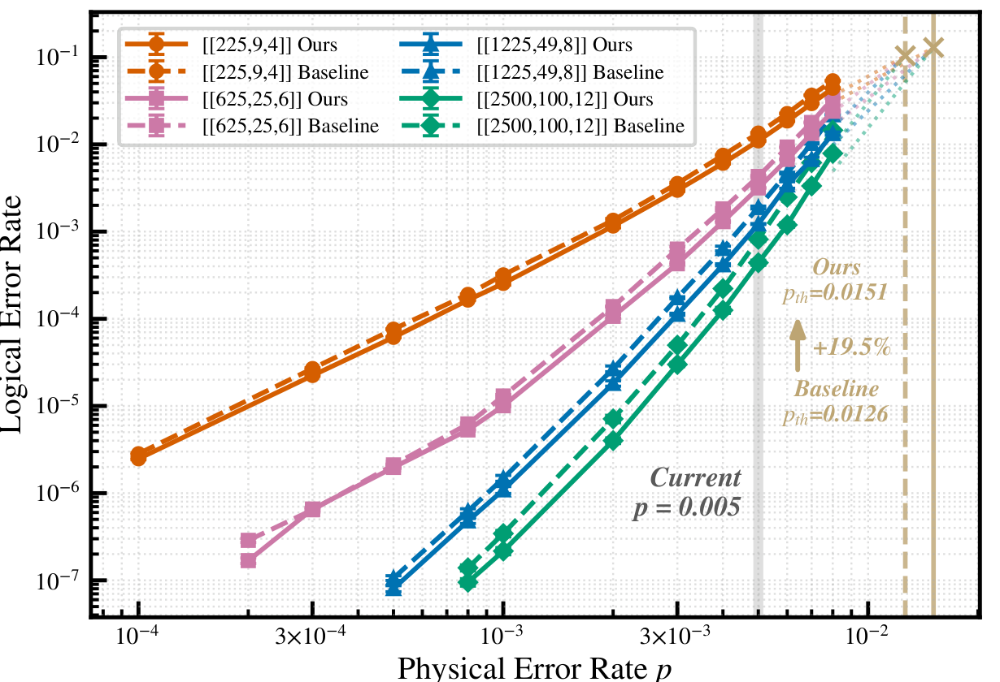

**图 14：四个 HGP 码的单轮逻辑错误率与物理错误率 $p$ 的关系。** 实线表示 ONEX，虚线表示基线 [50]。竖线标出参考物理错误率（米色：估计阈值；灰色：当前代表值）。

图中文字：`Logical Error Rate` 为“逻辑错误率”，`Physical Error Rate` 为“物理错误率”，`Ours/Baseline` 为“本文／基线”，`Current` 为“当前代表值”；$p_{\mathrm{th}}$ 表示估计阈值。

为展示这一点，我们在电路级噪声模型和一个与重排相关的加性空闲错误信道下，模拟四个 HGP 码（$n\in\{225,625,1{,}225,2{,}500\}$）的综合征提取电路。图 14 分别对 Xu 等基线和 ONEX，画出单轮 LER 随物理错误率 $p$ 的变化。

ONEX 把每个门阶段的重排时长从约 1.7–3 ms 缩短到约 0.3–0.8 ms，因而按比例抑制空闲噪声，并在所有码和全部物理错误率上得到一致而有利的 LER 改善。在近期参数拟合下，更高效的执行把估计阈值提高 19.5%，从 $p=1.26\times10^{-2}$ 提升到 $p=1.51\times10^{-2}$。在未来低错误率区域中，这项优势仍然存在，一直延续到低于 $10^{-7}$ 的 LER。

在代表性的物理错误率 $p=0.005$ 处，ONEX 相较基线把 LER 降低 $1.23\times$–$1.85\times$。这种改善对执行更复杂综合征提取的大码最明显，因为其空闲噪声在总错误预算中占比更大。对 HGP $[\![2500,100,12]\!]$ 码，在扫描的全部物理错误率上，ONEX 取得 43.7% 的 LER 中位缩减；较小的 $[\![225,9,4]\!]$ 码则获得较温和的 17.9% 改善。

这一趋势突出了一项关键架构含义：QEC 码扩展到数千个数据量子比特时，重排开销对错误预算的影响会越来越大。

需要注意，LER 从根本上仍受码性质约束。因此，我们把随之产生的 LER 改善视为 ONEX 提高执行频率这一主要收益之外的额外好处。我们还观察到，译码器行为会影响实际改善程度：局部非单调效应可能削弱降低空闲噪声所显现的收益。我们把这种相互作用留作以译码器为中心的后续研究课题。

## 附录 C：并行机制分析

除了基础性能指标，我们还考察并行策略对 ONEX 编译特征的具体影响。

### C.1. 并行配置

表 4 汇总编译实验中的关键并行参数。对种子组合，每次 SMT 调用都让 $K_{\mathrm{port}}$ 个独立进程竞速；对边界推测，则同时试探 $K_{\mathrm{spec}}$ 个候选深度或时长目标。这两层按层级组合，所以单个基准调用内部最多可以使用 $K_{\mathrm{port}}K_{\mathrm{spec}}$ 个并发求解器进程。

**表 4：深度（阶段 1）、局部（阶段 3.1）与全局（阶段 3.2）优化的并行配置。**

| 参数 | 符号 | 深度 | 局部 | 全局 |
|---|---|---:|---:|---:|
| 每次调用的组合种子数 | $K_{\mathrm{port}}$ | 10 | 10 | 3 |
| 推测窗口大小 | $K_{\mathrm{spec}}$ | 2 | — | 5 |
| 每个基准的进程数 | — | 20 | 10 | 15 |
| 最大内存分配 (GB) | — | 100 | 50 | 75 |

### C.2. 组合并行

众所周知，SMT 求解器运行时间对内部选择分支启发式时使用的随机种子十分敏感。图 15 对这种方差进行量化：在问题规模 $N=56$ 时，对 10 个实例各运行五个种子。

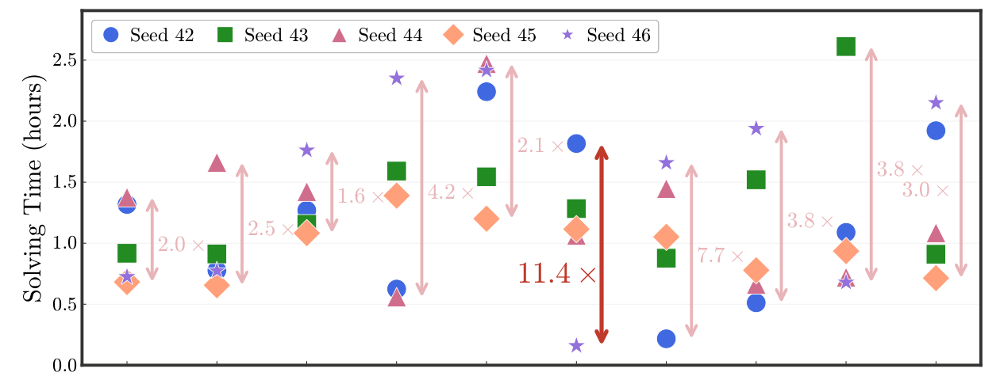

**图 15：SMT 求解器的种子敏感性分析。** 每个点表示一个实例使用一个种子的求解时间；双向箭头标出最大值／最小值之比。

图中文字：`Solving Time` 为“求解时间”，`Seed 42`–`Seed 46` 为五个求解器随机种子。

在 $N=56$ 时，不同种子之间的最大、最小运行时间之比达到 $11.4\times$，平均比值为 $4.2\times$。绝对运行时间差可高达 1.9 小时，而且规模增大时还会进一步扩大。此外，不同实例之间不存在一致的种子性能排序，这表明启发式性能并无内在一致性，而是对底层具体问题结构高度敏感。

这种高方差证实，组合并行是缓解求解器最坏情形行为的一项有效策略。让多个种子竞速并取第一个决定性结果，会把预期墙钟时间推向分布的低端，因而可能获得一个数量级的加速，并比单种子方法节省数小时。

### C.3. 推测并行

迭代式全局搜索需要顺序试探候选时长界。边界推测并行同时在不同目标界上启动多个求解器调用，从而加快收敛。

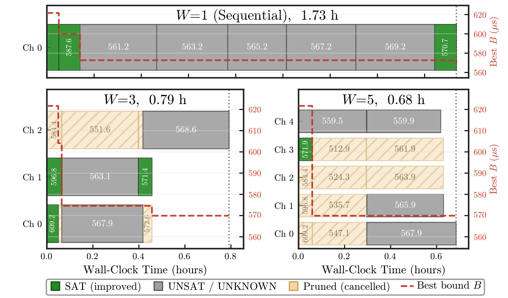

**图 16：代表性实例的推测调度剖面。** 块颜色表示求解器结果（绿色：sat；灰色：unsat／unknown；琥珀色斜线：已剪除）。红色虚线跟踪当前已知最佳时长界 $B$。

图中文字：`Sequential` 为“顺序执行”，`Wall-Clock Time` 为“墙钟时间”，`Pruned (cancelled)` 为“已剪除（取消）”，`Best bound` 为“最佳上界”，`Ch` 表示并行求解通道。

实验结果显示，推测窗口从 $W=1$ 增到 $W=5$ 时平均加速 $1.9\times$，个别情形可达 $3.0\times$。图 16 用类似甘特图的方式展示一个代表性实例的推测调度，其中三条泳道共享同一个时间轴。

顺序基线（$W=1$）以严格串行模式试探每个候选；更宽的窗口则让求解任务在多个并行通道上重叠，使较早返回的 SAT 结果能够剪除过时任务，并用更严格的目标重新填满窗口。在三种配置中，当前最佳上界 $B$ 总体下降趋势一致；但更宽的窗口消除了串行瓶颈，因此更早达到收敛。

## 参考文献

以下 54 条参考文献按原文编号保留，题名、出版信息与外部标识不译。

> [!note] 译注
> 原文采用完整作者表。为使 Markdown 参考文献可读，作者超过六人时以下以“et al.”缩写；所有原文编号和作品均已保留，没有省略参考文献条目。

[1] Rajeev Acharya et al. 2023. “Suppressing quantum errors by scaling a surface code logical qubit.” *Nature* **614**(7949), 676–681. https://doi.org/10.1038/s41586-022-05434-1

[2] D. Aharonov and M. Ben-Or. 1997. “Fault-tolerant quantum computation with constant error.” In *Proceedings of the Twenty-Ninth Annual ACM Symposium on Theory of Computing* (STOC ’97), 176–188. https://doi.org/10.1145/258533.258579

[3] Dolev Bluvstein et al. 2024. “Logical quantum processor based on reconfigurable atom arrays.” *Nature* **626**(7997), 58–65. https://doi.org/10.1038/s41586-023-06927-3

[4] Dolev Bluvstein et al. 2022. “A quantum processor based on coherent transport of entangled atom arrays.” *Nature* **604**(7906), 451–456. https://doi.org/10.1038/s41586-022-04592-6

[5] Sergey Bravyi, Andrew W. Cross, Jay M. Gambetta, Dmitri Maslov, Patrick Rall, and Theodore J. Yoder. 2024. “High-threshold and low-overhead fault-tolerant quantum memory.” *Nature* **627**(8005), 778–782. https://doi.org/10.1038/s41586-024-07107-7

[6] Madelyn Cain et al. 2026. “Shor’s algorithm is possible with as few as 10,000 reconfigurable atomic qubits.” arXiv:2603.28627 [quant-ph]. https://arxiv.org/abs/2603.28627

[7] A. R. Calderbank, E. M. Rains, P. W. Shor, and N. J. A. Sloane. 1997. “Quantum Error Correction and Orthogonal Geometry.” *Phys. Rev. Lett.* **78**(3), 405–408. https://doi.org/10.1103/PhysRevLett.78.405

[8] Kathleen Chang, Zhiyang He, Theodore J. Yoder, Guanyu Zhu, and Tomas Jochym-O’Connor. 2026. “Constant-Time Surgery on 2D Hypergraph Product Codes with Near-Constant Space Overhead.” arXiv:2603.02157 [quant-ph]. https://doi.org/10.48550/arXiv.2603.02157

[9] Leonardo De Moura and Nikolaj Bjørner. 2008. “Z3: an efficient SMT solver.” In *TACAS’08/ETAPS’08*, 337–340.

[10] Simon J. Evered et al. 2023. “High-fidelity parallel entangling gates on a neutral-atom quantum computer.” *Nature* **622**(7982), 268–272. https://doi.org/10.1038/s41586-023-06481-y

[11] Austin G. Fowler, Matteo Mariantoni, John M. Martinis, and Andrew N. Cleland. 2012. “Surface codes: Towards practical large-scale quantum computation.” *Phys. Rev. A* **86**(3), 032324. https://doi.org/10.1103/PhysRevA.86.032324

[12] Craig Gidney. 2021. “Stim: a fast stabilizer circuit simulator.” *Quantum* **5**, 497. https://doi.org/10.22331/q-2021-07-06-497

[13] Craig Gidney. 2025. “How to factor 2048 bit RSA integers with less than a million noisy qubits.” arXiv:2505.15917 [quant-ph]. https://doi.org/10.48550/arXiv.2505.15917

[14] Craig Gidney and Martin Ekerå. 2021. “How to factor 2048 bit RSA integers in 8 hours using 20 million noisy qubits.” *Quantum* **5**, 433. https://doi.org/10.22331/q-2021-04-15-433

[15] Daniel Gottesman. 1997. “Stabilizer Codes and Quantum Error Correction.” arXiv:quant-ph/9705052 [quant-ph]. https://arxiv.org/abs/quant-ph/9705052

[16] Loïc Henriet et al. 2020. “Quantum computing with neutral atoms.” *Quantum* **4**, 327. https://doi.org/10.22331/q-2020-09-21-327

[17] Yunqi Huang, Dingchao Gao, Shenggang Ying, and Sanjiang Li. 2025. “DasAtom: A Divide-and-Shuttle Atom Approach to Quantum Circuit Transformation.” *IEEE Transactions on Computer-Aided Design of Integrated Circuits and Systems* **44**(8), 2966–2978. https://doi.org/10.1109/TCAD.2025.3532818

[18] Michael Jünger and Petra Mutzel. 1997. “2-Layer Straightline Crossing Minimization: Performance of Exact and Heuristic Algorithms.” *Journal of Graph Algorithms and Applications* **1**(1), 1–25. https://doi.org/10.7155/jgaa.00001

[19] Anirudh Krishna and David Poulin. 2021. “Fault-Tolerant Gates on Hypergraph Product Codes.” *Phys. Rev. X* **11**(1), 011023. https://doi.org/10.1103/PhysRevX.11.011023

[20] Manuel Laguna and Rafael Marti. 1999. “GRASP and Path Relinking for 2-Layer Straight Line Crossing Minimization.” *INFORMS Journal on Computing* **11**(1), 44–52. https://doi.org/10.1287/ijoc.11.1.44

[21] Wan-Hsuan Lin, Daniel Bochen Tan, and Jason Cong. 2025. “Reuse-Aware Compilation for Zoned Quantum Architectures Based on Neutral Atoms.” In *2025 IEEE International Symposium on High Performance Computer Architecture (HPCA)*, 127–142. https://doi.org/10.1109/HPCA61900.2025.00021

[22] Pengyu Liu et al. 2025. “Coniq: Enabling Concatenated Quantum Error Correction on Neutral Atom Arrays.” In *2025 IEEE International Conference on Quantum Computing and Engineering (QCE)*, Vol. 01, 615–626. https://doi.org/10.1109/QCE65121.2025.00073

[23] Hannah J. Manetsch, Gyohei Nomura, Elie Bataille, Xudong Lv, Kon H. Leung, and Manuel Endres. 2025. “A tweezer array with 6,100 highly coherent atomic qubits.” *Nature* **647**(8088), 60–67. https://doi.org/10.1038/s41586-025-09641-4

[24] Michael A. Nielsen and Isaac L. Chuang. 2010. *Quantum Computation and Quantum Information: 10th Anniversary Edition*. Cambridge University Press.

[25] M. A. Norcia et al. 2024. “Iterative Assembly of $^{171}\mathrm{Yb}$ Atom Arrays with Cavity-Enhanced Optical Lattices.” *PRX Quantum* **5**(3), 030316. https://doi.org/10.1103/PRXQuantum.5.030316

[26] Pavel Panteleev and Gleb Kalachev. 2022. “Quantum LDPC Codes With Almost Linear Minimum Distance.” *IEEE Transactions on Information Theory* **68**(1), 213–229. https://doi.org/10.1109/TIT.2021.3119384

[27] Lars Pause et al. 2024. “Supercharged two-dimensional tweezer array with more than 1000 atomic qubits.” *Optica* **11**(2), 222–226. https://doi.org/10.1364/OPTICA.513551

[28] Joschka Roffe. 2022. “LDPC: Python tools for low density parity check codes.” https://pypi.org/project/ldpc/

[29] Joschka Roffe, David R. White, Simon Burton, and Earl Campbell. 2020. “Decoding across the quantum low-density parity-check code landscape.” *Physical Review Research* **2**(4), 043423. https://doi.org/10.1103/physrevresearch.2.043423

[30] Jixuan Ruan, Xiang Fang, Hezi Zhang, Ang Li, Travis Humble, and Yufei Ding. 2025. “PowerMove: Optimizing Compilation for Neutral Atom Quantum Computers with Zoned Architecture.” In *ASPLOS ’25*, 163–178. https://doi.org/10.1145/3676642.3736128

[31] Mark Saffman. 2018. “Quantum computing with neutral atoms.” *National Science Review* **6**(1), 24–25. https://doi.org/10.1093/nsr/nwy088

[32] M. Saffman, T. G. Walker, and K. Mølmer. 2010. “Quantum information with Rydberg atoms.” *Rev. Mod. Phys.* **82**(3), 2313–2363. https://doi.org/10.1103/RevModPhys.82.2313

[33] V. V. Sivak et al. 2023. “Real-time quantum error correction beyond break-even.” *Nature* **616**(7955), 50–55. https://doi.org/10.1038/s41586-023-05782-6

[34] Yannick Stade, Lukas Burgholzer, and Robert Wille. 2025. “Search Smarter, Not Harder: A Scalable, High-Quality Zoned Neutral Atom Compiler.” arXiv:2512.13790.

[35] Yannick Stade, Wan-Hsuan Lin, Jason Cong, and Robert Wille. 2025. “Routing-Aware Placement for Zoned Neutral Atom-based Quantum Computing.” In *2025 IEEE/ACM International Conference On Computer Aided Design (ICCAD)*, 1–9. https://doi.org/10.1109/ICCAD66269.2025.11240721

[36] Yannick Stade, Ludwig Schmid, Lukas Burgholzer, and Robert Wille. 2024. “An Abstract Model and Efficient Routing for Logical Entangling Gates on Zoned Neutral Atom Architectures.” In *2024 IEEE International Conference on Quantum Computing and Engineering (QCE)*, Vol. 01, 784–795. https://doi.org/10.1109/QCE60285.2024.00098

[37] Larry Stockmeyer. 1984. “Optimal orientations of cells in slicing floorplan designs.” *Information and Control* **57**(2–3), 91–101. https://doi.org/10.1016/S0019-9958(83)80038-2

[38] Bochen Tan, Dolev Bluvstein, Mikhail D. Lukin, and Jason Cong. 2022. “Qubit Mapping for Reconfigurable Atom Arrays.” In *ICCAD ’22*, Article 107, 9 pages. https://doi.org/10.1145/3508352.3549331

[39] Daniel Bochen Tan, Dolev Bluvstein, Mikhail D. Lukin, and Jason Cong. 2024. “Compiling Quantum Circuits for Dynamically Field-Programmable Neutral Atoms Array Processors.” *Quantum* **8**, 1281. https://doi.org/10.22331/q-2024-03-14-1281

[40] Daniel Bochen Tan, Dolev Bluvstein, Mikhail D. Lukin, and Jason Cong. 2024. “Compiling Quantum Circuits for Dynamically Field-Programmable Neutral Atoms Array Processors.” *Quantum* **8**, 1281; arXiv:2306.03487 [quant-ph]. https://doi.org/10.22331/q-2024-03-14-1281

[41] Daniel Bochen Tan, Wan-Hsuan Lin, and Jason Cong. 2025. “Compilation for Dynamically Field-Programmable Qubit Arrays with Efficient and Provably Near-Optimal Scheduling.” Association for Computing Machinery, 921–929. https://doi.org/10.1145/3658617.3697778

[42] Jean-Pierre Tillich and Gilles Zémor. 2014. “Quantum LDPC Codes With Positive Rate and Minimum Distance Proportional to the Square Root of the Blocklength.” *IEEE Transactions on Information Theory* **60**(2), 1193–1202. https://doi.org/10.1109/TIT.2013.2292061

[43] Pauli Virtanen et al. 2020. “SciPy 1.0: fundamental algorithms for scientific computing in Python.” *Nature Methods* **17**(3), 261–272. https://doi.org/10.1038/s41592-019-0686-2

[44] Joshua Viszlai, Willers Yang, Sophia Lin, Junyu Liu, Natalia Nottingham, Jonathan Baker, and Frederic Chong. 2026. “qSIEVE: Efficient qLDPC Memory via Systolic Movement in Atom Arrays.” *ACM Transactions on Quantum Computing* **7**(2), Article 9, 26 pages. https://doi.org/10.1145/3779066

[45] Joshua Viszlai et al. 2025. “Matching Generalized-Bicycle Codes to Neutral Atoms for Low-Overhead Fault-Tolerance.” In *2025 IEEE International Conference on Quantum Computing and Engineering (QCE)*, 688–699. https://doi.org/10.1109/qce65121.2025.00080

[46] Hanrui Wang et al. 2024. “Atomique: A Quantum Compiler for Reconfigurable Neutral Atom Arrays.” In *2024 ACM/IEEE 51st Annual International Symposium on Computer Architecture (ISCA)*, 293–309. https://doi.org/10.1109/ISCA59077.2024.00030

[47] Ming Wang and Frank Mueller. 2026. “Coprime Bivariate Bicycle Codes and Their Layouts on Cold Atoms.” *Quantum* **10**, 2009; arXiv:2408.10001 [quant-ph]. https://doi.org/10.22331/q-2026-02-23-2009

[48] Paul Webster, Samuel C. Smith, and Lawrence Z. Cohen. 2025. “Explicit construction of low-overhead gadgets for gates on quantum LDPC codes.” arXiv:2511.15989 [quant-ph]. https://doi.org/10.48550/arXiv.2511.15989

[49] D. F. Wong and C. L. Liu. 1986. “A New Algorithm for Floorplan Design.” In *23rd ACM/IEEE Design Automation Conference*, 101–107. https://doi.org/10.1109/DAC.1986.1586075

[50] Qian Xu et al. 2024. “Constant-overhead fault-tolerant quantum computation with reconfigurable atom arrays.” *Nature Physics* **20**(7), 1084–1090. https://doi.org/10.1038/s41567-024-02479-z

[51] Qian Xu et al. 2025. “Fast and Parallelizable Logical Computation with Homological Product Codes.” *Phys. Rev. X* **15**(2), 021065. https://doi.org/10.1103/PhysRevX.15.021065

[52] Willers Yang, Jason Chadwick, Mariesa H. Teo, Joshua Viszlai, and Fred Chong. 2026. “RASCqL: Reaction-time-limited Architecture for Space-time-efficient Complex qLDPC Logic.” arXiv:2602.14273 [quant-ph]. https://doi.org/10.48550/arXiv.2602.14273

[53] F. Y. Young and D. F. Wong. 1999. “Slicing floorplans with range constraint.” In *ISPD ’99*, 97–102. https://doi.org/10.1145/299996.300033

[54] Chen Zhao, Casey Duckering, Andi Gu, Nishad Maskara, and Hengyun Zhou. 2026. “Towards Ultra-High-Rate Quantum Error Correction with Reconfigurable Atom Arrays.” arXiv:2604.16209 [quant-ph]. https://arxiv.org/abs/2604.16209
